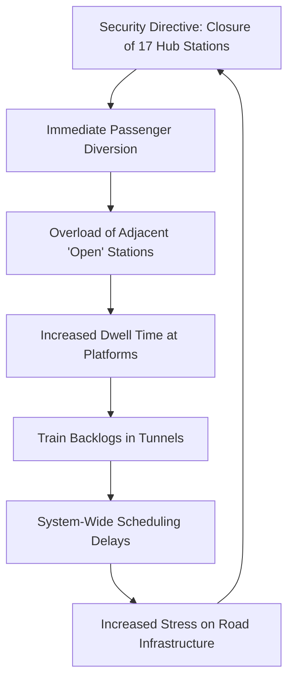

# 🚇 When the Heartbeat of Delhi Skips a Beat

If you live in Delhi, you know the city never really sleeps, but it does breathe—and that breath is the **Delhi Metro Rail Corporation (DMRC)**. For millions of residents and commuters, the Metro isn't just a convenient way to get around; it is the primary artery that keeps the National Capital Region (NCR) alive. When the trains are running, the city flows with a predictable, mechanical rhythm. When it stops? Everything from the corporate hubs of Gurgaon to the narrow lanes of Old Delhi grinds to a sudden, jarring halt.

Recently, reports from [News On AIR](https://newsonair.gov.in) and other major outlets highlighted a scenario that every Delhiite dreads: the DMRC closed 17 strategic stations "until further notice." For the average person trying to reach a job interview, a college lecture, or a critical hospital appointment, this wasn't a minor technical glitch or a routine maintenance delay. It was a systemic failure of mobility that rippled through every street, alley, and flyover in the city.

These kinds of closures are rarely the result of a signal failure or a power outage. Instead, they occur at the volatile intersection where urban transit crashes into high-stakes national security. Whether it is the management of massive protests, the arrival of foreign dignitaries, or the prevention of civil unrest, the Metro becomes a pawn in a larger security game. It is a constant, tense struggle between the state's need to keep the city safe and the citizen's basic right to move. To understand why this happens, we must look beyond the closed gates and examine the logistics of security, the mathematics of network failure, and the human cost of a city paralyzed.

---

### 🛑 The Day the Gates Closed: Anatomy of a Shutdown

It usually happens with terrifying speed. A sudden announcement echoes through the concourse, screens flash red, and the gates are locked. According to reporting by [News On AIR](https://newsonair.gov.in), the DMRC often receives direct directives from security agencies to shutter specific stations. The phrase "until further notice" is perhaps the most anxiety-inducing string of words in the commuter's vocabulary. It removes the ability to plan, leaving thousands stranded on platforms or forcing them into a desperate scramble for auto-rickshaws in a city already choked by gridlock.

The stations selected for closure are never random. They are strategic nodes chosen for their proximity to "sensitive zones." In recent shutdowns, the focus has been heavily on **Central Delhi**, including critical hubs like **Kashmere Gate**, **Chandni Chowk**, and stations orbiting the Red Fort and government secretariats. 

These are not just stations; they are "interchanges." When a hub like Kashmere Gate—where the Yellow, Red, and Violet lines converge—is shut down, the impact isn't localized. It creates a "butterfly effect" across the entire network. A person traveling from Rohini to Noida may find their entire journey compromised simply because a central node in their path has been deleted from the map.

For the commuter, the experience is one of sudden disorientation. Security personnel, acting on "trigger-based" protocols, push crowds away from entrances. These protocols are designed to activate the moment a perceived threat level reaches a certain threshold, prioritizing the "containment" of the area over the "convenience" of the traveler.

> "The closure of metro stations during periods of unrest is a preemptive strike against potential chaos, but it often transforms the streets into an unplanned bottleneck, shifting the crisis from the underground to the asphalt." — *Urban Mobility Analyst*

---

### 🛡️ The Security Logic: Why 17 Stations?

To the average commuter, closing 17 stations feels like an overreaction. However, from the perspective of the Delhi Police and the Ministry of Home Affairs, it is a calculated tactical move. During mass mobilizations—such as the Farmers' Protests or major political rallies—security agencies view the Metro as a "high-capacity delivery system."

In military or security terms, the Metro is a force multiplier. A single train can transport **thousands of people** and deposit them directly into a restricted zone within seconds. By shutting down these stations, the government effectively creates a "security perimeter" that is far more impenetrable than a line of police barricades. While a physical fence can be climbed or pushed through, a closed metro station is a concrete wall.

The strategic goals of these shutdowns are three-fold:
1. **Stopping the Surge**: By eliminating the fastest way to reach a flashpoint, security forces prevent the "sudden spike" of thousands of people arriving simultaneously, which often triggers stampedes or violent clashes.
2. **Controlling the Gates**: Closures allow authorities to ensure that only vetted personnel and authorized officials can enter high-security zones, turning the Metro's efficiency against the protestors.
3. **Fragmentation of the Crowd**: When the Metro fails, people are forced onto roads and buses. This naturally breaks a monolithic crowd into smaller, fragmented groups that are significantly easier for the [Delhi Police](https://delhipolice.nic.in) to monitor and manage.

However, this "security-first" logic ignores the secondary effects. Passengers do not simply disappear; they shift. This puts an unsustainable strain on the "perimeter stations"—those that remain open just outside the closed zone—and an already exhausted bus network, creating new zones of chaos.

---

### 📉 The Commuter's Nightmare: Analyzing the Numbers

To truly grasp the scale of the disruption, one must look at the sheer volume of the [Delhi Metro](https://en.wikipedia.org/wiki/Delhi_Metro). Serving a metropolitan area of over 30 million people, the system handles between **5 to 6 million passengers daily**. When you remove 17 key stations, you aren't just removing stops; you are severing the connections of millions.

**The Ripple Effect in Bold Stats:**
*   **Commute Inflation**: Passengers reported an average increase of **45 to 90 minutes** to their daily trips, as they were forced to take circuitous routes or rely on congested surface roads.
*   **Last-Mile Volatility**: Demand for app-based aggregators (Uber/Ola) and auto-rickshaws jumped by an estimated **300%** around the closed stations, leading to predatory "surge pricing" and wait times exceeding an hour.
*   **Platform Density**: Stations adjacent to the closed zones experienced a **20% to 40% spike** in footfall. This leads to "platform saturation," where the sheer volume of people makes it dangerous for trains to stop, further delaying the entire line.
*   **Economic Leakage**: For daily wage earners, a three-hour delay isn't just an inconvenience; it is a loss of income. When the city stops, the informal economy—which powers much of Delhi—takes a direct hit.

Beyond the statistics lies a deeper psychological toll. For the corporate employee in a high-pressure job or a student facing a strict examination deadline, the uncertainty of "until further notice" creates a state of chronic stress. In the NCR, your reliability as a professional is often tied to the reliability of the DMRC.

---

### 🧬 The Science of the Crash: Network Theory and Cascading Failure

If we analyze the DMRC through the lens of **Network Science**, the 17-station shutdown is a textbook example of "node failure" in a scale-free network. Research into urban transit resilience, such as studies hosted on [ArXiv](https://arxiv.org/abs/1210.1975), suggests that transport networks rely on a few "super-hubs" to maintain efficiency.

In the Delhi Metro, hubs like Kashmere Gate, Rajiv Chowk, and Hauz Khas act as these super-hubs. When you remove these nodes, the network doesn't just slow down—it fragments. This triggers what is known as a **cascading failure**.

**Breaking down the cycle:**
1. **Node Removal**: The 17 stations are removed from the active map.
2. **Diversion**: Thousands of passengers pile into the nearest open station.
3. **The Dwell Time Trap**: Because the platforms are overcrowded, it takes much longer for passengers to board and alight. This "dwell time" increases from the standard 30 seconds to several minutes.
4. **The Backlog**: Because the train at Station A is delayed by dwell time, the train behind it cannot enter the station. This creates a queue of trains in the tunnels, delaying passengers who are nowhere near the closed stations.
5. **Surface Saturation**: The displaced passengers flood the roads, slowing down the very buses and police vehicles intended to manage the crisis.

The resilience of a network depends on "redundancy"—the existence of multiple equal-quality paths between two points. The DMRC, while expansive, has low redundancy in its central core. Once the center is cut, the limbs are isolated.

---

### ⚖️ The Big Debate: State Security vs. Freedom of Movement

The ability of the state to unilaterally shut down public infrastructure raises profound legal and ethical questions. Under the **Metro Railways (Operation and Maintenance) Act**, the DMRC is responsible for the safe operation of the trains. However, in practice, the DMRC operates under the shadow of the Ministry of Home Affairs and the local police.

This creates a fundamental tug-of-war:
*   **The State's Mandate**: The government argues that the prevention of a riot or a security breach outweighs the inconvenience of a commute. In a capital city, the cost of a security failure is seen as catastrophic.
*   **The Citizen's Mandate**: Citizens argue that public utilities, funded by taxes and user fares, should not be used as tools of political or security containment. The right to movement is a basic liberty that should not be suspended without a declared emergency.

Critics argue that the "total shutdown" is a blunt instrument. They suggest a "filtered access" model: instead of closing the entire station, security could be tightened at the entry points (using biometric or ID checks) while allowing trains to continue running. This would prevent the "surge" of protestors while keeping the city's economy moving.

The DMRC often counters this by stating that once a crowd breaks into an underground station, the enclosed environment becomes a death trap. In the event of a stampede or a fire in a crowded underground concourse, the casualty rate would be exponentially higher than on the street. Thus, they argue, closure is the only humane option.

---

### 🚀 Building a Resilient Metro: The Path Forward

As Delhi evolves into a global megacity, it can no longer afford to rely on "blunt instrument" shutdowns. The DMRC and the government need a proactive **Urban Resilience Framework** to ensure the city keeps moving, even when parts of the map are offline.

**Proposed Strategies for a Smarter Network:**

1. **AI-Driven Dynamic Rerouting**: The DMRC app should integrate with real-time traffic data. The moment a station closes, the app should push a notification to all affected users with a "Next Best Route," integrating Metro, bus, and ride-sharing options in a single ticketed journey.
2. **Emergency "Bridge Bus" Corridors**: The DMRC should have a standing MOU with the [Delhi Transport Corporation (DTC)](https://dtc.delhi.gov.in). Whenever 5 or more stations are closed, "Bridge Buses" should be deployed instantly to mimic the metro line, transporting passengers from the last open station to the first available one on the other side of the closure.
3. **Surgical Access Management**: Rather than closing a station, authorities should employ "Zonal Closures." This involves shutting down specific exits that lead to sensitive areas while keeping the platforms and other exits open for through-passengers.
4. **Transparent Communication**: The era of "until further notice" must end. Even a rough estimate (e.g., "Closed until 6:00 PM") allows the workforce to reorganize and reduces the panic-buying of expensive ride-shares.
5. **Decentralized Hubs**: Future expansion should focus on creating more "orbital" lines (like the upcoming corridors) to reduce the reliance on the central hubs of Central Delhi, thereby increasing the network's redundancy.

---

### 🏁 Final Thoughts: More Than Just Tracks and Trains

The closure of 17 stations is a reminder that in a modern metropolis, we are all interconnected. A security decision made in a climate-controlled boardroom in New Delhi translates into a struggle for a student in Rohini, a healthcare worker in Noida, or a small business owner in Chandni Chowk.

The [News On AIR](https://newsonair.gov.in) report was a symptom of a larger challenge: how do we balance the iron-clad requirements of national security with the fluid requirements of urban life? The Delhi Metro is an engineering marvel, a testament to India's growth and organizational capability. But its greatest challenge is not technical—it is social and political.

The true maturity of a "Smart City" is not measured by the speed of its trains, but by its ability to remain mobile during a crisis. Security is an absolute necessity, but it should not mean the paralysis of the city's heartbeat. Until the DMRC can move from "containment" to "management," the commuters of Delhi will remain at the mercy of the "until further notice" sign.

---

## 📚 References & Further Reading

*   **News On AIR**: Official government broadcasting for real-time alerts on DMRC closures and security directives. [newsonair.gov.in](https://newsonair.gov.in)
*   **Delhi Metro Rail Corporation (DMRC)**: Official operational guidelines, network maps, and passenger charters. [delhimetrorail.com](https://www.delhimetrorail.com)
*   **Wikipedia - Delhi Metro**: A comprehensive overview of ridership statistics, phase-wise expansion, and historical scale. [en.wikipedia.org/wiki/Delhi_Metro](https://en.wikipedia.org/wiki/Delhi_Metro)
*   **ArXiv**: Peer-reviewed research on "Complex Networks" and the impact of node failure on urban transit resilience. [arxiv.org](https://arxiv.org)
*   **Ministry of Home Affairs (MHA)**: Policy documents regarding the security protocols for the National Capital Region (NCR). [mha.gov.in](https://mha.gov.in)
*   **Delhi Police**: Public advisories, traffic diversion maps, and security notices during state events. [delhipolice.nic.in](https://delhipolice.nic.in)
*   **Delhi Transport Corporation (DTC)**: Information on bus routes and integration with the metro network. [dtc.delhi.gov.in](https://dtc.delhi.gov.in)
*   **Urban Land Institute (ULI)**: Reports on Transit-Oriented Development (TOD) and the importance of redundancy in city planning. [uli.org](https://uli.org)
