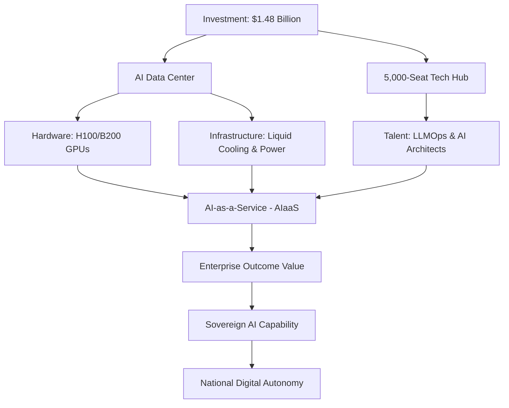

# 🚀 The $1.48 Billion Bet: How HCLTech is Engineering India's AI Future

### 🌐 Introduction: The Great Pivot of Indian IT
For three decades, the narrative of the Indian Information Technology (IT) sector was defined by a single, powerful concept: **labor arbitrage**. The strategy was simple but effective: provide high-quality software maintenance, BPO (Business Process Outsourcing), and system integration for a fraction of the cost of Western onshore teams. This "billable hour" model built empires, turning firms like TCS, Infosys, and HCLTech into global juggernauts. 

However, we have entered the era of **Generative AI (GenAI)**, and the foundations of that old model are cracking. When a Large Language Model (LLM) can write a Python script in seconds that would have previously taken a junior developer six hours, the "per-hour" pricing model becomes a liability rather than an asset. The industry is facing an existential crossroads: evolve into high-value orchestrators or be automated into obsolescence.

This is the context behind **HCLTech's** latest strategic gambit. The company has [announced a massive $1.48 billion investment](https://www.reuters.com) to construct a cutting-edge AI data center and a 5,000-seat high-tech hub within India. This is not merely an expansion of capacity; it is a fundamental pivot in identity. By committing nearly **$1.5 billion** to local hardware and specialized talent, HCLTech is positioning itself as the architect of **"Sovereign AI."**

The bet is clear: the future of the digital economy isn't just about who can write the best code, but who owns the "factories" where that intelligence is forged. By owning the compute, the cooling, and the talent, HCLTech aims to leapfrog from a service provider to an infrastructure powerhouse.

---

### 🏗️ Section 1: Deconstructing the $1.48 Billion Investment
To the uninitiated, a data center is simply a warehouse full of computers. But an **AI Data Center** is a different beast entirely. Traditional data centers are designed for "general-purpose" workloads—hosting websites, managing databases, or streaming video. These rely primarily on CPUs (Central Processing Units) and are optimized for high availability and low latency.

AI workloads, specifically the training and inference of LLMs, require **compute-intensive** processing. This demands a shift from CPUs to GPUs (Graphics Processing Units) and TPUs (Tensor Processing Units). When HCLTech invests $1.48 billion, they aren't just buying floor space; they are buying into the most expensive and scarce real estate in the digital world: **GPU clusters**.

#### The Hardware Stack
The investment likely focuses on high-density clusters of [Nvidia H100s or the newer Blackwell B200 GPUs](https://www.nvidia.com). These chips are the engines of the AI revolution, but they come with extreme requirements:
*   **Power Density:** A standard server rack might pull 5-10kW. An AI rack can easily pull **40kW to 100kW**, requiring a total overhaul of electrical grids.
*   **Interconnects:** To make thousands of GPUs act as a single "brain," you need ultra-fast networking. HCLTech will likely deploy [InfiniBand or Ultra Ethernet](https://www.mellanox.com), reducing bottlenecks that would otherwise cripple model training.
*   **Storage:** AI requires massive throughput. This means moving from traditional SSDs to NVMe-over-Fabrics (NVMe-oF) to ensure the GPUs aren't waiting for data to arrive.

> "The shift to AI infrastructure is not a linear upgrade; it is a foundational rebuild. You cannot simply put an LLM on a standard cloud server and expect enterprise-grade performance. You need a purpose-built environment where power, cooling, and compute are synchronized."

By owning this infrastructure, HCLTech reduces its dependency on "hyperscalers" like Amazon AWS, Microsoft Azure, and Google Cloud. This allows them to offer **AI-as-a-Service (AIaaS)**, giving enterprise clients a "private cloud" experience where data residency and security are guaranteed.

---

### 🎓 Section 2: The Talent Engine: The 5,000-Seat Hub
Hardware is the body, but talent is the mind. The announcement of a **5,000-seat tech hub** is perhaps more strategic than the data center itself. In the previous era of Indian IT, 5,000 seats meant 5,000 developers focusing on "execution"—following a specification document provided by a client in New York or London.

In the AI era, the role of the engineer is shifting from **Coder to Orchestrator**. HCLTech isn't just hiring developers; they are building a workforce of AI architects, prompt engineers, and LLMOps (Large Language Model Operations) specialists.

#### The Rise of the "AI Factory"
The goal of this hub is to create "AI Factories." In this model, the 5,000 specialists don't just write software; they manage the lifecycle of a model:
1.  **Data Curation:** Cleaning and labeling massive datasets to remove bias and noise.
2.  **Fine-Tuning:** Taking a base model (like Llama 3 or GPT-4) and specializing it for a specific industry, such as healthcare or high-frequency trading.
3.  **RLHF (Reinforcement Learning from Human Feedback):** Using human experts to "grade" AI outputs, ensuring the model is safe, accurate, and helpful.
4.  **Deployment & Monitoring:** Ensuring the model doesn't "hallucinate" once it is integrated into a live business process.

According to [Wikipedia's profile of HCL Technologies](https://en.wikipedia.org/wiki/HCL_Technologies), the company has a long history of R&D. This new hub scales that ambition, moving the Indian workforce up the value chain. Instead of "doing what they are told," these 5,000 engineers will be "telling the AI how to do it," shifting the economic value from labor hours to intellectual property.

---

### 📈 Section 3: The Strategic Pivot: From Headcount to Outcomes
The IT services industry is currently facing a crisis of measurement. For decades, the primary KPI was **headcount**. More engineers on a project meant more revenue. This created a perverse incentive to keep projects complex and labor-intensive.

GenAI destroys this incentive. If an AI agent can automate **40% to 60%** of basic coding and testing, a company that bills by the hour will see its revenue plummet. HCLTech is pivoting toward **Value-Based Pricing**.

#### The "Efficiency Capture" Model
By owning the AI infrastructure and the talent to run it, HCLTech can offer "Outcome-as-a-Service." Instead of charging for the 1,000 hours it takes to migrate a database, they can charge for the *result* of the migration. If they use their own AI tools to do it in 100 hours, they keep the difference as profit. This is known as **efficiency capture**.

This transition is a hot topic on forums like [Hacker News](https://news.ycombinator.com), where the "death of the junior developer" is frequently debated. HCLTech is attempting to solve this by upskilling its junior talent into "AI Agents Managers." The goal is to move from being a "service shop" to a "technology partner" that owns the means of production.

---

### 🇮🇳 Section 4: The Sovereign AI Movement
HCLTech's investment is a microcosm of a larger geopolitical trend: **Sovereign AI**. For years, the world's intelligence layer has been concentrated in a few zip codes in California and Washington. This creates a risk of "digital colonialism," where a nation's data and intelligence are dependent on the whims and laws of a foreign corporation.

#### The IndiaAI Mission
The Indian government has recognized this risk through the [IndiaAI Mission](https://indiaai.gov.in), a strategic push to ensure the country has its own compute capacity. Sovereign AI is about three core pillars:
1.  **Data Sovereignty:** Ensuring that sensitive citizen data—financial, medical, and governmental—never leaves Indian soil.
2.  **Cultural Alignment:** Ensuring that AI models understand the linguistic diversity and cultural nuances of India, rather than reflecting a Western-centric worldview.
3.  **Compute Autonomy:** Ensuring that if global chip supplies are throttled or cloud services are suspended, India's critical infrastructure continues to function.

When HCLTech spends **$1.48 billion**, they are building the "rails" for this mission. For an Indian bank or a government agency, sending data to a server in Virginia is a security risk. Keeping that data in a localized, HCLTech-managed AI data center keeps it under local jurisdiction and law.

---

### ⚡ Section 5: The Hardware Hurdle: The Physics of AI
Building an AI data center is not just a financial challenge; it is a battle against the laws of physics. Research from [ArXiv](https://arxiv.org/abs/2303.17564) highlights that the three primary bottlenecks for AI scale are **Power, Cooling, and Interconnects**.

#### 1. The Power Crisis
AI is an energy glutton. A typical CPU-based server is efficient, but a GPU cluster is a power furnace. To support thousands of H100s, HCLTech must secure massive amounts of steady electricity. This often requires building dedicated substations or investing in renewable energy micro-grids to avoid crashing the local power grid.

#### 2. The Cooling Challenge
Air cooling (using giant fans) is no longer sufficient for AI chips. When a GPU reaches its thermal limit, it engages in **thermal throttling**—slowing down its clock speed to prevent physical melting. This kills performance. To combat this, HCLTech will likely employ:
*   **Direct-to-Chip Liquid Cooling:** Pumping coolant through cold plates directly onto the processor.
*   **Immersion Cooling:** Submerging the entire server in a non-conductive, dielectric fluid that absorbs heat far more efficiently than air.

#### 3. The GPU War
The scarcity of high-end chips has turned hardware procurement into a geopolitical game. HCLTech must navigate a landscape where Nvidia GPUs are treated like gold. Their investment ensures they have the capital to secure long-term supply agreements, shielding their clients from the volatility of the chip market.

---

### 💰 Section 6: The Ripple Effect and Economic Outlook
The implications of this move extend far beyond HCLTech's quarterly earnings report. A **$1.48 billion** injection into the local ecosystem creates a massive multiplier effect.

#### The Economic Multiplier
The 5,000 high-skill roles created in the tech hub are not entry-level positions. These are high-salary roles that drive demand for local housing, services, and ancillary tech startups. Moreover, by establishing a world-class AI hub, HCLTech creates a "talent magnet," attracting global AI researchers to India.

#### Rebranding "Indian IT"
For a decade, "Indian IT" was often synonymous with "legacy systems" or "cost-cutting." This investment is a rebranding exercise. By dominating the most advanced segment of the tech stack, HCLTech is signaling that India is no longer just the "back office" of the world, but its **"intelligence engine."**

#### The Risks: Obsolescence and SLMs
However, the strategy is not without risk. The AI field moves at a breakneck pace. There is a growing trend toward **Small Language Models (SLMs)**—efficient models that can run on a laptop or a phone (edge computing) rather than a giant data center. If the world shifts entirely toward decentralized, small-scale AI, a massive $1.48 billion centralized hub could become a "white elephant."

But the most likely scenario is a **Hybrid AI Future**. Heavy-duty training (The "Forge") will happen in massive hubs like HCLTech's, while the daily execution (The "Inference") will happen on the edge. By owning the Forge, HCLTech becomes the landlord of the AI era.

---

### 🏁 Conclusion: A New Chapter for the Digital East
HCLTech's **$1.48 billion** investment is a calculated gamble on the future of intelligence. By simultaneously capturing the compute (the data center) and the cognition (the 5,000-seat hub), they are solving the two biggest bottlenecks in the AI supply chain.

As India accelerates toward its goal of Sovereign AI, HCLTech is building the industrial backbone necessary to make that vision a reality. The transition from selling "man-hours" to selling "AI outcomes" is the most difficult pivot in the history of the Indian IT sector, but it is the only one that leads to survival.

The world is watching to see if HCLTech can successfully transform from a service provider into a sovereign AI power. If they succeed, they won't just have saved their business model—they will have rewritten the blueprint for the global IT industry.

---

## 📚 References & Further Reading

**Industry Reports & News:**
*   [Reuters: HCLTech's Strategic Investment in AI Infrastructure](https://www.reuters.com) - Primary source for investment figures and project scope.
*   [Nvidia Corporate: The Evolution of the H100 and Blackwell Architecture](https://www.nvidia.com) - Technical specifications for AI compute.
*   [Gartner: Top Strategic Technology Trends for 2024: AI Trust, Risk and Security Management](https://www.gartner.com) - Analysis of enterprise AI adoption.

**Technical & Academic Sources:**
*   [ArXiv: Energy Consumption and Thermal Management in AI Data Centers](https://arxiv.org/abs/2303.17564) - Research on the physics of cooling and power in GPU clusters.
*   [Wikipedia: HCL Technologies](https://en.wikipedia.org/wiki/HCL_Technologies) - Company history and operational scale.

**Government & Community:**
*   [IndiaAI Mission Official Portal](https://indiaai.gov.in) - Overview of India's national strategy for sovereign AI.
*   [Hacker News: The Impact of GenAI on Software Engineering Labor](https://news.ycombinator.com) - Community discussions on the shift from coding to orchestration.
*   [IDC: Worldwide AI Infrastructure Forecast](https://www.idc.com) - Market trends for AI-as-a-Service (AIaaS).
