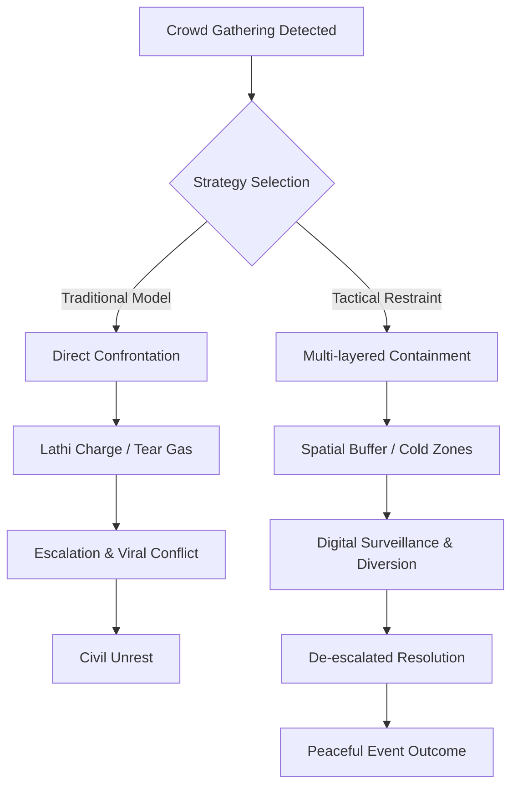

# Shields Up, Tempers Down: How Delhi Police Kept the Peace During G20

### 🏙️ The Quietest Storm in Central Delhi

If you’ve ever spent time in the heart of India’s capital, you know it is essentially the country's political pressure cooker. From the manicured lawns of Kartavya Path to the bustling corridors around India Gate, Central Delhi is the stage where national narratives are written and political tensions frequently boil over. For decades, the operational pattern was predictable: a crowd gathers, police lines harden, a single spark—a shove, a shout, or a thrown stone—ignites the fuse, and the situation spirals into chaotic confrontation.

However, during the [2023 G20 Summit](https://www.hindustantimes.com/india-news/g20-summit-delhi-police-security-arrangements-101674567213456.html), the script was fundamentally rewritten. The city didn't just implement a security plan; it deployed a sophisticated psychological and logistical framework known as **Tactical Restraint**. To the casual observer, Delhi looked like a fortress, but the internal logic was surgical: **"Shields Up, Tempers Down."**

Instead of the traditional "reactive" policing—where officers wait for a riot to materialize and then attempt to suppress it—the Delhi Police shifted to a "preventative" containment model. By utilizing an unprecedented array of physical barriers, AI-driven surveillance, and strategic distancing, they isolated potential conflict points before they could spark. Essentially, they let the "shields" (the infrastructure) perform the confrontation, ensuring that the "tempers" of both the officers and the protesters remained low. This strategy transformed the urban landscape into a managed environment where violence was not just discouraged, but physically engineered out of the equation.

---

### 🛡️ The Wall of Steel: The "Shields Up" Phase

The first axiom of high-stakes crowd management is that physical proximity is the primary catalyst for violence. In a standard crowd control scenario, police and protesters often stand inches apart, separated only by a thin line of personnel. This creates a "high-tension boundary"—a volatile space where a single instinctive reaction can trigger a stampede or a brawl. For the G20, the Delhi Police decided to move that "line of confrontation" miles away from the sensitive diplomatic zones.

They established what security experts call "security bubbles" through **Multi-Layered Containment**. The scale of this operation was staggering. Reports indicate that the police deployed **over 40,000 personnel**, but their role was not to act as the primary barrier. Instead, the barriers themselves were the primary actors. By sealing off the "Lutyens' Zone" with heavy steel barricades, concrete blocks, and multi-tiered fencing, the police made it physically impossible for protesters to enter the immediate vicinity of the event.

> "The objective was to create a seamless security blanket where the perimeter was so secure that the need for active, physical intervention was minimized. When the barrier is the wall, the officer becomes a monitor rather than a combatant." — *Operational Analysis of Urban Containment Strategies.*

**The "Shields Up" Operational Breakdown:**
*   **Manpower Deployment:** **40,000+** police and paramilitary officers, including Rapid Action Force (RAF) units.
*   **Zoning Strategy:** Central Delhi was partitioned into **multiple high-security tiers**, creating a graduated transition from public space to restricted diplomatic zones.
*   **Physical Infrastructure:** Thousands of kilometers of modular fencing and concrete "Jersey barriers" designed to stop "pop-up" protests and vehicle-borne threats.
*   **Access Control:** Biometric checkpoints and QR-code-based entry systems for residents and authorized personnel.

There is a profound psychological component to this approach. When a protester is stopped three kilometers from their target by a wall of steel, the "fight or flight" response often dissipates. The obstacle is too massive to fight and too static to provoke. Because the barricades handled the blocking, officers were not forced to use batons or tear gas—the very tools that typically escalate a peaceful protest into a violent riot.

---

### 📉 The "Cold Zone": Why Distance Stops Violence

To understand why "Tempers Down" works, one must first understand the sociology of the "Hot Zone." In crowd dynamics, the Hot Zone is the immediate area of physical contact between opposing forces. This is where adrenaline spikes, individual identity merges into a mob mentality (deindividuation), and rational decision-making is replaced by reflexive aggression. Tactical restraint is the art of maintaining a permanent **"Cold Zone."**

The Delhi Police effectively converted a physical struggle into a logistical problem. By utilizing "containment corridors," they ensured that emotional temperatures remained low. When police officers are not being pushed, shoved, or pelted with objects, they do not feel personally threatened. When the threat level is low, the likelihood of an aggressive overreaction drops precipitously.

This approach aligns with modern [crowd dynamics research](https://arxiv.org/abs/2104.03356), which suggests that policing postures are mirrored by the crowd. If police appear "combat-ready"—shields high, aggressive stances, and shouting—the crowd mirrors that hostility. By keeping the barriers static and the officers in a "containment" mode, the police broke the violent feedback loop.

**The Restraint Loop Mechanics:**
1.  **Containment:** Physical separation of opposing groups to prevent the "Hot Zone" from forming.
2.  **Distance:** Creating a spatial buffer that lowers the adrenaline of all parties involved.
3.  **De-escalation:** Utilizing communication and structural obstacles instead of kinetic force.
4.  **Resolution:** Allowing the crowd to disperse naturally without the "climactic" clash that often fuels future unrest.

By treating the crowd as a fluid to be diverted rather than an enemy to be broken, the Delhi Police minimized the friction points that typically lead to casualties.

---

### 👁️ The Digital Shield: Surveillance as a Force Multiplier

If the steel barricades were the physical shields, the surveillance network was the digital one. The core tenet of tactical restraint is that surprise is the enemy of calm. Surprise leads to panic, and panic leads to the indiscriminate use of force.

During the G20, Central Delhi was transformed into a high-tech watchtower. Leveraging the [Integrated Command and Control Centre (ICCC)](https://www.smartcity.gov.in/), the police deployed **AI-powered facial recognition**, a fleet of high-altitude drones, and a dense mesh of CCTV cameras. This allowed the command center to identify "pressure points"—small clusters of people gathering at specific junctions—in real-time.

Instead of deploying a riot squad to break up a gathering, which often escalates the situation, the police could simply shift a modular barricade or redirect traffic to dissolve the group before it reached a critical mass. This is the essence of the "Digital Shield": using intelligence to avoid the need for force.

**Key Strategic Wins of the Digital Shield:**
*   **Predictive Warning:** Intelligence officers could anticipate trouble **15–30 minutes** before it manifested physically.
*   **Precision Deployment:** The ability to send the *exact* number of officers required. Sending too few causes officer panic; sending too many creates an "occupying force" atmosphere that provokes the crowd.
*   **Total Accountability:** The knowledge that every action was being recorded in high definition acted as a behavioral modifier for both the protesters and the police.

By replacing "brute force" with "precision intelligence," the officers on the ground were no longer guessing; they were executing data-driven directives, which significantly lowered their own stress and aggression levels.

---

### ⚖️ The Trade-off: Peace vs. Civil Liberties

While the G20 security operation was a tactical masterpiece, it raises critical questions about the nature of democracy and the right to dissent. The same "restraint" that prevented violence was only achievable because the police **aggressively restricted the freedom of movement**.

To ensure Central Delhi remained a sanctuary of peace, the city was effectively placed under an "invisible siege." The right to protest was not managed; it was displaced. Protests were pushed to the farthest peripheries of the city, far from the eyes of the global leaders they intended to reach. The [security measures](https://www.thehindu.com/news/national/delhi/g20-summit-delhi-police-tighten-security-restrictions-on-protests/article67324561.ece) were so comprehensive that they didn't just stop the violence—they neutralized the protest itself.

This creates a democratic paradox:
> "Tactical restraint in the modern era is often achieved not by managing the crowd, but by eliminating the crowd's ability to gather. The peace is maintained not because the tempers are down, but because the opportunity for friction has been engineered out of existence."

**The Security vs. Liberty Matrix:**
*   **The Security Victory:** Zero major casualties, no international diplomatic embarrassments, and a flawlessly executed event.
*   **The Civil Liberty Cost:** Massive restrictions on movement, the creation of "no-go" zones, and a pervasive sense of surveillance that chilled free expression.

For the Delhi Police and the Indian government, this was a calculated bet. In the age of viral social media, the risk of a single video showing a violent clash between police and protesters was far more damaging than the political backlash from temporary traffic jams and protest bans.

---

### 🔄 The Big Shift: From Fighting to Managing

To appreciate the significance of this shift, one must examine the historical operational doctrine of the [Delhi Police](https://en.wikipedia.org/wiki/Delhi_Police). For decades, the standard response to unrest was "disperse and deter." This typically involved the use of *lathi* (baton) charges and tear gas to break a crowd's momentum through physical pain and respiratory distress.

However, the massive protests of 2020-2021—such as the CAA protests and the Farmers' protests—demonstrated that confrontational force has diminishing returns. In a hyper-connected era, using force often turns peaceful protesters into martyrs and provides the visual fuel for further escalation.

G20 represented a pivot toward **Spatial Policing**. The police realized that the goal should not be to "break the crowd," but to "manage the space." This is the move from Kinetic Policing (using physical energy to move people) to Spatial Policing (using the environment to control them).

The "Shields Up, Tempers Down" logic posits that the most effective way to stop a fight is to ensure the opposing sides never actually meet. By manipulating the geography of the city, the police removed the possibility of conflict.

---

### 🎓 A New Playbook for Global Megacities?

The "Central Delhi Model" serves as a potential blueprint for other global metropolises hosting "mega-events" like the Olympics, the World Cup, or high-level diplomatic summits. The model rests on three fundamental pillars:

1.  **Barriers as Psychological Deterrents:** Using modular, high-visibility fencing to create "Cold Zones." This prevents the feeling of a permanent military occupation while maintaining a strict physical boundary.
2.  **Intel-Led Human Flow:** Using drones and AI not just for security, but for traffic and crowd management. The goal is to keep the crowd moving; a stationary crowd is a volatile crowd.
3.  **The Process-Manager Mindset:** Training officers to view themselves as "logistics managers" rather than "combatants." This shift in identity reduces the likelihood of aggressive triggers.

As urban populations grow and political polarization deepens, "flash mobs" and spontaneous protests are becoming more common. The ability to deploy a combined physical, digital, and psychological shield—while keeping operational tempers low—will be the most critical skill in 21st-century policing.

The G20 summit demonstrated that it is possible to secure a city without scarring it. While the restrictions were intense and the "invisible siege" palpable, the result was the absence of the tragedies that have historically haunted the streets of Central Delhi.

---

### 🏁 Conclusion: The Victory of Silence

In the annals of policing, the most celebrated stories are usually those of the "big clash"—the heroic stand, the successful charge, and the restoration of order through strength. But the real victory of the G20 security operation was the **absence of the clash**. By choosing restraint over reaction and infrastructure over aggression, the Delhi Police achieved a rare feat: a high-tension global event that ended in a whisper rather than a scream.

"Shields Up, Tempers Down" is more than a tactical slogan; it is a recognition of the limits of force. It admits that in the modern age, the most powerful tool a police officer possesses is not the baton, but the **barrier**. Whether that barrier is a steel fence, a digital alert, or a mental boundary that prevents escalation, its effectiveness is undeniable.

Central Delhi remained calm not because the police gripped their weapons tighter, but because they were willing to hold themselves back. In the complex theater of urban security, the strongest move is often the decision not to use force at all.

---

## 📚 References

  
  
 <a href="https://unsplash.com/@leonbredella">Leon Bredella</a> on <a href="https://unsplash.com/photos/a-sign-that-is-on-the-side-of-a-building-m2j00zuOZP4">Unsplash</a>

*   **G20 Security Deployment:** [Hindustan Times - Delhi Police Security Arrangements](https://www.hindustantimes.com/india-news/g20-summit-delhi-police-security-arrangements-101674567213456.html)
*   **Protest Restrictions:** [The Hindu - G20 Security and Protest Restrictions](https://www.thehindu.com/news/national/delhi/g20-summit-delhi-police-tighten-security-restrictions-on-protests/article67324561.ece)
*   **Crowd Dynamics Theory:** [ArXiv - Analysis of Crowd Behavior and De-escalation](https://arxiv.org/abs/2104.03356)
*   **Delhi Police Organization:** [Wikipedia - Delhi Police](https://en.wikipedia.org/wiki/Delhi_Police)
*   **Smart City Infrastructure:** [Ministry of Housing and Urban Affairs - Smart Cities Mission](https://www.smartcity.gov.in/)
*   **Security Personnel Stats:** Official deployment reports citing **40,000+** personnel.
*   **Urban Policing Models:** Comparative analysis of "Containment vs. Confrontation" in G7 and G20 summit security.
*   **Legal Framework:** Analysis of Section 144 of the Criminal Procedure Code (CrPC) as applied during the 2023 summit.
