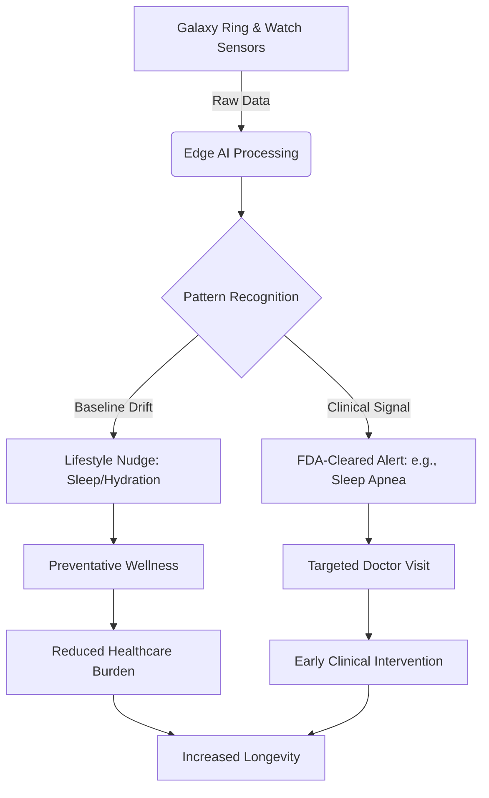

# Can a Ring Actually Keep You Out of the Doctor's Office? Samsung’s Big AI Bet

For decades, the fundamental architecture of modern healthcare has been reactive. The logic is simple, if flawed: something hurts, you notice a symptom, and *then* you book an appointment. In essence, we wait for the fire to start before we call the fire department. This "episodic care" model relies on snapshots—a single blood pressure reading every six months or a blood test once a year—which often miss the subtle, creeping trends that lead to chronic illness.

However, in a recent deep dive with [TechRadar](https://www.techradar.com/health/exclusive-samsungs-vp-of-mobile-experience-reveals-more-about-samsungs-ai-health-overhaul), Samsung’s VP of mobile experience outlined a goal that sounds almost provocative: **“We want to keep people away from doctors.”**

At a surface level, this sounds reckless. Why would a consumer electronics giant encourage users to bypass professional medical consultation? But a closer look reveals a more sophisticated ambition. Samsung isn't attempting to replace the physician; it is attempting to replace the *necessity* of the routine, diagnostic visit. By synthesizing data from the Galaxy Ring, the Galaxy Watch, and a sophisticated AI orchestration layer, Samsung is betting that we can pivot from "sick care"—fixing things once they break—to true "health care"—maintaining the system so it never breaks in the first place.

This shift represents a move toward the "Quantified Self" on a systemic scale. It is no longer about counting steps or calculating calories burned during a jog. It is about building a 24/7 biological surveillance system capable of detecting the "tiny whispers" of physiological distress before they escalate into medical emergencies. The goal is to turn raw biometric data into a real-time lifestyle steering wheel, potentially reducing the burden on an already overwhelmed global healthcare infrastructure.

---

## 🩺 The Big Idea: From Reactive Snapshots to Proactive Movies

  
  
 <a href="https://unsplash.com/@anhnhat1205">Anh Nhat</a> on <a href="https://unsplash.com/photos/black-and-white-iphone-case-PdALQmfEqvE">Unsplash</a>

The core of Samsung's strategy is the transition from reactive medicine to proactive wellness. To understand why this matters, one must understand the limitation of the current clinical model. When you visit a doctor, they see a "snapshot." Your blood pressure might be high that morning because you're nervous (White Coat Hypertension), or your glucose might be skewed by a specific meal. These data points are isolated events.

Samsung’s vision is to provide a "movie" instead of a "snapshot." When an AI tracks your heart rate variability (HRV), sleep architecture, and blood oxygen levels every single second of every single day, it stops looking for a "bad number" and starts looking for **biometric drift**.

Biometric drift occurs when your data begins to slide away from your own established baseline. For most people, a resting heart rate of 70 BPM is normal. But if *your* personal baseline is 55 BPM, and it suddenly climbs to 65 BPM over a week, that **18% increase** is a significant signal, even though you are still well within the "normal" range for the general population.

As highlighted in research regarding [AI in healthcare](https://arxiv.org/abs/2303.15563), the power of wearables lies in this continuous monitoring. By detecting these shifts early, the AI can nudge a user to adjust their behavior—perhaps by prioritizing sleep or reducing caffeine—before the drift leads to a clinical event like burnout, a severe respiratory infection, or a cardiovascular episode.

> "The goal is to move from simple data collection to actionable intelligence," the Samsung VP told TechRadar.

By flagging these trends *before* the user feels symptomatic, Samsung believes it can effectively "gatekeep" the doctor's office. If the AI can resolve a health dip through lifestyle intervention, the patient avoids the waiting room, and the physician is freed to focus on complex cases that actually require surgical or pharmacological intervention.

---

## 💍 The Gear: The Symbiosis of Ring and Watch

To achieve clinical-grade accuracy, Samsung realized that a single form factor was insufficient. The Galaxy Watch is a powerhouse of sensors, but it has a fundamental flaw: ergonomics. Many users find a bulky smartwatch uncomfortable for sleep tracking, yet sleep is where the most critical recovery data is generated. This is the strategic vacuum that the [Galaxy Ring](https://www.samsung.com/global/galaxy/galaxy-ring/) was designed to fill.

The Galaxy Ring is engineered for **low-friction, 24/7 monitoring**. By placing sensors on the finger, Samsung gains access to a different set of biological signals. The arteries in the finger are closer to the surface than those in the wrist, often allowing for more precise readings of heart rate and blood oxygen (SpO2) during periods of stillness.

When the Ring and Watch are used in tandem, they create a comprehensive biological telemetry system:
1.  **The Galaxy Watch:** Handles high-intensity data, GPS tracking, ECG (Electrocardiogram) for heart rhythm, and blood pressure monitoring.
2.  **The Galaxy Ring:** Manages the baseline—skin temperature, deep sleep cycles, and resting heart rate—without interrupting the user's life.

The convergence of this data feeds into the **Energy Score**, an AI-generated metric that synthesizes sleep, activity, and heart rate. This score is a psychological masterstroke. Instead of presenting the user with a daunting spreadsheet of raw millivolts and BPMs, Samsung provides a simplified "readiness" number. 

If your Energy Score is low, the AI doesn't just report fatigue; it suggests a specific action, such as a light walk instead of a heavy gym session. This transforms the device from a passive recorder into an active health coach, closing the loop between *monitoring* and *action*.

---

## 🧠 Galaxy AI: Turning Noise into Biological Intelligence

The true challenge of wearable tech isn't the hardware; it's the signal-to-noise ratio. Raw biometric data is inherently noisy. A heart rate spike of **20-30 BPM** could mean you are having a panic attack, you just climbed three flights of stairs, or you are fighting off a fever. Without context, this data is not only useless—it can be anxiety-inducing.

This is where **Galaxy AI** and the concept of "Biological Intelligence" come into play. Samsung is utilizing machine learning to provide the "contextual layer." The AI correlates data from multiple sensors simultaneously. If your heart rate spikes while the accelerometer shows you are moving at 5 mph, the AI marks it as "exercise." If your heart rate spikes while the accelerometer shows you are motionless and your skin temperature has risen by **0.5°C**, the AI flags a potential fever.

Furthermore, Samsung is prioritizing **Edge AI**. Traditionally, health data is sent to the cloud for processing, which raises massive privacy concerns. By processing data locally on the device, Samsung reduces latency and enhances security. Research on [privacy-preserving AI](https://arxiv.org/abs/2308.11223) suggests that "on-device" intelligence is the only way to maintain the trust necessary for users to share their most intimate biological data.

The AI is also trained to spot **long-term circadian shifts**. While a doctor might ask "How have you been sleeping lately?" and receive an inaccurate subjective answer, Galaxy AI analyzes three months of sleep-wake cycles. It can detect a slow shift in the circadian rhythm that might indicate the onset of a sleep disorder or clinical depression long before the user consciously notices a change in mood or energy.

---

## 🏥 Clinical Integration: FDA Approval and the "Silent Killers"

Samsung is aggressively pushing past the "wellness" label to enter the realm of regulated medical devices. A primary example is the [FDA clearance for sleep apnea detection](https://www.reuters.com/technology/samsung-health-sleep-apnea-fda-clearance) on the Galaxy Watch.

Sleep apnea is often termed a "silent killer" because it remains undiagnosed for years. The current gold standard for diagnosis is a polysomnography (sleep study), which requires a patient to spend a night in a clinic wired to dozens of sensors—a process that is expensive, uncomfortable, and often results in "first-night effect," where the patient doesn't sleep naturally.

Samsung’s AI handles this by monitoring SpO2 levels and movement patterns throughout the night. If the AI detects repeated drops in blood oxygen coupled with specific respiratory disturbances, it flags the user for a high probability of sleep apnea. 

This is the "keeping people away from doctors" philosophy in action. Instead of every snoring adult undergoing a sleep study, the AI acts as a high-efficiency filter. Only those with high-probability flags go to the clinic, drastically reducing the load on sleep specialists and ensuring that those at highest risk are prioritized.

Similarly, Samsung is exploring the integration of PPG (Photoplethysmography) sensors to monitor cardiovascular health. Research into [Deep Learning for Cardiovascular Diseases](https://arxiv.org/abs/1812.04693) indicates that these light-based sensors can be trained to detect arrhythmias and early signs of hypertension. If successfully implemented, the Galaxy ecosystem becomes a primary screening tool for heart disease, moving the point of detection from the clinic to the living room.

---

## ⚠️ The Risks: Cyberchondria and the "Algorithm Over Body" Paradox

Despite the potential, a 24/7 biological surveillance state carries significant psychological risks. The most prominent is **"cyberchondria"**—a modern derivative of hypochondria where individuals obsessively analyze their health data and interpret minor fluctuations as signs of catastrophe.

When a user sees a "Poor" sleep score or a dip in their heart rate variability (HRV), it can trigger a stress response. This creates a paradoxical loop: the device intended to reduce stress becomes the source of stress. As noted in discussions on [the stress of digital tracking](https://www.psychologytoday.com/us/blog/digital-health/the-stress-of-tracking), the constant feedback loop of "optimization" can lead to orthosomnia—an unhealthy obsession with achieving the "perfect" sleep score.

There is also the danger of **cognitive outsourcing**. If a user feels a strange flutter in their chest but their Galaxy AI tells them their "Energy Score" is **95/100**, will they ignore a legitimate physical warning sign? There is a risk that we will stop listening to our intuitive bodily signals and defer entirely to the algorithm.

Samsung’s challenge is to build an AI that knows its own limits. The system must be designed to avoid "false reassurance." The goal should not be to tell the user they are "fine," but to provide a probability range that encourages a professional visit the moment a signal enters a "gray zone."

---

## 🏁 The Ecosystem War: Samsung vs. Apple vs. Oura

Samsung is not operating in a vacuum. They are locked in a three-way battle with Apple and Oura, each taking a different approach to the "Health Stack."

- **Apple:** Focuses on the "Safety Net." With fall detection, ECG, and high-accuracy heart monitoring, Apple positions the watch as a life-saving device. However, Apple has been slow to enter the ring market, leaving a gap in seamless sleep tracking.
- **Oura:** Focuses on "Deep Recovery." Oura pioneered the smart ring and has a massive lead in sleep and readiness data. However, Oura lacks the broader ecosystem—they don't make the phone, the OS, or the home appliances.
- **Samsung:** Focuses on "Integrated Orchestration." 

Samsung's advantage is the ability to plug health data into the user's entire digital environment via SmartThings and Galaxy AI. Imagine a scenario where the Galaxy Ring detects you had a night of poor REM sleep and your resting heart rate is elevated. Instead of just giving you a low score, the ecosystem reacts:
- **Home Automation:** Your smart blinds open more slowly to ease you into the day.
- **Calendar Integration:** Your AI assistant suggests moving a high-stress morning meeting to the afternoon to allow for a later wake-up.
- **Nutrition:** Your connected fridge suggests a high-protein, low-sugar breakfast to stabilize your energy levels.

This is the "Galaxy Experience." By controlling the hardware (Ring/Watch), the software (Health app), and the environment (SmartThings), Samsung is building a wellness "walled garden." Once your entire biological history is stored and analyzed within this system, the switching cost to another brand becomes prohibitively high.

---

## 🚀 The Future Roadmap: The "Holy Grail" of Wearables

While sleep apnea and heart rate are significant wins, the next frontier for Samsung is non-invasive metabolic monitoring. The "Holy Grail" of the wearable industry is **non-invasive glucose monitoring**. 

Currently, millions of diabetics must prick their fingers or wear interstitial sensors (like Dexcom) to monitor blood sugar. If Samsung can use spectroscopic sensors in the Galaxy Ring or Watch to monitor glucose levels through the skin, it would be the single most disruptive event in the history of consumer health tech. 

Integrating glucose monitoring with AI would allow for real-time dietary feedback. Instead of wondering why you feel a "sugar crash" at 3 PM, the AI could show you the exact spike caused by your lunch and suggest a 10-minute walk to bring those levels back to baseline. This would effectively democratize metabolic health, moving it from a clinical necessity for diabetics to a performance tool for everyone.

---

## Conclusion: A New Philosophy of Living

Samsung’s bet on using AI to "keep people away from doctors" is more than a product strategy; it is a bid to redefine the human relationship with health. By moving the point of intervention from the clinic to the wrist and finger, we have the opportunity to stop treating health as a series of crises to be managed and start treating it as a system to be maintained.

However, the success of this vision depends on balance. AI must remain a compass—a tool that points us in the right direction—rather than a crutch that replaces clinical judgment. The ultimate victory for Samsung will not be the replacement of the physician, but the transformation of the doctor's visit. In the future, you won't go to the doctor to find out *what* is wrong; you will go to the doctor with a year's worth of AI-analyzed data to discuss exactly *how* to fix it.

As we enter this era of biological intelligence, the goal is clear: use technology to buy back our time, our health, and ultimately, our lives.

## References

- [TechRadar: Samsung's VP reveals AI health overhaul](https://www.techradar.com/health/exclusive-samsungs-vp-of-mobile-experience-reveals-more-about-samsungs-ai-health-overhaul)
- [Samsung Global: Galaxy Ring Product Page](https://www.samsung.com/global/galaxy/galaxy-ring/)
- [ArXiv: Privacy-preserving machine learning for healthcare: open challenges and future perspective](https://arxiv.org/abs/2303.15563)
- [Wikipedia: Federated learning](https://en.wikipedia.org/wiki/Federated_learning)
- [ArXiv: ECG Arrhythmia Classification Using Transfer Learning from 2-D CNN Features](https://arxiv.org/abs/1812.04693)
- [Reuters: Samsung FDA Clearance for Sleep Apnea](https://www.reuters.com/technology/samsung-health-sleep-apnea-fda-clearance)
- [Psychology Today: The Stress of Digital Tracking](https://www.psychologytoday.com/us/blog/digital-health/the-stress-of-tracking)
- [Samsung Global: Galaxy Ring Energy Score](https://www.samsung.com/global/galaxy/galaxy-ring/energy-score/)
- [World Health Organization: Global Report on Diabetes](https://www.who.int/news-room/fact-sheets/detail/diabetes)
- [FDA: Software as a Medical Device (SaMD)](https://www.fda.gov/medical-devices/digital-health-center/software-medical-device-samd)
