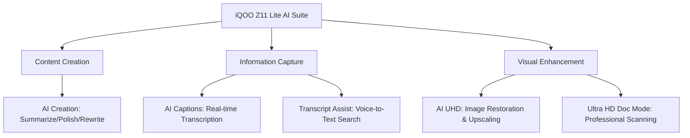

# 🔋 Finally, a Budget Phone That Actually Lasts: The iQOO Z11 Lite 5G

Let's be real: for most of us, our smartphones have evolved from simple communication devices into our primary workstations. For students and young professionals in India, a phone is a notebook, a library, a cinema, and a social hub all rolled into one. However, the daily struggle to keep the battery alive has become a modern-day nightmare. We've all experienced the anxiety of seeing that **15% battery warning** during a crucial lecture or while navigating a new city.

That’s where the **iQOO Z11 Lite 5G** steps in. This isn't just another incremental update in a sea of nearly identical budget phones; it is a device designed specifically to solve the pain points that actually annoy users. iQOO is branding it a "Battery Behemoth," and the numbers back it up. While the industry standard for budget phones has stagnated at 5,000mAh, the Z11 Lite pushes the envelope with a massive **6,500mAh** cell.

But a giant battery is useless if the software is clunky or the hardware is fragile. The Z11 Lite balances its endurance with "Non-Stop Intelligence" AI tools and a build quality designed to survive the chaos of campus life. Whether you need to summarize a dense academic paper, transcribe a fast-talking professor, or survive a clumsy drop in a crowded hallway, this device is built to be a long-term companion rather than a disposable gadget. Powered by [OriginOS 6](https://www.republicworld.com/tech/iqoo-z11-lite-5g-launched-in-india-with-6500mah-battery-ai-features-starting-at-19499-2026-07-24-133304), the Z11 Lite is attempting to redefine what "value" means in the under-₹20,000 market.

---

### ⚡ The 6,500mAh BlueVolt Battery: Ending Battery Anxiety Forever

For the average student, a typical day is a grueling marathon. It starts with early morning alarms, hours of digital note-taking, constant toggling between WhatsApp and Canvas, streaming educational content on YouTube, and perhaps a few rounds of *BGMI* or *Free Fire* to unwind. In the past, this cycle meant hunting for a wall socket by lunch or lugging around a bulky power bank that adds unnecessary weight to your bag.

The iQOO Z11 Lite seeks to end this cycle with its **6,500mAh BlueVolt battery**. To understand why this matters, we have to look at the chemistry. Most budget phones use standard Lithium-Polymer batteries that degrade significantly after 500 to 800 charge cycles. iQOO's "BlueVolt" technology utilizes high-density materials that allow for a larger capacity without making the phone feel like a brick.

More importantly, iQOO is claiming a **five-year battery health** guarantee. This is a game-changer. Most budget users find that their phone becomes unusable after 18 to 24 months because the battery capacity drops to 70%. By focusing on long-term chemical stability, iQOO is promising a device that can actually last through a three- or four-year degree program without requiring a costly battery replacement.

**Charging and Power Management:**
A battery this large could be a liability if it took six hours to charge. To mitigate this, the device supports **44W FlashCharge**. According to reports from [Fone Arena](https://www.fonearena.com/blog/488172/iqoo-z11-lite-price-india-specifications.html), the Z11 Lite can jump from **1% to 50% in approximately 37 to 38 minutes**. While it isn't the fastest charging in the world, it's a pragmatic balance between charging speed and battery longevity (as ultra-fast charging often degrades cells faster).

Additionally, the inclusion of reverse charging is a thoughtful touch. If your wireless earbuds die during a commute, you can use your Z11 Lite as an emergency power bank, ensuring your audio experience remains uninterrupted.

> "The iQOO Z11 Lite packs a 6,500mAh battery paired with 44W FlashCharge support... designed to comfortably last through a full day of classes, multitasking, and entertainment." — [MySmartPrice](https://www.mysmartprice.com/personal-tech/mobiles/mobiles-news/iqoo-z11-lite-launching-on-july-24-under-rs-20000-with-6500mah-battery-ai-features-military-grade-durability)

---

### 🤖 AI That Actually Works: The "Non-Stop Intelligence" Suite

In the current smartphone landscape, "AI" is often used as a marketing buzzword for basic filters or slightly better voice assistants. iQOO has taken a different approach with the Z11 Lite. Instead of gimmicks, they have integrated "Productivity AI" directly into **OriginOS 6**, focusing on the specific needs of students and entry-level professionals.

#### 📝 AI Creation: Your Academic Assistant
The **AI Creation** tool is perhaps the most valuable feature for anyone dealing with heavy reading loads. It doesn't just summarize text; it can adjust the tone of your writing. If you've drafted a rough email to a professor or a first draft of an assignment, AI Creation can polish the grammar and shift the tone from "casual" to "professional" in seconds. For students facing a 50-page research paper, the ability to generate a concise, bulleted summary allows for faster skimming and better information retention.

#### 🎧 AI Captions & Transcript Assist: The End of Manual Note-Taking
One of the hardest parts of learning is trying to write everything a lecturer says while simultaneously trying to understand the concept. **AI Captions** and **AI Transcript Assist** solve this by providing real-time transcription. You can record a lecture, and the AI will convert the audio into structured text, highlighting key terms and creating a searchable document [Republic World](https://www.republicworld.com/tech/iqoo-z11-lite-5g-launched-in-india-with-6500mah-battery-ai-features-starting-at-19499-2026-07-24-133304). This allows students to engage more deeply with the material rather than becoming mere stenographers.

#### 🖼️ Visual AI and Document Management
The suite also includes tools to handle the "physical-to-digital" transition:
*   **AI Screen Translation**: This is an incredible tool for those learning a new language or reading international journals. It translates text on any app screen instantly.
*   **AI UHD & Photo Enhance**: Budget cameras often struggle with low light or blur. This tool uses AI to upscale images and remove noise from scanned documents.
*   **Ultra HD Document Mode**: This acts as a professional-grade scanner, flattening curved pages and enhancing contrast to make handwritten notes look sharp and digitally archived.

---

### 📺 A Display Built for the Indian Sun

A common failure of budget LCD screens is their inability to compete with sunlight. Many "budget" phones become mirrors the moment you step outside, making it impossible to read a map or check a notification. iQOO has addressed this with a **6.74-inch HD+ LCD** that reaches a peak brightness of **1,200 nits (HBM)**. 

According to [Moneycontrol](https://www.moneycontrol.com/technology/iqoo-z11-lite-with-6-500-mah-battery-120hz-display-launched-in-india-price-specifications-article-13983331.html), this is among the brightest displays in its price bracket for 2026. High Brightness Mode (HBM) automatically kicks in under direct sunlight, ensuring that your screen remains legible even in the harsh midday heat of an Indian summer.

**Fluidity and Eye Care:**
The **120Hz refresh rate** ensures that the user interface feels snappy. Whether you are scrolling through a long PDF or navigating through social media feeds, the motion is fluid, reducing the "stutter" often associated with cheaper chipsets. Furthermore, the **TÜV Rheinland Low Blue Light certification** is crucial for students. When you're pulling an all-nighter and staring at a screen for six hours straight, the reduced blue light emission helps minimize eye strain and prevents the disruption of your sleep cycle.

**The "Dynamic Light" Innovation:**
One of the most interesting additions is the **Dynamic Light** notification system. In a classroom or office setting, having your phone vibrate or light up the entire screen is disruptive. The Dynamic Light module provides subtle, coded visual alerts for calls and messages, allowing you to keep the phone face-down while remaining aware of urgent notifications. Additionally, the **200% volume mode** is a lifesaver for those attending online classes in noisy environments, ensuring you don't miss a single word of the lecture.

---

### 🚀 Performance: Efficiency Over Raw Power

Under the hood, the iQOO Z11 Lite is powered by the **MediaTek Dimensity 6300**. To be clear: this is not a gaming beast. It won't beat a flagship in *Genshin Impact* on ultra settings. However, it is built on a **6nm process**, which is the secret to its efficiency.

In the budget segment, raw power often leads to overheating, which in turn kills the battery. The Dimensity 6300 is tuned for stability. It handles multitasking with ease and ensures that the **6,500mAh battery** isn't drained by an inefficient processor.

**Memory and Storage Architecture:**
The device offers **4GB to 6GB of LPDDR4X RAM**. While 4GB can feel tight in 2026, iQOO implements **virtual RAM expansion**. This technology uses a portion of the internal storage as temporary RAM, allowing the phone to keep more apps open in the background without closing them. 

Storage options range from **128GB to 256GB (UFS 2.2)**. For the power user, there is a microSD slot supporting up to **2TB**. This is a massive advantage for students who record hours of lectures or store thousands of high-resolution textbooks and PDFs locally.

**Software Longevity:**
The Z11 Lite runs **OriginOS 6 based on Android 16**. One of the biggest frustrations with budget phones is "software abandonment," where a company releases a phone and never updates it again. iQOO is promising **two years of OS updates and four years of security patches** [Moneycontrol](https://www.moneycontrol.com/technology/iqoo-z11-lite-with-6-500-mah-battery-120hz-display-launched-in-india-price-specifications-article-13983331.html). This means the device will remain secure and compatible with the latest apps well into the future.

---

### 🛡️ Military-Grade Durability: Built for the Real World

Most budget phones feel like they are made of fragile plastic. One accidental drop on a concrete floor usually results in a shattered screen or a cracked back panel. iQOO has completely flipped the script by implementing **Military-Grade Durability** in the Z11 Lite.

The device carries the **Swiss SGS 5-Star Drop Resistance certification**. This isn't just a marketing sticker; it means the chassis and glass have been tested against repeated drops from various angles and heights. For a student rushing between classes or a commuter navigating a crowded bus, this "peace of mind" is arguably more valuable than a slightly faster processor.

**Environmental Protection:**
The **IP65 rating** provides a necessary layer of protection. While it cannot be submerged in a pool (which would require IP68), it is fully protected against dust and water splashes. If you get caught in a sudden monsoon downpour while walking to the metro, you don't have to panic about your phone dying from a few raindrops [Republic World](https://www.republicworld.com/tech/iqoo-z11-lite-5g-launched-in-india-with-6500mah-battery-ai-features-starting-at-19499-2026-07-24-133304).

The design remains understated yet modern, available in **Midnight Blue** and **Solar Flame**. The side-mounted fingerprint scanner is snappy and ergonomically placed, making one-handed operation a breeze.

---

### 💰 Price Analysis: Value for Money?

The iQOO Z11 Lite is positioned aggressively to capture the heart of the Indian youth market. Starting at an effective price of **₹17,999**, it competes directly with the likes of the Redmi Note and Realme series.

**Pricing Tiers:**
*   **4GB + 128GB**: ₹19,499 (Effective price **₹17,999** with launch offers)
*   **6GB + 128GB**: ₹21,499 (Effective price **₹19,999**)
*   **6GB + 256GB**: ₹24,499 (Effective price **₹22,999**)

To make it even more accessible, iQOO is offering a **flat ₹1,500 instant discount** for SBI and Axis Bank cardholders, alongside no-cost EMI options for three months [Republic World](https://www.republicworld.com/tech/iqoo-z11-lite-5g-launched-in-india-with-6500mah-battery-ai-features-starting-at-19499-2026-07-24-133304).

**Competitive Comparison:**
When compared to other devices in the ₹15,000–₹20,000 range, the Z11 Lite offers a clear advantage:
1.  **Battery**: **30% more capacity** than the average 5,000mAh competitor.
2.  **Durability**: SGS 5-Star rating is rare in this price segment.
3.  **Display**: 1,200 nits HBM makes it superior for outdoor use.
4.  **Support**: Being made at vivo's **Greater Noida facility** under the "Make in India" initiative ensures an extensive network of over 670 service centers [MySmartPrice](https://www.mysmartprice.com/personal-tech/mobiles/mobiles-news/iqoo-z11-lite-launching-on-july-24-under-rs-20000-with-6500mah-battery-ai-features-military-grade-durability).

---

### 🏁 The Final Verdict: Who Should Buy This?

The iQOO Z11 Lite 5G is not attempting to be a "flagship killer." It doesn't have a periscope zoom lens, it doesn't support 120W charging, and it won't win any benchmark races. Instead, it is winning the **"Real Life Race."**

By prioritizing the three things that actually matter to a budget user—**extreme battery life, rugged durability, and practical AI tools**—iQOO has created a safety net for the user. It is a device that recognizes the reality of student life: long hours, accidental drops, and a need for tools that actually help with productivity.

**✅ Buy this if:**
*   You are a student or young professional who hates carrying a power bank.
*   You are clumsy with your devices and need something that can survive a drop.
*   You need a reliable tool for transcribing lectures and summarizing documents.
*   You spend a lot of time outdoors and need a bright, legible screen.

**❌ Skip this if:**
*   You are a hardcore mobile gamer who needs the absolute highest frame rates.
*   You are a content creator who needs 4K 60fps video recording.
*   You prefer a compact phone (the 6,500mAh battery makes this a larger device).

In the budget world, "luxury" is often defined by flashy specs that you only use once. But true luxury is the peace of mind that comes from knowing your phone **refuses to die**, **refuses to break**, and **helps you work faster**. On that front, the iQOO Z11 Lite is the best value proposition in India right now.

---

## 📚 References

  
  
 <a href="https://unsplash.com/@zelebb">Andrey Matveev</a> on <a href="https://unsplash.com/photos/a-hand-holds-an-iqoo-smartphone-tXBXrc-6LuQ">Unsplash</a>

*   [iQOO Z11 Lite Launching on July 24 With 6,500mAh Battery - MySmartPrice](https://www.mysmartprice.com/personal-tech/mobiles/mobiles-news/iqoo-z11-lite-launching-on-july-24-under-rs-20000-with-6500mah-battery-ai-features-military-grade-durability)
*   [iQOO Z11 Lite 5G Launched in India Starting at ₹19,499 - Republic World](https://www.republicworld.com/tech/iqoo-z11-lite-5g-launched-in-india-with-6500mah-battery-ai-features-starting-at-19499-2026-07-24-133304)
*   [iQOO Z11 Lite with 6.74″ 120Hz display, 6500mAh battery - Fone Arena](https://www.fonearena.com/blog/488172/iqoo-z11-lite-price-india-specifications.html)
*   [iQOO Z11 Lite with 6,500 mAh battery, 120Hz display - Moneycontrol](https://www.moneycontrol.com/technology/iqoo-z11-lite-with-6-500-mah-battery-120hz-display-launched-in-india-price-specifications-article-13983331.html)
*   [iQOO Z11 Lite Colourways, Key Features Revealed - Gadgets360](https://www.gadgets360.com/mobiles/news/iqoo-z11-lite-india-launch-date-announced-colourways-specifications-features-11748081)
