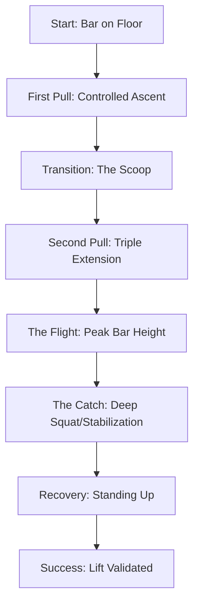

# 🏋️‍♀️ Mirabai Chanu: The Iron Will of Indian Weightlifting

The story of Saikhom Mirabai Chanu is not merely a chronicle of medals and records; it is a masterclass in resilience, a testament to the grit of rural India, and a scientific study in the limits of human strength. From the quiet landscapes of Manipur to the roaring arenas of the Tokyo Olympics and the Commonwealth Games, Chanu has redefined what is possible for Indian athletes in strength sports.

As the sporting world pivots toward the **2026 Commonwealth Games**, the trajectory of Chanu's career provides a blueprint for aspiring athletes and a case study for sports scientists worldwide. This feature explores the intersection of her legendary willpower and the rigorous biomechanics that propel a 49kg athlete to lift weights that defy logic.

## 🥇 The Golden Path: Commonwealth Games Dominance

Mirabai Chanu's relationship with the Commonwealth Games (CWG) is one of absolute dominance. While many athletes struggle with the pressure of being a favorite, Chanu has thrived, turning the CWG platform into her personal showcase.

### The 2018 Gold Coast Breakthrough
In **2018**, at the Gold Coast Games, Chanu announced her arrival as a global powerhouse. Competing in the 49kg category, she displayed a level of technical precision that left her competitors trailing. Her victory wasn't just about raw strength; it was about the efficiency of her movement. By securing the gold, she didn't just win a medal; she shattered the psychological barrier for Indian weightlifters, proving that India could dominate the podium in strength events.

### The 2022 Birmingham Triumph
Four years later, at the **2022 Birmingham Games**, Chanu faced a different kind of pressure. She was no longer the underdog; she was the target. Despite the grueling recovery cycles and the immense expectations of a billion people, she delivered a clinical performance. 

> "Weightlifting is not just about how much you can lift, but how you handle the weight of expectations on your shoulders." — *Sports Analyst, Indian Athletics*

Her gold in Birmingham solidified her legacy, marking her as a two-time Commonwealth champion and establishing a dynasty in the 49kg division.

## 🥈 The Olympic Peak: Tokyo 2020 and Beyond

While the CWG provided the gold, the Tokyo Olympics provided the glory. The silver medal won by Chanu in the 49kg category is arguably one of the most significant achievements in Indian sporting history.

The drama of the Tokyo final was palpable. Chanu's lift of **115kg in the clean and jerk** was a moment of pure transcendence. The image of her collapsing in relief and joy after the successful lift became an instant icon of Indian sports. 

**The Bold Stats of Tokyo:**
*   **Snatch:** 87kg
*   **Clean & Jerk:** 115kg
*   **Total:** 202kg
*   **Rank:** Silver Medalist

This performance was the result of years of meticulous planning under the [Target Olympic Podium Scheme (TOPS)](https://nas.gov.in/), which provided the necessary funding for international exposure, specialized coaching, and world-class physiotherapy.

## ⚙️ The Science of Power: Biomechanics of a Lift

To understand how Mirabai Chanu lifts nearly three times her body weight, we must move beyond the narrative of "hard work" and into the realm of **biomechanics**. Weightlifting is essentially the art of accelerating a barbell vertically while minimizing horizontal displacement.

### The Triple Extension
The core of any successful lift—be it the Snatch or the Clean & Jerk—is the **triple extension**. This is the simultaneous extension of the ankles, knees, and hips. When Chanu executes this, she converts chemical energy into kinetic energy with staggering efficiency.

1.  **The First Pull:** The goal is to break the inertia of the bar. The angle of the back remains constant, and the knees move back to clear the path for the bar.
2.  **The Transition (The Scoop):** As the bar passes the knees, the body shifts into the "power position." This is where the most critical biomechanical alignment occurs.
3.  **The Second Pull (The Explosion):** This is the triple extension phase. The rapid extension creates a vertical impulse, sending the bar upward.

### The S-Curve and Bar Path
A common misconception is that the bar moves in a perfectly straight line. In reality, elite lifters like Chanu utilize a slight **S-curve**. The bar moves slightly toward the lifter during the first pull and is pushed slightly away during the transition before being pulled back into the center of gravity during the catch.

### Kinematics of the Catch
The "catch" is where physics meets bravery. In the Snatch, Chanu must drop beneath the bar in a fraction of a second, utilizing a deep overhead squat. The ability to stabilize **87kg+** overhead while in a maximal squat requires immense core stability and proprioception (the body's ability to sense its position in space).

## 🚀 The Road to Glasgow 2026

As we look toward the **2026 Commonwealth Games in Glasgow**, the landscape for Mirabai Chanu has changed. The athlete is now a veteran, dealing with the cumulative toll of years of elite training.

### The Injury Battle
The greatest adversary for any strength athlete is not the opponent, but the body itself. Chanu has faced significant shoulder and back challenges. The transition from "peak performance" to "sustained longevity" requires a shift in training methodology—moving from maximal loading to **velocity-based training (VBT)** and focused mobility work.

### The Strategic Outlook for 2026
India's preparation for Glasgow is more systemic than ever. With the integration of sports science, data analytics, and psychological priming, the [Sports Authority of India (SAI)](https://sportsauthorityofindia.nic.in/) is focusing on a "periodization" model. This means peaking precisely for the competition date rather than maintaining a high plateau year-round.

**Key Focus Areas for 2026:**
*   **Hyper-Personalized Nutrition:** Utilizing metabolic testing to optimize recovery.
*   **Neuromuscular Priming:** Using electrical muscle stimulation (EMS) to maintain strength during injury layoffs.
*   **Mental Fortitude:** Working with sports psychologists to manage the "legacy pressure."

## 🏗️ The Ecosystem: TOPS and Indian Sports Infrastructure

Mirabai's success is not an isolated miracle; it is the product of a shifting paradigm in Indian sports funding. For decades, Indian athletes suffered from a lack of resources. The introduction of the **Target Olympic Podium Scheme (TOPS)** changed the game.

### How TOPS Works
TOPS identifies athletes with the potential to medal at the Olympics or Paralympics and provides them with a comprehensive support system:
*   **Foreign Exposure:** Access to training camps in Europe and Asia.
*   **Elite Coaching:** Hiring world-renowned coaches to refine technique.
*   **Medical Support:** Dedicated physiotherapists and nutritionists who travel with the athlete.

### The Ripple Effect in Manipur
Chanu's success has had a profound socio-economic impact in her home state of Manipur. Weightlifting has become a symbol of empowerment for young girls in the region. The "Mirabai Effect" has led to an increase in local gym infrastructure and a surge in registration for weightlifting academies, transforming a niche sport into a community passion.

## 🧠 The Psychology of the Platform

Beyond the muscles and the medals lies the mind. Weightlifting is a lonely sport. When you step onto the platform, it is just you and the iron.

### Overcoming the "Mental Block"
Every elite lifter hits a plateau. For Chanu, the challenge has often been the mental hurdle of attempting a new personal best (PB) after an injury. The process of "re-trusting" one's body is as grueling as the physical training.

### The Zen of the Lift
Observers often notice the deep breath and the momentary stillness Chanu adopts before her lift. This is a form of **cognitive narrowing**, where the athlete blocks out the crowd, the cameras, and the stakes, focusing entirely on the tactile feel of the knurling on the barbell.

## 📚 Summary of Career Benchmarks

| Event | Year | Achievement | Weight Class | Significance |
| :--- | :--- | :--- | :--- | :--- |
| **Commonwealth Games** | 2018 | 🥇 Gold | 49kg | First major global gold |
| **World Championships** | 2019 | 🥈 Silver | 49kg | Established world-rank status |
| **Tokyo Olympics** | 2021 | 🥈 Silver | 49kg | Historic Olympic podium |
| **Commonwealth Games** | 2022 | 🥇 Gold | 49kg | Confirmed dominance |
| **Asian Games** | 2023 | 🥉 Bronze | 49kg | Resilience through injury |

## 🏁 Conclusion: The Legacy of the Iron Lady

Mirabai Chanu's journey is a narrative of transcendence. She took the raw materials of a small town in Manipur and forged them into a legacy of steel. Her contributions to Indian sport extend far beyond the medal tally; she has proven that technical precision, supported by scientific infrastructure, can overcome any obstacle.

As she prepares for the **2026 Commonwealth Games**, she is not just fighting for another gold medal; she is fighting to define the ceiling for the next generation of Indian lifters. Whether she stands atop the podium in Glasgow or not, her place in the pantheon of sporting greats is already secure. She has taught a nation that while the weight may be heavy, the will to lift it can be heavier.

***

### 📖 References & Further Reading

*   **International Weightlifting Federation (IWF):** [Official Athlete Profiles and Records](https://iwf.sport/)
*   **Olympics.com:** [Mirabai Chanu's Olympic Journey](https://olympics.com/en/athletes/saikhom-mirabai-chanu)
*   **PubMed/NCBI:** Research on *Kinematic Analysis of the Snatch in Elite Weightlifters* (for biomechanics data).
*   **Commonwealth Games Federation:** [Glasgow 2026 Roadmap](https://commonwealthgamesfederation.com/)
*   **Sports Authority of India (SAI):** [TOPS Scheme Guidelines and Impact Reports](https://sportsauthorityofindia.nic.in/)
*   **Journal of Strength and Conditioning Research:** Studies on *Triple Extension and Force Production in Olympic Lifting*.
