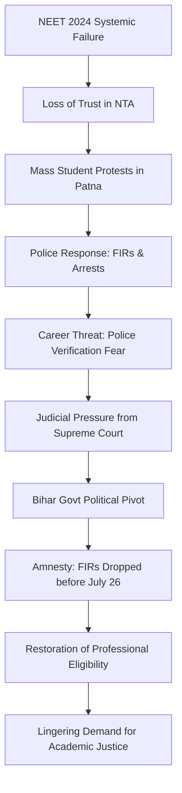

# 🩺 Healing the Rift: Why Bihar is Dropping Charges Against NEET Protesters

If you’ve been following the news in Bihar lately, you know things have been incredibly intense for medical aspirants. For months, the coaching hubs of Patna—areas like Boring Road and Kankarbagh—and study rooms across the state have been filled with a volatile mix of desperation and anger. For these students, the NEET-UG 2024 exam wasn't just a test of biology, physics, or chemistry; it became a fight for their entire future. When the results finally arrived, instead of providing a clear rank and a path to a medical college, they delivered a national scandal.

Between reports of leaked papers, the systemic collapse of the [National Testing Agency (NTA)](https://www.nta.ac.in/), and the confusing mess of "grace marks," the exam sparked a wave of outrage that transcended the classroom. In Bihar, a state where a government medical seat is often the only ticket out of poverty for a middle-class family, this wasn't just an academic failure—it was a social tragedy.

When this anger spilled onto the streets, the state's initial response was one of suppression. Police batons, mass arrests, and a flurry of First Information Reports (FIRs) were deployed to maintain order. However, for a medical student, an FIR is more than just a legal headache; it is a potential career-killer. Because government medical jobs, residency applications, and international fellowships require stringent police verification, a criminal record can effectively end a doctor's career before it even begins. Suddenly, the fight for a fair exam shifted into a fight for professional survival.

In a surprising turn of events, the Bihar government has decided to drop FIRs against NEET protesters filed before **July 26** and release those who were detained. This move is more than a simple legal gesture; it is a tacit admission that the system failed so profoundly that students felt they had no choice but to take to the streets. This article explores the anatomy of the NEET 2024 crisis, the specific volatility of the Bihar protests, and whether this "clean slate" is a genuine act of justice or a calculated political pivot.

---

## 🩺 The Spark: The NEET 2024 Crisis and the Collapse of Trust

  
  
 <a href="https://unsplash.com/@pervezrobin">Pervez Robin</a> on <a href="https://unsplash.com/photos/a-lush-green-field-with-a-house-in-the-middle-4rRbOQ4IZqY">Unsplash</a>

To understand why thousands of students were willing to risk their professional futures, one must examine the systemic collapse of the NTA. The NEET-UG 2024 was intended to be the gold standard for medical entrance in India, but it quickly devolved into one of the most controversial examinations in the country's history. The crisis was not the result of a single error but a cascading series of institutional failures.

The first alarm bells rang with reports of paper leaks in multiple states. Intelligence suggested that organized mafias had bypassed the NTA's security protocols, selling leaked question papers for lakhs of rupees. However, the controversy reached a boiling point with the introduction of "grace marks." The NTA awarded these marks to a segment of students who allegedly lost time due to administrative delays at certain centers. 

This decision created a statistical anomaly that defied logic: **67 students** scored a perfect 720/720. In previous years, such a high number of perfect scores was unheard of, leading to immediate suspicions that grace marks were being used as a convenient cover-up for leaked answers. The resulting inflation of the cutoff marks meant that students who had studied for years found themselves pushed out of the qualifying bracket by a sudden surge of "perfect" candidates.

The situation grew dire as the [Supreme Court of India](https://main.sci.gov.in/) stepped in. The court questioned the NTA's methodology, criticizing the "grace marks" approach as arbitrary and potentially unfair. The pressure culminated in the resignation of the Director General of the NTA, who admitted to lapses in the examination process. In Bihar, where the competition for limited government seats is visceral, this felt like a betrayal of the meritocratic ideal. The "spark" was the realization that hard work—the only currency these students possessed—had been cheapened by corruption.

---

## 📢 The Streets of Bihar: From Study Halls to Protests

Once the trust in the NTA vanished, the study halls of Patna transformed into war rooms. Patna is not just a city; it is the educational nerve center of Bihar, housing thousands of students from rural districts who migrate there in search of the "medical dream." These weren't politically motivated protests organized by established parties; they were organic, raw outbursts of anger from youth who spent **12 to 16 hours a day** in cramped hostels and libraries.

Thousands of students flooded the streets, demanding a transparent investigation and, in many cases, a complete re-examination. What set these protests apart was the nature of the students' arguments. They didn't just chant slogans; they presented data. Using statistical probability, student representatives argued that the sudden spike in perfect scores was mathematically improbable, suggesting a systemic breach rather than a fluke of performance.

Behind the anger was a deep well of grief. The socioeconomic stakes in Bihar are uniquely high. Many of these students come from families where parents—often farmers or small-scale traders—have liquidated their life savings, sold ancestral land, or taken high-interest loans to fund coaching fees and living expenses in Patna. For these families, a medical seat isn't just about a degree; it's about social mobility and financial security for the entire extended family. 

As [The Hindu](https://www.thehindu.com/education/) reported, while the NEET scandal was a national issue, it felt intensely personal in Bihar. The protests were a plea for their sacrifices not to be rendered meaningless by a leaked PDF or an administrative whim.

---

## 🚔 The Crackdown: FIRs and the Fear of a "Criminal Record"

As the protests grew in scale, disrupting traffic and city administration, the Bihar police shifted from crowd management to active suppression. The state began filing FIRs against students and organizers, utilizing charges such as "unlawful assembly," "obstructing public servants in the discharge of their duty," and "inciting violence."

For a typical protester, an FIR is a legal nuisance that can be contested in court over several years. However, for a medical aspirant, it is an existential threat. The medical profession is one of the most heavily regulated sectors in India. To secure a government appointment, obtain a license from the National Medical Commission (NMC), or apply for a residency (MD/MS), a "clean" police verification report is mandatory. 

Even an FIR that does not lead to a conviction can create a permanent "red flag" in government databases. This can block passport applications for those wishing to pursue USMLE or PLAB exams abroad and can disqualify candidates from prestigious government medical fellowships. The state, in essence, was using the students' own dreams as leverage to ensure their silence.

> "The FIRs were used as a weapon of silence. We were fighting for our right to a fair exam, but suddenly we were being told that our fight would prevent us from ever becoming doctors. The state was trying to trade our professional futures for a few days of street silence," noted a student representative during the peak of the crackdown.

The psychological toll was devastating. Students who had spent their teenage years in libraries suddenly found themselves in police lock-ups, facing the terrifying possibility that a few days of activism would erase a decade of academic toil. It was a cruel irony: the state was punishing the very young professionals it desperately needs to solve Bihar's chronic healthcare shortage.

---

## ⚖️ The Pivot: The Decision to Drop FIRs and the July 26 Cutoff

As the weeks passed, the Bihar government realized that the legal and political cost of the crackdown was becoming unsustainable. With the Supreme Court actively monitoring the NEET case and public sentiment swinging heavily in favor of the students, the government shifted its strategy. They announced a sweeping amnesty: all FIRs filed against NEET protesters before **July 26** would be dropped, and all detainees would be released.

The choice of **July 26** as the cutoff date is a critical detail. This date marks the period immediately following the initial surge of protests and aligns with the timing of the Supreme Court's directives regarding the grace marks. By establishing this cutoff, the government attempted a "surgical" amnesty. They aimed to protect the "genuine students"—those who acted out of academic frustration—while leaving the door open to prosecute any external political agitators who might have attempted to hijack the movement for partisan gain later in the summer.

This decision was not merely an act of benevolence; it was a pragmatic political calculation. In a state where the youth vote is increasingly influential, continuing to prosecute students for protesting a proven administrative failure (the NTA's collapse) would have been political suicide. According to reports from the [Times of India](https://timesofindia.indiatimes.com/city/patna), such amnesties are common when a government realizes that the protesters' grievances are widely viewed as legitimate by the general public.

---

## 🎓 The Student Verdict: Relief vs. Resolution

While the removal of criminal charges has brought a wave of relief, it has not brought resolution. For many students, the government's decision to drop FIRs is a "band-aid" on a systemic wound. The core issue—that the NEET-UG 2024 exam was compromised—remains unresolved. 

There is a lingering fear that the government is simply clearing the legal wreckage to move the controversy out of the headlines without actually fixing the examination machinery. Students argue that while they are no longer "criminals" in the eyes of the law, they remain "victims" in the eyes of the education system. Many continue to call for a comprehensive re-examination of the affected subjects to ensure that no fraudulent candidate occupies a seat meant for a hardworking student.

Furthermore, the "invisible" costs of the crackdown cannot be erased by a government order. The trauma of detention, the anxiety of facing a police record, and the weeks of lost study time have left a lasting mark. [Indian Express](https://indianexpress.com/section/education/) has highlighted the growing mental health crisis among Indian students facing high-stakes exams, noting that the NEET scandal acted as a catalyst for burnout and depression.

The general sentiment among student unions is clear: **Amnesty is a necessary relief, but accountability is the only real cure.** They are demanding to know exactly how the leaks occurred, who the beneficiaries were, and what concrete safeguards the NTA will implement for the 2025 cycle to prevent a recurrence.

---

## 🌍 The National Ripple: A Blueprint for Student Protests?

The events in Bihar reflect a broader shift in the relationship between the Indian state and its digitally connected, highly educated youth. The NEET crisis was not isolated to Bihar; it sparked similar unrest in Rajasthan, Maharashtra, and Uttar Pradesh. However, Bihar's decision to explicitly clear police records sets a potential precedent for how governments handle student-led movements.

Historically, the state's first instinct during student unrest has been the "crackdown model"—using the threat of legal action to stifle dissent. But in the era of social media, where a single video of a detained student can go viral in minutes and mobilize thousands, the crackdown model is becoming counterproductive. By choosing amnesty, Bihar is experimenting with a "de-escalation model." This approach acknowledges the unique vulnerability of students whose entire lives depend on a clean record.

However, this raises a provocative question: is the right to protest only valid if the government decides to "forgive" you later? If charges are only dropped when the protests become too large to ignore, it creates a dangerous incentive for students to escalate their tactics to gain leverage. Ideally, the state should establish official, transparent channels for grievances so that students never feel the need to risk their careers to be heard.

---

## 🛡️ Moving Forward: Necessary Reforms for 2025

To prevent another 2024, the Indian examination system requires more than just legal amnesties; it needs a total architectural overhaul. The vulnerabilities exposed by the NEET scandal suggest that the NTA's current model is insufficient for the scale of the exams it conducts.

**Proposed systemic reforms include:**
1.  **Blockchain-Enabled Paper Distribution:** Implementing encrypted, time-locked digital delivery of question papers to centers to eliminate the possibility of physical leaks.
2.  **Independent Auditing:** Establishing a third-party oversight committee, comprising retired judges and academic experts, to audit the NTA's result-generation process.
3.  **Standardized Grace Mark Policy:** Creating a transparent, pre-defined formula for grace marks that is published *before* the exam, preventing arbitrary post-exam adjustments.
4.  **Mental Health Support Systems:** Integrating mandatory counseling services within coaching hubs to help students manage the crushing pressure of competitive exams.

If these reforms are not implemented, the amnesty provided by the Bihar government will be seen as a temporary truce rather than a permanent peace. The students of 2025 will be watching closely to see if the state has learned that the best way to prevent protests is to ensure the integrity of the process.

---

## 🏁 Conclusion: Beyond the Amnesty

Dropping the FIRs and releasing the detainees is a vital first step in repairing the fractured relationship between the Bihar government and its future medical professionals. By removing the legal threat, the government has effectively conceded that the students were not acting out of malice, but out of a desperate need for fairness. It is an admission that the real "crime" was the failure of the exam system, not the protest against it.

However, the ultimate test will not be found in the number of dropped charges, but in the conduct of the next examination. The 2024 scandal exposed gaping holes in India's high-stakes testing infrastructure, from the NTA's lack of transparency to the fragile security of the examination papers. Legal relief is a kindness, but academic justice is a right.

For the students in Bihar, the path to wearing a stethoscope is slightly clearer today, but the horizon remains clouded. As they return to their books, they carry the knowledge that their future depends not only on their ability to memorize textbooks but on the state's ability to run an honest, accountable exam. The amnesty is a relief; the reform is the requirement. Until the NTA can prove its processes are leak-proof, the students will remain vigilant, knowing that their dreams are far too precious to be left to chance.

---

## 📚 References

*   [National Testing Agency (NTA) Official Portal](https://www.nta.ac.in/) - Official notifications and guidelines on the conduct of NEET-UG.
*   [Supreme Court of India Official Website](https://main.sci.gov.in/) - Case filings and judicial directives regarding the NEET-UG 2024 grace marks controversy.
*   [The Hindu - Education Section](https://www.thehindu.com/education/) - In-depth reporting on national paper leaks and the socioeconomic impact on aspirants.
*   [Times of India - Patna City News](https://timesofindia.indiatimes.com/city/patna) - Local reporting on the Bihar government's amnesty decision and police actions.
*   [NDTV - Education News](https://www.ndtv.com/education) - Documentation of the NTA leadership changes and the fallout of examination anomalies.
*   [Indian Express - Education Analysis](https://indianexpress.com/section/education/) - Analysis of the psychological toll of competitive exams and the legal weight of FIRs.
*   [Press Information Bureau (PIB)](https://pib.gov.in/) - Government statements regarding educational reforms and national testing integrity.
*   [LiveLaw - Legal Updates](https://www.livelaw.in/) - Detailed legal breakdowns of the judicial interventions in the NEET 2024 case.
