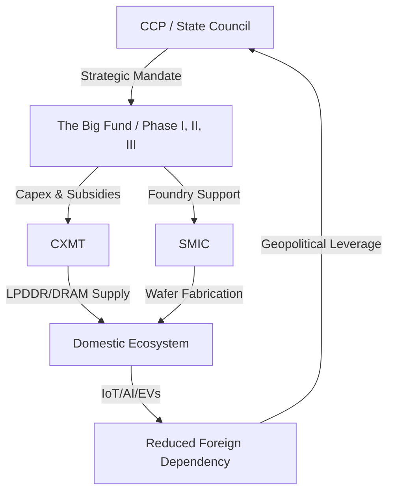

# 🚀 The Silicon Sovereign: How CXMT Became China's Most Valuable Chip Titan

The global semiconductor landscape is currently undergoing a seismic shift, moving away from the era of borderless efficiency toward a fragmented era of "technological sovereignty." In the high-stakes boardrooms of Seoul, Hsinchu, and Boise, the conversation has shifted from quarterly dividends to a singular, looming presence: **ChangXin Memory Technologies (CXMT)**. 

For years, Western analysts dismissed China's semiconductor ambitions as a "sunk cost" exercise—a series of expensive experiments characterized by massive state injections with negligible high-end yields. However, as reported by the [BBC](https://www.bbc.com), the meteoric rise of CXMT suggests that these experiments have finally reached a critical mass. CXMT has not only scaled its production but has ascended to become mainland China's most valuable listed semiconductor firm, signaling that the "experiment" has evolved into a strategic reality.

This is not merely a story of stock market volatility or a bubble driven by nationalistic speculation. This is the opening salvo of the **"Memory War."** While the general public focuses on the "brains" of AI—the logic chips like NVIDIA's GPUs—the silent engine that enables these processors to function is **DRAM (Dynamic Random Access Memory)**. Without high-speed DRAM, the most powerful AI model is effectively a brain without a short-term memory; it cannot process data fast enough to be useful. For three decades, the DRAM market has been a "Triopoly" shared by Samsung, SK Hynix, and Micron. CXMT is the first entity from mainland China to breach the walls of this fortress, backed by the unmatched financial weight of the Chinese state.

---

## 📈 The Valuation Shock: Understanding the "Sovereign Premium"

The current valuation of CXMT defies traditional financial metrics. If one were to look strictly at Price-to-Earnings (P/E) ratios or current cash flow, the numbers might seem inflated. However, the market is not applying a standard corporate valuation; it is applying a **"Sovereign Premium."**

In the context of the US-China tech decoupling, the value of a company is no longer just about its ability to generate profit—it is about its ability to ensure national survival. For China, the world's largest consumer of semiconductors, the reliance on foreign memory is a strategic vulnerability. A single export ban on DRAM could paralyze everything from domestic server farms to the production of electric vehicles (EVs) and 5G infrastructure.

> "The valuation of CXMT represents a hedge against geopolitical risk. Investors are betting on the certainty that the Chinese government will do whatever is necessary—regardless of cost—to ensure CXMT succeeds, because the alternative is strategic paralysis."

**Bold Stats on Market Shift:**
*   **Market Dependence:** Historically, China imported over **90%** of its high-end memory chips.
*   **State Investment:** The "Big Fund" has funneled **hundreds of billions of yuan** into the domestic ecosystem.
*   **Strategic Priority:** Memory self-sufficiency is now ranked as a **Tier-1 priority** in China's 14th Five-Year Plan.

When you combine a guaranteed domestic market (where Chinese OEMs like Xiaomi and Huawei are incentivized to buy local) with the bottomless pockets of the state, CXMT becomes more than a company. It is a cornerstone of a national security architecture designed to ensure that China's digital infrastructure cannot be "switched off" by a foreign power.

---

## 🧪 The DRAM Holy Grail: The Physics of the Memory War

To appreciate why CXMT's progress is so disruptive, one must understand the staggering technical difficulty of manufacturing DRAM. Unlike logic chips (CPUs/GPUs), which function as complex sets of switches, DRAM is an exercise in extreme materials science.

At its core, a DRAM cell consists of one transistor and one capacitor. The capacitor holds an electrical charge; if it's charged, it's a "1"; if it's empty, it's a "0". The challenge is that these capacitors are microscopic, yet they must hold enough charge to be readable.

### The Technical Nightmare of Fabrication
1.  **The Leakage Problem:** Capacitors are inherently "leaky." Electricity naturally escapes, meaning the data disappears in milliseconds. To prevent this, the chip must be "refreshed" thousands of times per second. CXMT's challenge was developing dielectric materials that could minimize this leakage while maintaining a tiny footprint.
2.  **The Aspect Ratio Crisis:** As the industry moves toward smaller nodes (10nm and below), the capacitors cannot get wider (because the chip would be too large), so they must get *taller*. This creates a "skyscraper" effect on a nanoscopic scale. If the aspect ratio becomes too extreme, the capacitors physically lean or collapse during the etching process.
3.  **The Node Race:** While the "Triopoly" is pushing toward the 1a and 1b nodes, CXMT has focused heavily on **LPDDR (Low Power Double Data Rate)** memory. By mastering LPDDR4X and moving toward LPDDR5, CXMT has targeted the most lucrative and high-volume markets: smartphones and IoT devices.

The ability to produce functional DRAM at scale proves that CXMT has solved the fundamental materials science hurdles that defeated previous Chinese attempts. They are no longer just "copying" designs; they are optimizing the fabrication process for high-yield mass production.

---

## 🛡️ The EUV Wall: Sanctions and the Art of the Workaround

The rise of CXMT is happening against the backdrop of the most aggressive export controls in modern history. The US Department of Commerce has implemented a "technological ceiling," specifically targeting the machinery required for the most advanced lithography.

The epicenter of this conflict is **EUV (Extreme Ultraviolet) lithography**, a technology produced exclusively by the Dutch firm [ASML](https://www.asml.com). EUV uses a wavelength of 13.5nm to etch patterns of incredible precision, enabling the production of 7nm, 5nm, and 3nm chips. Without EUV, creating the densest memory cells is functionally impossible by traditional means.

### The "Workaround" Strategy
CXMT's valuation suggests that the market believes China can bypass the EUV wall. Their strategy involves a combination of "brute force" engineering and material innovation:

*   **Multi-Patterning (SADP/SAQP):** Since they lack EUV, CXMT utilizes **DUV (Deep Ultraviolet)** machines in a process called "multi-patterning." Instead of one EUV pass, they use several DUV passes to create the same fine lines. This is exponentially more expensive and slower, but with state subsidies, the cost is irrelevant.
*   **High-K Dielectrics:** By researching new materials for the capacitor's insulating layer (High-K dielectrics), CXMT can potentially store more charge in a larger area, reducing the desperate need for the extreme shrinking that EUV provides.
*   **The Domestic Tooling Pivot:** There is a massive, quiet effort to build a domestic lithography ecosystem. While they may not match ASML's precision today, the goal is to reach a "good enough" threshold that removes the external kill-switch.

> "The US sanctions are designed to create a ceiling. But in semiconductor physics, there is always a workaround if you have enough money, enough engineers, and enough time. CXMT is the proof that the ceiling is porous."

---

## 💰 The Big Fund: The Engine of State Capitalism

CXMT is the crowning achievement of the **National Integrated Circuit Industry Investment Fund**, commonly known as the "Big Fund." To understand CXMT, you must understand that it does not operate under the rules of Silicon Valley venture capital.

The Big Fund is a state-led financial behemoth. While a typical VC fund seeks a 10x return in five years, the Big Fund seeks **strategic autonomy**. This gives CXMT an unfair—and overwhelming—competitive advantage: **the ability to operate at a loss indefinitely.**

### The Loss-Leader Strategy
In a free market, a company with low yields and high production costs would go bankrupt. CXMT, however, can run at a loss for years while it perfects its manufacturing process. This allows them to:
1.  **Aggressively Undercut Prices:** By subsidizing the cost of their chips, CXMT can offer "good enough" memory to Chinese OEMs at prices Samsung or Micron cannot match without destroying their own margins.
2.  **Absorb R&D Failures:** The cost of a failed fabrication run at a 10nm node is millions of dollars. For CXMT, this is simply an "education cost" funded by the state.
3.  **Rapid Capacity Expansion:** While Micron must justify a new fab (factory) to shareholders based on projected ROI, the Big Fund builds fabs based on national necessity.

---

## ⚔️ The Global Memory War: Breaking the Triopoly

For decades, Samsung, SK Hynix, and Micron have operated as a "cozy club." They didn't necessarily collude, but they shared a mutual interest in managing global capacity to prevent price crashes. CXMT is the "black swan" event that threatens this stability.

### The Competitive Matrix
*   **The Mid-Range Flood:** CXMT does not need to beat Samsung at the ultra-high-end (yet). By dominating the mid-range and budget memory markets—the chips in your budget laptop, your smart fridge, or your mid-tier Android phone—they can erode the profit margins of the giants.
*   **The HBM Race (The Crown Jewel):** The real battle has shifted to **HBM (High Bandwidth Memory)**. HBM involves stacking DRAM dies vertically to create a massive data highway, essential for AI GPUs like the NVIDIA H100. [SK Hynix](https://www.skhynix.com) currently leads here, but CXMT is aggressively pivoting its R&D toward HBM. If CXMT can produce a viable HBM alternative, they will move from a "budget provider" to a "strategic pillar" of AI.
*   **The Ecosystem Lock-in:** Chinese giants like BYD and Huawei are under immense pressure to "de-Americanize" their supply chains. Even if a CXMT chip is 10% less efficient than a Micron chip, the security benefit of a domestic source makes it the preferred choice.

---

## 🔮 The Horizon: PIM and the End of the Von Neumann Bottleneck

The future of memory is not just about *storage*, but *computation*. For decades, computers have followed the **Von Neumann Architecture**, where the CPU and memory are separate. The "bottleneck" occurs because moving data between the two consumes massive amounts of energy and time.

CXMT is eyeing a leapfrog strategy through **Processing-in-Memory (PIM)**. 

### What is PIM?
PIM integrates processing capabilities directly into the memory array. Instead of sending data to the CPU to be added or multiplied, the memory chip does the math itself. This is a game-changer for Large Language Models (LLMs), which require moving trillions of parameters back and forth.

Academic research hosted on [ArXiv](https://arxiv.org) and [IEEE Xplore](https://ieeexplore.ieee.org) shows a surge in Chinese research into PIM and **Computational Storage**. If CXMT can commercialize PIM before the Triopoly, they could render the "EUV wall" irrelevant by winning the architectural war rather than the lithography war.

Furthermore, the synergy between CXMT (Memory) and **SMIC** (Foundry) creates a closed-loop national ecosystem. When the design, fabrication, and memory are all handled within one border, the iteration cycle shrinks from years to months.

---

## 🏁 Conclusion: The New Silicon Order

CXMT's ascent to become China's most valuable listed chip firm is a watershed moment in industrial history. It marks the transition of China from a "consumer of innovation" to a "producer of strategic assets." 

The "Memory War" is no longer about who can make the cheapest chip; it is about who controls the fundamental building blocks of the AI era. While the technical gap between CXMT and the leaders in Seoul or Boise still exists, the financial and strategic gap is closing. 

We are witnessing the birth of a **Sovereign Semiconductor Model**, where the goal is not profit maximization, but the absolute guarantee of supply. In this new world order, CXMT is not just a company—it is a national asset, a shield against sanctions, and a spear aimed at the heart of the global memory monopoly.

---

## 📚 References & Further Reading

*   **Global Trade Policy:** [US Department of Commerce - Export Controls](https://www.commerce.gov)
*   **Industry Analysis:** [Reuters - The Big Fund and China's Chip Strategy](https://www.reuters.com)
*   **Technical Specifications:** [ASML - EUV Lithography Guide](https://www.asml.com)
*   **Market Trends:** [Micron Technology - DRAM Market Reports](https://www.micron.com)
*   **Company News:** [Samsung Newsroom - Semiconductor Innovation](https://news.samsung.com)
*   **Academic Research:** [ArXiv.org - Processing-in-Memory (PIM) Papers](https://arxiv.org)
*   **Industry Standards:** [IEEE Xplore - Semiconductor Fabrication](https://ieeexplore.ieee.org)
*   **Geopolitical Context:** [Financial Times - The US-China Chip War](https://www.ft.com)
*   **Market Data:** [Bloomberg - Semiconductor Valuations](https://www.bloomberg.com)
*   **General Reference:** [Wikipedia - Semiconductor Industry in China](https://en.wikipedia.org/wiki/Semiconductor_industry_in_China)
