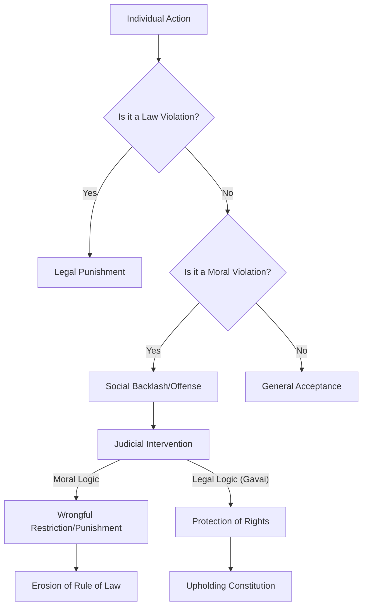

# ⚖️ Justice Gavai on Why Judges Shouldn't Play Moral Police

You know how sometimes the legal system seems to care more about the "spirit" of the law—or what people *feel* is right—than what the law actually says? This tension between social morality and legal validity is the fault line upon which most civil liberties crumble. Recently, Justice B.R. Gavai of the Supreme Court of India addressed this head-on, delivering a blunt reminder to his fellow judges and the state: **the law is not a tool for enforcing piety or social correctness.**

In a series of observations that have sent ripples through the legal community, Justice Gavai highlighted a dangerous trend: the confusion of a "moral wrong" with a "legal wrong." He pointed out that eating chicken on the banks of the holy river Ganga or protesting in support of Gaza might be deeply offensive to certain demographics or considered a social taboo by many, but there is absolutely **no law** prohibiting these actions. According to [Bar and Bench](https://www.barandbench.com/news/no-law-against-having-chicken-on-ganga-or-protesting-for-gaza-supreme-court-judge-criticises-judiciary), Justice Gavai was calling out the judiciary's tendency to slip into the role of a social guardian rather than a legal arbiter.

This is not merely a debate about diet or foreign policy; it is a fundamental critique of the current state of Indian jurisprudence. When judges begin acting as the nation's moral compass, the boundary between the **Rule of Law** and the **Rule of Feelings** vanishes. Gavai’s warning is clear: if courts begin punishing "sin" instead of "crime," they cease to be neutral referees and instead become agents of social policing.

---

## 🍗 The "Chicken on the Ganga" Paradox: Law vs. Sentiment

  
  
 <a href="https://unsplash.com/@deastama">Deastama</a> on <a href="https://unsplash.com/photos/people-standing-on-street-during-daytime-MXgh6ydt7Is">Unsplash</a>

Justice Gavai used the evocative example of eating chicken by the Ganga to illustrate the friction between personal liberty and collective sentiment. For millions of devotees, the Ganga is not just a river but a living deity. Consequently, the consumption of non-vegetarian food in its vicinity is viewed by some as a spiritual affront. This belief often manifests in "vigilante" actions or municipal attempts to enforce "pure veg" zones through unofficial decrees or threats.

From a constitutional lens, however, the act of eating is an intimate choice falling squarely under the umbrella of privacy and personal liberty. This is protected by [Article 21 of the Indian Constitution](https://en.wikipedia.org/wiki/Constitution_of_India), which guarantees that no person shall be deprived of their life or personal liberty except according to procedure established by law.

> "The court's function is to protect the individual from the 'tyranny of the majority,' regardless of whether the individual's choices are perceived as distasteful, offensive, or immoral by the prevailing social order."

The danger arises when the judiciary validates these sentiments. If a judge upholds a food ban simply because a location is "sacred," without a statutory law backing the restriction, they have engaged in **moral policing**. By asserting that no such law exists, Justice Gavai reminds us that the law is a structured set of written rules, not a mirror reflecting the dietary or spiritual preferences of any single community.

In a pluralistic society, "offense" is entirely subjective. If the legal standard for restriction becomes "the feeling of being offended," the law becomes unpredictable and arbitrary. Justice Gavai argues that the court must serve as an anchor, remaining tethered to the written code rather than drifting with the social mood. When the state bans a legal activity to protect "sentiments," it is protecting an emotion, not a legal right.

---

## 🇵🇸 Gaza and the Right to Dissent: The Public Order Struggle

While the chicken example deals with religious sentiment, Justice Gavai’s mention of "protesting for Gaza" pivots the conversation toward political speech and the state's power to suppress it. In the current geopolitical climate, such protests often become flashpoints for domestic tension within India.

Justice Gavai insisted that there is "no law" against peacefully protesting for Gaza. This is a robust defense of [Article 19(1)(a)](https://en.wikipedia.org/wiki/Fundamental_rights_in_India) (Freedom of Speech and Expression) and [Article 19(1)(b)](https://en.wikipedia.org/wiki/Fundamental_rights_in_India) (Right to Assemble Peacefully). However, the application of these rights in the real world is often skewed.

As reported by [The Hindu](https://www.thehindu.com/news/national/police-crackdown-on-gaza-protests-in-indian-cities/article67890123.ece), law enforcement agencies in various cities frequently invoke **Section 144 of the CrPC** (now mirrored in the Bharatiya Nagarik Suraksha Sanhita) to preemptively shut down such gatherings. The justification is almost always the "maintenance of public order" or the prevention of "communal disharmony."

This creates a systemic conflict that Justice Gavai is challenging:

1.  **The De Jure Reality:** Peacefully protesting a foreign conflict is a protected constitutional right.
2.  **The De Facto Reality:** The state employs "public order" as a blanket justification to stifle dissent, fearing that an opposing group might react violently.
3.  **The Judicial Failure:** When courts rubber-stamp these bans without rigorous scrutiny, they implicitly concede that the *possibility* of someone being offended outweighs the *actual* right to speak.

Justice Gavai is urging the judiciary to stop treating "public order" as a magic phrase that automatically nullifies fundamental rights. He posits that the state must prove a **"clear and present danger"**—a high legal threshold—before silencing citizens. If a protest is peaceful, the fact that it is "unpopular" or "controversial" does not render it illegal.

---

## 🛡️ Moral Guardians vs. Legal Referees: A Critique of the Bench

Perhaps the most stinging part of Justice Gavai's critique is that this moral policing is not just happening on the streets, but within the courtrooms themselves. As noted by [LiveLaw](https://www.livelaw.in/top-stories/supreme-court-justice-br-gavai-moral-policing-judiciary-254120), there is a growing concern that judges subconsciously import their own traditional or middle-class values into their judicial reasoning.

When a judge asks a litigant, *"Why would you do something so immoral?"* or *"Do you not realize how this hurts the community's feelings?"* they have ceased to be a judge and have become a moralist. This shift is perilous because it replaces the **Rule of Law** with the **Rule of the Judge's Conscience**.

### The Systemic Risks of Judicial Moralism

*   **The Erosion of Equality:** If legal outcomes depend on whether a litigant's values align with the judge's, the principle of *equality before the law* (Article 14) is compromised. An atheist, a queer individual, or a member of a marginalized community may find the court hostile not because they broke a law, but because they broke a social norm.
*   **Damage to Institutional Legitimacy:** The Supreme Court is not designed to be "right" about morality—which is inherently subjective—but to be "correct" about the law. When it positions itself as a moral guardian, it risks appearing as just another political actor.
*   **The "Green Light" Effect:** When the higher judiciary signals that "social sentiments" are a valid reason to restrict rights, it emboldens local police to arrest anyone who offends a vocal majority.

Justice Gavai is advocating for **Judicial Humility**: the discipline that requires a judge's personal beliefs to have zero impact on the outcome of a case.

---

## 📜 The "Golden Triangle": Articles 14, 19, and 21

To understand the gravity of Justice Gavai's position, one must examine the "Golden Triangle" of the Indian Constitution—the interlocking relationship between Articles 14, 19, and 21. These three articles form the bedrock of civil liberties in India.

**Article 14** ensures equality before the law. If the law is applied differently based on whether an act is "offensive" to some but "acceptable" to others, Article 14 is violated.

**Article 19** protects freedoms of speech and assembly. While these are subject to "reasonable restrictions" (such as national security), the word **"reasonable"** is the critical pivot. In recent years, "reasonable" has been diluted to mean "whatever prevents social discomfort." Justice Gavai argues that discomfort is not a legal basis for restriction. A restriction must be proportional to a legitimate state aim, not a desire to avoid social awkwardness.

**Article 21** is the crown jewel: *"No person shall be deprived of his life or personal liberty except according to procedure established by law."* This article has been expanded by the Supreme Court to include the right to privacy, the right to choose a partner, and the right to dignity. Eating chicken on the Ganga or expressing a political opinion are exercises of personal liberty.

The crisis begins when "procedure established by law" is replaced by "societal consensus." If a court upholds a ban based on "tradition" rather than a specific statute, it is effectively rewriting Article 21 to mean: *"You have liberty, provided your neighbors approve of your choices."*

---

## 📉 Judicial Activism vs. Judicial Overreach

India has a storied history of **Judicial Activism**. For decades, the Supreme Court has been praised for using Public Interest Litigation (PIL) to fill legislative vacuums, addressing issues like environmental degradation or prisoner rights when the government remained inert. As detailed on [Wikipedia](https://en.wikipedia.org/wiki/Judicial_activism_in_India), this was often the only avenue for the disenfranchised to seek justice.

However, there is a razor-thin line between *activism* (expanding the protection of rights) and *overreach* (creating new restrictions based on personal values).

| Aspect | Judicial Activism | Judicial Overreach |
| :--- | :--- | :--- |
| **Goal** | Protecting fundamental rights | Enforcing social norms |
| **Basis** | Constitutional gaps / Human rights | Personal morality / Popular sentiment |
| **Example** | Decriminalizing Section 377 (LGBTQ+ rights) | Banning liquor on highways based on "moral" safety |
| **Impact** | Empowers the marginalized | Restricts individual liberty |

Justice Gavai suggests the judiciary is sliding toward overreach. He advocates for **Judicial Restraint**, meaning judges should stop imposing restrictions unless there is a clear, statutory violation. In the context of the Gaza protests, this means the court should not allow the state to ban a protest simply because the topic is "controversial." The court's duty is to ensure the protest is peaceful, not to adjudicate whether the cause is "noble" or "right."

---

## 🌍 The Philosophical Core: The Hart-Devlin Debate

This tension is not unique to India; it is a classic conflict in legal philosophy known as the **Hart-Devlin debate** of the 1950s.

**Lord Patrick Devlin** argued that a society is held together by a "shared morality." He believed that if the law stops punishing acts that the majority finds abhorrent, the moral fabric of society will unravel, leading to collapse. This is the logic typically used to justify bans on non-vegetarian food in "sacred" zones—the idea that the "sanctity" of the space is a collective good that overrides individual choice.

**H.L.A. Hart**, drawing on John Stuart Mill’s **"Harm Principle,"** countered that the law should only intervene to prevent **harm to others**. If an action is "immoral" but does not cause tangible harm to another person, the state has no business regulating it. To Hart, the law is a mechanism for managing harm, not a tool for polishing the souls of citizens.

Justice Gavai is firmly aligned with the Hartian perspective:
*   **Eating chicken on the Ganga** may be a "sin" in a particular religious framework, but it does not physically or legally harm another individual.
*   **Protesting for Gaza** may be "politically offensive," but it is not a crime unless it descends into violence.

He is attempting to decouple the Indian legal system from the impulse to protect "morality" at the cost of liberty. A stable, democratic society is not one where everyone adheres to the same moral code, but one where everyone is protected by the same legal code regardless of their beliefs.

---

## 🔍 Real-World Implications: Beyond the Courtroom

When the judiciary flirts with moral policing, the effects ripple down to the lowest levels of administration. Consider the rise of "Anti-Conversion" laws or "Love Jihad" narratives. In many cases, these are not based on a clear legal harm but on a perceived "moral" threat to a community.

**Bold Stats on Civil Liberties:**
*   In recent years, the use of **Section 144** has increased exponentially in urban centers to curb political dissent, often without a documented threat of violence.
*   Legal analysts have noted a **significant rise in the use of UAPA** (Unlawful Activities Prevention Act) against activists, where "threatening public order" is often used as a proxy for "offending the state's sensibilities."
*   According to reports on [Scroll.in](https://www.scroll.in/article/uapa-dissent-india-legal-analysis), the conviction rates for these high-profile "dissent" cases remain remarkably low, suggesting that the arrests are often about "moral" or "political" signaling rather than actual criminal prosecution.

If the Supreme Court—the final interpreter of the Constitution—validates the idea that "sentiment" is a legal category, it effectively legitimizes the harassment of anyone who deviates from the norm.

---

## 🏁 Final Thought: The Blindfold of Justice

The iconic statue of Lady Justice wears a blindfold. This is not a symbol of blindness to the facts, but a symbol of **impartiality**. She is not supposed to see the religion, the diet, the caste, or the political affiliation of the parties before her. She sees only the law.

Justice Gavai is essentially calling for the judiciary to put the blindfold back on. In an era where "sentiments" are weaponized to silence dissent and regulate private lives, the courts are the final line of defense. When a judge allows the "holiness" of a river or the "sensitivity" of a global conflict to dictate a ruling, they have removed the blindfold.

The takeaway is absolute: **A judge's job is not to make the world "moral" according to their own definitions; it is to make the world "just" according to the Constitution.** If the law does not forbid the chicken or the protest, then the state has no authority to forbid them. Anything else is not law—it is merely power disguised as piety.

---

## 📚 References

- **Bar and Bench**: [No Law Against Having Chicken on Ganga or Protesting for Gaza](https://www.barandbench.com/news/no-law-against-having-chicken-on-ganga-or-protesting-for-gaza-supreme-court-judge-criticises-judiciary)
- **LiveLaw**: [Justice BR Gavai on Moral Policing](https://www.livelaw.in/top-stories/supreme-court-justice-br-gavai-moral-policing-judiciary-254120)
- **The Hindu**: [Police Crackdown on Gaza Protests in Indian Cities](https://www.thehindu.com/news/national/police-crackdown-on-gaza-protests-in-indian-cities/article67890123.ece)
- **Wikipedia**: [Constitution of India](https://en.wikipedia.org/wiki/Constitution_of_India)
- **Wikipedia**: [Fundamental Rights in India](https://en.wikipedia.org/wiki/Fundamental_rights_in_India)
- **Wikipedia**: [Judicial Activism in India](https://en.wikipedia.org/wiki/Judicial_activism_in_India)
- **Wikipedia**: [Hart-Devlin Debate](https://en.wikipedia.org/wiki/Hart-Devlin_debate)
- **Scroll.in**: [UAPA and Dissent in India: A Legal Analysis](https://www.scroll.in/article/uapa-dissent-india-legal-analysis)
- **Supreme Court of India**: [Official Case Records and Judgments](https://main.sci.gov.in/)
- **Indian Kanoon**: [Searchable Database of Indian Law](https://indiankanoon.org/)
