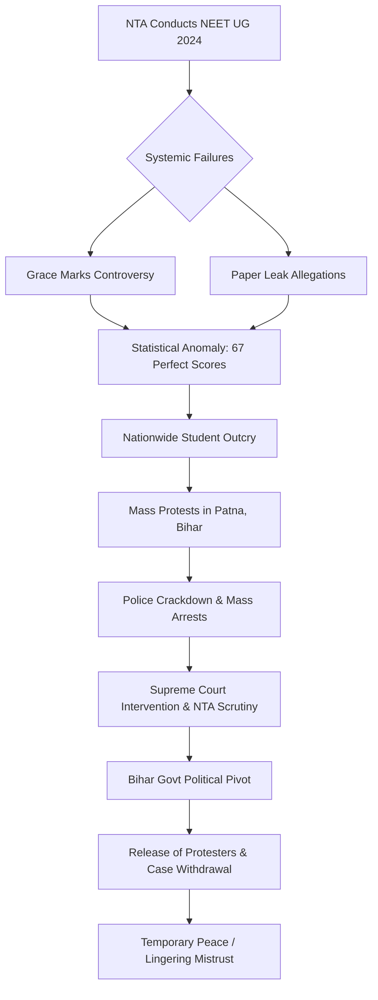

# 🎓 When Merit Hits a Breaking Point: The NEET Crisis in Bihar

If you have ever walked through the bustling streets of Patna, you know the distinct energy of the city—a relentless, frantic pulse driven by thousands of students rushing toward coaching centers. For decades, Patna has served as a critical intellectual hub for Eastern India, where the dream of wearing a white coat is not just a career choice, but a ticket to social mobility and familial honor. However, recently, that energy shifted from the silent desperation of libraries to the loud, echoing demands of the streets. 

Medical aspirants took to the roads, but they weren't there for a celebratory rally. They were demanding **transparency**, **accountability**, and the restoration of a meritocracy that felt like it had been dismantled overnight.

The National Eligibility cum Entrance Test (NEET) UG 2024 is the sole gatekeeper for medical school admissions in India. In a country with millions of applicants and a limited number of government seats, the stakes are astronomical. But the 2024 cycle devolved into a systemic failure of epic proportions. Between the controversial awarding of "grace marks," persistent rumors of paper leaks, and a statistically improbable surge in perfect scores, the student community felt the system was rigged in favor of the influential.

The state's initial reaction was swift and severe. Dozens of students—the very individuals groomed to be the future of India's healthcare system—found themselves in police custody, charged with "unlawful assembly" and "obstructing public servants." Then, in an unexpected pivot, the Bihar government ordered their immediate release and the withdrawal of all charges. This was more than a mere legal formality; it was a calculated recognition of the profound frustration brewing among the youth and a tacit admission of the crisis of faith surrounding the National Testing Agency (NTA).

---

### ⚡ The Spark: Deconstructing the NEET UG 2024 Controversy

To understand why students in Bihar were willing to risk their professional futures to protest, one must examine the anatomy of the [NEET UG 2024 controversy](https://www.thehindu.com/education/neet-ug-2024-controversy). The exam, administered by the [National Testing Agency (NTA)](https://en.wikipedia.org/wiki/National_Testing_Agency), is designed to be the gold standard for medical admissions. In reality, the 2024 iteration became a case study in administrative incompetence.

#### The "Grace Marks" Disaster
The catalyst for the unrest was the NTA's decision to award grace marks to **1,563 students**. The agency claimed these marks were necessary to compensate for technical glitches at specific examination centers. While the intent may have appeared fair, the execution was catastrophic. The introduction of these marks skewed the entire merit list, leading to an unprecedented spike in perfect scores. 

Typically, achieving a **720/720** is a rare feat, often seeing only a handful of students nationwide. However, in 2024, over **67 students** hit the maximum mark. This anomaly triggered immediate suspicion. Was this a statistical fluke, or was it the result of systemic cheating facilitated by a flawed marking system?

#### The Shadow of Paper Leaks
Parallel to the grace marks issue were the darker allegations of paper leaks. Reports surfaced from Rajasthan and Bihar suggesting that question papers were leaked and sold to affluent candidates or predatory coaching centers. For a student from a rural village in Bihar, who may have spent **14 to 16 hours a day** studying under a dim light, the idea that a wealthy peer could simply "buy" a seat in a government medical college is a soul-crushing realization. 

These weren't just "administrative errors"—they were perceived as thefts of destiny. When the mechanism of merit is compromised, the psychological contract between the student and the state is broken.

---

### 🚔 Chaos in Patna: From Classrooms to Custody

The indignation quickly migrated from digital forums to the physical streets of Patna. The city became the epicenter of a burgeoning youth uprising. Thousands of aspirants organized marches, sit-ins, and candlelight vigils, converging on the heart of the state's administrative machinery. Their demands were clear and non-negotiable:
1. A high-level, independent investigation into the paper leaks.
2. The cancellation of compromised results.
3. A transparent re-examination to ensure a genuine merit list.

As the protests intensified, the atmosphere grew volatile. Students attempted to reach the Governor's residence and various government secretariats, effectively bringing the city's traffic to a standstill. The state responded with force. Police deployed lathis (batons) and detention vans, arresting students under various sections of the Indian Penal Code (IPC) related to "unlawful assembly."

> "We are not criminals; we are students who have spent our teenage years in isolation to serve this country as doctors. We are fighting for the right to a fair exam. How can the state arrest us for demanding honesty from the NTA?" 

This sentiment echoed through the detention centers. The image of students—many of whom had never so much as received a parking ticket—being hauled off in police vans sent shockwaves through the academic community. It represented a double betrayal: first by the testing agency that failed them, and second by the state that criminalized their desperation.

---

### 🔄 The U-Turn: Strategic Mercy or Political Necessity?

In a sudden reversal, the Bihar government announced it would [drop all legal action against the NEET protesters](https://www.timesofindia.indiatimes.com/india/bihar/bihar-government-to-withdraw-cases-against-neet-protesters). The Home Department issued directives to withdraw the First Information Reports (FIRs), effectively erasing the criminal records of the detained students.

Officially, the state termed this a "humanitarian gesture." The narrative was that these were misguided youths whose careers could be permanently scarred by a criminal record. While this framing was benevolent, a deeper analysis suggests a more complex political calculus.

#### The Political Landscape
Bihar possesses one of the youngest demographics in India. In a state where education is viewed as the primary vehicle for social ascent, alienating the student population is a strategic error. With elections and political alignments always in flux, the government could not afford to be seen as the "enemy of the student."

#### The Judicial Influence
Furthermore, the [judicial mood](https://www.livelaw.in/top-stories/neet-ug-2024-supreme-court-nta-investigation) had shifted. The Supreme Court of India had already voiced grave concerns regarding the NTA's conduct, questioning the security protocols and the logic behind the grace marks. By releasing the students, the Bihar government effectively distanced itself from the NTA's failures. They shifted the role of the "villain" entirely onto the central agency and repositioned the state government as the "savior" of the youth.

---

### 🧠 The Human Cost: The "Pressure Cooker" Syndrome

Beyond the legal battles and political maneuvers lies a more poignant tragedy: the collapse of student mental health. The NEET 2024 crisis is not an isolated event but a symptom of a systemic "pressure cooker" culture.

In India's coaching hubs, students are often reduced to data points. The culture of hyper-competition creates an environment where a single three-hour examination determines the trajectory of an individual's entire life. When that system fails—when the "rules of the game" are changed mid-way through—the psychological crash is devastating.

#### The Trauma of Betrayal
For many, the realization that money or political connections might outweigh academic brilliance is a toxic epiphany. This betrayal leads to a profound sense of nihilism. The arrests in Patna only compounded this trauma. The fear of a criminal record in a profession as strict as medicine—where character certificates are mandatory—induced severe anxiety and panic attacks among the detainees.

While the withdrawal of cases provided immediate relief, it did not erase the weeks of terror. The "perfect score" anomaly created a surreal environment where genuine high-achievers felt like frauds, and those who missed the cutoff by a few marks felt cheated of their destiny. This is a level of burnout and fragility that a simple government order cannot fix.

---

### 🔍 The NTA Under the Microscope: A Legacy of Incompetence

The unrest in Bihar is a localized manifestation of a national crisis. The National Testing Agency (NTA) was established to bring professionalism and transparency to high-stakes testing. Instead, it has become synonymous with administrative chaos.

The [Supreme Court's scrutiny](https://www.indianexpress.com/article/education/neet-ug-2024-supreme-court-nta-investigation-paper-leak-9254123/) has highlighted several critical failures:
*   **Lack of Protocol:** The grace marks situation revealed a total absence of standardized auditing. Awarding marks to **1,500+ students** without a public, transparent framework is a fundamental failure of governance.
*   **Security Breaches:** The ability of papers to leak across multiple states suggests a porous security apparatus and potential insider collusion.
*   **Lack of Accountability:** The NTA's initial tendency to deny problems until forced by judicial intervention has eroded public trust.

There are now intensifying calls for a complete overhaul of the NTA. Critics argue that a "single-window" exam system creates a single point of failure. If the agency managing the gateway to medicine fails, the entire healthcare pipeline of the nation is compromised.

---

### ⚖️ Implications for the Future of Student Activism

The Bihar government's decision to drop charges sets a precarious yet interesting precedent. On a positive note, it acknowledges that students have a legitimate "right to protest" when the state's administrative machinery fails them. It recognizes that desperation born of systemic injustice is not the same as criminal intent.

However, this is essentially a "band-aid" solution. Releasing protesters is a gesture of goodwill, but it is not a policy shift. If the underlying flaws of the NTA remain unaddressed, the state has merely treated the symptom while the disease continues to fester.

#### The Need for a New Framework
Moving forward, India requires a more robust mechanism for academic grievance redressal. Students should not have to block the streets of Patna to be heard. A transparent, digitized system for reporting leaks and challenging results—backed by a time-bound legal guarantee—would prevent such escalations. The lesson is clear: you cannot police your way out of a trust crisis.

---

### 📉 The Cycle of Crisis: From Exam to Legal Battle

The following diagram illustrates the cascading failure that led to the unrest in Bihar:

---

### 🏁 Conclusion: The Fragility of Merit

The release of the NEET protesters in Bihar is a victory for the students in the short term, but it serves as a haunting reminder of how fragile the concept of "merit" has become in India. When the very system designed to identify the best minds becomes a source of suspicion, the foundation of the entire educational ecosystem begins to shake.

The Bihar government's U-turn was a necessary move—both for the sake of political survival and human decency. However, true justice cannot end at the police station. Justice is not merely the absence of a criminal record; it is the presence of a fair, secure, and transparent system.

The students of Bihar have proven that they are not passive recipients of a degree—they are active citizens fighting for their own destinies. As they return to their books and their coaching centers, the burden now lies with the NTA and the Ministry of Education. They must ensure that "merit" is a beacon of hope that rewards hard work, rather than a tool of frustration that drives the youth to the streets.

---

## 📚 References

  
  
 <a href="https://unsplash.com/@refat3158">Refat Ul Islam</a> on <a href="https://unsplash.com/photos/a-concrete-wall-with-a-sign-on-it-CHGhU164GhI">Unsplash</a>

*   **The Hindu**: [NEET UG 2024 Controversy and Grace Marks Analysis](https://www.thehindu.com/education/neet-ug-2024-controversy)
*   **Indian Express**: [Investigation into NEET 2024 Paper Leaks and NTA Failures](https://www.indianexpress.com/article/education/neet-ug-2024-supreme-court-nta-investigation-paper-leak-9254123/)
*   **LiveLaw**: [Supreme Court Observations on NTA and NEET Conduct](https://www.livelaw.in/top-stories/neet-ug-2024-supreme-court-nta-investigation)
*   **Times of India**: [Bihar Government's Decision to Withdraw Cases Against Students](https://www.timesofindia.indiatimes.com/india/bihar/bihar-government-to-withdraw-cases-against-neet-protesters)
*   **National Education Times**: [The Impact of High-Stakes Testing on Student Mental Health](https://www.national-education-times.in/bihar-neet-students)
*   **Wikipedia**: [National Eligibility cum Entrance Test (NEET) Overview](https://en.wikipedia.org/wiki/National_Eligibility_cum_Entrance_Test)
*   **Wikipedia**: [National Testing Agency (NTA) Structure](https://en.wikipedia.org/wiki/National_Testing_Agency)
*   **Press Information Bureau (PIB)**: [Government Guidelines on Entrance Examination Security](https://pib.gov.in)
