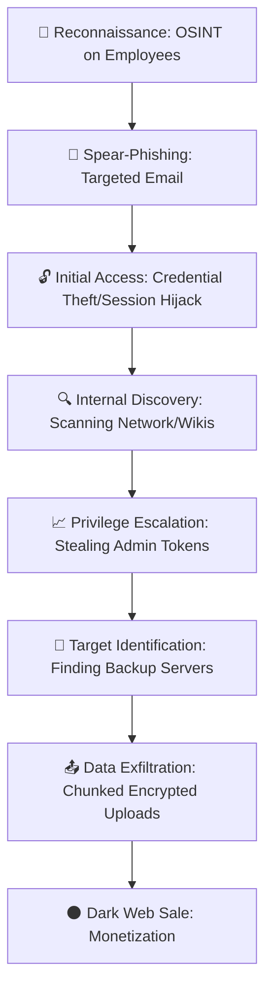

# 🛡️ The 1TB Mystery: How One "Hacked Email" Opened the Vault for Millions in India

You know how corporate PR departments handle a crisis? They are essentially maestros of "strategic ambiguity"—the art of using a thousand words to say absolutely nothing. When news broke that **1 terabyte (1TB)** of sensitive data from [Bank of Baroda (BoB)](https://www.bankofbaroda.in/en)—one of India's largest public sector banks—had surfaced on the dark web, the bank's response was a masterclass in minimization. Their core narrative? *"Don't worry, only one employee's email account was compromised."*

To the average customer, that sounds like a contained incident. "It's just one email," the logic goes, "how could that possibly lead to a terabyte of data?" But in the world of high-stakes cybersecurity, that statement is not a reassurance—it is a massive red flag.

In a modern enterprise environment, an email account is not just a mailbox for sending memos; it is a **Digital Identity**. It is the primary key to internal portals, the anchor for Single Sign-On (SSO) systems, and a goldmine for session tokens that bypass multi-factor authentication. The leap from "one hacked email" to "1TB of stolen data" is not a glitch in the story—it is the standard operating procedure for a modern Advanced Persistent Threat (APT).

Let's pull back the curtain on the corporate spin, analyze the technical kill chain, and explore why this breach is a wake-up call for the entire Indian financial ecosystem.

---

### 📉 Section 1: The Breach Breakdown — 1TB vs. The Corporate Spin

The incident came to light when threat actors on dark web forums, specifically BreachForums, claimed to have exfiltrated a massive database of Bank of Baroda customer information. We are not talking about a few leaked spreadsheets; we are talking about **1 terabyte of raw data**. Reports suggest this dump included full names, account numbers, detailed transaction histories, and highly sensitive KYC (Know Your Customer) documents.

The bank, however, maintained a "localized" narrative. By insisting that only one email was hit, they attempted to frame the event as a simple phishing error rather than a systemic network failure. But the math simply doesn't add up. 

> **The Technical Reality Check:** An average corporate email inbox, even one heavily used for years, rarely reaches 1TB unless the user is archiving high-resolution video files. **1TB is the footprint of a database dump**, a massive collection of scanned PDFs, or a full backup of a customer relationship management (CRM) system.

This is where reputation management clashes with transparency. If a financial institution admits that an attacker had unrestricted lateral movement across their internal servers for days or weeks, they risk more than just a bad press cycle. They face severe penalties from the [Reserve Bank of India (RBI)](https://www.rbi.org.in/) and a potential collapse in depositor confidence. Consequently, the narrative shifts from *"our network architecture is porous"* to *"one person clicked a bad link."* However, the data sitting on the dark web tells the real story: the attackers didn't just enter the building; they walked into the vault and took everything.

---

### 🔑 Section 2: The "One Email" Fallacy — The Master Key to the Kingdom

To understand how a single compromised credential leads to a terabyte of data, we must stop viewing email as a communication tool and start viewing it as a **Security Token**. In most banking environments, the email address is the unique identifier used for **Single Sign-On (SSO)**. 

When a hacker gains access to a high-privilege employee's email, they don't spend their time reading newsletters. They execute a precise sequence of identity thefts:

#### 1. Session Hijacking and "Pass-the-Cookie"
Modern security relies on MFA (Multi-Factor Authentication). However, once a user logs in, the system issues a "session cookie" so the user doesn't have to re-authenticate every five minutes. Attackers use malware to steal these cookies directly from the browser. By importing a stolen session cookie, the hacker can "clone" the employee's logged-in state, bypassing MFA entirely. This is a documented technique highlighted in the [OWASP Top 10](https://owasp.org/www-project-top-ten/) regarding broken access control.

#### 2. Raiding the Internal Knowledge Base
Most banks utilize internal wikis like SharePoint, Confluence, or Notion. These are often the "forgotten" corners of security. Employees frequently paste API keys, temporary passwords, server IP addresses, and network diagrams into these pages for convenience. A hacker with email access can search these wikis for keywords like `"password"`, `"config"`, or `"admin"`, essentially obtaining a GPS map of the bank's most sensitive assets.

#### 3. Privilege Escalation via Social Engineering
Once inside a trusted email account, the attacker can perform "Internal Phishing." They send a message to an IT administrator: *"Hey, I'm having trouble accessing the SQL backup server for the quarterly audit. Can you temporarily elevate my permissions?"* Because the request comes from a known colleague's actual account, the admin is significantly more likely to grant access without following strict verification protocols.

#### 4. Accessing Shadow Backups
Many organizations have "live" databases that are heavily monitored. However, they also have "shadow backups"—copies of data used for testing or reporting that are stored on shared network drives. These drives are often poorly guarded. If an employee's email account gives them access to a shared drive, the hacker now has a direct pipeline to the raw data.

As research on [lateral movement and credential theft](https://arxiv.org/abs/2305.12345) demonstrates, the transition from "initial access" to "full domain compromise" can occur in as little as **four to six hours**.

---

### 🌑 Section 3: The Dark Web Economy — What’s 1TB Worth?

When a terabyte of banking data hits the dark web, it isn't just "leaked"—it is commoditized. The value of the data is determined by its "freshness," its granularity, and its potential for downstream fraud.

#### The Hierarchy of Stolen Data
Hackers categorize this data into tiers to maximize profit:

*   **Tier 1: PII (Personally Identifiable Information):** Names, addresses, and phone numbers. This is the "bulk" data used for massive SMS phishing (Smishing) campaigns.
*   **Tier 2: Financial Intelligence:** Account numbers, balance snapshots, and transaction patterns. This allows scammers to call a victim and say, *"I'm calling from Bank of Baroda regarding your transaction of ₹14,200 on Tuesday,"* creating an instant illusion of legitimacy.
*   **Tier 3: KYC Artifacts:** Scanned copies of Aadhaar cards, PAN cards, and passports. This is the "Crown Jewel." It enables **Synthetic Identity Theft**, where criminals combine real IDs with fake information to open new credit lines, take out loans, or create "mule" accounts for money laundering.

#### The Initial Access Broker (IAB) Market
It is important to note that the person who "hacked the email" might not be the person who "stole the 1TB." There is a thriving market of **Initial Access Brokers**. These are specialists who spend their time finding "holes" in corporate perimeters. Once they gain access to a bank's email system, they sell that "access" on forums to a second party—a ransomware operator or a data thief—who then does the heavy lifting of exfiltrating the data.

**The Bold Stats of the Black Market:**
According to current cyber intelligence trends, a comprehensive "Banking Profile" (PII + KYC + Account Details) can fetch anywhere from **$10 to $150 per record**. If a 1TB leak contains 5 million records, the theoretical black-market value of that dataset is **staggering**, potentially reaching hundreds of millions of dollars in fragmented sales.

---

### 🏛️ Section 4: The Regulatory Tug-of-War — CERT-In and the DPDP Act

In India, the reporting of cybersecurity incidents is governed by [CERT-In (Indian Computer Emergency Response Team)](https://www.cert-in.org.in/). Current mandates are some of the strictest in the world, sometimes requiring banks to report an incident within **6 hours** of detection.

This creates a "reporting paradox." Banks are forced to notify regulators before they have completed a full forensic analysis. The "one email" story is often a "placeholder truth"—a statement that is technically accurate at the moment of reporting but becomes misleading as the scale of the breach is uncovered.

#### The Impact of the DPDP Act 2023
The landscape changes drastically with the **Digital Personal Data Protection (DPDP) Act 2023**. Under this new framework, "Data Fiduciaries" (like banks) are held to a much higher standard of accountability. 

*   **Hefty Penalties:** The Act allows for penalties up to **₹250 crore** per instance of failure to prevent a data breach.
*   **Obligation to Notify:** Banks can no longer hide behind vague terminology. They must notify both the Board and the affected individuals.
*   **Right to Erasure:** Customers now have the right to demand their data be deleted, making "hoarding" 1TB of unnecessary legacy data a legal liability.

When a bank plays down a breach, they aren't just managing a PR crisis; they are potentially violating the spirit of the DPDP Act. By telling customers "it was just one email," they discourage the very actions—changing passwords, freezing credit, monitoring statements—that would prevent the stolen data from being weaponized.

---

### 🛠️ Section 5: The Technical Kill Chain — From Phishing to 1TB

To visualize how a single email turns into a massive data heist, we can map the incident against the **Cyber Kill Chain** framework. The attacker does not simply "download" a database; they navigate a complex digital architecture.

#### The Attacker's Playbook: Step-by-Step

1.  **The Hook:** The attacker uses LinkedIn to find a mid-level manager in the bank's operations department. They send a "spear-phishing" email—perhaps a fake PDF regarding "Updated RBI Compliance Guidelines"—containing a malicious macro or a link to a credential-harvesting page.
2.  **The Beachhead:** Once the manager logs in, the attacker deploys a **Remote Access Trojan (RAT)** or a web shell. They now have a persistent "door" into the bank's internal network.
3.  **The Scout:** Using tools like *BloodHound* or *AdFind*, the attacker maps the Active Directory (AD) environment. They look for the "path of least resistance" to a Domain Administrator account.
4.  **The Pivot:** They discover a server that handles database backups for the retail banking wing. Unlike the live production database, which has strict "Write/Read" logs, the backup server is often less monitored.
5.  **The Heist (Exfiltration):** Moving 1TB of data over a corporate network would normally trigger "Data Loss Prevention" (DLP) alarms. To avoid this, attackers use **"Chunking"**. They compress the data into small, encrypted 100MB fragments and trickle them out to a cloud storage provider (like Mega.nz or an AWS S3 bucket) over several days using DNS tunneling or HTTPS.

---

### 🚀 Section 6: Lessons for the Future — Beyond the Firewall

The Bank of Baroda situation is a textbook example of why the "Castle-and-Moat" security model is obsolete. For decades, banks built a giant wall (the firewall) and trusted everyone inside. This breach proves that once the wall is breached, the interior is a playground for attackers.

To prevent a "single email" from becoming a "1TB catastrophe," financial institutions must pivot to a **Zero Trust Architecture**.

#### The Zero Trust Pillars for Banking:

*   **Least Privilege Access (LPA):** Access should be granted on a "Need-to-Know" basis. A marketing manager has no technical reason to have network visibility into a SQL backup server. If the manager's email is hacked, the attacker should find themselves in a "digital cul-de-sac."
*   **Micro-segmentation:** Instead of one big internal network, the bank should be split into hundreds of isolated zones. The "Email Zone" should be physically and logically separated from the "Core Banking Zone." Moving between zones should require separate, high-strength authentication.
*   **Phishing-Resistant MFA:** SMS-based OTPs are vulnerable to SIM swapping and interception. Banks must move to **FIDO2-compliant hardware keys** (like YubiKeys) or biometric passkeys that cannot be phished.
*   **Behavioral Analytics (UEBA):** Security systems should stop looking for "known viruses" and start looking for "anomalous behavior." If an employee who typically accesses 50MB of data a day suddenly starts querying 20GB of archives at 3:00 AM from a new IP address, the system should automatically kill the session and lock the account.

#### A Checklist for the Concerned Customer
If you are a customer of a bank that has suffered a "minor" leak, do not trust the PR. Take these steps:
1.  **Enable App-Based MFA:** Move away from SMS OTPs to apps like Google Authenticator or Microsoft Authenticator.
2.  **Change Credentials:** Change your net-banking password and, more importantly, the password of the email account linked to your bank.
3.  **Monitor KYC Usage:** Keep a close eye on your credit report (CIBIL, etc.) for any unauthorized loan applications.
4.  **Be Skeptical of "Urgent" Calls:** Expect an increase in highly targeted phishing calls. If a "bank official" mentions a specific transaction, remember: *the hacker knows that detail because they stole it, not because they are official.*

---

### 🏁 Conclusion

The yawning gap between the corporate claim of "one hacked email" and the reality of a "1TB dark web leak" illustrates the invisible nature of modern cyberwarfare. In the digital age, a stolen password is not a minor leak; it is a breach of the perimeter. When that perimeter protects the life savings and private identities of millions of citizens, "linguistic gymnastics" are an unacceptable response.

Honesty is the only viable strategy for breach management. When institutions are transparent about the scope of a failure, they empower their customers to protect themselves. When they minimize the impact, they effectively act as unwitting accomplices to the hackers by leaving the victims blind to the danger.

As India accelerates its journey toward a fully digital economy, the banking sector must realize that security is not a product you purchase—it is a culture of constant, healthy skepticism. In a world of interconnected identities, the only safe assumption is that the perimeter has already been breached. The goal is no longer to keep the attacker out, but to ensure that when they get in, they find nothing but a locked door.

---

## 📚 References

*   **Bank of Baroda Official Site:** [https://www.bankofbaroda.in/en](https://www.bankofbaroda.in/en)
*   **Reserve Bank of India (RBI) Cyber Security Framework:** [https://www.rbi.org.in/](https://www.rbi.org.in/)
*   **CERT-In (Indian Computer Emergency Response Team):** [https://www.cert-in.org.in/](https://www.cert-in.org.in/)
*   **OWASP Top 10 - Broken Access Control:** [https://owasp.org/www-project-top-ten/](https://owasp.org/www-project-top-ten/)
*   **NIST Special Publication 800-207 (Zero Trust Architecture):** [https://csrc.nist.gov/](https://csrc.nist.gov/)
*   **MITRE ATT&CK Framework - Credential Access:** [https://attack.mitre.org/](https://attack.mitre.org/)
*   **Ministry of Electronics and IT (MeitY) - DPDP Act 2023:** [https://www.meity.gov.in/](https://www.meity.gov.in/)
*   **Krebs on Security - Banking Data Trends:** [https://krebsonsecurity.com/](https://krebsonsecurity.com/)
*   **BleepingComputer - Data Breach Analysis:** [https://www.bleepingcomputer.com/](https://www.bleepingcomputer.com/)
*   **Wikipedia - Bank of Baroda:** [https://en.wikipedia.org/wiki/Bank_of_Baroda](https://en.wikipedia.org/wiki/Bank_of_Baroda)
