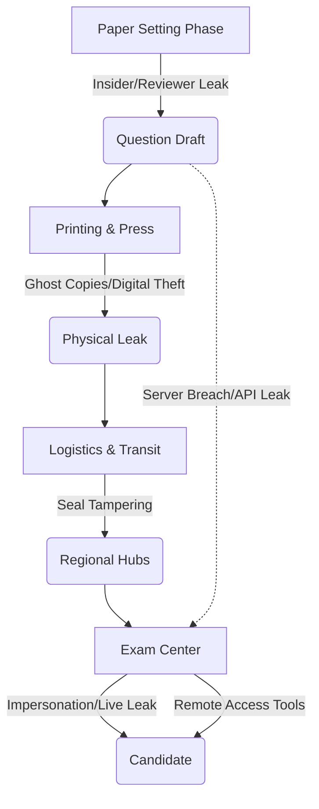

# 🚨 The Trust Gap: What’s Really Going On?

For millions of students in India, a single three-hour exam isn't just a test of knowledge—it is a high-stakes lottery ticket for their entire future. Whether it is the **NEET-UG** for medical school, the **JEE** for engineering, or the **UGC-NET** for eligibility in teaching and research, these examinations serve as the sole gateways to the most coveted careers in the country. However, in recent years, these gates have increasingly been opened not by merit or hard work, but by the deepest pockets.

The narrative of the "paper leak" has evolved. What used to be an occasional incident of a few students cheating in a remote corner of a classroom has transformed into a full-blown, industrial-scale criminal enterprise. We are no longer dealing with opportunistic cheating; we are witnessing a systemic collapse of academic integrity.

Whenever a leak is exposed, the immediate reaction is a wave of public fury and demands for a re-exam. While these reactions are justified, they often miss the structural reality: the "leak" is rarely a single point of failure. Instead, it is a leaky pipeline. From the moment a subject matter expert conceptualizes a question to the moment a student clicks "submit" on a computer terminal, there are a dozen critical vulnerability points.

The catastrophic 2024 controversy surrounding the [NEET-UG and UGC-NET exams](https://www.thehindu.com/news/national/neet-ug-ugc-net-controversy-nta-exam-leaks/article68337335.ece) proved that neither traditional pen-and-paper formats nor modern Computer Based Tests (CBT) are inherently secure. If India is to salvage the credibility of its competitive exams, we must stop labeling these events as "accidents" and start treating them as sophisticated security breaches in a fundamentally broken architecture.

---

## ✍️ Stage 1: The Blueprint (The Vulnerability of Creation)

  
  
 <a href="https://unsplash.com/@pawel_czerwinski">Pawel Czerwinski</a> on <a href="https://unsplash.com/photos/birds-eye-view-of-white-open-window-O8MImzp7ROo">Unsplash</a>

The genesis of every exam is the "Blueprint" stage. In theory, this is the most secure phase of the process. Questions are drafted in "confidential cells"—isolated environments where experts are sequestered, their devices confiscated, and their movements monitored to ensure total secrecy. However, the human element remains the most significant vulnerability.

### The Insider Threat
The "Insider Leak" occurs when the very people trusted to safeguard the integrity of the exam become the agents of its compromise. This typically manifests in three ways:
1. **Direct Sale of Drafts:** A paper setter or a reviewing official sells the entire draft to a middleman before it even reaches the printing stage.
2. **Theme Leaking:** Rather than the exact questions, "themes" or specific high-weightage topics are leaked, allowing coaching centers to "predict" the paper with uncanny accuracy.
3. **Question Substitution:** In some sophisticated schemes, certain questions are altered slightly after the leak to provide plausible deniability for the officials involved.

Because these leaks occur at the source, they are nearly impossible to detect using traditional surveillance. By the time the "official" paper is distributed, a select group of wealthy candidates has already memorized the answer key. In this scenario, biometric scanners and CCTV cameras at the exam center are useless because the "source code" of the test has already been compromised.

> "When the process of setting a fair exam is traded for cash, the test ceases to be a measurement of merit and becomes a product for sale in a shadow market."

---

## 🖨️ Stage 2: The Industrial Leak (Printing & Logistics)

Once the blueprint is finalized, it moves to the industrial phase: printing and distribution. This is where a "brain leak" (intellectual theft) scales into an "industrial leak" (mass distribution).

### The Printing Press Paradox
India relies heavily on a network of third-party printing presses. Even those designated as "secure" often have gaps in their operational security. The primary methods of breach here include:
* **Ghost Copies:** Corrupt press operators print a small percentage of "extra" copies—ghost sheets—that are not logged in the official count. These copies are smuggled out in clothing, food containers, or via complicit staff.
* **Digital Interception:** Modern printing involves sending files digitally to the press. If the transmission line is not end-to-end encrypted, or if a technician intercepts the file on the print server, the entire paper can be digitized and shared via PDF in seconds.

### The Shipping Gap and Regional Hubs
The journey from the press to the exam center is a logistical nightmare. Papers are sealed in envelopes and shipped to regional hubs. This "transit window" is a goldmine for brokers. There have been documented cases where seals were surgically tampered with, pages photographed using high-resolution miniature cameras, and the envelopes resealed using professional-grade adhesives.

In several state-level scandals, papers have leaked from regional lockers just **2 to 6 hours** before the exam. These breaches are almost always facilitated by local administrators who are paid to "look the other way" while a broker enters the secure zone.

---

## 💻 Stage 3: The Digital Side (The Fallacy of CBT)

To combat physical leaks, the [National Testing Agency (NTA)](https://www.nta.ac.in/) shifted toward Computer Based Tests (CBT). The logic was seductive: if there is no physical paper to steal, there is nothing to leak. However, this merely shifted the attack vector from the printing press to the server and the endpoint.

### The Rise of "Cyber Leaks"
Digital exams introduced a new breed of cheating: the **Remote Access Trojan (RAT)**. High-tech "solvers" use remote-desktop software (like AnyDesk or customized stealth variants) to gain control of the exam terminal.
* **The Process:** A technician installs a hidden tool on the center's computer before the exam starts. While the student sits in the hall, an expert in another city sees the screen in real-time.
* **The Delivery:** The expert solves the question and feeds the answer to the student via a microscopic Bluetooth earpiece.

### Encryption and API Vulnerabilities
Beyond the endpoint, the server architecture itself is a target. If the digital decryption keys—used to unlock the exam on local servers—are leaked or shared prematurely, the entire question bank can be dumped onto Telegram channels minutes before the clock starts. The [UGC-NET cancellation in 2024](https://www.indianexpress.com/article/india/ugc-net-exam-cancelled-nta-paper-leak-allegations-9335412/) highlighted how a single breach in digital trust can invalidate an entire national process.

---

## 🏫 Stage 4: The Last Mile (Center-Level Compromise)

Even if a paper survives the blueprint, printing, and digital transit, it must face the "Last Mile"—the exam center. This is often the weakest link because it involves the highest number of low-paid, easily bribable staff.

### The Impersonation Industry
The most blatant form of cheating is **Impersonation**. "Professional solvers"—typically brilliant students from coaching hubs who are financially struggling—are paid massive sums to take the test on behalf of a wealthy candidate.
* **Biometric Bypass:** This only works because of systemic failure. Corrupt supervisors may intentionally mismanage biometric verification or manually override the system, claiming "technical glitches" to allow the solver in.
* **The "Proxy" Network:** In some centers, entire rooms are managed by a single broker who ensures that the "solvers" are placed in positions where they can assist other candidates.

### The Live Leak
The "Live Leak" is the most chaotic form of breach. The moment the paper is opened, a complicit invigilator or a student with a hidden camera snaps photos of the questions. These are uploaded to WhatsApp groups in real-time. Because the exams are often held across different time zones or in staggered shifts, a leak in one city can compromise the exam for the rest of the country.

---

## 💰 Stage 5: The Economics of Cheating (The Shadow Industry)

Exam leaking is no longer a crime of opportunity; it is a multi-crore shadow industry with a corporate hierarchy. To understand why leaks persist, one must understand the economics behind them.

### The Corporate Structure of Fraud
1. **The Kingpins:** These are the architects. They possess the high-level connections within government departments, printing presses, or the NTA. They don't handle the papers; they handle the people.
2. **The Brokers:** The middle managers. They operate Telegram channels and WhatsApp groups, marketing "guaranteed success" to desperate parents and students. They manage the payment gateways and the distribution of leaked PDFs.
3. **The Solvers:** The foot soldiers. These are often highly skilled students from hubs like Kota or Delhi who sell their intellectual labor.

### The Price of a Future
The financial incentives are staggering. For high-stakes exams like NEET, the cost of a "guaranteed seat" or a leaked paper can range from **₹10 lakhs to ₹50 lakhs**. In some cases, brokers charge a "base fee" for the paper and a "success bonus" once the results are declared.

This creates a vicious cycle. When a low-level printing press operator or a center supervisor can earn **more in one afternoon** than they do in five years of official salary, the temptation becomes an inevitability. This industry thrives on the brutal competition of the Indian education system, where a **0.1% difference** in marks can mean the difference between a prestigious medical college and a dead end.

---

## ⚖️ Stage 6: Legislative Shields and the Path Forward

In response to the escalating crisis, the Indian government introduced the [Public Examinations (Prevention of Unfair Means) Act, 2024](https://www.meity.gov.in/). This represents a shift from treating leaks as administrative failures to treating them as organized crime.

### Analysis of the 2024 Act
The new legislation introduces severe deterrents:
* **Criminalization:** Organizing a leak is now a non-bailable offense.
* **Imprisonment:** Penalties include up to **10 years of jail time** for those leading organized crime rings.
* **Financial Ruin:** Fines can reach up to **₹1 crore**, aimed at stripping the profit motive from the "Broker" class.
* **Broad Jurisdiction:** The law targets the entire pipeline—from the paper setter to the printer and the solver.

However, laws alone cannot fix a systemic leak. Legislation is a reactive tool; security requires a proactive architecture.

### A "Zero Trust" Security Framework
To truly secure the pipeline, India needs to move toward a **Zero Trust Architecture**, incorporating the following:
1. **Blockchain-Based Distribution:** Instead of physical envelopes, papers could be encrypted and distributed via a blockchain. The decryption key would only be released to the center's terminal at the exact second the exam begins, authenticated by a multi-signature protocol.
2. **AI-Driven Behavioral Proctoring:** Moving beyond basic CCTVs, AI can monitor eye movements, detect the presence of unauthorized devices via radio-frequency scanning, and identify remote-access software signatures in real-time.
3. **Dynamic Question Banking:** Instead of one set of questions, the system should generate **thousands of unique versions** of the exam. Each student receives a set with the same difficulty level but different questions, making a single "leaked paper" useless.
4. **Psychometric Analysis:** Using AI to detect "impossible" patterns in answer sheets—such as a student getting the hardest questions right while failing the basic ones—to flag potential solvers.

---

## 🧠 The Psychological Toll: The Hidden Cost of the Leak

While the headlines focus on the logistics and the laws, the most devastating impact of the "Leak Pipeline" is psychological. For a student who has spent **14-16 hours a day** studying for two years, the news of a leak is not just a delay—it is a trauma.

The "Trust Gap" creates a pervasive sense of cynicism. When merit is perceived as a lie, the motivation to excel diminishes. Students stop asking "How can I learn more?" and start asking "Who do I need to know to get the paper?" This erosion of the meritocratic ideal is a long-term disaster for India's human capital. According to [UNESCO's guidelines on education quality](https://www.unesco.org/), the integrity of assessment is the foundation of a functioning educational system. Without it, a degree becomes a mere piece of paper rather than a certification of competence.

---

## 🏁 Conclusion: Beyond the Quick Fix

When we map the pipeline and ask "Leaked, but where?", the answer is: **everywhere**. India is attempting to fight 21st-century cyber-crime and organized fraud with 20th-century security protocols. Whether it is a physical envelope being opened in a transit van or a hacker bypassing a firewall, the root cause is a failure of institutional integrity.

The chaos surrounding the NTA and the subsequent legislative crackdown show that the state is finally acknowledging the scale of the problem. But until the "Economics of the Leak" are dismantled—by reducing the extreme, life-altering pressure of "one-shot" exams and implementing a rigorous, audited technical security stack—the pipeline will continue to leak.

The real cost of these breaches is not a rescheduled exam date or a wasted academic year. It is the slow death of the idea of merit. When the hardworking are pushed aside by those who can afford to buy the "right stage" of the leak, the country loses more than just a fair test—it loses the trust of its youth and the integrity of its future.

---

## 📚 References

- **The Hindu:** [Comprehensive Analysis of NEET-UG and UGC-NET Controversy](https://www.thehindu.com/news/national/neet-ug-ugc-net-controversy-nta-exam-leaks/article68337335.ece)
- **National Testing Agency (NTA):** [Official Portal, Guidelines, and CBT Framework](https://www.nta.ac.in/)
- **Indian Express:** [UGC-NET Cancellation and the Crisis of Academic Integrity](https://www.indianexpress.com/article/india/ugc-net-exam-cancelled-nta-paper-leak-allegations-9335412/)
- **Ministry of Electronics & IT (MeitY):** [Public Examinations (Prevention of Unfair Means) Act, 2024](https://www.meity.gov.in/)
- **Press Information Bureau (PIB):** [Government of India's Official Stance on Exam Integrity](https://pib.gov.in/)
- **PRS Legislative Research:** [Analysis of the Public Examinations Act and its Implications](https://prsindia.org/)
- **The Times of India:** [Investigative Reports on Solver Gangs and Leak Networks](https://timesofindia.indiatimes.com/)
- **The Wire:** [Critical Analysis of the NTA's Structural Failures in 2024](https://thewire.in/)
- **News18:** [Breakdown of Penalties under the 2024 Public Examinations Act](https://www.news18.com/)
- **Ministry of Education:** [Annual Reports on Higher Education and Competitive Testing](https://www.education.gov.in/)
- **UNESCO:** [Global Standards for Education Quality and Assessment Integrity](https://www.unesco.org/)
