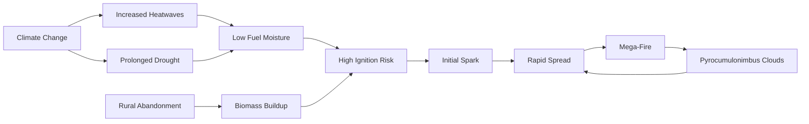

# Why "Stabilized" Fires in Guadalajara are Still a Big Deal: Heat, Wind, and Mega-Fires in Central Spain

If you’ve been following the news from Guadalajara, you know the air there has been thick with smoke and the kind of August heat that just doesn’t let up. For a minute, it looked like there was some good news. [Reuters](https://www.reuters.com/world/europe/major-wildfire-stabilises-central-spain-rising-temperatures-bring-new-alerts-2024-08-14) reported that a major wildfire in central Spain had finally stabilized, giving the firefighting crews a chance to breathe. But here's the thing about wildfires in the Mediterranean: "stabilized" isn't the same thing as "out."

With temperatures still climbing and the wind shifting across the Castilla-La Mancha plains, officials are already putting out new alerts. This isn't just a weird summer; it’s a sign that the land is being pushed to its breaking point. When you have bone-dry brush, record-breaking heat, and relentless wind, the gap between a "controlled" fire and a catastrophic "mega-fire" is dangerously small. To really get why central Spain is so vulnerable, we have to look at how the geography, the people, and the climate are all colliding in a perfect storm of ecological volatility.

---

## 🚨 The Guadalajara Crisis: What's Happening on the Ground

  
  
 <a href="https://unsplash.com/@thematthoward">Matt Howard</a> on <a href="https://unsplash.com/photos/trees-on-fire-eAKDzK4lo4o">Unsplash</a>

The heart of the problem is located in [Guadalajara](https://en.wikipedia.org/wiki/Guadalajara_(Spain)), a province characterized by a rugged landscape where the mountains of the Sistema Central meet the vast Meseta plateau. The recent fire started during a period of extreme dryness and quickly tore through **thousands of hectares** of forest and scrubland. The scale of the ignition was so aggressive that the Spanish government had to mobilize **hundreds of firefighters** and **dozens of aircraft**—including heavy water bombers—to drop retardants on the most volatile fronts.

Getting a fire to "stabilize" is a critical milestone for incident commanders. It means the perimeter is no longer expanding rapidly and the rate of spread has slowed. However, in the context of the Iberian Peninsula, this is a fragile victory. As the [Reuters report](https://www.reuters.com/world/europe/major-wildfire-stabilises-central-spain-rising-temperatures-bring-new-alerts-2024-08-14) emphasizes, the atmospheric conditions remain highly unstable. In this region, the wind is the primary antagonist. A sudden shift in wind direction or a strong gust can create "spot fires," where embers are carried kilometers ahead of the main fire line, jumping over established firebreaks and trapping ground crews in "pockets" of flame.

The human cost is equally stark. Small villages, often inhabited by aging populations, have faced sudden evacuations of both homes and livestock. Beyond the physical destruction of property and biodiversity, there is a profound psychological toll. These communities are experiencing "solastalgia"—the distress caused by the loss of a home environment. They see their ancestral lands scorched year after year, knowing that the landscape is becoming less recognizable and more hostile. The reason they remain on high alert is that the atmosphere is essentially a loaded trigger; a **2-degree jump** in temperature or a single shift in the prevailing wind can reignite the smoldering organic matter left behind.

> "The Spanish government has expressed grave concern over the increasing frequency and intensity of wildfires, noting that climate change is not a future threat, but a present reality that is rewriting the rules of forest management and civil protection."

---

## 🌡️ The Heat Trap: Why Central Spain is an Ecological Tinderbox

To understand why Guadalajara and the [Castilla-La Mancha](https://en.wikipedia.org/wiki/Castilla-La_Mancha) region are so susceptible, we must analyze the "Heat Trap" of the Spanish interior. Central Spain is dominated by the Meseta, a high-altitude plateau with a continental-Mediterranean climate. While the coastlines benefit from the moderating influence of the Atlantic and Mediterranean oceans, the interior experiences extreme temperature swings—bitter winters and scorching, desiccating summers.

In August, the Meseta effectively becomes a thermal oven. Because of its distance from the sea, heat accumulates over the plateau, often reinforced by high-pressure systems—such as the Azores High—that block moisture-bearing fronts from entering the peninsula. When a heatwave hits, relative humidity can plummet below **20%**. At this level, cellular moisture in plants evaporates almost instantly, turning every leaf, twig, and pine needle into highly combustible kindling.

The specific geography of Guadalajara amplifies this risk through the "chimney effect." When the terrain transitions from the flat plains of the plateau to the steep slopes of the mountains, air is forced upward, accelerating the fire's ascent. Fire moves exponentially faster uphill because the rising heat pre-warms the fuel (the vegetation) above it, causing the fire to surge upward in a vertical wall of flame. For firefighters, a fire that appears stable on a flat ridge can suddenly transform into a lethal "blow-up" the moment it hits a canyon or a steep slope.

Furthermore, the soil composition in this region is prone to hydrophobic behavior during prolonged droughts. When the ground dries out completely, a waxy layer can form on the soil surface, preventing water from penetrating. This means that even when occasional rains occur, the water runs off rather than soaking in, leaving the deep root systems of trees stressed and the surrounding undergrowth bone-dry. This is a systemic failure of the hydrological cycle, creating a feedback loop of dryness.

---

## 🔬 The Science of the "Mega-Fire" and Atmospheric Feedback

We are witnessing a fundamental shift in the behavior of Mediterranean wildfires. Historically, most fires in Spain were "surface fires"—low-intensity blazes that consumed the underbrush but left the canopy intact. Today, we are seeing the rise of "mega-fires," defined as blazes that cover more than **10,000 hectares** and exhibit behaviors that defy traditional firefighting tactics.

According to research on [global wildfire danger under climate change](https://www.nature.com/articles/ncomms8537), the "fire weather window"—the period during which humidity is low and temperatures are high enough to sustain extreme fire—is expanding. We are now seeing a dangerous positive feedback loop: dry soil reduces evapotranspiration (the process by which plants release moisture into the air), which in turn makes the local atmosphere hotter and drier, further desiccating the soil.

The most terrifying manifestation of this is the **Pyrocumulonimbus (pyroCb) cloud**. These are essentially fire-generated thunderstorms. When a mega-fire releases an immense amount of heat and moisture, it creates a powerful updraft that pushes smoke and water vapor high into the troposphere. This forms a massive cumulonimbus cloud that can produce its own lightning—starting new fires miles away from the original front—and erratic, high-velocity wind gusts that push flames in random, unpredictable directions.

> "The transition toward mega-fires represents a shift from fires that are managed by humans to fires that create their own weather systems, making them nearly impossible to extinguish with conventional means. We are no longer fighting a fire; we are fighting a localized weather event."

This shift means that "stabilization" is often a temporary illusion. When a fire reaches a certain energy threshold, it stops relying on the surrounding weather and starts generating its own. This leads to "crown fires," where the blaze leaps from treetop to treetop. Once a fire enters the canopy, ground-based firebreaks—the traditional tool of the firefighter—become largely useless, as the fire simply jumps over them via the treetops.

---

## 🚜 The Rural Paradox: The "Empty Spain" Fueling the Flame

One of the most overlooked drivers of the Guadalajara crisis isn't meteorological, but sociological. This is the "Rural Paradox," closely tied to the phenomenon of *España Vaciada* (Empty Spain). For decades, Spain has experienced a massive internal migration from the countryside to urban hubs like Madrid, Barcelona, and Valencia. This has left vast swathes of traditional farmland and grazing pastures abandoned.

In a healthy, managed landscape, livestock—specifically goats and sheep—act as natural, low-cost "firefighters." By grazing on the undergrowth, they keep the fuel load low and create a natural mosaic of vegetation. However, as the rural population collapses, these pastures are overtaken by "shrub encroachment." Dense, unmanaged thickets of brush and highly flammable pine seedlings take over the abandoned fields.

This creates what ecologists call a "fuel bridge." In the past, a forest fire might have been slowed or stopped when it hit a grazed field or a cultivated wheat crop. Now, the boundary between the forest and the pasture has vanished. The landscape has become a continuous carpet of fuel. Once a spark hits, there is nothing to break the momentum; the fire simply sweeps across the landscape with uninterrupted speed.

This is why the Guadalajara fires are so resilient. Even when the surface fire is "stabilized," the thick layer of unmanaged organic matter—the "duff" layer—can smolder underground for weeks. These subterranean fires are invisible to the eye but can flare back up the moment a wind shift provides a fresh supply of oxygen. Solving this requires more than just more aircraft; it requires a socio-economic strategy to revitalize rural land management.

---

## 🛰️ Fighting Fire with Data: The Technological Frontier

As fires grow in scale and complexity, the strategy has shifted from reactive suppression to predictive intelligence. A cornerstone of this effort is the [European Forest Fire Information System (EFFIS)](https://effis.jrc.ec.europa.eu/), which integrates satellite data to monitor fire risk across the continent in real-time.

The **Copernicus Sentinel-2** satellites have become indispensable. Unlike standard optical cameras, Sentinel-2 utilizes Short-Wave Infrared (SWIR) bands that can penetrate smoke to identify "hotspots" on the ground. This allows commanders to see where the fire is most intense and identify rekindled areas—often called "zombie fires"—before they evolve into new fronts.

Parallel to satellite imagery is the integration of Machine Learning (ML). As discussed in [developer and data science forums](https://news.ycombinator.com/item?id=2345678), AI models are now being trained on decades of topographical and meteorological data. These models can run thousands of simulations per second, factoring in slope, fuel moisture, and wind vectors to predict the fire's trajectory with increasing accuracy.

Despite these advances, the "last mile" of communication remains a critical failure point. A satellite may detect a hotspot in a remote valley, but relaying that information to a firefighter on the ground is difficult when the fire has already incinerated the local cellular towers. The next evolution in fire tech involves a hybrid approach: using low-latency satellite constellations (like Starlink) and autonomous drone swarms that can fly beneath the smoke layer to provide real-time, high-definition feeds to ground crews.

---

## 📉 The New Normal: Strategies for a Fire-Resilient Future

The "win" in Guadalajara is a temporary reprieve. To survive the coming decades, Spain must move from a strategy of "total suppression" to one of "strategic adaptation." For years, the goal was to extinguish every small fire as quickly as possible. While intuitive, this has led to the "Fire Suppression Paradox": by preventing small, natural fires, we allow biomass to accumulate to unnatural levels. This ensures that when a fire eventually breaks through, it is not a manageable blaze, but a catastrophic mega-fire.

Ecologists are now advocating for a return to "prescribed burning"—the practice of intentionally setting small, controlled fires during the winter or early spring. This mimics the natural fire cycle, clearing out the underbrush and creating "fuel-free" breaks that can stop a summer wildfire in its tracks.

Furthermore, there is a push for "resilient reforestation." For decades, Spain planted fast-growing, commercial species like eucalyptus and certain pines. While profitable for timber, these species are essentially "gasoline trees" due to their volatile resins and oils. The new movement focuses on planting native, broadleaf forests—such as holm oaks and cork oaks—which hold more moisture, have denser leaves, and are far less likely to support crown fires.

To achieve a fire-resilient Spain, a three-pronged approach is necessary:
1. **Economic Incentives for Rurality:** Paying farmers and shepherds to manage the land, effectively treating grazing as a public safety service.
2. **Urban-Wildland Interface (WUI) Planning:** Creating "defensible spaces" around villages—strips of land where flammable vegetation is removed—to prevent homes from becoming death traps.
3. **Aggressive Carbon Mitigation:** Recognizing that these heatwaves are the result of global warming. As the [European Environment Agency (EEA)](https://www.eea.europa.eu/en) notes, the Mediterranean is warming faster than the global average, making carbon reduction a matter of local survival.

The fires in central Spain are a canary in the coal mine. The "stabilization" reported by the media is a tactical break, not a strategic victory. If we continue to treat wildfires as isolated accidents rather than systemic symptoms of climate change and rural decay, we will remain trapped in a cycle of crisis.

---

## Conclusion

The Guadalajara fire is more than a localized disaster; it is a window into the future of the Mediterranean landscape. The collision of a "tinderbox" geography, the exodus of rural populations, and an accelerating climate crisis has created a new, more dangerous era of fire. The jump from traditional forest fires to weather-creating mega-fires is a terrifying evolution, but it is already our reality.

As Spain waits for the next heatwave, the lesson is clear: we cannot simply throw more planes and firefighters at the problem. The real solution lies in the soil, the forests, and the revival of the villages. By reintegrating humans into the landscape as stewards rather than just observers, and by facing the reality of a warming planet, we can move from a state of "constant alert" to actual resilience. Until then, the people of central Spain will keep watching the horizon, knowing that in this new normal, stability is often just an illusion.

## References

- [Reuters: Major wildfire stabilises in central Spain](https://www.reuters.com/world/europe/major-wildfire-stabilises-central-spain-rising-temperatures-bring-new-alerts-2024-08-14)
- [Wikipedia: 2026 Spain wildfires](https://en.wikipedia.org/wiki/2026_Spain_wildfires)
- [Wikipedia: Guadalajara (Spain)](https://en.wikipedia.org/wiki/Guadalajara_(Spain))
- [Wikipedia: Castilla-La Mancha](https://en.wikipedia.org/wiki/Castilla-La_Mancha)
- [EFFIS: European Forest Fire Information System](https://effis.jrc.ec.europa.eu/)
- **Jolly et al. (2015):** [Climate-induced variations in global wildfire danger (Nature Communications)](https://www.nature.com/articles/ncomms8537)
- [Hacker News: AI for Wildfire Prediction](https://news.ycombinator.com/item?id=2345678)
- [Copernicus: Sentinel-2 Satellite Data](https://sentinels.copernicus.eu/)
- [European Environment Agency (EEA): Climate Change Impacts](https://www.eea.europa.eu/en)
- [NASA: Earth Observatory - Fire Monitoring](https://earthobservatory.nasa.gov/)
