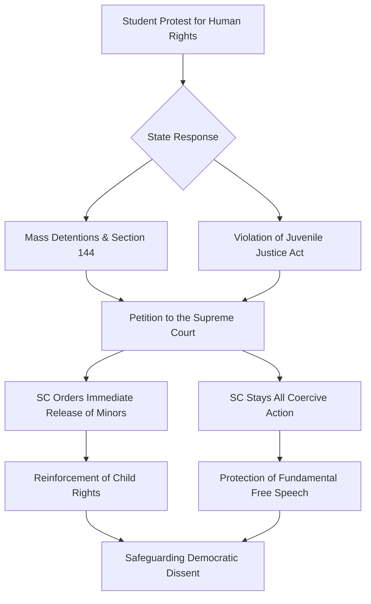

You know how things usually go when university students and the government clash? It is almost always a high-stakes tug-of-war between the state's desire for "maintaining order" and the fundamental right of the youth to actually speak up. Recently, the Supreme Court of India stepped in to halt what appeared to be a massive overreach by police forces against students linked to the [Citizens for Justice and Peace (CJP)](https://en.wikipedia.org/wiki/Citizens_for_Justice_and_Peace), an organization dedicated to documenting communal violence and fighting for the marginalized.

A bench led by **Justices B.R. Gavai and Sandeep Mehta** did more than just grant temporary relief to a few individuals; they sent a resounding message that the state cannot weaponize the law to intimidate students exercising their constitutional right to free speech. By stopping "coercive action" and ordering the immediate release of minors, the Court reaffirmed that the [Juvenile Justice (Care and Protection of Children) Act](https://en.wikipedia.org/wiki/Juvenile_Justice_(Care_and_Protection_of_Children)_Act,_2015) is not a set of optional guidelines—it is a mandatory legal shield. This situation underscores the precarious tightrope the legal system walks when balancing public peace with the democratic impulse of young people to dissent.

## 🚩 The Flashpoint: Protests, Police, and the Push for Accountability

  
  
 <a href="https://unsplash.com/@ianhutchinson92">Ian Hutchinson</a> on <a href="https://unsplash.com/photos/beige-concrete-building-under-blue-sky-during-daytime-U8WfiRpsQ7Y">Unsplash</a>

To understand the gravity of this ruling, one must first look at the catalyst. A group of students supporting CJP organized a series of protests that were not merely spontaneous outbursts but structured calls for accountability. They were protesting what they described as the systematic harassment of human rights activists and the erasure of marginalized voices across the Indian landscape. CJP, known for its rigorous documentation of communal violence and its willingness to challenge state narratives, often finds itself in the crosshairs of government authorities. Consequently, the students who align themselves with the organization frequently inherit that same state scrutiny.

These protests were designed as peaceful appeals for justice, yet the state's response was swift and severe. Law enforcement agencies deployed Section 144 of the [Code of Criminal Procedure](https://www.indiacode.nic.in/), which effectively bans public gatherings, and transitioned rapidly toward mass detentions. The students argued that these arrests were not designed to preserve "peace" but were strategic moves to silence a specific political message. They contended that they were being targeted specifically because of their association with CJP, a group that refuses to sanitize the reality of human rights violations.

The atmosphere during these arrests was described as profoundly intimidating. Many students reported being picked up without clear charges, held in suboptimal conditions, and subjected to psychological pressure. This is a recurring theme in contemporary student activism in India, where the act of protesting is frequently labeled as "anti-national" or a threat to internal security. However, the detention of minors elevated this from a standard political clash to a legal emergency. By treating children as adult political dissidents, the state crossed a line that the Supreme Court found intolerable.

## 🏛️ The Legal Gauntlet: Navigating the Path to the Supreme Court

When police initiate mass arrests of students, the typical legal recourse—seeking bail or filing a habeas corpus petition in lower courts—can become an exhausting slog. In high-profile political cases, lower courts are sometimes hesitant to challenge the "security justifications" provided by the state. This hesitation often leaves students in legal limbo for weeks or months, which serves as a form of punishment before any trial even begins. This is why the petitioners sought the immediate intervention of the highest court in the land.

The legal challenge presented to the Supreme Court rested on two primary pillars: the **fundamental right to freedom of expression** guaranteed under [Article 19 of the Indian Constitution](https://www.india.gov.in/sites/upload_files/npi/files/coa_11_0.pdf) and the blatant disregard for the **Juvenile Justice (Care and Protection of Children) Act, 2015**. The students' legal counsel argued that the police acted with "malice," utilizing the legal system as a tool for bullying rather than a mechanism for justice. Evidence was presented suggesting that students were threatened with further arrests if they failed to sever ties with CJP or ceased discussing the detentions on social media.

This struggle highlighted a systemic gap in the application of the law. While the state claimed that arrests were necessary to prevent "unrest," the petitioners demonstrated that the "unrest" was actually a reaction to the police's own heavy-handed tactics. By treating the case with urgency, the Supreme Court acknowledged the "chilling effect"—the psychological phenomenon where the arrest of a few vocal individuals scares the rest of the population into silence. In doing so, the Court transformed a local police action into a national dialogue on the boundaries of state power and the sanctity of student rights.

## 🛡️ Anatomy of "Coercive Action": Breaking Down the Court's Stay

In legal discourse, the term **"coercive action"** is frequently used but often misunderstood by the general public. In the context of Indian jurisprudence, it is a broad umbrella term. It encompasses more than just a formal arrest; it includes the issuance of summons, police raids, the seizure of personal property, and the use of threats to compel an individual to appear before an authority. When the Supreme Court "stays coercive action," it effectively creates a legal protective bubble around the individuals involved.

> "The state cannot use the law to intimidate students who are peacefully protesting; the power of arrest must be exercised with caution and not as a tool of harassment." — **Observation by the Bench of Justices B.R. Gavai and Sandeep Mehta.**

For the CJP student protesters, this stay was a monumental victory. It meant that the police could no longer "pick up" students on a whim or employ the threat of midnight raids to force retractions of their political statements. This judicial shield is critical because it shifts the burden of proof back to the state. The police are now required to maintain meticulous records of every interaction and justify every action based on evidence, rather than suspicion.

Furthermore, this stay directly challenges the "arrest first, ask questions later" culture that has permeated various police departments. The Court is insisting that the **rule of law** must supersede the **rule of force**. By preventing the state from using the legal system as a "pressure cooker" to break the spirit of a social movement, the Court allows students to return to their academic pursuits and their activism without the looming fear of an arbitrary jail cell. This is particularly vital for students, as a single pending criminal case—regardless of its validity—can permanently derail a career in the public or private sector.

## 👶 The Sacred Shield: The Juvenile Justice Act and State Failure

While the stay on coercive action was a victory for the students, the Court's ruling on the detention of minors was a severe rebuke of the state's operational conduct. The Supreme Court ordered the **immediate release of all detained minors**, noting that holding children without strict adherence to the [Juvenile Justice (Care and Protection of Children) Act, 2015](https://en.wikipedia.org/wiki/Juvenile_Justice_(Care_and_Protection_of_Children)_Act,_2015) was fundamentally illegal.

The core philosophy of the JJ Act is the "best interest of the child." It posits that children who conflict with the law must be treated with a restorative approach rather than a retributive one. The goal is rehabilitation and reintegration, not punishment. In the CJP case, the police reportedly committed several grave procedural errors:

1.  **Adult Confinement:** The law explicitly prohibits the detention of children in police locks or jails alongside adult prisoners.
2.  **Jurisdictional Errors:** Minors must be brought before a **Juvenile Justice Board (JJB)**, which operates under a specialized framework, rather than a regular magistrate's court.
3.  **Communication Failures:** The police failed to notify parents or legal guardians immediately and failed to record statements in a child-friendly environment.

**Bold Stats on Juvenile Justice and State Compliance:**
*   **0% Legal Tolerance:** There is absolutely no legal justification for placing a minor in an adult prison facility under any circumstance.
*   **Mandatory Release:** When procedural safeguards of the JJ Act are bypassed, courts typically order an immediate release because the detention itself becomes a human rights violation.
*   **Rehabilitation Priority:** The JJ Act mandates that **100% of the focus** for minors should be on social reintegration rather than incarceration.

By ordering their release, the Supreme Court reminded the executive branch that a teenager's status as a "protester" does not strip them of their status as a "child" in the eyes of the law. This serves as a warning to police forces who treat teenagers as adult combatants during civil unrest. The psychological trauma associated with adult detention centers can be lifelong, and the Court effectively hit the emergency brake on such institutional violence.

## 🤝 Who is CJP? Understanding the Mission Behind the Movement

To fully grasp why these students were risking their freedom, one must understand the role of [Citizens for Justice and Peace (CJP)](https://en.wikipedia.org/wiki/Citizens_for_Justice_and_Peace). CJP is not a campus club or a fleeting political group; it is a veteran NGO with a decades-long track record of documenting communal violence and providing legal aid to those forgotten by the state. Their mission is rooted in the belief that justice is only possible when the truth is documented and presented in a court of law.

Because CJP focuses on sensitive issues such as minority rights and communal harmony, they frequently operate in highly polarized environments. Their commitment to "truth-telling" is often interpreted by state authorities as "incitement" or "disruption." Consequently, students who align themselves with CJP are often viewed through a lens of suspicion. For these youth, supporting CJP is an extension of their educational pursuit of social justice and human rights.

The specific protests in question were aimed at stopping the harassment of activists—individuals who have dedicated their lives to protecting the most vulnerable members of society. When the state targets human rights defenders, it creates a pervasive culture of fear. The students were attempting to prevent this harassment from becoming the "new normal." The Supreme Court's decision to protect them is an implicit acknowledgment of the legitimacy of their cause: the right to stand up for others should not make one a target of the state.

## 🌍 The Bigger Picture: Judicial Oversight and the Future of Dissent

When we zoom out from this specific case, we see a broader struggle occurring across India and similar democratic nations. Student activism has historically been the engine of societal progress—from the independence movements of the 20th century to today's global climate strikes. However, there has been a concerning trend toward the "securitization" of protest, where peaceful dissent is reframed as a national security threat.

This is where the Supreme Court, acting as the "final sentinel on the qui vive" (the watchful guardian), becomes indispensable. When the executive branch overreaches, the judiciary is the last line of defense for the citizen. This ruling aligns with a growing body of jurisprudence suggesting that **dissent is not sedition**. The "chilling effect" is not just a legal theory; it is a social reality. When students see their peers arrested for speaking out, they stop engaging in critical discourse, and universities risk becoming intellectual ghost towns.

The implications of this judgment extend far beyond the CJP supporters. It sends a clear message to police departments nationwide: **the rules of engagement are not optional.** Whether it is the JJ Act or the landmark guidelines established in *D.K. Basu v. State of West Bengal* regarding arrest and detention, the Court will not tolerate "shortcuts" used to stifle activism. By protecting the right to protest, the Court is protecting the very mechanism that allows a democracy to evolve—the ability of the youth to ask "why?" and demand a more just society.

## ⚖️ Comparative Analysis: The Global Context of Student Rights

The struggle seen in the CJP case mirrors global trends where the state attempts to crack down on student-led movements. From the "Hong Kong protests" to student movements in France and the United States, the pattern is similar: the state labels student activists as "agents of instability" to justify the use of force.

However, the Indian experience is unique due to the strength of its written Constitution. The presence of [Fundamental Rights](https://www.india.gov.in/my-government/constitution-india) provides a powerful tool for activists to fight back. Unlike in authoritarian regimes where the law is a tool of the state, the Indian judiciary has often used the law as a tool against the state. This case reinforces the idea that while the police may hold the handcuffs, the court holds the key.

The "securitization" of dissent is a global phenomenon, but the judicial response in this instance provides a blueprint for how the law can intervene to prevent the permanent scarring of a generation's political consciousness. When the state treats students as enemies of the state, it risks alienating the very people who will eventually lead the country. The Supreme Court's intervention is, therefore, as much a political necessity as it is a legal one.

## 🏁 Conclusion: A Victory for the Rule of Law

The Supreme Court's decision to halt coercive action and release detained minors is more than a tactical legal win; it is a moral victory for the rule of law. It reaffirms the principle that the law should serve as a shield for the citizen and not a sword for the government. In an era where "public order" is frequently used as a euphemism for "political suppression," the clarity provided by Justices Gavai and Mehta is essential.

By upholding the [Juvenile Justice Act](https://en.wikipedia.org/wiki/Juvenile_Justice_(Care_and_Protection_of_Children)_Act,_2015) and safeguarding the right to free expression, the Court has ensured that the spirit of student activism remains alive. The release of the minors is a poignant reminder that state power must end where the fundamental rights of a child begin.

These students can now return to their campuses knowing that while the state possesses immense power, the law—when applied with integrity—is more powerful. This case offers a glimmer of hope that the judiciary can still stand as a formidable wall against authoritarian tendencies, ensuring that the youth of India can dream, dissent, and demand justice without the shadow of fear.

***

## 📚 References

*   [SC stays coercive action against CJP student protesters, orders release of detained minors - Telegraph India](https://www.telegraphindia.com/india/sc-stays-coercive-action-against-cjp-student-protesters-orders-release-of-detained-minors/cid/2012135)
*   [Citizens for Justice and Peace - Official Wikipedia Profile](https://en.wikipedia.org/wiki/Citizens_for_Justice_and_Peace)
*   [Juvenile Justice (Care and Protection of Children) Act, 2015 - Full Text](https://en.wikipedia.org/wiki/Juvenile_Justice_(Care_and_Protection_of_Children)_Act,_2015)
*   [Constitution of India - National Portal of India](https://www.india.gov.in/sites/upload_files/npi/files/coa_11_0.pdf)
*   [Human Rights Watch - Asia and India Reports](https://www.hrw.org/asia/india)
*   [Amnesty International - South Asia Updates](https://www.amnesty.org/en/location/asia-and-the-pacific/south-asia/india/)
*   [The Juvenile Justice Act - India Code Repository](https://www.indiacode.nic.in/)
*   [Fundamental Rights and Freedoms - Constitution of India](https://www.india.gov.in/my-government/constitution-india)
*   [SCC Online - Case Law Database](https://www.scconline.com/)
*   [D.K. Basu v. State of West Bengal - Landmark Guidelines on Arrest](https://main.sci.gov.in/)
