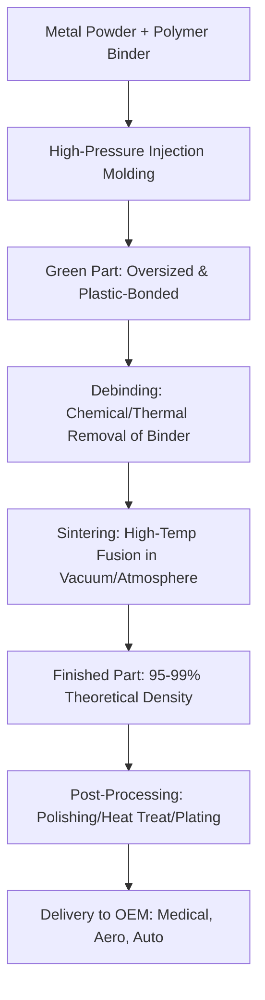

# Indo-MIM: A Blockbuster Debut and the Big Question Over Its Price Tag

You know how the Indian stock market loves a "blockbuster" IPO? We see it all the time—a stock rockets up on day one, fueled by retail euphoria and a dash of FOMO, only to fizzle out as the reality of quarterly earnings sets in. Then there’s **Indo-MIM**. This company doesn't just make "parts"; they engineer the tiny, complex components that actually make the modern world work—everything from the precision tools surgeons use in the operating room to the high-performance gears in an aerospace engine.

Their listing wasn't just a way for early investors to cash out; it was a loud statement of intent. As the share price climbed steadily after the opening bell, investors became obsessed with the company because they operate in a very specialized, high-barrier-to-entry niche called Metal Injection Molding (MIM). For a market saturated with software-as-a-service (SaaS) and consumer tech, a company that creates tangible, high-precision physical goods is a breath of fresh air.

For the average retail investor, this surge creates a classic head-scratcher: Is this a "generational buy" because they hold a global competitive advantage, or is the initial hype just masking a price tag that has drifted far from its intrinsic value? According to [Moneycontrol](https://www.moneycontrol.com), the sentiment is polarized. Some analysts laud their dominance in a specialized field, while others warn that the "blockbuster" start has already priced in the growth for the next three to five years. 

To understand if Indo-MIM is a sustainable powerhouse or a speculative bubble, we need to peel back the layers of their technology, their financial machinery, and the geopolitical winds blowing in their favor.

---

## 🚀 That Blockbuster Listing: Anatomy of a Surge

Indo-MIM’s debut was a total whirlwind. While many IPOs struggle to maintain momentum past the first week, Indo-MIM surged so aggressively that analysts were forced to redo their valuation models in real-time. The stock didn't just open with a premium; it sustained a trajectory that signaled a deep hunger for "New Age Manufacturing" stocks in India.

Two primary drivers fueled this momentum. First, the IPO was **massively over-subscribed**, creating a supply-demand imbalance that naturally pushed prices upward. Second, there are very few "pure-play" MIM companies listed on public exchanges globally, let alone in India. When a company provides critical components for aerospace and medical technology, investors are often willing to overlook a short-term price spike because they are betting on long-term strategic indispensability.

However, there is a fundamental risk when a stock "gaps up" this violently. The price often detaches from the actual **Earnings Per Share (EPS)**, leading to a valuation based on "hope" rather than "hard data." For Indo-MIM, the narrative is heavily tied to the "China Plus One" strategy. Global Original Equipment Manufacturers (OEMs) are desperately seeking to diversify their supply chains away from China to mitigate geopolitical risks. This shift has transformed a standard industrial IPO into a high-growth strategic play.

> "The listing of Indo-MIM represents a fundamental shift in investor appetite—moving from pure software plays to high-tech, precision engineering firms that possess the ability to scale globally while maintaining micron-level quality."

---

## 🛠️ What Exactly Does Indo-MIM Do? (The "Magic" of MIM)

To understand why the market is so bullish, you have to look past the balance sheet and into the factory. **Metal Injection Molding (MIM)** is not basic casting; it is a sophisticated hybrid of plastic injection molding and powder metallurgy. 

Traditional machining (CNC) is subtractive—you start with a block of metal and carve away everything you don't need. This is incredibly wasteful and slow for complex shapes. MIM, however, is formative. It allows for the mass production of complex metal parts with high precision and minimal waste.

### The MIM Process: From Powder to Precision

The lifecycle of an Indo-MIM component follows a rigorous technical path:

1.  **Feedstock Preparation:** The process begins with a "feedstock," which is a precise blend of fine metal powder (such as stainless steel, cobalt-chrome, or titanium) and a thermoplastic binder.
2.  **Injection Molding:** This mixture is heated and injected into a mold under high pressure. The result is a "green part"—a component that has the right shape but is held together by plastic, not metal bonds.
3.  **Debinding:** The green part undergoes a chemical or thermal process to remove the binder. This leaves behind a "brown part," which is porous and fragile.
4.  **Sintering:** This is where the magic happens. The part is placed in a high-temperature furnace. As the temperature reaches a critical point, the metal particles fuse together through atomic diffusion.
5.  **Post-Processing:** Depending on the requirement, the parts may undergo CNC grinding, heat treatment, or plating to reach their final specifications.

The end result is a part that is **95% to 99% as dense** as a forged piece of metal, yet possesses a geometry that would be impossible or prohibitively expensive to create via traditional carving. For industries where a tiny mistake can lead to catastrophic failure—like a gear in a surgical robot or a fuel nozzle in a jet engine—this level of repeatability and precision is priceless.

---

## 📈 Market Positioning: Riding the Triple Wave

Indo-MIM isn't just betting on one industry; they have strategically diversified their portfolio across three massive global trends: the digitalization of healthcare, the evolution of mobility (EVs), and the new era of aerospace and defense.

### 🩺 The Medical Revolution
There is an exploding demand for minimally invasive surgery (MIS). These procedures require surgical instruments that are incredibly small yet strong enough to withstand high stress. MIM is the gold standard for producing these tools. By utilizing biocompatible materials like cobalt-chrome and titanium, Indo-MIM has positioned itself as a critical partner for medical device giants. This sector typically offers the **highest profit margins** because the cost of the part is negligible compared to the value of the life-saving procedure it enables.

### 🚗 The Automotive Pivot (ICE to EV)
While the world is moving toward Electric Vehicles (EVs), the need for precision metal parts hasn't disappeared—it has just changed. We still need high-precision actuators, sensors, and battery management components. Furthermore, the high-end Internal Combustion Engine (ICE) market still requires complex turbocharger components and fuel system parts. Because Indo-MIM can work with a wide array of alloys, they are "technology agnostic," meaning they can pivot their production as the automotive world shifts from pistons to batteries.

### 🚀 Aerospace and Defense: The Ultimate Moat
In the world of aerospace, certification is everything. Getting a part approved for use in a jet engine or a satellite is a brutal, multi-year process involving rigorous testing and auditing. Once Indo-MIM becomes a certified supplier for a company like Boeing, Airbus, or a national defense agency, they have created a "moat." A client will not switch suppliers simply to save a few cents per part because the cost and risk of re-certifying a new supplier are too high. As [IndustryWeek](https://www.industryweek.com) notes, the integration of MIM into aerospace is redefining the efficiency of turbine and engine manufacturing.

---

## 🔍 The Money Talk: Financial Growth vs. Market Price

When professional analysts evaluate Indo-MIM, they look past the "cool tech" and focus on the P&L statement. The company's financial strength lies in its **operational leverage**. 

In the MIM business, the heaviest costs are upfront: designing the mold and installing the sintering furnaces. However, once the infrastructure is in place, the marginal cost of producing the 1,000th part versus the 1,000,000th part is incredibly low. This allows the company to scale revenue exponentially while costs grow linearly.

**Key Financial Indicators to Watch:**
*   **Revenue CAGR:** Indo-MIM has maintained a robust Compound Annual Growth Rate over the last few years, largely driven by the shift of global OEMs toward Indian suppliers.
*   **EBITDA Margins:** Because they offer a high-tech solution rather than a commodity part, they possess significant **pricing power**. They aren't competing on price alone; they are competing on precision and reliability.
*   **CAPEX Cycle:** The funds raised from the IPO are likely earmarked for expansion. Adding more sintering lines and establishing a stronger physical presence in the US and Europe will be critical to reducing shipping lead times and increasing their "stickiness" with Western clients.

### The Valuation Trap
Despite the strong fundamentals, the **Price-to-Earnings (P/E) ratio** is the point of contention. When a stock debuts with such momentum, the P/E often stretches to levels that assume "perfect execution." If the global economy slows down or if there is a sudden spike in the cost of raw materials (like tungsten or specialized nickel alloys), the stock could see a sharp correction as the market brings the valuation back in line with historical industrial averages.

---

## ⚖️ The Investor's Dilemma: Buy, Sell, or Hold?

The investment community is currently split into three distinct camps. Your decision depends entirely on your time horizon and risk tolerance.

### 🐂 The Bulls (The "Buy" Case)
The bulls view Indo-MIM as a "category killer." They argue that the MIM market in India is still in its infancy and that Indo-MIM's early lead in technology and certification gives them a massive head start. For this group, the current price is a fair entry point for a company that will dominate the precision engineering landscape for the next decade. They point to the **high barriers to entry**—sintering is a "black art" that takes years to master—meaning new competitors cannot simply buy their way into the market.

### 🐻 The Bears (The "Sell" Case)
The bears see "listing euphoria." They believe the stock is trading on hope and geopolitical narratives rather than current cash flows. Their primary concern is that the automotive and aerospace industries are **cyclical**. A global recession or a dip in air travel could lead to a sudden drop in orders, leaving Indo-MIM with expensive, underutilized factories. For them, the current price is an opportunity to harvest profits before the hype cycle ends.

### 😐 The Pragmatists (The "Hold" Case)
The pragmatists are taking a "wait-and-see" approach. They recognize the company's quality but believe the stock needs a period of **consolidation**—a phase where the price moves sideways while the company's earnings catch up to the valuation. They are waiting for the first two or three quarterly reports to ensure that the "blockbuster" listing is mirrored by "blockbuster" bottom-line growth.

> "Investing in Indo-MIM at this stage is essentially a bet on the global transition toward high-precision manufacturing. If you believe in the 'Make in India' for the world narrative, you hold; if you are a momentum trader, you take the profit."

---

## 🚩 Risk Analysis: The Red Flags

No investment is without risk, and Indo-MIM faces several headwinds that could disrupt its trajectory.

### 1. Raw Material Volatility
MIM requires ultra-pure metal powders. These materials are often sourced from a handful of countries. Any geopolitical instability in these regions can lead to a spike in input costs. Unlike a massive conglomerate, a specialized firm like Indo-MIM has less room to absorb these costs without impacting its margins.

### 2. The Threat of Additive Manufacturing (3D Printing)
While MIM is superior for mass production (thousands of parts), industrial 3D printing (such as Selective Laser Melting - SLM) is improving rapidly. If 3D printing reaches a tipping point where it can match the speed and cost-efficiency of MIM for complex parts, Indo-MIM's "moat" will shrink. However, currently, MIM remains the only viable way to produce these parts at a truly global scale.

### 3. Client Concentration Risk
In the aerospace and medical sectors, a few massive contracts often account for a huge percentage of total revenue. The loss of a single major OEM contract due to a quality lapse or a strategic shift could cause a significant, albeit temporary, dip in capacity utilization and revenue.

---

## 🛠️ Deep Dive: Comparing MIM to Traditional Methods

To truly appreciate the value proposition of Indo-MIM, we must compare it to the alternatives. For decades, companies had to choose between **CNC Machining** and **Investment Casting**.

| Feature | CNC Machining | Investment Casting | Metal Injection Molding (MIM) |
| :--- | :--- | :--- | :--- |
| **Material Waste** | High (Subtractive) | Moderate | **Very Low (Formative)** |
| **Complexity** | Limited by tool access | High | **Very High** |
| **Production Speed** | Slow (One by one) | Moderate | **Very Fast (Mass Production)** |
| **Precision** | Extremely High | Moderate | **High (Micron level)** |
| **Initial Tooling Cost** | Low | Moderate | **High (Mold costs)** |
| **Cost per Unit (High Vol)** | High | Moderate | **Very Low** |

As shown, MIM is the "sweet spot" for high-volume, high-complexity parts. This is why Indo-MIM is so attractive to companies that need 100,000 identical, complex parts per year rather than 10 custom pieces.

---

## 🌏 The Macro Play: "China Plus One" and India's Rise

The success of Indo-MIM cannot be viewed in a vacuum. It is a direct beneficiary of the global shift in supply chain philosophy. For thirty years, the world relied on China for low-cost manufacturing. However, the pandemic and rising geopolitical tensions have revealed the danger of this over-reliance.

The **"China Plus One"** strategy is a corporate mandate to diversify manufacturing into other hubs—primarily India, Vietnam, and Mexico. India has a distinct advantage in high-end engineering due to its large pool of skilled metallurgists and engineers.

Furthermore, the Indian government's **Production Linked Incentive (PLI)** schemes are encouraging local firms to scale up production for global markets. Indo-MIM is the poster child for this movement. They aren't just competing on labor costs; they are competing on **technological sophistication**. When a German automotive firm or a US medical device company chooses Indo-MIM, they aren't doing it because it's "cheap"—they're doing it because it's "better" and "safer" than the alternatives.

---

## 🏁 The Bottom Line

Indo-MIM is more than just a successful IPO; it is a signal of the maturity of Indian manufacturing. The company has successfully transitioned from a local player to a global contender by mastering the complex science of Metal Injection Molding.

For the investor, the decision boils down to a simple question: **Do you value current valuation or future dominance?**

If you are a short-term trader, the current volatility provides opportunities, but be wary of a correction as the "IPO honeymoon" ends. However, for the long-haul investor, this is a rare opportunity to own a piece of the invisible infrastructure that powers the future of flight, medicine, and mobility. The price of entry is steep, but the position in the global supply chain is enviable.

As long as the world continues to demand components that are smaller, stronger, and more complex, Indo-MIM is positioned not just to survive, but to lead the charge in the next industrial revolution.

---

## 📚 References & Further Reading

*   **Financial Analysis:** [Moneycontrol: Indo-MIM Listing and Analyst Views](https://www.moneycontrol.com) – Comprehensive coverage of the listing day and initial brokerage reports.
*   **Manufacturing Trends:** [IndustryWeek: Trends in Precision Manufacturing](https://www.industryweek.com) – Insights into how MIM and additive manufacturing are disrupting traditional CNC.
*   **Official Data:** [NSE India: Company Filings and IPO Data](https://www.nseindia.com) – Direct access to the Red Herring Prospectus (RHP) and shareholding patterns.
*   **Market Performance:** [BSE India: Market Performance and Shareholding Patterns](https://www.bseindia.com) – Tracking the daily volatility and institutional ownership.
*   **Industry Research:** [Grand View Research: Metal Injection Molding Global Market](https://www.grandviewresearch.com) – Data on the CAGR of the MIM market and regional growth drivers.
*   **Educational Resource:** [Investopedia: Understanding P/E Ratios in Industrial Stocks](https://www.investopedia.com) – A guide to valuing capital-intensive businesses.
*   **Global Trade:** [World Trade Organization: Global Supply Chain Diversification Reports](https://www.wto.org) – Analysis of the "China Plus One" trend and its impact on emerging economies.
*   **Technical Standard:** [ASTM International: Standards for Powder Metallurgy](https://www.astm.org) – The global standards for sintering and powder density.
