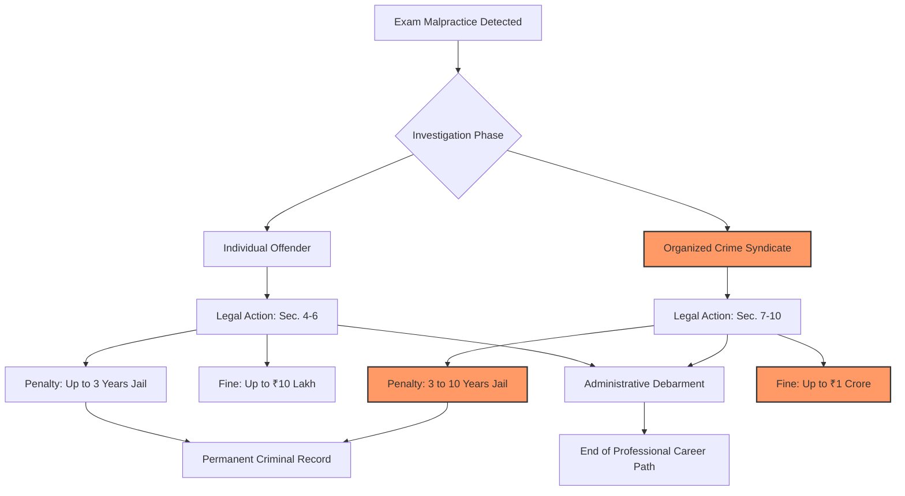

# The War on the Paper Leak Mafia: What the New Public Examinations Act Actually Means for Students

We all know how high the stakes are for competitive exams in India. When millions of people are fighting for a few thousand seats in medical, engineering, or civil services, a single leaked paper isn't just a "mistake"—it’s a total betrayal of the social contract. For years, these "paper leak mafias" have been operating in the shadows, essentially commodifying the dreams of honest students and selling them to the highest bidder. 

To fight this systemic rot, the Indian government passed the **Public Examinations (Prevention of Unfair Means) Act, 2024**. This isn't just a set of updated school rules; it's a heavy-duty penal framework designed to dismantle the infrastructure of cheating. By shifting the legal classification of exam fraud from "academic dishonesty" to "organized crime," the government is attempting to send a shockwave through the underworld of education.

Passed by both the Lok Sabha and Rajya Sabha, this Act fundamentally changes the risk-reward calculus for those orchestrating leaks. We are now looking at prison sentences of up to **10 years** and astronomical fines. However, the central question remains: can a "legislative hammer" actually fix a "leaky pipe"? To understand whether this law is a genuine cure or a cosmetic bandage, we must dive deep into the mechanics of the Act, the scandals that triggered it, and the technological arms race currently unfolding in India's examination halls.

---

## ⚖️ The "Legislative Hammer": How the Act Works

The **Public Examinations (Prevention of Unfair Means) Act, 2024**, is designed as a comprehensive penal framework. Its primary objective is to eliminate "unfair means" in public examinations conducted by central government agencies or state agencies acting on behalf of the center. The Act is intentionally broad in its definitions to ensure that no loophole is left unplugged.

### Defining "Unfair Means"
Under the Act, "unfair means" is no longer limited to a student hiding a cheat sheet in their sock. It now encompasses a wide spectrum of illicit activities:
*   **Leakage of Question Papers:** Any unauthorized disclosure of the exam content before the scheduled time.
*   **Tampering with Answers:** Altering OMR sheets or digital records post-exam.
*   **Impersonation:** The use of "solvers"—professional test-takers who take the exam on behalf of a candidate.
*   **Unauthorized Tech:** The use of gadgets ranging from basic smartphones to sophisticated Bluetooth earpieces.
*   **False Information:** Providing fraudulent data during the application process to gain an unfair advantage.

### The Tiered Penalty System
The government has implemented a tiered punishment structure to differentiate between a desperate student and a professional criminal.

1.  **For Individual Offenders:** Students or candidates caught using unfair means face up to **3 years in prison** and a fine of up to **₹10 lakh**.
2.  **For the "Mafia" (Organized Crime):** If the cheating is proven to be part of an "organized crime" syndicate—meaning a coordinated group working for profit—the penalties skyrocket. These perpetrators face **3 to 10 years in prison** and fines that can reach **₹1 crore**.

> "The shift toward treating paper leaks as organized crime is a recognition that these are not isolated incidents of cheating, but a sophisticated industry that undermines the meritocratic foundation of the Indian state." — *Legal Analysis on Administrative Law*

Furthermore, the Act introduces the concept of **administrative debarment**. A candidate found guilty can be banned from taking any public examination for a period specified by the conducting agency. For an aspirant who has spent **4 to 6 years** of their youth in a 10x10 room in Kota or Rajinder Nagar, a multi-year ban is effectively a professional death sentence. According to [PRS Legislative Research](https://www.prsindia.org/billtrack/public-examinations-prevention-of-unfair-means-bill-2024), this combination of incarceration and academic exile is intended to create an impenetrable shield around the examination process.

---

## 🕵️ Anatomy of the "Paper Leak Mafia"

To appreciate why such a draconian law was necessary, one must understand the "Paper Leak Mafia." This is not a loose collection of opportunistic students; it is a shadow economy. These networks are highly sophisticated, involving a complex supply chain that often penetrates the very heart of the testing agencies.

### The Supply Chain of Fraud
The "mafia" typically operates through a three-tier hierarchy:

*   **The Source (The Insiders):** These are the high-level officials within the National Testing Agency (NTA), printing press employees, or transportation contractors. They have access to the "master copy" of the exam.
*   **The Distributor (The Middlemen):** These actors manage the "client list." They use encrypted platforms like **Telegram, Signal, and WhatsApp** to create private groups where the papers are auctioned. They often operate from "safe houses" in different states to evade local police.
*   **The Facilitator (The Tech Support):** These individuals provide the hardware—miniature cameras, high-frequency earpieces, and remote-access software—that allow a "solver" to communicate with a student in real-time.

As a [Live Law analysis](https://www.livelaw.in/top-stories/public-examinations-prevention-of-unfair-means-act-2024-analysis-258000) points out, by labeling these activities as "organized crime," the government can now employ investigative tools usually reserved for terrorism or narcotics trafficking, such as systemic financial auditing and more aggressive surveillance. The goal is to make the "business" of leaking papers financially ruinous and legally unsustainable.

---

## 📉 The Breaking Point: NEET and UGC NET 2024

The 2024 legislative push was not proactive; it was a reactive emergency measure following a total collapse of trust in India's premier testing bodies. The catalyst was a series of scandals that dominated national headlines and sparked widespread student protests.

### The NEET-UG 2024 Crisis
The **NEET-UG 2024** controversy was a watershed moment. Allegations surfaced regarding leaked papers and the suspicious awarding of "grace marks." The data showed an impossible distribution of perfect scores in certain regions, suggesting that a segment of students had the paper in advance. A report by [The Hindu](https://www.thehindu.com/sci-tech/health/neet-ug-2024-sc-rules-out-cancellation-and-retest-of-exam/article68436902.ece) highlighted that the integrity of the National Testing Agency (NTA) had been compromised, leading to a crisis of confidence among millions of medical aspirants.

### The UGC NET Fallout
Shortly after, the **UGC NET 2024** exam was cancelled by the Ministry of Education due to "integrity concerns." When an exam for PhD and lecturer aspirants—people who are already highly educated—is compromised, it proves that the leak mafia does not discriminate based on the level of prestige. No exam is "too high" for the mafia to target if there is enough money on the table.

These events exposed a systemic vulnerability: the NTA could manage the *scale* of the exams (millions of candidates), but it failed in the *security* of the "last mile." Whether it was the transport of physical papers or the security of digital servers, the walls were porous. The **Public Examinations Act** was the government's attempt to plug these holes with the threat of jail time.

---

## ⚖️ The Philosophical Divide: Punishment vs. Prevention

While the public largely supports the severity of the new law, legal scholars and educationists are debating a fundamental question: **Does the threat of jail time stop a leak if the system itself is structurally flawed?**

### The Deterrence Model (The Government's View)
The government is betting on the **Deterrence Model**. The logic is simple: if the penalty for leaking a paper is **10 years in prison** and a **₹1 crore fine**, the "cost" of the crime will eventually outweigh the "profit." This approach treats the leaker as a rational actor who can be scared into honesty.

### The Structural Model (The Critics' View)
Critics argue that the government is treating the "symptoms" (the criminals) rather than the "disease" (the institutional failure). If a paper leaks from inside a government-run agency, that is a failure of governance, not just a failure of individual morality. 

Key concerns include:
1.  **Lack of Transparency:** The Act punishes the leaker but doesn't mandate a total overhaul of how papers are encrypted or stored.
2.  **Potential for Misuse:** The definition of "unfair means" is dangerously broad. There are fears it could be used to penalize students for minor technical glitches during a Computer-Based Test (CBT) or for innocent mistakes.
3.  **Due Process:** Without a transparent, fast-track appeals process, the law could become a tool for administrative harassment.

The [Live Law critique](https://www.livelaw.in/top-stories/public-examinations-prevention-of-unfair-means-act-2024-analysis-258000) suggests that until we have a "Zero Trust" architecture in exam administration, the law is merely a deterrent that the most daring criminals will simply gamble against.

---

## 💻 The Digital Arms Race and the AI Frontier

The 2024 Act mentions "unauthorized electronic devices," but it is fighting a 21st-century war with 20th-century definitions. Cheating has evolved far beyond the hidden smartphone; we are now entering the era of **AI-driven academic fraud**.

### The New Toolkit of the Mafia
Modern cheating syndicates are employing technologies that are nearly invisible to a human proctor:
*   **Bluetooth Micro-Earpieces:** Devices so small they fit deep inside the ear canal, allowing a remote "solver" to feed answers in real-time.
*   **Remote Access Trojans (RATs):** Software installed on exam computers that allows a hacker to see the screen and control the mouse from a different city.
*   **Generative AI Prediction:** Using LLMs to analyze years of previous papers to predict the exact "probability distribution" of questions, essentially "engineering" the leak without actually stealing a paper.
*   **Deepfake Audio:** AI-generated voices that impersonate center superintendents to give fraudulent instructions to students.

### The Path to Technical Sovereignty
To truly win, the government must move beyond penal codes and toward **Forensic Data Analytics**. According to research on [AI-Driven Detection](https://arxiv.org/abs/2105.10707), the only way to catch sophisticated leaks is through "anomaly detection."

For example, if **15% of students** at a single center in a small town all answer the same five complex questions correctly but fail the basic ones, that is a statistical impossibility. This "clustering" is a digital fingerprint of a leak. Implementing a system of **Blockchain-based paper distribution**—where every copy of the exam is uniquely encrypted and tracked—could remove the "human element" that the mafia currently exploits.

---

## 💔 The Human Cost: The 'Aspirant's Burden'

Behind the legal jargon and the **₹1 crore fines** are millions of students living in a state of permanent psychological siege. In hubs like Kota, the "coaching culture" has turned education into a high-pressure industry. Students often study **12 to 16 hours a day**, sacrificing sleep, social interaction, and mental health for a single shot at a government job or a medical seat.

### The Psychology of Desperation
When an exam is leaked, the impact is not just administrative—it is traumatic. For a student who has invested years of their life, a leak is a signal that the world is unfair and that merit is a lie. This leads to a devastating cycle:
*   **Erosion of Trust:** Students stop believing in hard work and start looking for "shortcuts" or "contacts."
*   **Mental Health Crisis:** The uncertainty of whether an exam will be cancelled leads to severe anxiety and depression.
*   **Socioeconomic Divide:** Only the wealthy can afford the "black market" prices of leaked papers, further cementing a class-based divide in professional opportunities.

Sociology research [on ArXiv](https://arxiv.org/abs/2510.15307) notes that the cheating economy specifically preys on this desperation. The mafia doesn't just sell papers; they sell "hope" to the desperate. The real tragedy is that the **₹1 crore fine** is a message to the kingpins, but for the student, the real cost is the loss of a year of their youth—a cost that no court can ever reimburse.

---

## 🛠️ The Enforcement Lifecycle: From Detection to Penalty

To visualize how the **Public Examinations Act, 2024** actually functions in practice, we can map the process from the moment a malpractice is detected to the final legal outcome.

---

## 🏁 Final Thoughts: A New Era of Accountability?

The **Public Examinations (Prevention of Unfair Means) Act, 2024**, is undoubtedly a bold and necessary step. By introducing **10-year prison sentences** and massive financial penalties, the Indian government is finally treating paper leaks as the existential threat to meritocracy that they are. It is a clear signal that the era of "slaps on the wrist" for corrupt officials is over.

However, we must be realistic: a law is only as good as its enforcement. If the investigators are as corrupt as the leakers, the Act will be a dead letter. To truly eradicate the "Paper Leak Mafia," India needs a three-pronged approach:
1.  **The Legal Hammer:** Maintain the strict penalties of the 2024 Act to deter the organized syndicates.
2.  **The Technical Shield:** Transition to blockchain-encrypted papers and AI-driven forensic auditing to make leaks mathematically impossible.
3.  **The Social Shift:** Reduce the extreme pressure of the "one-exam-decides-all" culture, which fuels the desperation the mafia feeds upon.

For the millions of students currently studying under flickering desk lamps in tiny rooms across India, the hope is that this law marks the end of the "leak era." The ultimate success of this legislation will not be measured by the number of criminals in jail, but by the day a student walks into an exam hall knowing that their hard work is the only currency that matters.

---

## 📚 References & Further Reading

*   **Official Legislation:** [PRS Legislative Research: Public Examinations (Prevention of Unfair Means) Bill, 2024](https://www.prsindia.org/billtrack/public-examinations-prevention-of-unfair-means-bill-2024)
*   **Legal Analysis:** [Live Law: Detailed Analysis of the Public Examinations Act 2024](https://www.livelaw.in/top-stories/public-examinations-prevention-of-unfair-means-act-2024-analysis-258000)
*   **Case Study (NEET):** [The Hindu: Supreme Court declines to cancel NEET-UG 2024](https://www.thehindu.com/sci-tech/health/neet-ug-2024-sc-rules-out-cancellation-and-retest-of-exam/article68436902.ece)
*   **Case Study (UGC NET):** [NDTV: UGC-NET cancelled a day after exam; Centre says "exam integrity compromised"](https://www.ndtv.com/india-news/amid-neet-fiasco-ugc-net-cancelled-after-exam-integrity-compromised-5925997)
*   **Technical Research:** [ArXiv: Adversarial Attacks and Mitigation for Anomaly Detectors of Cyber-Physical Systems](https://arxiv.org/abs/2105.10707)
*   **Sociological Study:** [ArXiv: Strategic Interactions in Academic Dishonesty: A Game-Theoretic Analysis of the Exam Script Swapping](https://arxiv.org/abs/2510.15307)
*   **Government Portal:** [Press Information Bureau (PIB): Notification on the Public Examinations Act](https://pib.gov.in)
*   **General Overview:** [Wikipedia: Public Examinations (Prevention of Unfair Means) Act, 2024](https://en.wikipedia.org/wiki/Public_Examinations_(Prevention_of_Unfair_Means)_Act,_2024)
