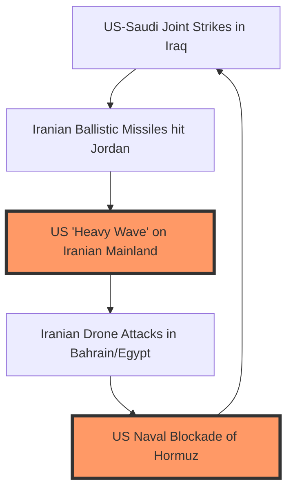

The geopolitical landscape of the Middle East has undergone a fundamental and violent shift. What [Al Jazeera](https://www.aljazeera.com/news/2026/7/30/us-launches-another-round-of-attacks-on-iran) describes as a "heavy wave" of US strikes on Iranian military targets has effectively dismantled the established rules of engagement. For over a decade, the United States and the Islamic Republic of Iran operated within the confines of a "shadow war"—a sophisticated game of attrition characterized by cyberattacks, maritime skirmishes, and the utilization of proxy militias to maintain plausible deniability.

However, the events of July 2026 have shattered that facade. We have moved beyond the era of strategic ambiguity and diplomatic signaling. The conflict has transitioned into an open, high-intensity confrontation. These are not merely reactive strikes to isolated provocations; they represent a systemic pivot in US foreign policy. By targeting the operational heart of the Islamic Revolutionary Guard Corps (IRGC), the US administration is attempting to neutralize the "Axis of Resistance" in a single, coordinated campaign. With precision-guided munitions striking deep within Iranian soil and a reinforced coalition involving regional heavyweights like Saudi Arabia, the world is now facing a critical juncture: Is this a calibrated strategy to force Iranian capitulation, or the opening salvo of a regional war that could collapse the global energy market?

## 💥 Breaking Down the ‘Heavy Wave’

  
  
 <a href="https://unsplash.com/@longlivehaas">Jacinto</a> on <a href="https://unsplash.com/photos/man-in-blue-and-black-adidas-jacket-wearing-white-cap-ydWtwxxjvys">Unsplash</a>

When [Al Jazeera](https://www.aljazeera.com/news/2026/7/30/us-launches-another-round-of-attacks-on-iran) and US Central Command (CENTCOM) utilize the term "heavy wave," they are referring to both the scale of firepower and the audacity of the targets. Historically, US kinetic actions were confined to proxy hubs in Syria, Iraq, or Yemen. The July 2026 offensive changed the geography of the war by striking the Iranian mainland directly. CENTCOM reports that "dozens" of high-value targets were neutralized, specifically those associated with IRGC command-and-control centers, ballistic missile launch sites, and unmanned aerial vehicle (UAV) production facilities.

One of the most devastating strikes occurred on **Qeshm Island** in the Persian Gulf, a strategic outpost for Iran's naval operations. However, the precision of modern warfare does not eliminate the tragedy of collateral damage. Iranian state media reported that at least **three civilians, including a two-year-old child**, were killed when a strike impacted a residential structure [Al Jazeera](https://www.aljazeera.com/news/liveblog/2026/7/30/iran-war-live-trump-threatens-to-hit-back-hard-over-strikes-on-jordan). This incident underscores the volatility of urban military operations and provides Tehran with potent propaganda to galvanize domestic support.

Simultaneously, massive explosions rocked **Abadan**, a critical nexus for Iran's petrochemical and oil refining infrastructure. This move signals a dangerous escalation: the US is now targeting economic assets that double as military logistics hubs. The operational execution of the "Heavy Wave" was a masterclass in joint-force synchronization. The US deployed a combination of B-2 stealth bombers and autonomous drone swarms to penetrate Iranian air defenses—systems that Tehran had long advertised as impenetrable. By blinding Iran’s surveillance capabilities in the Strait of Hormuz and destroying land-based missile silos, the US sought to paralyze the IRGC's ability to coordinate with its regional proxies.

## 🚀 The Trigger: From Jordan to the Strait of Hormuz

The "heavy wave" did not emerge from a vacuum; it was the culmination of a rapid escalation cycle triggered by what Washington termed a "surprise attack." The catalyst was Iran's decision to launch a series of ballistic missiles targeting US military installations in **Jordan**. While the Jordanian military, supported by US interceptors, managed to neutralize several threats [BBC News](https://www.youtube.com/watch?v=b5-5gn1Dc2o), the act of a sovereign state launching missiles at a US-allied base was a clear violation of established "red lines."

Parallel to the attacks in Jordan, tensions reached a breaking point in the **Strait of Hormuz**. Intelligence reports indicated that Iranian fast-attack craft and mine-laying vessels were positioning themselves to disrupt US naval transit. For the US, the combination of ballistic missile strikes in the Levant and naval aggression in the Gulf created a "compounding threat" that demanded an overwhelming response.

> "The era of strategic patience has concluded. We will deliver a beating to those who think they can target American personnel with impunity. This is not about escalation; it is about establishing a new baseline of deterrence." — *Attributed to President Trump via [Al Jazeera](https://www.aljazeera.com/news/2026/7/29/trump-says-us-to-deliver-beating-to-iran-after-bases-again-targeted)*

This cycle demonstrates the failure of containment. For years, the US relied on "maximum pressure" via sanctions and targeted assassinations of high-ranking generals. However, as Iran developed missiles capable of reaching deep into allied territories, the threat transitioned from a regional nuisance to an existential risk for US interests in the Middle East. The current offensive is a signal that the US is prepared to risk full-scale war to maintain regional hegemony.

## 🇸🇦 The New Axis: US-Saudi Joint Offensives

Perhaps the most significant geopolitical development is the overt military alignment between the US and **Saudi Arabia**. In a historic shift, the two nations conducted joint air strikes against "Iran-aligned" militias within Iraqi territory [Al Jazeera](https://www.aljazeera.com/video/newsfeed/2026/7/29/us-and-saudi-arabia-strike-iran-aligned-groups-in-iraq). For years, Riyadh maintained a cautious distance from US-led kinetic operations to avoid direct retaliation from Tehran. That caution has vanished.

This alignment creates a strategic "pincer movement." By striking proxies in Iraq and the Levant while simultaneously bombing the Iranian mainland, the US and Saudi Arabia are forcing Iran to defend a massive, fragmented perimeter. These joint operations specifically targeted the "land bridge"—the logistical corridor stretching from Tehran through Baghdad and Damascus to Beirut—which is essential for the flow of weaponry to Hezbollah.

However, this partnership carries immense risk for the House of Saud. By abandoning their role as a neutral mediator, Saudi Arabia has exposed itself to Iran's specialty: asymmetric retaliation. The IRGC has already responded with drone strikes targeting infrastructure in **Bahrain and Jordan** [Al Jazeera](https://www.aljazeera.com/news/2026/7/29/iran-pushes-back-against-us-as-regional-attacks-heat-up). The conflict is no longer a bilateral dispute between a superpower and a regional actor; it has evolved into a multi-polar regional war.

## ⛽ The Economic Fallout and the ‘Energy Shock’

The decision to strike Abadan and Qeshm extends far beyond tactical military gains; it is a calculated strike at Iran's economic jugular. Iran's control over the Strait of Hormuz—through which approximately **20% to 30% of the world's total liquefied natural gas (LNG) and oil** passes—makes any conflict in the region a global economic event. [Al Jazeera](https://www.aljazeera.com/video/counting-the-cost/2026/7/29/is-the-world-at-risk-of-another-energy-shock) has warned that the world is on the precipice of a severe "energy shock."

If Iran responds by closing the Strait of Hormuz, the resulting spike in Brent Crude prices would trigger global inflation, potentially pushing oil prices above **$150 per barrel**. While the US has increased its domestic shale production, the global economy—particularly Europe and East Asia—remains hyper-dependent on Gulf exports. 

The humanitarian cost is already manifesting in the periphery. In Yemen, where the economy is already decimated, fuel prices have surged, leading to widespread unemployment among construction workers and low-wage laborers [Al Jazeera](https://www.aljazeera.com/news/2026/7/29/yemen-construction-fuel-iran). This illustrates a grim reality: the "heavy wave" of strikes creates a ripple effect of instability that fuels further radicalization and humanitarian crises, potentially creating more recruits for the very proxies the US is trying to destroy.

## 🛡️ Iran’s Doctrine of Asymmetric Retaliation

Understanding Iran's response requires an analysis of **asymmetric warfare**. As detailed by [Wikipedia](https://en.wikipedia.org/wiki/Asymmetric_warfare), asymmetric warfare occurs when two belligerents have vastly different military capabilities, forcing the weaker party to use unconventional tactics to negate the stronger party's advantages.

Iran knows it cannot win a conventional air or sea battle against the US Navy's carrier strike groups. Instead, they employ a "strategy of a thousand cuts":
1.  **Cheap Attrition:** Using drones (such as the Shahed series) that cost a few thousand dollars to force the US to expend interceptor missiles costing **$2 million each**.
2.  **Proxy Saturation:** Utilizing the "Axis of Resistance" (Hezbollah, Houthis, PMF) to stretch US resources across multiple borders.
3.  **Cyber Sabotage:** Targeting civilian infrastructure and military logistics via sophisticated malware.

Recent reports of drone-initiated fires on shipping vessels off the **coast of Egypt**, including US-owned assets [BBC News](https://www.youtube.com/watch?v=b5-5gn1Dc2o), demonstrate this strategy. By extending the battlefield to Egypt—traditionally a stable US partner—Iran is signaling that no ally is safe. The goal is to create a state of "permanent instability" that eventually makes the cost of the US presence in the Middle East politically untenable for the American public.

## 🌍 The Stability-Instability Paradox and Regional Contagion

The current escalation is a textbook illustration of the **Stability-Instability Paradox**. This theoretical framework suggests that when two states achieve a level of strategic stability (such as nuclear deterrence or an overwhelming power imbalance), they may actually feel *more* emboldened to engage in low-level, tactical conflicts. They believe that the risk of a total, catastrophic war is so low that they can afford to fight smaller proxy wars without fear of total escalation.

For decades, the US and Iran operated within this paradox. The US tolerated IRGC activities in Iraq and Syria because it didn't want a full-scale war on the Iranian mainland. Iran tolerated US sanctions and targeted strikes because it didn't want a direct invasion.

The "heavy wave" indicates that this paradox has collapsed. By striking oil hubs and command centers, the US has moved from "tactical instability" to "strategic instability." When the survival of the regime is perceived to be at risk, the logic of the paradox flips: the only way to ensure survival is through a preemptive, massive strike.

The risk of "regional contagion" is now an acute threat. The conflict has expanded from a bilateral dispute into a regional wildfire. The following diagram illustrates the current escalation loop:

We are now in a state of extreme volatility where a "black swan" event—such as a missile miscalculation hitting a head of state or a catastrophic oil spill in the Gulf—could trigger a total war that neither side strategically desires but both feel militarily compelled to fight.

## 🏁 Conclusion

The "heavy wave" of US strikes represents a definitive break from the cautious, incremental diplomacy of the previous decade. By targeting the IRGC's heartland and formalizing a military alliance with Saudi Arabia, Washington is attempting to break Iran's regional ambitions through overwhelming force. However, the events in Qeshm and Abadan demonstrate that military superiority does not automatically translate into strategic victory.

The US is fighting an enemy that thrives on chaos and asymmetry. While the US can destroy aircraft factories and missile silos, it cannot easily dismantle a decentralized network of proxies that operate within the sovereign borders of other nations. With the global energy market on edge and the conflict spreading from the Mediterranean to the Persian Gulf, this is the most precarious moment for Middle Eastern stability since the 1979 Revolution.

Ultimately, the "heavy wave" reveals a shared desperation. Washington is desperate to end the missile threat to its personnel, and Tehran is desperate to maintain its grip on the region. Unless a diplomatic off-ramp is established—one that addresses the core security concerns of both parties—the Middle East is drifting toward a systemic collapse. In this new era of open conflict, the only certainty is that the price of escalation will be paid in blood and oil.

***

## 📚 References

*   **Al Jazeera:** [US launches ‘heavy wave’ of new strikes on Iran](https://www.aljazeera.com/news/2026/7/30/us-launches-another-round-of-attacks-on-iran)
*   **Al Jazeera:** [Iranian couple, child killed in US strike on Qeshm](https://www.aljazeera.com/news/liveblog/2026/7/30/iran-war-live-trump-threatens-to-hit-back-hard-over-strikes-on-jordan)
*   **Al Jazeera:** [Trump says US to deliver ‘beating’ to Iran](https://www.aljazeera.com/news/2026/7/29/trump-says-us-to-deliver-beating-to-iran-after-bases-again-targeted)
*   **Al Jazeera:** [US and Saudi Arabia strike ‘Iran-aligned’ groups in Iraq](https://www.aljazeera.com/video/newsfeed/2026/7/29/us-and-saudi-arabia-strike-iran-aligned-groups-in-iraq)
*   **Al Jazeera:** [Is the world at risk of another energy shock?](https://www.aljazeera.com/video/counting-the-cost/2026/7/29/is-the-world-at-risk-of-another-energy-shock)
*   **Al Jazeera:** [Fuel prices soar in Yemen](https://www.aljazeera.com/news/2026/7/29/yemen-construction-fuel-iran)
*   **Al Jazeera:** [Iran pushes back against US as regional attacks heat up](https://www.aljazeera.com/news/2026/7/29/iran-pushes-back-against-us-as-regional-attacks-heat-up)
*   **BBC News:** [US launches 'heavy' strikes on Iran after attempted attack](https://www.youtube.com/watch?v=b5-5gn1Dc2o)
*   **Wikipedia:** [Asymmetric Warfare Conceptual Framework](https://en.wikipedia.org/wiki/Asymmetric_warfare)
