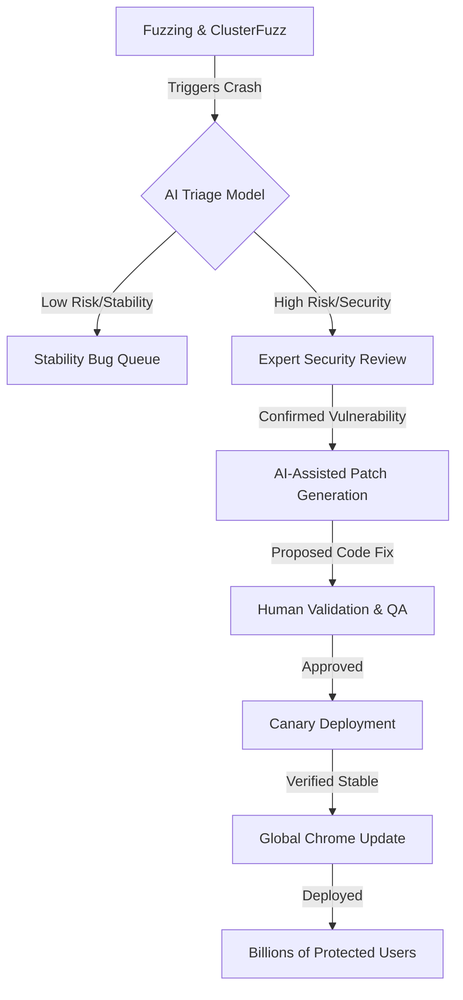

# How Google is Using AI to Stop Chrome from Crashing (and Getting Hacked)

### 🛡️ The New Way We Protect Our Browsers

For years, keeping a web browser safe has felt like a never-ending game of Whac-A-Mole. The fundamental nature of the modern web—where we execute untrusted code from random servers every time we click a link—makes the browser the most exposed piece of software on any device. Here is the traditional cycle: a security researcher or a malicious actor finds a **"zero-day"**—a vulnerability that is unknown to the developers. Once discovered, this hole can be used to bypass security boundaries, steal session cookies, extract passwords, or execute arbitrary code on the host machine. 

Because Google Chrome is the most widely used browser globally, commanding **over 60% of the global browser market share**, it is the primary target for state-sponsored actors and cybercriminal syndicates. The stakes are astronomically high; a single critical flaw in Chrome can potentially compromise hundreds of millions of devices simultaneously.

In the past, the defense was primarily a manual, labor-intensive process. Highly skilled security engineers spent thousands of hours auditing millions of lines of code. They relied heavily on "fuzzing"—the process of feeding a program random, malformed data to see if it crashes. If the browser crashed, the engineer would then spend hours or days analyzing the "crash dump" to determine if that crash was a harmless glitch or a weaponizable security hole.

However, modern software has reached a scale where human intuition alone is no longer sufficient. The [V8 engine](https://en.wikipedia.org/wiki/V8_JavaScript_engine), the high-performance JavaScript and WebAssembly engine that powers Chrome, consists of millions of lines of complex C++ code. Finding every single logic error or memory leak in such a behemoth is a mathematical impossibility for a human team. This is why Google is fundamentally changing the paradigm. Instead of simply increasing headcount, they are integrating Large Language Models (LLMs) directly into the security development lifecycle. By moving from reactive patching to AI-driven prediction and triage, Google is attempting to build a "digital immune system" for the world's most popular browser.

---

### 📉 The Nightmare of "Zero-Days" and the Exploit Economy

To understand why AI is the only viable path forward, we must first examine the nature of the **Zero-Day**. The term refers to the fact that the developers have "zero days" to fix the flaw before it is potentially exploited in the wild. In the world of cybersecurity, zero-days are a high-value commodity. Companies like Zerodium and other exploit brokers offer **millions of dollars** for functional, remote-code-execution (RCE) exploits in Chrome. This financial incentive drives a global army of hackers to hunt for the smallest possible crack in Chrome's armor.

Most of these critical vulnerabilities stem from **memory safety issues**. In languages like C++, developers are responsible for manually managing how the computer's RAM is used. If a developer forgets to "free" a piece of memory or tries to access a piece of memory that has already been deleted, it creates a vulnerability. The most common examples include:

1.  **Use-After-Free (UAF):** This occurs when a program continues to use a pointer after the memory it points to has been freed. A hacker can "spray" the memory with their own malicious data, so that when the program tries to use that "freed" pointer, it instead executes the hacker's code.
2.  **Buffer Overflows:** This happens when a program writes more data to a block of memory (a buffer) than it can hold, causing the extra data to spill over into adjacent memory spaces. This can be used to overwrite the program's return address, redirecting the CPU to run a malicious payload.

To mitigate these risks, Google employs [sandboxing](https://en.wikipedia.org/wiki/Sandbox_(security)), a security architecture that isolates the browser's rendering process from the rest of the operating system. Even if a hacker exploits a bug in a tab, the sandbox is designed to prevent them from reaching the user's files or webcam. However, hackers specialize in "sandbox escapes"—chaining multiple bugs together to break out of the isolation. According to reports from [Android Authority](https://www.androidauthority.com), the sheer volume of code makes it impossible for human auditors to catch every single escape route.

> "The challenge in modern browser security isn't just finding the crash; it's the cognitive load of understanding if that crash can be weaponized into a full-scale exploit."

This is the primary bottleneck. Every day, Google's automated tools generate thousands of crashes. **Statistically, the vast majority of these crashes are benign stability bugs**, but the "needle in the haystack" is the one critical security flaw. If an engineer misses it due to "alert fatigue," the entire user base remains vulnerable.

---

### 🤖 Enter the AI Sentry: Revolutionizing Triage

Google's solution is to deploy AI as a high-speed triage layer. The process begins with [ClusterFuzz](https://google.github.io/clusterfuzz/), an open-source fuzzing infrastructure that relentlessly hammers the browser with random inputs to force crashes. While ClusterFuzz is an expert at *inducing* failure, it lacks the semantic understanding to explain *why* the failure happened.

This is where LLMs enter the pipeline. Instead of handing a raw crash dump to a human, Google feeds the data into a specialized AI model. The AI analyzes the **call stack** (the list of functions the program was running at the moment of the crash) and the **memory registers** (the state of the CPU). 

Because these LLMs have been trained on decades of public vulnerability data, CVEs (Common Vulnerabilities and Exposures), and historical patches, they can recognize the "shape" of a security flaw. The AI doesn't just see a crash; it sees a pattern that looks like a "Use-After-Free" in the DOM rendering logic. 

The results are transformative:
- **Scale:** AI can process **thousands of crashes per hour**, a volume that would require an army of thousands of engineers to handle manually.
- **Precision:** By filtering out the noise, the AI allows human engineers to focus exclusively on the **top 1% of high-risk crashes**.
- **Zero-Shot Detection:** Recent [academic research on LLMs](https://arxiv.org/abs/2305.14473) suggests that advanced models can identify "zero-shot" vulnerabilities—flaws they weren't explicitly trained on—by reasoning about the logic of the code.

We are witnessing a fundamental shift: we are moving from a world where humans use tools to find bugs, to a world where AI leads the hunt and humans act as the final validators.

---

### ⚙️ Deep Dive: V8, JIT, and the Technical Battlefield

To truly appreciate the AI's job, we have to look at the "engine room" of Chrome: the [V8 JavaScript engine](https://en.wikipedia.org/wiki/V8_JavaScript_engine). V8 is responsible for taking the JavaScript code written by web developers and turning it into something the computer's processor can understand. To make this fast, V8 uses **Just-In-Time (JIT) compilation**.

JIT compilation is a complex process of "speculative optimization." When V8 sees a function being called repeatedly with the same type of data (e.g., always two integers), it makes a "speculation" that the function will *always* receive integers. It then compiles a highly optimized version of that function in machine code, skipping the expensive type-checks.

This is where the danger lies. If a hacker can suddenly pass a different type of data (like an object or a pointer) into that optimized function, they can trigger a **"Type Confusion"** bug. The engine thinks it's dealing with a simple number, but it's actually manipulating a memory address. This allows an attacker to read and write to arbitrary locations in the system's memory—the "Holy Grail" for any hacker.

The AI is being trained to analyze the **Intermediate Representation (IR)** of the code. The IR is the halfway point between the original JavaScript and the final machine code. By auditing the IR, the AI can spot logic flaws in the optimization pipeline that are nearly invisible to humans.

Simultaneously, Google is executing a long-term migration toward **memory-safe languages**. While the AI cleans up the legacy C++ codebase, Google is increasingly using [Rust](https://en.wikipedia.org/wiki/Rust_(programming_language)) for new components. Rust prevents memory crashes by design through its "ownership and borrowing" system, which ensures that memory is handled safely at compile-time. This creates a dual-layered defense: **AI manages the legacy risk, while Rust eliminates future risk.** This strategy aligns with recent [CISA recommendations](https://www.cisa.gov) for government and industry to transition away from memory-unsafe languages to stop the root cause of most cyberattacks.

---

### 🗺️ The AI Security Pipeline: From Crash to Patch

The integration of AI isn't just a single tool; it's a fully integrated assembly line. This pipeline ensures that the time between the discovery of a bug and the deployment of a patch (the "window of vulnerability") is shrunk to the absolute minimum.

#### Breakdown of the Pipeline:
1.  **Automated Discovery:** ClusterFuzz generates millions of test cases, causing the browser to crash.
2.  **AI Triage:** The LLM analyzes the crash dump. It discards "null pointer dereferences" that only cause a tab to crash and flags "heap overflows" that could lead to RCE.
3.  **Human Verification:** A security engineer reviews the AI's reasoning. Because the AI provides a summary of *why* it thinks the bug is dangerous, the engineer can verify it in minutes rather than hours.
4.  **AI-Assisted Patching:** Google is exploring **Automated Program Repair (APR)**. Based on [research into neural code repair](https://arxiv.org/abs/2107.02630), the AI suggests the exact lines of code needed to fix the flaw without breaking other features.
5.  **Rapid Deployment:** Once validated, the fix is pushed through Chrome's rapid release cycle, often reaching users in days.

---

### ⚔️ The Great AI Arms Race: Defense vs. Offense

While Google's use of AI is a massive win for the user, it exists within a broader, more dangerous context: the **AI Arms Race**. Cybersecurity is a zero-sum game; every tool available to the defender is eventually discovered and adopted by the attacker.

On forums like [Hacker News](https://news.ycombinator.com), experts warn that we are entering an era of **AI vs. AI warfare**. If an LLM can be trained to find a memory leak to fix it, a malicious actor can use a similar model to find that leak to exploit it. We are seeing the rise of **Automated Exploit Generation (AEG)**, where AI models are used to:
- **Discover Vulnerabilities:** AI can scan open-source projects (like Chromium) faster than any human.
- **Write Shellcode:** AI can help attackers write the precise machine-code payloads needed to bypass modern security mitigations like ASLR (Address Space Layout Randomization).
- **Build Exploit Chains:** AI can analyze multiple "low-severity" bugs and figure out how to link them together to create one "critical-severity" exploit.

There are also inherent risks in relying on AI for defense. One major concern is **"False Negatives"**—the possibility that an AI ignores a critical bug because it doesn't fit a known pattern. Another is **"Alert Fatigue"**; if the AI flags too many false positives, humans may start trusting the system less, potentially overlooking a real threat.

> "We are moving toward a world where the speed of discovery and the speed of patching are both governed by GPU clusters and token limits, not human brainpower."

To counter this, Google utilizes **adversarial testing**. They employ a "Red Team" of AI models whose only job is to find ways to bypass the patches created by the "Blue Team" AI. This iterative loop ensures that the final fix is robust against a wide variety of attack vectors.

---

### 🌐 The Chromium Ecosystem and Open Source Security

It is important to distinguish between **Google Chrome** and **Chromium**. Chromium is the open-source project that serves as the foundation for Chrome, Microsoft Edge, Brave, and Opera. Because Chromium is open source, anyone in the world can inspect its code.

This creates a fascinating security paradox. On one hand, having thousands of independent eyes on the code helps find bugs faster (Linus's Law: "Given enough eyeballs, all bugs are shallow"). On the other hand, it means that hackers have a perfect blueprint of the software they are trying to attack. They can run the same fuzzing tools and AI models on the Chromium source code that Google does.

By integrating AI into the Chromium project, Google isn't just protecting Chrome; it's raising the security floor for the entire web ecosystem. When a vulnerability is found and patched in Chromium, every browser based on it gets the fix. This collective defense is the only way to stay ahead of adversaries who are increasingly utilizing AI to automate their attacks.

---

### 🔮 The Future: The Era of Self-Healing Software

The ultimate vision for AI in browser security isn't just faster patching—it's the creation of **self-healing software**. 

Imagine a version of Chrome that doesn't wait for a version update from Google's servers. Instead, it uses an on-device, lightweight AI model to monitor its own execution in real-time. If the browser detects a memory access pattern that looks like an exploit attempt, the AI could:
1.  **Isolate the Process:** Immediately kill the affected tab and freeze its memory state.
2.  **Dynamic Hot-Patching:** Use a "micro-patch" to rewrite the vulnerable function in RAM on the fly, closing the hole without requiring a restart.
3.  **Telemetry Reporting:** Send the exploit data back to Google's servers so a permanent fix can be rolled out to all users.

This concept is rooted in research on **autonomous software agents**. Instead of software being a static binary that is updated every few weeks, it becomes a living, evolving entity that adapts its defenses based on the threats it encounters. As [research on AI-driven security](https://arxiv.org/abs/2208.02314) indicates, "proactive" defense—where the system anticipates the attack—is the only way to survive in an environment saturated with AI-powered malware.

---

### 🏁 Final Thoughts: The New Security Standard

Google's transition to an AI-led security model is not a luxury or a "fancy experiment"—it is a survival strategy. The complexity of the modern web has simply outpaced the capacity of the human mind. When you are managing millions of lines of code and billions of users, "good enough" is not an option.

The AI arms race ensures that the battle will never truly end. As long as there is a financial and political incentive to hack the browser, there will be new exploits. However, for the first time in history, the defenders have a tool that can scale as quickly as the attackers. 

By combining the raw power of LLMs for triage, the inherent safety of the Rust language, and the collaborative nature of the Chromium project, Google is building a future where the "AI Shield" is always running in the background. We are moving toward a world where the invisible holes in our software are filled before we even know they existed, making the web a safer place for everyone.

---

## 📚 References

  
  
 <a href="https://unsplash.com/@mitchel3uo">Mitchell Luo</a> on <a href="https://unsplash.com/photos/google-logo-neon-light-signage-jz4ca36oJ_M">Unsplash</a>

- **Industry Reports:** [Android Authority: Google is rebuilding Chrome security using AI](https://www.androidauthority.com)
- **Technical Documentation:** [Google ClusterFuzz Documentation](https://google.github.io/clusterfuzz/)
- **Core Technologies:** [Wikipedia: V8 JavaScript Engine](https://en.wikipedia.org/wiki/V8_JavaScript_engine)
- **Security Architecture:** [Wikipedia: Sandboxing](https://en.wikipedia.org/wiki/Sandbox_(security))
- **Programming Evolution:** [Wikipedia: Rust Programming Language](https://en.wikipedia.org/wiki/Rust_(programming_language))
- **Regulatory Guidance:** [CISA: Memory Safety Guidance](https://www.cisa.gov)
- **Academic Research:** [ArXiv: LLMs for Vulnerability Detection](https://arxiv.org/abs/2305.14473)
- **Academic Research:** [ArXiv: Neural Code Repair](https://arxiv.org/abs/2107.02630)
- **Academic Research:** [ArXiv: Proactive AI Security](https://arxiv.org/abs/2208.02314)
- **Community Discussion:** [Hacker News: AI Security Arms Race](https://news.ycombinator.com)
- **Project Base:** [The Chromium Project](https://www.chromium.org)
- **Standardization:** [OWASP: Top 10 Vulnerabilities](https://owasp.org)
