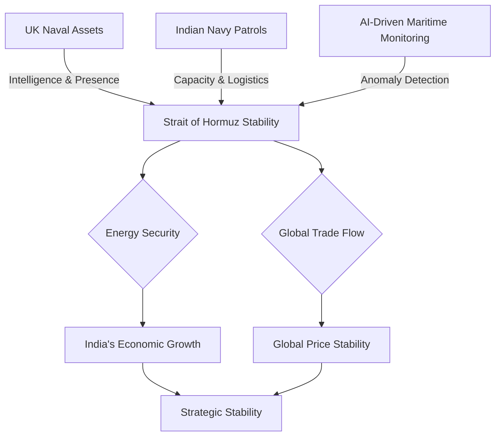

# 🌐 The New Strategic Axis: How Modi and Starmer are Redefining AI, Defence, and Maritime Security

In the high-stakes arena of global diplomacy, certain conversations serve as more than mere formalities—they act as architectural blueprints for future alliances. The recent high-level engagement between Indian Prime Minister Narendra Modi and the UK Prime Minister has signaled a profound shift in the Anglo-Indian relationship. While social media often reduces these interactions to snippets of diplomatic courtesy, the actual core of the strategic dialogue focused on three existential pillars: **Sovereign Artificial Intelligence (AI), Defence autonomy, and the precarious security of the Strait of Hormuz**.

This alignment is not an accident of timing but a calculated convergence of two national visions. India is aggressively positioning itself as a *"Vishwa Mitra"* (Friend of the World), seeking to lead the Global South through digital public infrastructure and strategic autonomy. Simultaneously, the UK is executing its "Indo-Pacific Tilt," a post-Brexit strategic pivot designed to secure trade and security interests in the world's most dynamic economic region.

The relationship between New Delhi and London has finally evolved past the shadow of Commonwealth nostalgia. It is now a pragmatic, transactional, and strategic partnership based on mutual growth and collective survival. From the nanometers of a semiconductor chip to the thousand-mile shipping lanes of the Persian Gulf, both nations have realized that in a multipolar world, the strategic distance between the Thames and the Ganges has effectively vanished.

---

## 🗺️ The Geopolitical Chessboard: A New Era of India-UK Ties

To understand the current trajectory, one must view this partnership through the lens of the "Comprehensive Strategic Partnership." For India, the UK represents a gateway to cutting-edge aerospace technology and a sophisticated financial hub that can fuel its goal of becoming a **$5 trillion economy**. For the UK, India is the indispensable partner—the democratic heavyweight capable of balancing power in Asia.

The global environment is currently defined by "polycrisis"—simultaneous instabilities in Eastern Europe, the Levant, and the South China Sea. These disruptions have exposed the fragility of global supply chains. The [India-UK Roadmap 2030](https://www.gov.uk/government/publications/india-uk-roadmap-2030) serves as the operational manual for this relationship, aiming to double bilateral trade and institutionalize security cooperation.

> "The partnership between India and the UK is no longer defined by the history they share, but by the future they must secure. It is a transition from a relationship of 'legacy' to a relationship of 'utility,' where shared democratic values provide the floor, but strategic necessity provides the ceiling."

### The "China Factor" and De-risking
A central, though often understated, driver of this alignment is the "China Factor." Neither New Delhi nor London seeks an adversarial total rupture with Beijing, but both are acutely aware of the risks associated with "over-dependence." The concept of **"de-risking"**—as opposed to "de-coupling"—is the guiding principle here. 

By teaming up on AI and defence, they are creating a strategic redundancy. If the supply of critical minerals or semiconductors from East Asia is weaponized, a diversified corridor between the UK and India provides a vital safety valve. The UK's "Indo-Pacific Tilt" is therefore not a mere rhetorical flourish; it is a material commitment involving joint naval deployments and intelligence sharing.

---

## 🤖 AI and the Digital Frontier: The Rise of Sovereign AI

When the leaders discussed Artificial Intelligence, the conversation transcended the hype of generative chatbots. They focused on **Sovereign AI**—the capability of a nation to produce AI using its own infrastructure, data, and workforce, without relying on foreign entities that could impose "kill-switches" or biased algorithms.

AI has transitioned from a productivity tool to a cornerstone of national power. The dialogue centered on "silicon diplomacy," specifically the semiconductor supply chain. India possesses an unparalleled pool of software engineering talent, while the UK hosts world-leading research clusters in AI safety and hardware design at institutions like the University of Oxford and the Alan Turing Institute.

### The Pillars of AI Collaboration
The collaboration is focusing on three critical domains to ensure that neither nation becomes a "digital colony" of another superpower:

1.  **Semiconductor Ecosystems:** Both nations are working to move beyond the "fab-less" model. By collaborating on chip design and advanced packaging, they aim to reduce the reliance on a handful of factories in Taiwan and South Korea.
2.  **AI Ethics & Guardrails:** Building on the momentum of the [Bletchley Park AI Safety Summit](https://www.gov.uk/government/publications/ai-safety-summit-2023), the two countries are aligning on "Red Teaming" protocols to prevent AI from being used to create bio-weapons or disrupt financial markets.
3.  **Compute Sovereignty:** The creation of high-performance computing (HPC) clusters to train Large Language Models (LLMs) that understand the linguistic and cultural nuances of the Global South and the West, avoiding the "Western-centric" bias of Silicon Valley models.

Research published on [arXiv](https://arxiv.org/abs/2303.12712) emphasizes the necessity of "human-in-the-loop" systems in national security AI. Both Modi and the UK PM agreed that the race for AI supremacy must be governed by strict guardrails to prevent the accidental escalation of autonomous weapon systems.

---

## 🛡️ Defence Sovereignty: Moving from Buyer to Co-Developer

For decades, the India-UK defence relationship followed a linear path: the UK exported high-end platforms, and India acted as the customer. This model is officially obsolete. The new paradigm is **Co-Development and Co-Production**.

The most significant point of contention and opportunity is the transfer of technology (ToT) for jet engines. In the aerospace world, the "engine core" is the holy grail of intellectual property. For India, acquiring this technology is central to the *Atmanirbhar Bharat* (Self-reliant India) initiative. The goal is to ensure that India's air superiority is not contingent on the political whims of a foreign capital during a conflict.

### The Defence Synergy Framework

| Area of Focus | Previous Model (Buyer-Seller) | New Model (Strategic Partner) |
| :--- | :--- | :--- |
| **Aerospace** | Importing off-the-shelf aircraft | Co-designing engine cores & turbine blades |
| **Drones** | Buying surveillance UAVs | Integrating UK sensors with Indian mass-manufacturing |
| **Cyber** | Purchasing security software | Joint Task Forces for infrastructure protection |
| **Naval** | Occasional port visits | Permanent MDA (Maritime Domain Awareness) sharing |

**The Bold Stat:** India currently ranks as one of the world's top three arms importers, yet the government has set an ambitious target to export **$5 billion worth of defence equipment by 2025**. This shift transforms India from a market into a manufacturing hub, potentially producing UK-designed components for the global market.

This synergy is a strategic win-win. The UK gains a massive partner to offset the astronomical R&D costs of next-generation weapons, while India gains the intellectual property required to secure its borders against regional adversaries.

---

## ⚓ The Strait of Hormuz: Navigating the Global Chokepoint

While AI and jets capture the headlines, the discussion regarding the **Strait of Hormuz** is perhaps the most urgent. For India, this narrow waterway is not just a geographical feature; it is an economic jugular vein.

The Strait of Hormuz is the world's most critical oil chokepoint. A significant percentage of India's crude oil imports pass through this corridor. Any closure—whether sparked by regional tensions, proxy conflicts, or state-level aggression—would lead to an immediate spike in energy costs, triggering domestic inflation and threatening India's GDP growth.

The UK's long-standing strategic presence in the Gulf provides a security umbrella that complements India's growing naval reach. The leaders discussed the implementation of **Maritime Domain Awareness (MDA)**. This involves the integration of satellite imagery and AI algorithms to detect "dark ships"—vessels that disable their Automatic Identification System (AIS) transponders to engage in illicit activities or prepare for attacks.

According to [maritime security research on AI anomaly detection](https://arxiv.org/abs/2106.01234), the integration of machine learning into naval surveillance can reduce reaction times from hours to seconds. By treating the freedom of navigation in the Strait of Hormuz as a "global public good," India and the UK are moving toward more frequent joint naval exercises and deeper intelligence synchronization.

---

## 📈 The FTA Factor: The Economic Engine of Diplomacy

While AI and defence provide the security framework, the **Free Trade Agreement (FTA)** is the engine that will sustain the partnership. The call reaffirmed a mutual commitment to finalizing the FTA, which has faced several delays due to complex negotiations over tariffs and visas.

The FTA is the "connective tissue" of the relationship. It is significantly easier to co-produce jet engines or collaborate on AI research if there are minimal tariffs on high-tech components and streamlined movement for specialists.

### Critical Negotiations in the FTA
The negotiations are currently focused on three "stumbling blocks" that require a pragmatic compromise:
*   **Mode 4 Services:** India is pushing for easier visa access for its IT professionals and healthcare workers to operate in the UK.
*   **Agricultural & Luxury Exports:** The UK is seeking lower import duties on its scotch whisky and automotive exports.
*   **Digital Trade:** Establishing common standards for data flow and digital payments to integrate the UK's fintech sector with India's UPI-led digital revolution.

Rather than pursuing a monolithic "grand bargain," the leaders are exploring **"Early Harvest" agreements**. This strategy involves securing quick wins on specific tariff lines to build momentum and provide immediate economic benefits while the more complex issues are ironed out.

**The Bold Stat:** Current bilateral trade is robust, but economic models suggest that a fully implemented FTA could boost trade volume by **over 20% within the first five years**, creating a powerful economic corridor that resists global volatility.

---

## ⚖️ The Balancing Act: Navigating a Multipolar World

The final, implicit theme of the Modi-Starmer dialogue was the art of the "Balancing Act." Both nations are navigating incredibly complex relationships with the United States and China.

India employs a strategy of **"Multi-alignment."** It is a key member of the Quad (alongside the US, Japan, and Australia) to ensure a free and open Indo-Pacific, yet it remains a pivotal player in BRICS and the SCO. This allows India to maintain strategic autonomy, ensuring it is not a junior partner in any alliance but a pole in its own right.

The UK, in its "Global Britain" phase, is attempting to redefine its identity post-Brexit. By deepening ties with India, the UK is signaling that its influence is not tied to a continental bloc in Europe, but to its ability to forge high-value partnerships across the globe.

The synergy between Modi and the UK PM suggests that the "Anglosphere" and the "Global South" can find a common language based on **mutual utility** rather than shared ideology. By focusing on the "Tech-Security Nexus," they are bypassing historical grievances and focusing on a future defined by competitiveness and stability.

---

## 🎯 Conclusion: The Architecture of a Future Alliance

The first high-level engagement between PM Modi and the UK Prime Minister was far more than a diplomatic courtesy; it was a strategic alignment. By weaving together the intellectual potential of **Sovereign AI**, the hard power of **Defence Co-production**, and the geopolitical necessity of **Maritime Security**, they have constructed a three-dimensional framework for the next decade of cooperation.

As we move toward 2030, the India-UK relationship will be measured by its ability to execute these plans. The successful transfer of jet engine technology and the finalization of the FTA will be the true litmus tests of this partnership. If they succeed, they will provide a global blueprint for how two diverse democracies—one an emerging superpower and the other a seasoned financial hub—can synchronize their interests in a fragmented world.

When the world's largest democracy and one of its oldest financial powerhouses align their strategic clocks, the resulting ripples are felt far beyond their own shores. This is not just a bilateral agreement; it is a reconfiguration of the Indo-Pacific power balance.

---

## 📚 References

*   **Official Government Portals:**
    *   [India-UK Roadmap 2030 - UK Gov](https://www.gov.uk/government/publications/india-uk-roadmap-2030)
    *   [UK-India Free Trade Agreement Updates - Dept for Business and Trade](https://www.gov.uk/government/collections/uk-india-free-trade-agreement)
    *   [Ministry of External Affairs (India) - Bilateral Relations with UK](https://www.mea.gov.in/bilateral-relations.htm?country=United+Kingdom)
    *   [UK Indo-Pacific Tilt Strategy - FCDO](https://www.gov.uk/government/publications/global-britain-in-the-indo-pacific)

*   **Academic & Strategic Research:**
    *   [AI and National Security: Anomaly Detection in Maritime Shipping - arXiv](https://arxiv.org/abs/2106.01234)
    *   [The Role of AI in Modern Warfare and Strategic Escalation - arXiv](https://arxiv.org/abs/2303.12712)
    *   [Strait of Hormuz: Geopolitical Significance and Oil Security - Wikipedia](https://en.wikipedia.org/wiki/Strait_of_Hormuz)

*   **News & Analysis:**
    *   [Diplomatic Coverage of Prime Minister's High-Level Calls - The Times of India](https://timesofindia.indiatimes.com)
    *   [Global Britain in the Indo-Pacific: Strategic Analysis - Foreign Commonwealth & Development Office](https://www.gov.uk/government/publications/global-britain-in-the-indo-pacific)
