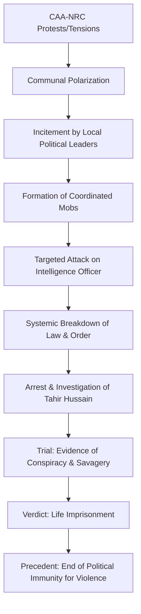

# The Price of Incitement: Tahir Hussain’s Life Sentence and the Scars of 2020

---

### 🏛️ The Gavel Falls: A Landmark Verdict for Accountability

Delhi's judicial corridors have witnessed countless high-profile trials, but the case of Tahir Hussain stands as a chilling testament to the intersection of political ambition and communal carnage. In a verdict that has sent shockwaves through the capital's political establishment, the former Aam Aadmi Party (AAP) leader has been sentenced to life in prison. This is not merely a criminal conviction; it is a profound statement on the limits of political immunity in the face of extreme violence.

The core of the conviction centers on the brutal murder of an intelligence officer during the 2020 North East Delhi riots. For years, the narrative surrounding these riots was clouded by political spin and conflicting reports. However, the court's final judgment stripped away the rhetoric, describing the act not as a spontaneous eruption of street anger, but as "savagery"—a calculated, clinical execution designed to dismantle the state's security apparatus.

This sentencing marks the culmination of a grueling legal odyssey that began in February 2020, amidst the smog of burning tires and the screams of a fractured city. For the family of the fallen officer and the security personnel who stood their ground, the verdict represents a long-awaited victory for justice. For the political class, it serves as a stern warning: a political title is not a shield, and orchestrating violence from a position of power is an aggravating factor, not a mitigating one.

---

### 🔥 The Day the City Burned: The Murder of a Public Servant

To appreciate the gravity of the life sentence, one must reconstruct the harrowing environment of North East Delhi in February 2020. The region, characterized by dense populations and narrow alleys, transformed overnight into a war zone. The air was thick with smoke, and the streets were dominated by mobs that operated with a level of coordination that suggested planning rather than impulse.

In the heart of this chaos, an intelligence officer—acting as the "eyes and ears" of the state—was deployed to gather critical data to preempt further escalation. In a functioning democracy, the security official is the thin line between order and anarchy. Yet, during these riots, this line was targeted. According to evidence meticulously presented by the prosecution and documented in reports by [NDTV](https://www.ndtv.com), the officer was not a victim of collateral damage; he was a target.

The court's use of the term "savagery" refers to the specific nature of the attack. The officer was intercepted and killed in a manner intended to send a message. The objective was clear: to "blind" the administration by removing those capable of providing real-time intelligence. When a state's intelligence operative is murdered, it is an attack on the sovereignty of the law itself.

**The court identified three critical pillars that elevated this crime to "rarest of the rare" territory:**

*   **Premeditated Coordination:** Evidence revealed that the attackers did not simply find the officer; they sought him out. The attack was part of a broader strategy to push security forces out of specific neighborhoods.
*   **The Asymmetry of Power:** The crime involved a lone official, representing the legal authority of India, pitted against a mob emboldened by the belief that they had political protection.
*   **Creation of "No-Go Zones":** The rioters aimed to establish territorial pockets where the police and intelligence agencies were forbidden to enter, effectively creating a state within a state where the law ceased to exist.

In the Indian legal system, the murder of a security official on duty is treated with extreme severity. The life sentence underscores the principle that an attack on the uniform is an attack on the state.

---

### 👤 The Architect of Chaos: Who is Tahir Hussain?

Tahir Hussain was not a peripheral figure in the North East Delhi landscape; he was a cornerstone of the Aam Aadmi Party's (AAP) local influence. As a municipal councillor, Hussain had spent years cultivating a persona as a champion of the marginalized. He built a vast network of loyalty, becoming a quintessential "power-broker" who could mobilize thousands of people with a single call.

For a time, this influence was viewed through the lens of democratic mobilization. However, the 2020 riots revealed the darker utility of such networks. The ability to "mobilize the street" for a rally is a political asset; the ability to mobilize the street for a pogrom is a criminal liability.

Before the riots, whispers of Hussain's involvement in land-grabbing and local intimidation had surfaced, but they were largely ignored in the pursuit of electoral gains. The trial revealed that Hussain utilized his political stature to transform a political protest into a violent insurgency. He didn't just happen to be present during the violence; he curated the environment that made the violence inevitable.

> "The use of political office to facilitate criminal conspiracy is the highest form of betrayal of the public trust. When a representative of the people becomes the recruiter for a mob, the democratic contract is shattered." — *Analysis of the judicial sentiment regarding political incitement.*

Hussain's eventual expulsion from the AAP was viewed by many analysts as a delayed reaction. It highlighted a systemic flaw in modern political parties: the reliance on "strongmen" to secure volatile voting blocs, only to discard them once their actions become a legal and PR liability.

---

### 🌪️ The 2020 Inferno: A Macro-Analysis of the Riots

The murder of the intelligence officer was the peak of a larger tragedy. The 2020 North East Delhi riots were not an isolated incident but the result of a volatile cocktail of communal polarization, political rhetoric, and systemic police failure.

Between February 20 and 26, 2020, the city witnessed a breakdown of civil society. The violence was characterized by "mob-hunting," where groups used leaked addresses and local knowledge to target individuals based on religious identity. As detailed in the [Wikipedia record of the 2020 Delhi Riots](https://en.wikipedia.org/wiki/2020_Delhi_riots), the toll was devastating: **53 people dead**, hundreds injured, and thousands of homes and businesses reduced to ash.

**The riots were amplified by three modern catalysts:**

1.  **The Weaponization of Social Media:** WhatsApp and Facebook were not just tools for communication but weapons of war. Fake news regarding "attacks on the community" was spread in real-time, creating a state of panic that made people susceptible to the incitement of leaders like Hussain.
2.  **Hyper-Local Geographies:** The violence occurred in densely packed neighborhoods where communal boundaries were already sharp. This allowed mobs to isolate targets with terrifying efficiency.
3.  **Institutional Paralysis:** For the first **48 to 72 hours**, the police response was catastrophically slow. This vacuum of authority allowed local strongmen to step in as the "de facto" law, coordinating attacks while security forces remained on the periphery.

By eliminating the intelligence officer, the orchestrators of the riot were attempting to maintain this vacuum. If the state cannot see, it cannot act.

---

### ⚖️ The Legal Labyrinth: Proving Conspiracy in Chaos

Securing a life sentence in the aftermath of a riot is an immense legal challenge. Riot environments are characterized by "collective anonymity," where it is easy for perpetrators to blend into the crowd. To move from a charge of "rioting" to a charge of "conspiracy to murder," the prosecution had to prove a direct link between the mastermind and the executioner.

The prosecution’s strategy was to move away from the "heat of the moment" narrative and focus on the "mastermind" framework. They argued that Tahir Hussain functioned as the logistics and psychological hub of the operation. He did not need to hold the knife or the gun; his crime was the provision of the plan, the incitement, and the promise of political immunity.

**The evidentiary "smoking guns" included:**

*   **Call Detail Records (CDRs):** Digital forensics showed a surge in communication between Hussain and known rioters in the hours leading up to the attacks. These logs proved that the movements of the mobs were not random but coordinated.
*   **Video and CCTV Evidence:** Recovered footage showed Hussain in positions of leadership, gesturing toward targets and inciting crowds. The visual evidence countered his defense that he was merely a bystander trying to maintain peace.
*   **Witness Testimony:** Local residents testified that they were told by Hussain's associates that they would be "protected" by the party and the government if they participated in the violence.

Hussain's legal team attempted to frame him as a political scapegoat, arguing that the charges were a result of "vendetta politics." However, the court found the evidence of coordination—specifically regarding the targeting of the security official—too precise to be coincidental.

---

### 🚩 The AAP Dilemma: From "Clean Politics" to Crisis Management

The Tahir Hussain case presented an existential PR crisis for the Aam Aadmi Party. Founded on the principles of *Swaraj* (self-governance), anti-corruption, and a "clean" image, the party found itself tethered to a man accused of orchestrating a massacre.

The party's internal handling of the crisis followed a predictable pattern of cognitive dissonance. Initially, there was a palpable hesitation to distance themselves from Hussain. In the high-stakes game of Delhi politics, Hussain's grip on North East Delhi was an asset that the party leadership was reluctant to lose.

**The evolution of the AAP's stance:**

*   **Phase 1: Deflection (Denial).** Early statements suggested that the allegations were politically motivated and that Hussain was being targeted because of his influence.
*   **Phase 2: Tactical Distance (Suspension).** As the scale of the atrocities became public and the evidence of the officer's murder surfaced, the party suspended him, effectively putting him in a "legal waiting room."
*   **Phase 3: Final Severance (Expulsion).** Only after the judicial process made the crimes undeniable did the party formally expel him.

This trajectory illustrates the "Strongman Trap." Many political parties in India overlook the criminal leanings of local leaders if those leaders can deliver **thousands of votes**. However, when those leaders use that same power to incite violence, they transform from an asset into a liability that can stain the party's brand for a generation.

---

### 🛡️ Justice for the Uniform: The Symbolic Weight of the Sentence

While the legal victory is personal for the officer's family, the symbolic victory belongs to the state's security apparatus. In times of civil unrest, security forces often face a "no-win" situation: use excessive force and be accused of brutality, or exercise restraint and be overrun by mobs.

When an officer is killed while exercising restraint or gathering intelligence, it is a direct assault on the rule of law. If such crimes go unpunished, it creates a dangerous precedent: it tells future rioters that the "eyes and ears" of the state are fair game.

**The implications of this life sentence are three-fold:**

1.  **Deterrence for Political Actors:** It sends a clear message that inciting a mob to target security personnel will result in the harshest possible penalties, regardless of political affiliation.
2.  **Institutional Morale:** It provides a sense of psychological security to the thousands of officers who operate in volatile zones, knowing that the judiciary recognizes the specific gravity of their risks.
3.  **Legal Clarification:** The verdict clarifies that "political influence" is not a defense but an aggravating circumstance. Using a public office to facilitate a crime makes the crime worse, not more excusable.

For further analysis on the legal standards of conspiracy in India, the [Bar and Bench](https://www.barandbench.com) and [LiveLaw](https://www.livelaw.in) provide comprehensive breakdowns of the IPC sections applied in this case.

---

### 📉 Bold Stats: The Human Cost of the 2020 Riots

To understand why a life sentence was deemed appropriate, one must look at the sheer scale of the devastation that occurred during the week of the riots:

*   **53 Deaths:** The official death toll, though some NGOs suggest higher numbers due to unreported casualties.
*   **1,000+ Injuries:** Hundreds of people required emergency hospitalization for burn injuries and stab wounds.
*   **Thousands of Properties Destroyed:** Small businesses, homes, and places of worship were systematically torched.
*   **Zero Tolerance:** The court's decision to award a life sentence reflects a **100% rejection** of the "political protest" defense in cases of targeted murder.

---

### 🏁 Final Thoughts: The Long Road to Social Healing

Tahir Hussain’s life sentence is a milestone, but it is not a destination. Legal justice is the first step toward healing, but it cannot replace social reconciliation. The scars of 2020 still run deep in the lanes of North East Delhi. The distrust between communities, the trauma of those who lost their homes, and the lingering fear of another eruption remain.

The case serves as a cautionary tale about the fragility of urban peace. It demonstrates how easily the tools of democracy—community organizing, political representation, and public speech—can be inverted to serve the interests of hatred.

As Hussain begins his life sentence, the lesson for the citizenry and the state is simple: the law may be slow, but it is relentless. Democracy cannot survive if the rule of the mob is allowed to supersede the rule of law. The gavel has fallen, and in doing so, it has reaffirmed that no one—no matter how many votes they can mobilize—is above the law.

For Delhi to truly heal, the city must move toward a future where political power is measured by the ability to build bridges, not by the ability to burn them. The price of incitement has been paid in full by one man, but the cost of the riots will be borne by the city for years to come.

---

## 📚 References

  
  
 <a href="https://unsplash.com/@markuswinkler">Markus Winkler</a> on <a href="https://unsplash.com/photos/scrabble-tiles-spelling-sovereignity-on-a-table-N7150PzZW3w">Unsplash</a>

*   **NDTV News**: In-depth coverage of the trial, conviction, and sentencing of Tahir Hussain. [ndtv.com](https://www.ndtv.com)
*   **Wikipedia**: Detailed chronological account and casualty reports of the 2020 Delhi Riots. [en.wikipedia.org/wiki/2020_Delhi_riots](https://en.wikipedia.org/wiki/2020_Delhi_riots)
*   **Wikipedia**: Political profile and municipal history of Tahir Hussain. [en.wikipedia.org/wiki/Tahir_Hussain_(politician)](https://en.wikipedia.org/wiki/Tahir_Hussain_(politician))
*   **The Indian Express**: Analysis of the AAP's internal conflict and the expulsion process of local leaders. [indianexpress.com](https://www.indianexpress.com)
*   **Times of India**: Archival reports on the specific charges of conspiracy and the murder of the intelligence officer. [timesofindia.indiatimes.com](https://timesofindia.indiatimes.com)
*   **LiveLaw**: Legal analysis of the "savagery" ruling and the application of life imprisonment. [livelaw.in](https://www.livelaw.in)
*   **Bar and Bench**: Detailed reports on the prosecution's use of Call Detail Records (CDRs) as evidence. [barandbench.com](https://www.barandbench.com)
*   **BBC News**: International perspective on the communal tensions and the impact of the 2020 riots. [bbc.com](https://www.bbc.com)
*   **The Hindu**: Reports on the police failure and the subsequent judicial inquiries. [thehindu.com](https://www.thehindu.com)
*   **Court Records**: Official findings regarding the coordination of mobs and the targeted nature of the attacks on state officials.
