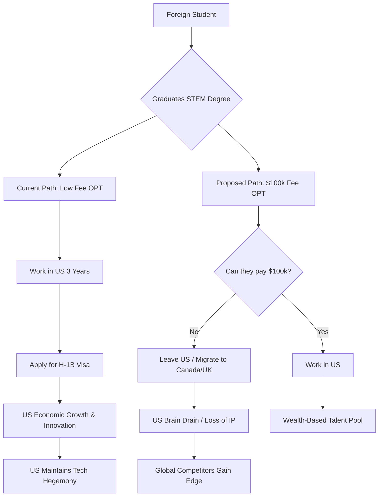

# Pay to Stay: What Trump’s Proposed $100,000 OPT Fee Means for Global Talent

For decades, the United States has served as the ultimate destination for the world's most ambitious minds. From the research laboratories of MIT and Stanford to the high-stakes boardrooms of Wall Street and the engineering hubs of Silicon Valley, the implicit agreement has been simple: if you possess exceptional talent and can secure a world-class American education, the U.S. will provide a pathway for you to contribute your skills to the domestic economy. This "global pipeline" has been a cornerstone of American hegemony in technology, medicine, and finance.

However, that pipeline is facing a potential blockade. Recent reports, including a detailed analysis by [Moneycontrol](https://www.moneycontrol.com/news/business/want-to-work-in-us-after-graduation-trump-weighs-100000-opt-fee-for-foreign-students-12731521.html), indicate that the incoming Trump administration is considering a staggering **$100,000 fee** for foreign students wishing to utilize Optional Practical Training (OPT). 

For the average international graduate, this isn't merely a policy adjustment—it is a financial wall. For years, the "OPT bridge" has been the primary mechanism allowing F-1 visa holders to transition from academic theory to professional practice. By introducing a six-figure entry fee, the U.S. risks shifting the criteria for residency from *merit* to *money*. If this proposal becomes reality, the "American Dream" may cease to be about what you can build or discover, and instead become a luxury product available only to the global elite.

---

## 🎓 What is OPT and Why Does It Actually Matter?

  
  
📸 <a href="https://unsplash.com/@merakist">Merakist</a> on <a href="https://unsplash.com/photos/work-freestanding-letters-zFd9Zvs0yN8">Unsplash</a>

To understand the gravity of a $100,000 fee, one must first understand the mechanics of [Optional Practical Training (OPT)](https://www.uscis.gov/working-in-the-united-states/students-and-exchange-visitors/optional-practical-training). For an international student on an F-1 visa, OPT is not a separate visa category; it is a benefit of their student status. It grants graduates the legal right to work in a professional role directly related to their field of study.

### The Three-Tiered Pathway
Most F-1 students are eligible for an initial **12-month period** of OPT. However, the true strategic value lies in the **STEM OPT Extension**. Students who graduate with degrees in Science, Technology, Engineering, or Mathematics (STEM) can apply for an additional **24-month extension**, providing a total of **36 months** of legal work authorization.

This extension serves three critical functions:
1.  **For the Student:** It provides the necessary window to earn a professional salary to pay down massive tuition debts.
2.  **For the Employer:** It offers a "trial period" to evaluate a hire's performance before investing in the costly and precarious [H-1B visa lottery](https://www.uscis.gov/working-in-the-united-states/temporary-workers/h-1b-specialty-occupations-and-fashion-models).
3.  **For the Economy:** It ensures that highly specialized skills—developed using U.S. resources and faculty—stay within the U.S. borders rather than being exported to competitors.

Without OPT, a student would be forced to depart the U.S. immediately upon graduation. This effectively renders a U.S. degree significantly less valuable than one from a country with more welcoming post-graduation policies. By placing a massive price tag at the end of this bridge, the U.S. is not just taxing students; it is actively disincentivizing the top 1% of global intellect from choosing American universities.

---

## 💰 The Proposal: Breaking Down the $100,000 Fee

The current cost of applying for OPT is negligible—a few hundred dollars in government filing fees. Jumping to **$100,000** is a tectonic shift. This is no longer a "processing fee"; it is a wealth test.

According to reports from [Moneycontrol](https://www.moneycontrol.com/news/business/want-to-work-in-us-after-graduation-trump-weighs-100000-opt-fee-for-foreign-students-12731521.html), the logic behind this proposal is rooted in an "America First" framework. The administration's goal is twofold: to generate substantial government revenue and to ensure that only "high-value" individuals remain in the country. In this context, "high-value" is defined as those who either possess significant personal wealth or are so indispensable that an employer is willing to pay the fee on their behalf.

> "The proposal aims to deter 'low-skilled' foreign labor and prioritize those who bring substantial financial or intellectual capital to the United States."

### The Fallacy of Wealth as a Proxy for Value
There is a profound logical flaw in equating financial capacity with intellectual contribution. A brilliant PhD candidate specializing in generative AI or quantum computing from a middle-class family in India or Nigeria is exponentially more valuable to the U.S. GDP than a wealthy student with a general degree who can simply write a check. 

Furthermore, the question of *who pays* creates a dangerous dichotomy:
*   **If the student pays:** They will likely turn to predatory lenders, increasing their debt burden to unsustainable levels and delaying their ability to contribute to the economy through consumption.
*   **If the employer pays:** It becomes a "talent tax." While a trillion-dollar company like Google or NVIDIA might absorb the cost for a handful of superstars, a seed-stage startup in Austin or a mid-sized engineering firm in the Midwest will be priced out of the market entirely.

---

## 📉 The Economic Shockwave: Students and Families

For the vast majority of international students, the cost of a U.S. education is already a crushing weight. Many students from developing nations take on immense debt, often borrowing from family or high-interest private lenders, to afford tuition and living expenses that can easily reach **$200,000 to $400,000** over four years.

Introducing a **$100,000 fee** at the moment of graduation creates a "debt trap." Imagine a graduate who has already borrowed $150,000 for their Master's in Data Science. To begin their first entry-level job—the only way to start repaying that loan—they must suddenly produce another $100,000. 

**The systemic ripple effects would be devastating:**
*   **Loan Default Cascades:** A spike in defaults as graduates find the "entry fee" to the workforce impossible to meet.
*   **Intergenerational Poverty:** In many cultures, extended families pool resources to send one "star" student to the U.S. A surprise $100k requirement could bankrupt multiple generations of a family.
*   **Meritocratic Erosion:** The "value" of a degree would shift from academic achievement to liquid assets.

This creates a perverse incentive structure. Instead of attracting the *best* students, the U.S. would attract the *richest* students. In the realms of science and technology, wealth is not a proxy for genius. By pricing out the global middle class, the U.S. would be conducting a massive experiment in self-imposed intellectual depletion.

---

## 🏫 The University Crisis: A Threat to Higher Education

The impact would extend far beyond the students; it would strike the U.S. higher education system at its core. International students are not just scholars; they are a vital economic engine. According to data from [NAFSA: Association of International Educators](https://www.nafsa.org/), international students contribute **billions of dollars** annually to the U.S. economy.

Many U.S. universities—particularly mid-tier public institutions and smaller private colleges—rely on the "international premium" (the higher tuition rates paid by non-residents) to subsidize domestic students, fund research, and maintain infrastructure. The primary "selling point" for these students is the potential for post-graduation employment in the U.S.

If that pathway is gated behind a $100,000 paywall, the value proposition of a U.S. degree collapses. Prospective students will look toward alternatives like the [University of Toronto](https://www.utoronto.ca/) or the [University of Melbourne](https://www.unimelb.edu.au/), where the paths to permanent residency are clearer and do not require a six-figure "pay-to-stay" fee.

**Predicted consequences for U.S. campuses:**
1.  **Enrollment Plunge:** A sharp decline in international applications, particularly in STEM fields where the ROI is currently highest.
2.  **Budgetary Deficits:** Massive revenue gaps leading to cuts in research grants, faculty layoffs, and potentially higher tuition for American citizens to fill the void.
3.  **Prestige Decay:** As the most driven global talent avoids the U.S., the quality of peer-to-peer learning and research output will decline, causing U.S. university rankings to slip.

The U.S. education system is essentially a high-value export. By taxing the "exit" (the transition from student to worker), the government is effectively sabotaging the "sale" (the enrollment).

---

## 💻 The Silicon Valley Perspective: Brain Drain 2.0

In tech hubs like San Francisco, Seattle, and Austin, the OPT program is more than a benefit—it is a lifeline. The American tech miracle was built on the backs of immigrants. From the founders of Google to the chief architects at NVIDIA, foreign-born talent has provided the critical mass of skill required to maintain a competitive edge.

Companies utilize the STEM OPT extension to integrate entry-level engineers who can deliver immediate value. If the cost of hiring a new graduate increases by **$100,000**, the barrier to entry becomes insurmountable for the startup ecosystem. While "Big Tech" can afford the fee for a few elite hires, the "garage startup" that creates the next disruptive technology will be unable to compete.

On forums like [Hacker News](https://news.ycombinator.com/), a palpable shift in sentiment is occurring. The conversation is moving from "How do I get into the U.S.?" to "Is it even worth the risk?"

This is "Brain Drain 2.0." In the first wave of brain drain, talent left their home countries for better opportunities in the U.S. In this second wave, they would be *pushed* out of the U.S. by financial hostility. When a brilliant AI researcher leaves Palo Alto for Toronto or Berlin, they don't just take their skills—they take their future patents, their future startup equity, and their future tax contributions. "America First" could ironically result in "America Alone."

---

## ⚖️ Legal Hurdles and the Political Reality

Implementing such a radical fee change is not as simple as signing an executive order. The administration would face a mountain of legal obstacles.

### The Administrative Procedure Act (APA)
Under the [Administrative Procedure Act](https://www.archives.gov/federal-register/laws/administrative-procedure-act), any significant change to federal regulations requires a "notice and comment" period. The Department of Homeland Security (DHS) would have to provide a rational basis for the fee and respond to thousands of public objections. Given the likely backlash from universities and the corporate sector, the "rational basis" would be difficult to defend in court.

### Statutory Authority vs. Taxation
There is a critical legal distinction between a "service fee" and a "tax." A service fee is intended to cover the cost of processing an application. A $100,000 fee for a process that costs the government a few hundred dollars to administer would likely be viewed by federal courts as an unauthorized tax. In the U.S., the power to tax resides with Congress, not the Executive branch.

### The Litigation Wave
Expect immediate lawsuits from three primary fronts:
*   **University Coalitions:** Suing over the direct economic damage to the higher education business model.
*   **Tech Industry Groups:** Arguing that the fee disrupts the labor market and harms national security by stifling innovation.
*   **Student Advocacy Groups:** Challenging the fee as "arbitrary and capricious" and discriminatory.

While the Executive branch has broad authority over immigration enforcement, the courts frequently intervene when policies lack a legal foundation or appear irrational. This proposal would not be settled in a press release; it would be fought in the federal courts for years.

---

## 🌍 The Global Context: A Competitive Market for Talent

The U.S. does not operate in a vacuum. Other developed nations are actively competing for the same pool of STEM graduates. Canada, for instance, has a highly streamlined [Post-Graduation Work Permit (PGWP)](https://www.canada.ca/en/immigration-refugees-citizenship/services/study-canada/work/after-graduation.html) that leads more directly to permanent residency. The UK has introduced the [Graduate Route visa](https://www.gov.uk/graduate-visa), allowing students to stay and work after their studies.

When the U.S. raises the cost of entry, it effectively subsidizes the growth of its competitors.

**The Global Talent Comparison:**
| Feature | United States (Proposed) | Canada | United Kingdom |
| :--- | :--- | :--- | :--- |
| **Post-Grad Work Fee** | **$100,000** | Low/Standard | Standard |
| **Path to Residency** | Difficult/Lottery | Streamlined | Merit-Based |
| **STEM Incentive** | High (if you're rich) | High | Moderate |
| **Barrier to Entry** | Extremely High | Low | Moderate |

By transforming the American Dream into a pay-to-play system, the U.S. is handing a massive strategic advantage to other nations. The "War for Talent" is won by the country that lowers the barriers to brilliance, not the one that builds a financial wall around it.

---

## Conclusion: Innovation vs. Protectionism

Charging foreign students **$100,000** to work in the U.S. after graduation is about more than just revenue; it is a philosophical statement. It signals a move from a system based on meritocracy to one based on plutocracy. While the stated goal may be to protect local jobs or increase government coffers, the actual result would likely be the erosion of the U.S.'s position as the global center of innovation.

Innovation is not the product of wealth; it is the product of diverse perspectives meeting the raw ambition of people who have everything to prove. By placing a paywall in front of the American Dream, the U.S. risks alienating the very people who build the next generation of life-saving medicines and world-changing technologies.

The true cost of a $100,000 OPT fee is not the money students lose—it is the breakthroughs the U.S. misses out on because the geniuses were too poor to stay. In the race for global intellectual dominance, the winner will not be the country with the highest fees, but the one with the most open doors for the brightest minds.

---

## 📚 References

*   **Moneycontrol:** [Trump weighs $100,000 OPT fee for foreign students](https://www.moneycontrol.com/news/business/want-to-work-in-us-after-graduation-trump-weighs-100000-opt-fee-for-foreign-students-12731521.html)
*   **USCIS:** [Optional Practical Training (OPT) Official Guide](https://www.uscis.gov/working-in-the-united-states/students-and-exchange-visitors/optional-practical-training)
*   **NAFSA:** [International Student Economic Impact Data](https://www.nafsa.org/)
*   **Hacker News:** [Discussions on US Visa Policy and Talent Migration](https://news.ycombinator.com/)
*   **Department of Homeland Security:** [Student and Exchange Visitor Program (SEVP)](https://studyinthestates.dhs.gov/)
*   **Government of Canada:** [Post-Graduation Work Permit (PGWP) Details](https://www.canada.ca/en/immigration-refugees-citizenship/services/study-canada/work/after-graduation.html)
*   **UK Government:** [Graduate Route Visa Information](https://www.gov.uk/graduate-visa)
*   **National Archives:** [Administrative Procedure Act (APA) Overview](https://www.archives.gov/federal-register/laws/administrative-procedure-act)
*   **Cato Institute:** [Research on High-Skilled Immigration](https://www.cato.org/immigration)
*   **IIE Open Doors:** [International Student Flow Report](https://opendoorsdata.org/)
