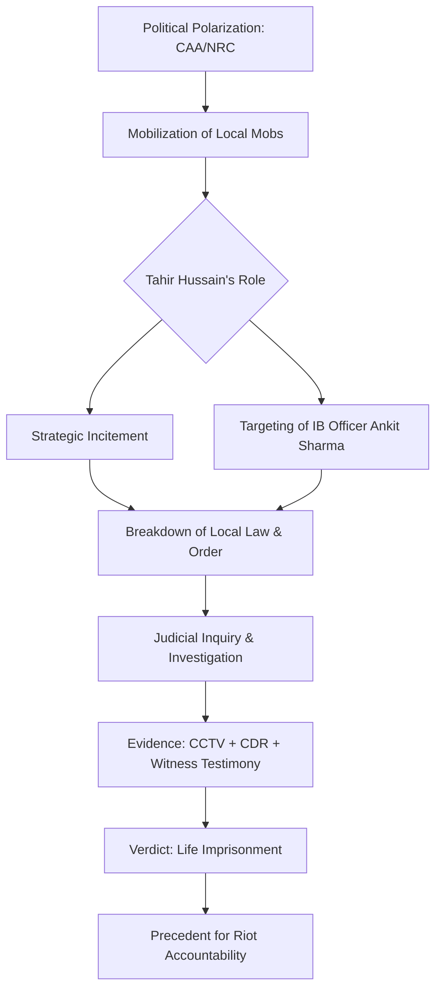

# Justice for Ankit Sharma: Why Tahir Hussain's Life Sentence Matters

Justice in the Indian judicial system is often characterized by its endurance—a slow, grinding process that tests the patience and resilience of the grieving. However, when a verdict finally descends, its impact can reverberate far beyond the courtroom walls. In a landmark ruling that has sent shockwaves through the political and social landscape of India, a Delhi court has sentenced **Tahir Hussain** and several associates to life imprisonment for the brutal murder of **Ankit Sharma**, a dedicated officer of the Intelligence Bureau (IB).

This verdict is more than just the conclusion of a single criminal trial; it represents a critical closing chapter on one of the most volatile periods in the capital's recent history—the North East Delhi riots of February 2020. For Ankit’s family, the sentence is a hard-won validation of their suffering. For the state, it is a declaration that the shield of a mob cannot protect perpetrators from the reach of the law. Ankit Sharma was a man who dedicated his professional life to the clandestine protection of the nation, only to be slaughtered in the streets of his own neighborhood. 

To understand the gravity of this sentence, we must examine the intersection of personal tragedy, communal hysteria, and the meticulous legal machinery that eventually brought the architects of violence to account.

---

## 🛡️ The Life and Legacy of Ankit Sharma

To comprehend the horror of the crime, one must first understand the identity of the victim. Ankit Sharma was not merely another statistic in the death toll of the 2020 riots. He was a professional intelligence officer serving with the **Intelligence Bureau (IB)**, India's premier internal security agency. The nature of IB work is inherently selfless and often invisible; officers operate in the shadows, analyzing threats and neutralizing risks before they manifest as public crises.

Ankit was described by his colleagues as a man of exceptional discipline and unwavering patriotism. His role required a high degree of discretion and a commitment to the stability of the Republic. However, on the night of the riots, the very state authority he served became the catalyst for his targeting. In the eyes of the rioters, Ankit was not just a resident of North East Delhi; he was a symbol of the Indian state.

The brutality of his death was not accidental but targeted. Ankit was not caught in a random skirmish or a stray crossfire. Evidence presented in court revealed that he was singled out by a mob, attacked with lethal intensity, and left for dead. The loss of a young, capable officer in the prime of his career was a profound blow to the security establishment and an agonizing void for his family.

> "The murder of a security officer during a period of civil unrest is not just a crime against an individual; it is an assault on the sovereignty of the state and the rule of law." — *Legal Analysis on State-Targeted Violence.*

The contrast between Ankit's life—dedicated to national security—and his death—at the hands of local communal hatred—serves as a poignant reminder of how quickly civil society can collapse when hate is weaponized. Because of his professional standing, his case became a focal point for those demanding that these murders not be dismissed as "general riot violence," but recognized as calculated executions.

---

## 🔥 Anatomy of the 2020 North East Delhi Riots

The murder of Ankit Sharma cannot be analyzed in isolation; it was a symptom of a larger, systemic collapse of law and order. In late February 2020, the districts of North East Delhi were transformed into a battlefield. The catalyst for this violence was the intense polarization surrounding the [Citizenship Amendment Act (CAA)](https://en.wikipedia.org/wiki/Citizenship_(Amendment)_Act,_2019) and the proposed [National Register of Citizens (NRC)](https://en.wikipedia.org/wiki/National_Register_of_Citizens).

What began as political protests and counter-protests rapidly devolved into communal clashes. Between February 23 and February 26, the neighborhoods of Jaffrabad, Bhajanpura, and Maujpur became epicenters of arson and slaughter. The official figures are staggering: **53 people lost their lives**, hundreds were hospitalized with critical injuries, and thousands were displaced from their ancestral homes.

The violence was characterized by a terrifying level of organization. This was not a spontaneous eruption of anger but a coordinated effort involving targeted arson, the looting of businesses, and the systematic killing of individuals based on their religious identity. **Thousands of crores worth of property** were reduced to ash, leaving a scar on the city's infrastructure and social fabric that persists to this day.

During these four days, there were widespread allegations that the police force was either overwhelmed or intentionally stagnant. Many residents claimed that security forces stood by while neighborhoods burned, creating a vacuum of power that was quickly filled by local strongmen and organized mobs. It was within this atmosphere of total lawlessness that the attack on Ankit Sharma occurred—a moment where the boundary between a citizen and a target vanished entirely.

---

## 🗺️ The Orchestration: Tahir Hussain’s Role in the Chaos

The core of the prosecution's case rested on the premise that the violence in North East Delhi was not a series of random accidents, but a choreographed campaign. The state pointed to **Tahir Hussain**, a local political figure with significant influence in the area, as one of the primary architects of the carnage.

Hussain was not merely a participant in the riots; he was accused of being the strategic center of the mobilization. According to detailed reports from [Live Law](https://www.livelaw.in), the prosecution presented evidence suggesting that Hussain used his social and political standing to incite the youth, designate target areas, and coordinate the movement of mobs. Essentially, the chaos was viewed by Hussain as a tool to exert territorial dominance and eliminate those he perceived as adversaries.

The attack on Ankit Sharma serves as a textbook example of this coordination. The mob that targeted Sharma did not happen upon him by chance; they moved through the streets with a specific objective. The prosecution argued that the perpetrators possessed local intelligence—knowledge of who lived where and who their professions were—which allowed them to strike with surgical precision.

The legal strategy employed by the state focused on the concepts of "common intention" and "criminal conspiracy" under the Indian Penal Code (IPC). To secure a conviction for the mastermind, the state did not need to prove that Tahir Hussain physically wielded the weapon that killed Ankit Sharma. Instead, they had to prove a "meeting of minds"—that Hussain and his associates shared a common goal to incite violence and commit murder. By establishing that Hussain led and inspired the mob, the court was able to hold him accountable for the ultimate outcome of those actions.

---

## ⚖️ The Legal Marathon: Proving Conspiracy in a Riot

Securing a conviction in the aftermath of a riot is one of the most difficult challenges a prosecutor can face. In the case of Ankit Sharma, the trial was plagued by witness intimidation, the sheer volume of conflicting testimonies, and the challenge of identifying individuals within a masked mob. However, the prosecution successfully bridged the gap between "riot chaos" and "planned murder" through a combination of digital forensics and courageous testimony.

### The Digital Smoking Guns
The conviction relied heavily on three pillars of evidence:

1.  **CCTV Surveillance**: High-definition footage from various points in North East Delhi was meticulously mapped. This allowed the prosecution to track the movement of the mob in real-time, placing Tahir Hussain and his co-accused at the scene of the crime and demonstrating their role in directing the attackers.
2.  **Call Detail Records (CDRs)**: Phone data provided the "invisible" link. The CDRs showed a flurry of communication between the accused immediately preceding and during the violence. This pattern of communication was instrumental in proving the "conspiracy" element, showing that the movements of the mob were not random but coordinated via mobile networks.
3.  **Eyewitness Testimony**: Despite the climate of fear, several witnesses provided pivotal testimony. They identified the accused not just as members of the crowd, but as leaders who were giving orders and identifying targets.

### The Application of the Indian Penal Code (IPC)
The court navigated several complex sections of the IPC to reach its verdict. While **Section 302 (Punishment for Murder)** was the primary charge, the court also considered:
*   **Section 147 & 148**: Rioting and rioting armed with deadly weapons.
*   **Section 120B**: Criminal conspiracy.
*   **Section 149**: Every member of an unlawful assembly guilty of an offense committed in prosecution of a common object.

The defense argued that the violence was a spontaneous reaction to political tension and that Hussain was being scapegoated for political reasons. However, the court found that the precision of the attack on an IB officer—a specific state representative—stripped the "spontaneous" defense of its credibility. The verdict concluded that this was a cold-blooded execution masked by the cover of a riot.

---

## 🔨 The Verdict: The Significance of Life Imprisonment

When the judge delivered the sentence of **life imprisonment**, it was a statement of judicial severity. In the Indian legal system, life imprisonment is the most severe penalty short of the death penalty. The court's decision to impose this sentence was based on the "heinous" nature of the crime and the "calculated brutality" exhibited by the perpetrators.

### Why the Sentence Matters
The court emphasized that the killing of Ankit Sharma was an attack on the state itself. Because the victim was an officer of the Intelligence Bureau, the crime transcended a personal dispute; it was an act of aggression against the national security apparatus. This elevated the crime from a "riot death" to a "targeted assassination."

Furthermore, this verdict breaks a frustrating trend in Indian riot cases. Historically, the "foot soldiers"—the low-level participants who are easily caught—are the ones who serve time, while the "masterminds" who incite the violence often evade conviction due to a lack of direct physical evidence. By sentencing Tahir Hussain, the court sent a clear message: **The hand that points the finger is as guilty as the hand that holds the knife.**

**Key Legal Takeaways from the Sentencing:**
*   **Accountability for Instigators**: The ruling reinforces that leaders of unlawful assemblies are legally responsible for the crimes committed by those they lead.
*   **Digital Evidence Priority**: The case highlights the increasing reliance on CDRs and CCTV to overcome the volatility of eyewitness testimony in communal cases.
*   **State Protection**: It affirms that attacks on government officials during civil unrest will be met with the maximum possible judicial rigor.

---

## 🌊 The Ripple Effect: Societal and Legal Implications

The sentencing of Tahir Hussain is not merely a legal victory; it is a social signal. For years, the victims of the 2020 riots felt that justice was being obstructed by political patronage or legal loopholes. This verdict suggests that the judiciary can remain an impartial arbiter even in the face of extreme political polarization.

### 1. Impact on the Family and Security Forces
For Ankit Sharma's family, the verdict provides a semblance of closure. While no sentence can replace a lost son or brother, the official recognition of the crime's brutality provides a psychological reprieve. For the IB and other intelligence agencies, the verdict is a crucial assurance that the state will not abandon its officers who risk their lives in the line of duty.

### 2. A Warning to Future Perpetrators
The verdict serves as a deterrent. It informs potential instigators that the anonymity of a mob is an illusion in the age of digital surveillance. The permanent nature of digital trails—CCTV, geolocation, and call logs—means that the window for escaping accountability is closing.

### 3. The "Justice Delayed" Dilemma
Despite the victory, the case brings to light the systemic issue of judicial delay. The gap between the crime (February 2020) and the final sentencing is a reminder of the burden on the Indian courts. When justice takes years, the healing process for the community is stunted, and the risk of retaliatory sentiment increases. This case underscores the urgent need for fast-track courts in cases of mass communal violence.

> "Justice delayed is justice denied, but justice delivered—no matter how late—is the only foundation upon which a fractured society can begin to rebuild."

---

## 🏁 Final Thoughts: The Long Road to Peace

The life imprisonment of Tahir Hussain for the murder of Ankit Sharma stands as a defining moment in the aftermath of the 2020 Delhi riots. It serves as a stark reminder that while hate can incinerate a city in a matter of days, the restoration of justice requires years of meticulous, patient, and unbiased work.

Ankit Sharma’s death was a tragedy born of hatred, but the verdict is a victory for the rule of law. It proves that regardless of political affiliation, local power, or social influence, no individual is above the law. The attempt to silence a servant of the state through violence ultimately gave the truth a louder and more permanent voice.

As North East Delhi continues its slow process of healing, this case acts as a beacon of accountability. The road to genuine peace is long and fraught with difficulty, but it must be paved with the stones of justice. By holding the architects of violence responsible, the Indian judiciary has reaffirmed the fundamental democratic principle that the law is the ultimate equalizer.

---

## 📚 References & Further Reading

For a deeper understanding of the legal and social context of this case, the following sources provide comprehensive data and analysis:

*   **Legal Proceedings**: [Live Law: Tahir Hussain, Others Get Life Imprisonment For Murder Of IB Staffer Ankit Sharma](https://www.livelaw.in) - Detailed coverage of the court's reasoning and the specific evidence cited.
*   **Historical Context**: [Wikipedia: 2020 Delhi Riots](https://en.wikipedia.org/wiki/2020_Delhi_riots) - A comprehensive overview of the timeline, casualties, and political triggers.
*   **Legislative Background**: [Wikipedia: Citizenship Amendment Act, 2019](https://en.wikipedia.org/wiki/Citizenship_(Amendment)_Act,_2019) - Understanding the law that sparked the initial protests.
*   **Administrative Context**: [Wikipedia: National Register of Citizens](https://en.wikipedia.org/wiki/National_Register_of_Citizens) - Analysis of the NRC and its role in the communal tension.
*   **Statutory Law**: [Indian Kanoon: IPC Section 302](https://indiankanoon.org/doc/1451423/) - The legal definition and punishment for murder under the Indian Penal Code.
*   **News Archives**: [NDTV: Delhi Riot Convictions](https://www.ndtv.com) - Reporting on the various trials and sentencing phases of the 2020 riots.
*   **Official Reports**: [Times of India: North East Delhi Violence](https://www.timesofindia.indiatimes.com) - Field reports and official statements regarding the security collapse.
*   **Academic Analysis**: [SCC Online: Common Intention under IPC](https://www.scconline.com) - Legal scholarship on how "common intention" is proven in conspiracy cases.
