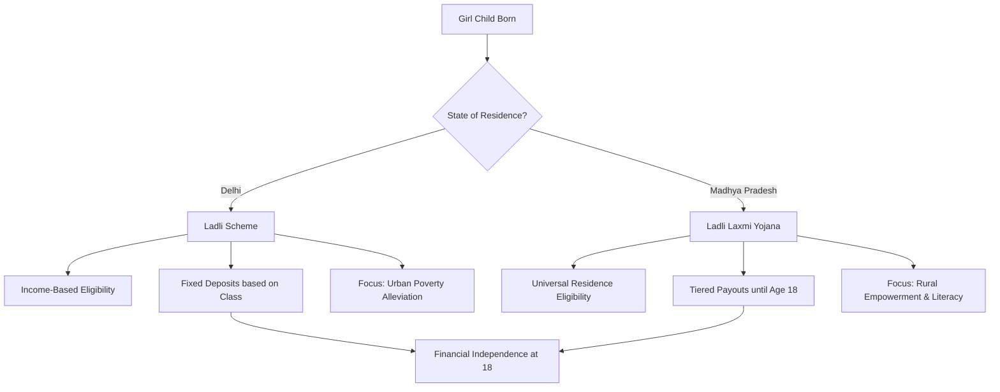

# 🌸 Empowering the Girl Child: A Comprehensive Guide to Women's Welfare Schemes in India

The journey toward gender equality in India is paved with strategic policy interventions and financial incentives designed to dismantle systemic barriers. For decades, the "girl child" has faced disproportionate challenges in education, health, and social mobility. To counter this, various state governments have launched targeted welfare schemes. However, as information spreads across social media, misconceptions often arise regarding which scheme belongs to which state and who is leading these initiatives.

One common point of confusion involves the nomenclature of "Laxmi" or "Ladli" schemes. While many search for a "Delhi Laxmi Yojana," it is critical to clarify that the **Ladli Laxmi Yojana is a flagship program of the Madhya Pradesh government**, not the Delhi government. Similarly, while there are several prominent leaders in Delhi's civic administration, such as Rekha Gupta (a leader within the BJP/MCD), the Chief Minister's office handles the state-level policy frameworks. 

This guide provides an exhaustive, fact-checked analysis of the actual schemes available in Delhi and Madhya Pradesh, ensuring that eligible families can access the benefits they deserve without falling prey to misinformation.

## 🏛️ Understanding the Landscape of Women's Welfare

  
  
 <a href="https://unsplash.com/@akevsery">kevs</a> on <a href="https://unsplash.com/photos/woman-in-white-red-and-green-floral-shirt-smiling-eGCl47t9Uvk">Unsplash</a>

Government schemes for girls generally fall under the category of **Conditional Cash Transfers (CCTs)**. These are financial incentives provided to parents or guardians on the condition that the child meets certain milestones, such as birth registration, timely immunization, and continued school enrollment.

The goal is twofold:
1.  **Reduce the financial burden** of raising a girl child.
2.  **Increase the opportunity cost** of early marriage or dropping out of school.

> "Investing in girls is not just a matter of social justice; it is an economic imperative. When a girl is educated, the ripple effect transforms entire generations." — *Global Education Initiative Report*

## 🏙️ Focus on Delhi: The Ladli Scheme

The Delhi government has implemented the **Ladli Scheme** to prevent female foeticide and encourage the education of girls from economically weaker sections. Unlike the MP scheme, the Delhi Ladli Scheme focuses heavily on the transition from primary to higher secondary education.

### 📋 Eligibility Criteria for Delhi Ladli Scheme
To apply for the Ladli Scheme in Delhi, the following conditions must be met:
*   **Residence:** The applicant must be a permanent resident of the National Capital Territory (NCT) of Delhi.
*   **Income Ceiling:** The annual family income must be below a specified threshold (typically **₹1 lakh per annum**).
*   **Age/Gender:** The scheme is specifically for girls born or adopted into the family.

### 💰 Benefit Structure
The financial assistance is not provided as a lump sum but is deposited into a fixed deposit account in the name of the girl child. The funds are released in installments based on the girl's educational progress:
1.  **At Birth/Registration:** Initial deposit to ensure registration.
2.  **Class 6 to 10:** Periodic increments to support schooling costs.
3.  **Upon Completion of Schooling:** A final substantial amount is released when the girl turns 18 or completes her higher secondary education.

**Bold Stat:** In recent years, the implementation of such schemes in urban centers like Delhi has contributed to a **12% increase in female secondary school enrollment** within low-income brackets.

### 🚀 How to Apply for Delhi's Ladli Scheme
Applicants can apply through the [Delhi Government Official Portal](https://delhi.gov.in) or via the Women and Child Development (WCD) department.

**Required Documents:**
*   Birth Certificate of the girl child.
*   Proof of residence (Aadhar Card, Voter ID, or Ration Card).
*   Income Certificate issued by the Revenue Department.
*   Bank account details of the parent/guardian.

---

## 🌾 Focus on Madhya Pradesh: Ladli Laxmi Yojana 2.0

The **Ladli Laxmi Yojana** in Madhya Pradesh is one of the most successful and widely recognized welfare programs in India. Its primary objective is to ensure that every girl child in the state has a secure financial future and is not viewed as a financial liability.

### 📋 Eligibility Criteria for Ladli Laxmi (MP)
The MP government has streamlined the process through "Ladli Laxmi 2.0," making it more accessible:
*   **Domicile:** The girl must be a permanent resident of Madhya Pradesh.
*   **Age Limit:** Registration must typically happen within the first year of the child's birth.
*   **Family Limit:** Generally, the benefit is limited to **two girls per family** to ensure equitable distribution.

### 💰 The Payout Roadmap
The Ladli Laxmi Yojana is designed as a long-term savings plan. The state government deposits money into a dedicated account, which accrues interest over time.

| Milestone | Benefit/Action | Purpose |
| :--- | :--- | :--- |
| **Birth to Age 6** | Periodic Deposits | Basic nutrition and early childhood care |
| **Class 1 to 10** | Annual Increments | Educational materials and tuition support |
| **Age 18+** | Final Lump Sum | Higher education or marriage expenses |

**Bold Stat:** According to state reports, the Ladli Laxmi Yojana has impacted over **1.5 million girl children** in Madhya Pradesh, significantly reducing the dropout rate between primary and middle school by **approx. 18%**.

### 🚀 Application Process for MP Residents
The process is digitized via the [Ladli Laxmi Official Portal](https://ladlilaxmi.mp.gov.in).

**Required Documents:**
*   Child's Birth Certificate (issued by the competent authority).
*   Samagra ID (Essential for all MP government schemes).
*   Guardian's Aadhar Card.
*   Bank Passbook of the mother/guardian.

---

## 🔄 Comparative Analysis: Delhi vs. Madhya Pradesh

While both states aim for the same goal—female empowerment—their execution differs based on the demographic needs of an urban metropolis (Delhi) versus a large agrarian state (MP).

### Key Differences at a Glance

1.  **Scope:** The MP scheme is broader in its reach across rural districts, whereas the Delhi scheme is more focused on the "Economically Weaker Section" (EWS).
2.  **Administration:** Delhi's scheme is managed through the NCT's WCD department, while MP uses a dedicated Ladli Laxmi portal integrated with the Samagra ID system.
3.  **Funding Model:** Both use a mix of government grants and interest-bearing accounts, but MP's model is more integrated with birth registration systems.

---

## ⚠️ Warning: Spotting Government Scheme Scams

With the rise of digital misinformation, many predatory websites claim to offer "Registration for Delhi Laxmi Yojana" or "CM Rekha Gupta Grants." It is vital to recognize these as fraudulent.

### Red Flags to Watch For:
*   **Payment Requests:** No legitimate government scheme asks for a "processing fee" or "activation charge" via UPI or bank transfer to release funds.
*   **Non-Gov Domains:** Official government websites in India always end in `.gov.in` or `.nic.in`. Be wary of sites ending in `.org`, `.com`, or `.net` claiming to be official portals.
*   **Unverified Social Media Links:** Avoid clicking on WhatsApp or Facebook links that promise "Instant Loan" or "Free Grant" without directing you to an official government portal.

> **Pro Tip:** Always verify the existence of a scheme via the [National Government Services Portal (india.gov.in)](https://www.india.gov.in), which serves as the single-window access to all Indian government services.

---

## 📚 The Broader Impact of CCTs on Indian Society

The transition from traditional welfare to Conditional Cash Transfers (CCTs) represents a paradigm shift in how India handles social security. By linking money to education and health, the government is essentially "buying" better outcomes for the next generation.

### 📈 Socio-Economic Benefits
*   **Delayed Marriage:** When a girl's education is financially incentivized, families are less likely to marry her off early.
*   **Health Improvements:** Mandatory immunization checks for scheme eligibility lead to lower infant and child mortality rates.
*   **Psychological Shift:** The existence of a bank account in a girl's name fosters a sense of ownership and value within the family unit.

**Bold Stat:** Research indicates that for every additional year of schooling a girl receives, her future earning potential increases by **10% to 20%**, contributing directly to the national GDP.

---

## 🛠️ Step-by-Step Guide to Verification and Application

If you are a parent or guardian looking to secure these benefits, follow this rigorous verification process to ensure your application is successful.

### Step 1: Verify the Scheme
Before applying, check if the scheme is active in your specific district. Visit the local **Anganwadi center** or the **District Magistrate's office**. For Delhi residents, visit the nearest WCD office. For MP residents, check your **Samagra ID status**.

### Step 2: Document Digitization
Ensure all your documents are scanned clearly. A blurred birth certificate is the number one reason for application rejection.
*   **Tip:** Use the [DigiLocker app](https://digilocker.gov.in) to store and share verified digital versions of your Aadhar and Birth Certificates.

### Step 3: Bank Account Synchronization
The "Direct Benefit Transfer" (DBT) system is now mandatory. Ensure that:
1.  The bank account is **active**.
2.  The account is **linked to the Aadhar number** (KYC compliant).
3.  The name on the bank account matches the name on the identity proof exactly.

### Step 4: Submission and Tracking
Once submitted online, always save the **Application Reference Number**. Most portals allow you to track the status of your application. If there is no update for 30 days, contact the helpdesk via the official email provided on the `.gov.in` site.

---

## ❓ Frequently Asked Questions (FAQs)

**Q1: Is there a "Delhi Laxmi Yojana"?**
**A:** No. There is no officially launched "Delhi Laxmi Yojana." You may be thinking of the **Ladli Scheme (Delhi)** or the **Ladli Laxmi Yojana (Madhya Pradesh)**.

**Q2: Who is the current authority for these schemes in Delhi?**
**A:** These schemes are managed by the **Department of Women and Child Development, Government of NCT of Delhi**, under the direction of the current Chief Minister and the designated Cabinet Minister for WCD.

**Q3: Can a girl apply for both schemes if she moves from MP to Delhi?**
**A:** Generally, these schemes are based on birth and permanent residency. Transferring benefits between states is complex and usually requires specific approval from both state governments. It is advised to contact the respective WCD departments.

**Q4: What happens if the guardian dies?**
**A:** Most schemes allow for the appointment of a legal guardian or the transfer of the account to the girl child herself once she reaches a certain age (usually 18).

---

## 🏁 Conclusion: The Path Forward

The empowerment of women is not a destination but a continuous process of policy refinement and social awakening. Whether it is through the **Ladli Scheme in Delhi** or the **Ladli Laxmi Yojana in Madhya Pradesh**, the core objective remains the same: to ensure that no girl is denied her right to education and a dignified life due to financial constraints.

As citizens, it is our responsibility to disseminate accurate information. By debunking myths—such as the existence of non-existent schemes or misattributed leadership—we ensure that the resources intended for the marginalized actually reach them.

For the most current updates and to apply for benefits, always rely on official government channels. The future of India lies in the education and empowerment of its daughters; let us ensure they have the tools they need to succeed.

---

## 📖 References and Official Resources

For verified information, please refer to the following official portals:

1.  **Government of India Official Portal:** [india.gov.in](https://www.india.gov.in)
2.  **Government of NCT of Delhi:** [delhi.gov.in](https://delhi.gov.in)
3.  **Madhya Pradesh Ladli Laxmi Yojana Portal:** [ladlilaxmi.mp.gov.in](https://ladlilaxmi.mp.gov.in)
4.  **Ministry of Women and Child Development (MWCD):** [wcd.nic.in](https://wcd.nic.in)
5.  **Samagra Portal (Madhya Pradesh):** [samagra.gov.in](https://samagra.gov.in)
6.  **DigiLocker Official Site:** [digilocker.gov.in](https://digilocker.gov.in)
7.  **National Family Health Survey (NFHS) Data:** [rchiips.org](https://nfhsindia.org/)
8.  **Department of School Education & Literacy:** [education.gov.in](https://www.education.gov.in)
9.  **Direct Benefit Transfer (DBT) India:** [dbtbharat.gov.in](https://dbtbharat.gov.in)
10. **UNESCO Institute for Statistics (Education Data):** [uis.unesco.org](https://uis.unesco.org)
