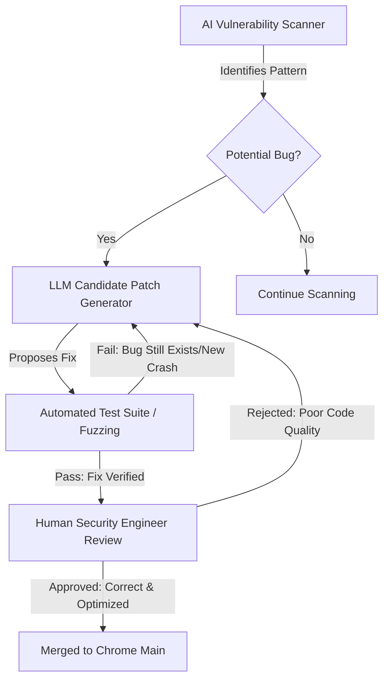

# 🛡️ Google Just Used AI to Nuke 1,072 Chrome Bugs—Here’s Why That’s a Big Deal

For decades, the battle for browser security has been a relentless game of "Whac-A-Mole." A security researcher discovers a vulnerability, Google rushes a patch into a stable channel, and within hours, sophisticated threat actors find a slightly modified version of that same hole to crawl through. This cycle is not a failure of talent, but a failure of scale. 

Google Chrome is one of the most complex pieces of software ever written, comprising tens of millions of lines of C++ code. To put that in perspective, the human brain cannot hold the entire architectural map of a modern browser. Trying to identify every single memory leak or pointer error by hand is like trying to find every grain of misplaced sand on a beach using a magnifying glass.

But the paradigm has just shifted. Google recently leveraged Large Language Models (LLMs) to hunt down and remediate a staggering **1,072 bugs** in the Chrome browser. According to reports from [Security Affairs](https://securityaffairs.com), this wasn't a routine update—it was a massive operational experiment in using AI to play defense. 

We are witnessing a transition from "reactive patching"—where we fix things after they break—to "predictive prevention." This marks the rise of the AI-powered security engineer, where the AI manages the crushing volume of repetitive code audits, leaving human experts to tackle the high-level architectural flaws.

---

## 🔍 Breaking Down the 1,072 Bugs: The Danger of the "Long Tail"

  
  
 <a href="https://unsplash.com/@growtika">Growtika</a> on <a href="https://unsplash.com/photos/a-group-of-tin-cans-sitting-on-top-of-a-blue-and-pink-floor-Jcw-i0fSqXg">Unsplash</a>

When the public hears that over a thousand bugs were fixed, the immediate reaction is often panic: *"Was my browser that broken?"* However, to understand this, we have to look at the "long tail" of vulnerability management.

In cybersecurity, bugs are typically categorized by severity: **Critical, High, Medium, and Low**. Most security teams obsess over the "Critical" bugs—the ones that allow Remote Code Execution (RCE) or complete system takeover. But the real danger often hides in the Medium and Low severity bugs. While a single "Low" bug might be harmless, hackers use a technique called **Exploit Chaining**. By stringing together three or four minor bugs, an attacker can bypass a browser's sandbox and gain access to the underlying operating system.

The majority of these 1,072 bugs were related to **memory safety**. Because Chrome is primarily written in C++, it grants developers direct control over the computer's memory. While this makes Chrome incredibly fast, it also makes it fragile. If a developer mismanages a single pointer, it creates a vulnerability.

According to [Wikipedia's comprehensive guide on memory safety](https://en.wikipedia.org/wiki/Memory_safety), there are three primary culprits that AI is now hunting:

1.  **Use-After-Free (UAF):** This occurs when a program continues to use a pointer after the memory it points to has been deleted. Attackers use this to "hijack" the program's execution flow by placing their own malicious code in that freed memory space.
2.  **Buffer Overflows:** This happens when a program writes more data to a block of memory (a buffer) than it can hold, causing the excess data to spill over and overwrite adjacent memory. This is a classic way to inject malicious instructions.
3.  **Out-of-bounds Reads:** When a program reads data outside its intended boundary, it can leak sensitive information—like passwords or encryption keys—from other parts of the system's memory.

AI is uniquely suited for this task because it doesn't suffer from "auditor fatigue." A human engineer staring at C++ code for eight hours will eventually miss a subtle logic error. An LLM, however, can scan millions of lines of code with the same level of scrutiny in seconds. By cleaning out these "low-hanging fruit" bugs, Google has drastically shrunk the **attack surface** of Chrome.

> "The ability to automate the discovery and remediation of a thousand-plus bugs simultaneously changes the economics of vulnerability research. It forces the attacker to work harder while the defender scales exponentially."

---

## ⚙️ How It Actually Works: The Automated Program Repair (APR) Pipeline

A common concern is the risk of "AI Hallucinations." If you simply asked a chatbot to "fix Chrome," it might suggest a patch that fixes the bug but accidentally deletes the browser's ability to render CSS or, worse, introduces a new security hole. 

To prevent this, Google implemented a rigorous **Automated Program Repair (APR)** pipeline. This isn't a simple prompt-and-response system; it is a closed-loop engineering factory. Drawing on research found in [ArXiv's studies on LLMs for program repair](https://arxiv.org/abs/2308.05423), the process follows a strict logical flow:

### 1. The Hunt (Detection)
The process begins with an AI scanner that doesn't just look for known bugs, but for *patterns* that typically lead to them. It looks for "smells" in the code—such as a pointer being used without a null-check or a complex loop that might lead to a buffer overflow.

### 2. The Suggestion (Generation)
Once a potential issue is flagged, an LLM analyzes the surrounding context. It looks at how the rest of the module is written and suggests a "candidate patch." This might involve adding a safety boundary check or implementing a smarter memory management routine.

### 3. The Gauntlet (Verification)
This is the most critical stage. The suggested fix is sent to a **Fuzzer**. Fuzzing is a technique where the system bombards the code with massive amounts of random, malformed, and "garbage" data to see if it crashes. If the AI's fix causes a crash, the patch is discarded immediately. If the fix solves the bug and survives the fuzzing, it moves forward.

### 4. The Human Check (Validation)
The final gatekeeper is a human security engineer. The AI doesn't commit code; it proposes it. The human ensures the fix follows [Google's C++ Style Guide](https://google.github.io/styleguide/cppguide.html) and doesn't create a performance bottleneck.

By wrapping the AI in a layer of automated testing and human oversight, Google has turned the LLM from a "creative writer" into a "precision tool."

---

## 🏗️ The C++ Problem: Why AI is a Mandatory Evolution

To understand why this AI intervention is necessary, we have to address the fundamental flaw of C++. For decades, C++ has been the industry standard for high-performance software (like browsers, operating systems, and game engines) because it allows developers to communicate almost directly with the hardware.

However, this power comes with a steep price: **Manual Memory Management**.

In languages like Java or Python, a "Garbage Collector" automatically cleans up memory that is no longer needed. In C++, the developer is the garbage collector. You must explicitly tell the computer when to allocate memory and when to release it. 

**The statistics are sobering:**
*   **70% of all high-severity security vulnerabilities** in large-scale C/C++ projects (including Windows and Chrome) are memory-safety issues.
*   Chrome contains **millions of lines of legacy code**, much of which was written before modern security best practices were established.
*   The complexity of the modern web—with its myriad of APIs and rendering engines—creates **thousands of edge cases** that are nearly impossible to test manually.

As noted in the [C++ documentation on Wikipedia](https://en.wikipedia.org/wiki/C%2B%2B), the language's flexibility is its greatest weakness. A single misplaced `delete` statement can open a door for an attacker. AI is the only way to audit this volume of code at the speed required by the modern threat landscape.

---

## 🤝 The Human Element: From Bug Hunter to Editor-in-Chief

There is a persistent narrative that AI will replace software engineers. However, the "Great Chrome Cleanup" suggests the opposite: it is redefining the role of the engineer.

Google utilizes a framework called **Human-in-the-Loop (HITL)**. The goal isn't to remove the human, but to remove the *drudgery*. In the old model, a security engineer might spend 40 hours a week hunting for a single, elusive Use-After-Free bug. In the AI-augmented model, that same engineer spends their week reviewing 50 high-quality patches proposed by the AI.

**Where the human remains indispensable:**
*   **Contextual Understanding:** AI can see that a piece of code is "incorrect" based on patterns, but it doesn't understand *why* a feature exists or how it serves the end user.
*   **Strategic Risk Assessment:** A human can recognize that a "low-severity" bug is actually a critical vulnerability because of how it interacts with a specific hardware driver or a third-party API.
*   **Architectural Vision:** AI can patch a leak, but it cannot decide that the entire memory management system needs to be redesigned for the next decade of computing.

The security engineer has evolved from a "detective" into an "editor-in-chief." They are no longer searching for the needle in the haystack; they are deciding which needles the AI has found are actually dangerous.

---

## 🚀 The Long Game: The Migration to Rust

While fixing 1,072 bugs is a victory, Google knows that patching C++ is like plugging holes in a leaking dam. The dam is still made of a material that is prone to leaking. To truly solve the problem, they need to change the material.

This is why the AI cleanup is happening in tandem with a massive architectural shift: **The migration of Chrome to Rust**.

[Rust](https://en.wikipedia.org/wiki/Rust_(programming_language)) is a systems programming language that provides the performance of C++ but with a fundamental guarantee: **Memory Safety**. Rust achieves this through a concept called the "Borrow Checker." Instead of relying on the developer to remember to free memory, the Rust compiler enforces strict rules about how memory is accessed. If you try to write a Use-After-Free bug in Rust, the code simply will not compile.

**Google's Dual-Track Strategy:**
1.  **Short-Term (AI):** Use LLMs to scrub existing C++ code, maintaining a high security baseline and eliminating the "long tail" of vulnerabilities.
2.  **Long-Term (Rust):** Gradually rewrite critical components of the Chromium engine in Rust, making memory-safety bugs physically impossible to write.

In this strategy, AI is the bridge. It keeps the browser secure today while the slow, methodical work of rewriting the core takes place. Eventually, the need for AI-driven memory audits will vanish because the language itself will act as the ultimate security guard.

---

## ⚔️ The AI Arms Race: Defender vs. Attacker

We must acknowledge a sobering reality: **The attackers have access to the same LLMs.**

We have entered an era of "Adversarial AI." The same technology Google uses to find and fix bugs can be inverted to find and exploit them. We are seeing the emergence of AI-driven "Zero-Day" hunters—tools that can scan software for vulnerabilities and automatically generate the exploit code required to weaponize them.

This creates a phenomenon known as the **Red Queen's Race** (a reference to *Through the Looking-Glass*), where both the defender and the attacker must run as fast as they can just to stay in the same place. If Google uses AI to fix 1,000 bugs, a state-sponsored actor might use AI to find 1,001.

**The new dynamics of the AI arms race:**
*   **Automated Exploit Generation (AEG):** AI tools can now take a crash report and automatically determine if that crash is exploitable, significantly reducing the time from "bug discovery" to "active attack."
*   **Intelligent Fuzzing:** Rather than throwing random data at a program, AI-powered fuzzers (like those discussed in [NIST security guidelines](https://www.nist.gov)) use machine learning to "learn" the program's structure and target the most fragile parts of the code.
*   **The Compression of Time:** The window between the discovery of a vulnerability and its exploitation is shrinking from weeks to minutes.

Google's move to AI-driven patching isn't just about efficiency—it's about survival. When an attack can be generated by an AI in milliseconds, the only viable defense is a patch that can be generated and deployed at the same speed.

---

## 🏁 Final Thoughts: A New Way of Building Software

The fact that Google used AI to eliminate **1,072 bugs** is a signal that the era of "artisanal" software maintenance is over. For too long, the industry accepted that software would always be buggy and that "stability" was an unreachable ideal.

By integrating AI into the heart of the [Chromium project](https://www.chromium.org/Home), Google is demonstrating that we can manage the "long tail" of vulnerabilities at an industrial scale. We are moving toward a future of **Self-Healing Code**, where software can identify its own flaws and propose its own repairs before a human—or a hacker—ever notices them.

The takeaway is clear: AI is not replacing the expert; it is liberating them. By automating the grunt work of memory audits, security engineers can focus on the high-level challenges of architecture, threat modeling, and the transition to memory-safe languages.

The battle for the browser is far from over, but the weaponry has changed. The "Great Chrome Cleanup" is merely the opening salvo. The ultimate goal is no longer to fix a thousand bugs—it is to build a digital world where those bugs can no longer exist.

---

## 📚 References & Further Reading

*   **Security Affairs**: [Google AI Supercharges Chrome Security, Fixing 1,072 Bugs](https://securityaffairs.com) - Primary source on the scale of the AI-driven bug fix.
*   **Wikipedia**: [Memory Safety Definition and Overview](https://en.wikipedia.org/wiki/Memory_safety) - Technical background on UAF and Buffer Overflows.
*   **Wikipedia**: [C++ Language and Vulnerabilities](https://en.wikipedia.org/wiki/C%2B%2B) - Understanding the complexities of manual memory management.
*   **Wikipedia**: [Rust Programming Language](https://en.wikipedia.org/wiki/Rust_(programming_language)) - Exploration of the Borrow Checker and memory safety.
*   **ArXiv**: [Large Language Models for Automated Program Repair](https://arxiv.org/abs/2308.05423) - Academic research on the efficacy of LLMs in fixing code.
*   **Google Security Blog**: [Insights into Chrome Security and Vulnerability Management](https://security.googleblog.com) - Official updates on how Google handles browser threats.
*   **OWASP**: [Top 10 Vulnerability Guide](https://owasp.org/www-project-top-ten/) - Industry standard for identifying software security risks.
*   **Chromium Project**: [Official Development Documentation](https://www.chromium.org/developers/) - Insights into the architectural scale of the Chrome browser.
*   **NIST**: [Guidelines on Software Vulnerability Management](https://www.nist.gov) - Federal standards for identifying and remediating software flaws.
*   **Chrome Release Notes**: [Official Chrome Security Updates](https://chromereleases.googleblog.com) - Real-time tracking of security patches in the Chrome ecosystem.
