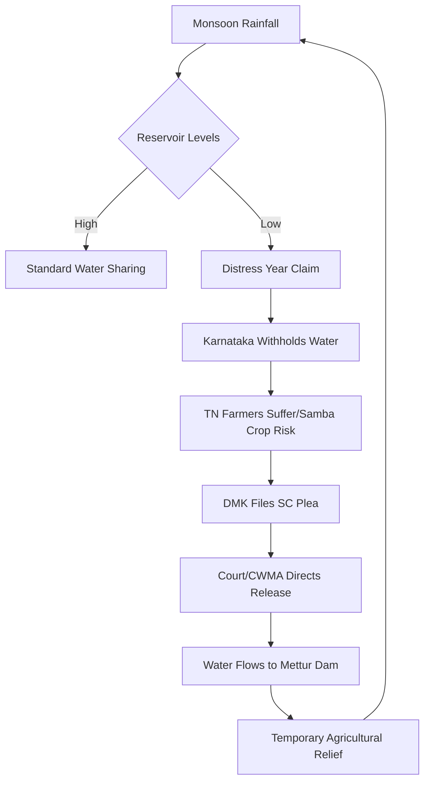

# The Fight for the Cauvery: Why Tamil Nadu and Karnataka are Back in Court

The Cauvery river is far more than a geographical feature; for the millions inhabiting the basins of South India, it is a lifeline, a cultural symbol, and a source of ancestral pride. However, it is also the epicenter of one of the most protracted and bitter legal battles in the history of the Indian republic. For over a century, the upstream state of Karnataka and the downstream state of Tamil Nadu have clashed over the allocation of its waters, turning a natural resource into a political weapon. 

Recently, tensions have escalated once again. The DMK-led government in Tamil Nadu has approached the Supreme Court of India, seeking urgent intervention to compel Karnataka to release additional water. At the heart of this fresh dispute is the survival of the **Samba crop**, the primary paddy cycle that sustains the agrarian economy of the Cauvery Delta. With reservoirs fluctuating and monsoon patterns becoming increasingly erratic due to climate change, the Tamil Nadu government fears an agricultural collapse. As reported by [Live Law](https://www.livelaw.in), the state is arguing that the [Cauvery Water Management Authority (CWMA)](https://en.wikipedia.org/wiki/Kaveri_River_water_dispute) has failed to ensure the timely flow of water, leaving millions of farmers in a state of precariousness.

---

## 🚨 What Sparked This? The DMK’s Urgent Plea

  
  
 <a href="https://unsplash.com/@anmol_ram_">Anmol Ramanujam</a> on <a href="https://unsplash.com/photos/river-between-green-trees-under-white-clouds-and-blue-sky-during-daytime-iT5HdREilcw">Unsplash</a>

The current legal friction was ignited when the Tamil Nadu government filed a fresh application with the Supreme Court. The core of their grievance is the timing of water releases. In the delta regions—the "rice bowl" of the state—the **Samba cultivation** is not merely a farming activity but the backbone of the local economy. This specific variety of paddy requires a precise volume of water during its critical growth phases. If the water does not arrive during the sowing and flowering stages, the entire harvest is jeopardized.

Tamil Nadu's legal counsel argues that while some pockets of the state received adequate rainfall, the overall inflow into the Mettur Dam remains critically low. They contend that Karnataka is retaining an excessive volume of water in its reservoirs, specifically the **Krishna Raja Sagara (KRS)** and **Kabini** dams, far beyond what is required for its own drinking water needs and local irrigation. The state is demanding that the CWMA enforce strict release schedules to prevent a total crop failure.

> "The failure to release water at this juncture is not merely an administrative lapse but a direct threat to the livelihood of lakhs of farmers in the Cauvery Delta, who are already grappling with the effects of erratic weather patterns and mounting debt."

The mathematics of the Samba crop are unforgiving. Agronomists suggest that a shortfall of even **10% to 15%** in water availability during the peak growth phase can lead to a drastic drop in yield. For farmers who have already invested heavily in seeds and fertilizers—often through high-interest loans—this deficit is catastrophic. By bypassing the slower administrative channels of the CWMA and going directly to the Supreme Court, the DMK government is attempting to secure a legally binding order that Karnataka cannot ignore.

---

## ⚖️ The Legal Framework: The 2018 Judgment and the CWMA

To understand why the dispute perpetually returns to the courtroom, one must examine the complex legal architecture governing the river. For decades, the conflict was managed by a series of ad-hoc committees and tribunals. However, the [2018 Supreme Court Judgment](https://en.wikipedia.org/wiki/Kaveri_River_water_dispute) attempted to bring a finality to the chaos. The court upheld the majority of the Cauvery Water Disputes Tribunal's (CWDT) award but adjusted the allocation to account for the drinking water needs of Bengaluru.

The most significant outcome of the 2018 verdict was the establishment of the **Cauvery Water Management Authority (CWMA)**. Designed as an independent regulatory body, the CWMA was tasked with:
1.  Monitoring reservoir levels in real-time.
2.  Managing the release of water from Karnataka to Tamil Nadu.
3.  Ensuring the "Final Award" is implemented without political interference.

Despite these intentions, the CWMA often finds itself caught in a geopolitical crossfire. Tamil Nadu frequently accuses the authority of being too lenient toward Karnataka, while Karnataka argues that the CWMA ignores the realities of "distress years." 

The crux of the legal battle usually hinges on the definition of a **"distress year."** In a normal monsoon year, the water sharing is straightforward. However, in a year where rainfall falls significantly below the long-term average, the rules change. Karnataka often claims a state of distress to justify withholding water for its own survival, while Tamil Nadu points to reservoir percentages to argue that the "distress" is exaggerated for political leverage.

---

## 🌧️ Karnataka’s Perspective: The "Distress Year" Dilemma

From the viewpoint of the Karnataka government, the demand for "urgent releases" often feels like an infringement on their own right to survive. The state argues that the Cauvery basin has seen extreme volatility in rainfall, and releasing water indiscriminately could lead to a humanitarian crisis in its own territory.

The primary concern for Karnataka is the drinking water security of **Bengaluru**, one of the world's fastest-growing cities. The city relies heavily on the Cauvery for its water supply. If the levels in the **Krishna Raja Sagara (KRS)** reservoir dip below a critical threshold, the state faces the prospect of severe water rationing for millions of urban residents. Furthermore, the farmers of the **Mandya region**—a politically sensitive belt—depend on the same water that Tamil Nadu is demanding.

**Key Statistics Cited by Karnataka:**
*   **Rainfall Deficit**: In several recent seasons, Karnataka has reported a **20% to 30%** deficit in rain within the catchment areas of the Western Ghats.
*   **Urban Demand**: The water requirement for Bengaluru has surged, making drinking water a non-negotiable priority over downstream irrigation.
*   **Critical Thresholds**: When KRS levels drop below **50%**, the political and social pressure within Karnataka to halt all releases becomes immense.

Karnataka views the DMK's Supreme Court plea as an attempt to politicize a technical hydrological issue. They maintain that the CWMA's data is the only objective metric and that judicial overrides of technical data set a dangerous precedent. It is a classic conflict of priorities: Tamil Nadu is fighting for the **Samba crop**, while Karnataka is fighting for **urban survival and local sustenance**.

---

## 🕰️ A Century of Conflict: The Historical Roots

The Cauvery dispute is not a modern phenomenon; it is a legacy of the colonial era. The conflict dates back to the late 19th century, with a series of agreements signed between the then-Princely State of Mysore and the Madras Presidency. The 1892, 1924, and 1930 agreements attempted to carve out water shares, but they were fundamentally flawed. They were based on historical rainfall patterns that did not account for the massive population explosion or the shift toward water-intensive agriculture in the 20th century.

By the 1960s, the dispute had evolved into a full-blown inter-state war of words. This led to the formation of the **Cauvery Water Disputes Tribunal (CWDT)** in 1990. The tribunal spent nearly two decades analyzing hydrology reports, rainfall data, and historical usage. Even when the "Final Award" was delivered in 2007, it failed to bring peace. Instead, it triggered violent protests in Karnataka, fueling the "Save Cauvery" movement and cementing the river as a symbol of regional identity.

The cycle of the conflict follows a predictable, tragic pattern:
1.  **Monsoon Failure**: Irregular rainfall leads to low reservoir levels.
2.  **Agricultural Distress**: Paddy crops in the Tamil Nadu delta begin to wither.
3.  **Political Escalation**: Tamil Nadu demands water; Karnataka refuses, citing its own shortage.
4.  **Judicial Intervention**: The case reaches the Supreme Court or the CWMA.
5.  **Temporary Resolution**: A court order forces a water release, providing a short-term fix until the next season.

This century-long loop has fostered deep-seated distrust. In Tamil Nadu, the Cauvery is viewed as a birthright; in Karnataka, protecting its flow is seen as a battle for the state's very existence.

---

## 🌾 The Human Cost: Beyond the Legal jargon

While the legal battles are fought in the air-conditioned halls of the Supreme Court using terms like "cusecs" (cubic feet per second), the actual consequences are felt in the mud and dust of the river basin. The human cost of this dispute is staggering, particularly for small-scale farmers who lack financial buffers.

In the **Cauvery Delta**, the failure of a Samba crop is more than a financial loss; it is a psychological trauma. In districts like Thanjavur and Tiruvarur, farming is an intergenerational struggle. Many farmers are trapped in a cycle of predatory lending. They borrow for seeds and fertilizers based on the hope of a timely water release. When the water fails to arrive, the crops die, but the debt remains.

**The socioeconomic impact includes:**
*   **Agrarian Crisis**: There is a documented correlation between extreme water shortages in the delta and a spike in farmer suicides.
*   **Rural Flight**: A growing number of youth are abandoning ancestral lands to seek menial work in Chennai or Bengaluru, as farming has become an unsustainable gamble.
*   **Food Security**: As the "rice bowl" of Tamil Nadu, any failure in the delta leads to increased rice prices across the state, affecting the urban poor.

Conversely, farmers in Karnataka's Mandya region feel like pawns in a larger political game. They are often used as visual symbols of "distress" to pressure the central government. The "water wars" have effectively pitted two marginalized farming communities against each other, while the root cause—environmental degradation—remains unaddressed.

> "The tragedy of the Cauvery is that the people who need the water most—the farmers—are the ones who have the least say in how it is managed, while the water is used as a tool for electoral mobilization."

---

## 🌍 The Environmental Context: Climate Change and the Western Ghats

The political fight over the Cauvery often ignores the ecological reality: the river itself is shrinking. The conflict is treated as a "zero-sum game" where one state's gain is another's loss. However, the actual "pie" is getting smaller due to environmental neglect.

The Cauvery originates in the **Western Ghats**, a biodiversity hotspot that acts as a giant sponge for the monsoon. Decades of deforestation, unplanned urbanization, and mining have stripped the hills of their cover, reducing the land's ability to retain water. This results in "flashy" river behavior—massive floods during heavy rain and bone-dry beds during the summer.

Furthermore, the "heat island" effect in rapidly expanding cities like Bengaluru has altered local rainfall patterns. When the forest cover vanishes, the groundwater recharge rate drops, forcing the state to rely even more heavily on surface reservoirs like the KRS.

**The Environmental Equation:**
*   **Deforestation** $\rightarrow$ Reduced Soil Moisture $\rightarrow$ Lower Baseflow in the River.
*   **Climate Change** $\rightarrow$ Erratic Monsoons $\rightarrow$ More Frequent "Distress Years."
*   **Over-extraction** $\rightarrow$ Depleted Aquifers $\rightarrow$ Total Dependence on Dam Releases.

---

## 🚀 Looking Forward: Is There a Sustainable Solution?

It has become evident that litigation is a band-aid, not a cure. The Supreme Court can mandate the release of water, but it cannot mandate the rain. To break the century-long cycle of conflict, South India must transition from "water sharing" to "integrated water management."

The most urgent shift required is agricultural. The obsession with water-hungry crops like Samba paddy in a semi-arid region is ecologically unsustainable. The government has incentivized rice production for decades, but the hydrology of the basin can no longer support this.

**Proposed Strategic Shifts:**
1.  **Crop Diversification**: Shifting from paddy to climate-resilient crops like millets (Ragi, Jowar), pulses, and oilseeds. These crops require a fraction of the water and are often more nutritious.
2.  **Precision Irrigation**: Implementing "Per Drop More Crop" initiatives via drip and sprinkler irrigation on a massive scale to reduce runoff and evaporation.
3.  **Transparent Data Systems**: Establishing a shared, real-time digital dashboard for rainfall and reservoir levels, accessible to the public, to eliminate suspicion and "data wars."
4.  **Eco-Restoration**: A joint Karnataka-Tamil Nadu project to reforest the Western Ghats catchment areas, treating the river's source as a shared ecological asset.

Technology could bridge the trust gap. Satellite-based moisture monitoring and AI-driven weather forecasting could allow the CWMA to predict distress years months in advance. This would enable farmers to choose their crops based on predicted water availability rather than gambling on the monsoon.

---

## 🏁 Wrapping Up: Cooperation Over Conflict

The DMK's current move to the Supreme Court may provide a temporary reprieve for the Samba crop this season, but it does nothing to solve the structural crisis of the Cauvery. The dispute is a cautionary tale of how political rivalry and a refusal to adapt to ecological changes can turn a life-giving river into a battlefield.

For a farmer in the delta or a resident of Bengaluru, a legal victory is meaningless if the taps are dry. The 2018 judgment and the creation of the CWMA were steps toward a technical solution, but they can only succeed if there is genuine political will to prioritize ecology over electoral gain.

Ultimately, the solution lies in recognizing that the Cauvery basin is a single, breathing ecological system. The river does not recognize state borders, and it is time for the governments of Karnataka and Tamil Nadu to stop treating it as a boundary. By embracing climate-smart agriculture and joint environmental stewardship, they can ensure that the Cauvery continues to sustain future generations.

## 📚 References

*   [Live Law - Comprehensive Coverage of Cauvery Water Dispute Pleas](https://www.livelaw.in)
*   [Wikipedia - Detailed History of the Cauvery River Water Dispute](https://en.wikipedia.org/wiki/Kaveri_River_water_dispute)
*   [The Hindu - Analysis of Inter-State Water Conflicts in South India](https://www.thehindu.com)
*   [Supreme Court of India - 2018 Final Verdict on Cauvery Allocation](https://main.sci.gov.in)
*   [CWMA - Official Guidelines for Water Management](https://en.wikipedia.org/wiki/Kaveri_River_water_dispute)
*   [Indian Express - Reports on the Socioeconomic Impact of Samba Crop Failure](https://indianexpress.com)
*   [Central Water Commission (CWC) - Basin Reports on the Cauvery River](https://cwc.gov.in)
*   [Environmental Reports on Western Ghats Deforestation and Rainfall Patterns](https://en.wikipedia.org/wiki/Western_Ghats)
