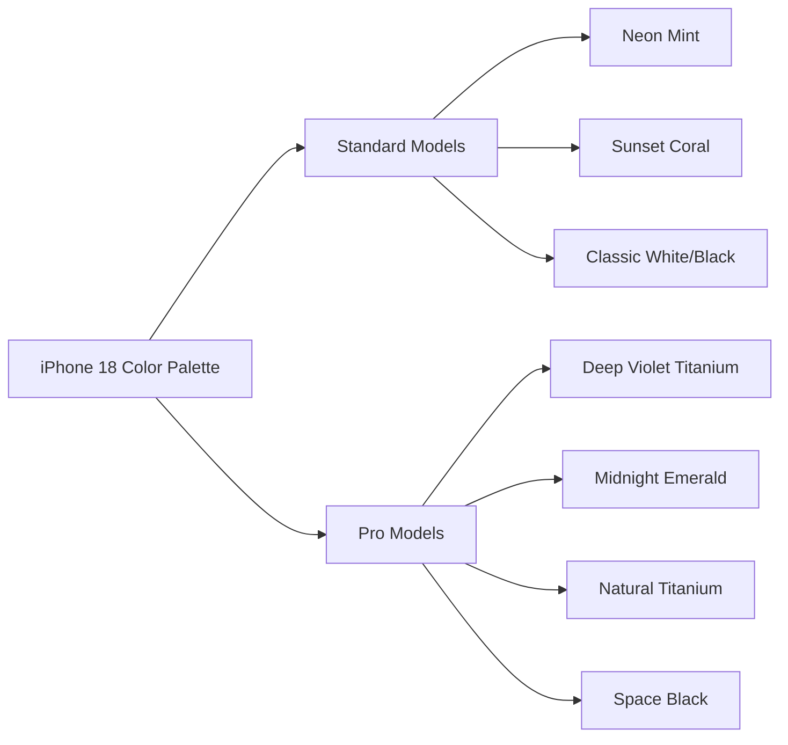

# 🚀 Introduction: Looking Toward 2026

In the hyper-accelerated world of consumer electronics, the cycle of anticipation is relentless. Barely have we acclimated to the integration of Apple Intelligence and the refined ergonomics of current hardware before the industry's gaze shifts toward the horizon. While the current generation focuses on the foundational rollout of AI, the rumor mill has already pivoted to the **iPhone 18 series**, slated for 2026. According to leaks aggregated by [chshyd.in](https://chshyd.in), 2026 will not be a year of iterative refinement, but rather a structural pivot in the philosophy of the smartphone.

For the last several cycles, Apple has adhered to a strategy of "safe evolution": incremental increases in Nits (brightness), marginal chip clock speeds, and the introduction of a new flagship color. However, the iPhone 18 is positioning itself as a "Great Leap Forward." The catalyst for this shift is the transition to **TSMC’s 2nm process**. This isn't merely a marketing buzzword; it represents a fundamental shift in semiconductor physics that promises to redefine power efficiency, thermal management, and computational density.

When combined with rumors of a truly "all-screen" aesthetic—driven by under-display sensor technology—and a pricing strategy designed to support massive on-device Large Language Models (LLMs), the iPhone 18 emerges as something more than a communication device. It is shaping up to be an invisible, proactive assistant integrated into a seamless slab of glass. To provide a comprehensive outlook, we have synthesized supply chain roadmaps, semiconductor research, and display patents to map out the device that will likely define the late 2020s.

---

## 📅 The Release Calendar: Synchronization and Silicon

  
  
 <a href="https://unsplash.com/@onurbinay">Onur Binay</a> on <a href="https://unsplash.com/photos/silver-iphone-6-and-red-iphone-case-OKjJZNTl004">Unsplash</a>

Apple's release cadence is one of the most predictable rhythms in global commerce. The company has perfected the autumn launch window to maximize holiday sales and synchronize with the production cycles of its global partners. Based on historical data and supply chain logistics, the **iPhone 18 is expected to arrive in September 2026**.

This timing is dictated by the "silicon roadmap." The production of a flagship SoC (System on a Chip) is a multi-year endeavor. According to [TSMC's corporate roadmap](https://www.tsmc.com), the mass production of 2nm wafers is scheduled to commence in 2025. For Apple to refine the A20 chip, conduct rigorous stability testing, and scale production to meet millions of units, a September 2026 launch is the earliest realistic window.

The expected lineup will likely maintain the established four-tier hierarchy to capture diverse market segments:
*   **iPhone 18**: The baseline flagship, offering the core 2nm experience.
*   **iPhone 18 Plus**: A large-format alternative for those prioritizing screen real estate and battery over "Pro" features.
*   **iPhone 18 Pro**: The professional powerhouse, featuring the full 48MP array and high-bandwidth RAM.
*   **iPhone 18 Pro Max**: The absolute ceiling of mobile technology, combining maximum battery, screen, and optical zoom.

> "The predictability of Apple's release cycle is not a lack of creativity, but a masterclass in supply chain synchronization. By timing the release with the 2nm transition, Apple ensures the 'wow factor' is backed by actual physics, not just marketing." — Senior Supply Chain Analyst.

Leading up to the event, we anticipate a surge in leaks from panel manufacturers like Samsung Display and LG Display. The core rumor suggests a transition to next-generation LTPO (Low-Temperature Polycrystalline Oxide) panels, which are essential for the rumored "invisible" sensor array that could finally retire the Dynamic Island.

---

## 💰 The Price Pivot: The Cost of Innovation

While consumers hope for price stability, the economic reality of the iPhone 18 suggests an upward trajectory. According to reports from [chshyd.in](https://chshyd.in), Apple is facing a "perfect storm" of increasing Bill of Materials (BoM) costs.

The primary driver is the cost of fabrication. Moving from 3nm to **2nm silicon** requires the implementation of High-NA (High Numerical Aperture) EUV lithography. These machines, produced by ASML, cost hundreds of millions of dollars per unit and require entirely new clean-room infrastructures. These capital expenditures inevitably trickle down to the MSRP.

Furthermore, the shift toward "On-Device AI" necessitates a hardware upgrade. To run sophisticated LLMs locally without relying on cloud latency, the iPhone 18 Pro models are rumored to jump to **12GB or 16GB of LPDDR5X RAM**. RAM is one of the more expensive components per square millimeter on a logic board.

**Projected Pricing Tiers:**
*   **iPhone 18**: **$799 - $899** (A modest increase to accommodate the A20 baseline).
*   **iPhone 18 Plus**: **$899 - $999**.
*   **iPhone 18 Pro**: **$1,099 - $1,199**.
*   **iPhone 18 Pro Max**: **$1,199 - $1,299**.

There is persistent speculation regarding a new **"Ultra" tier**. If Apple introduces a model featuring a 10x optical periscope lens and a 1-inch main sensor, we could see a flagship priced at **$1,399 or higher**. This would signal Apple's intent to move the iPhone away from being a general-consumer tool and toward being a specialized instrument for professional creators.

---

## 🎨 A New Palette: The Intersection of Design and Material Science

Color in the Apple ecosystem has evolved from simple aesthetics to a statement on material science. The introduction of Grade 5 Titanium in previous generations shifted the visual language toward a matte, industrial feel. For the iPhone 18, leaks suggest a return to vibrancy, but with a sophisticated, metallic twist.

According to [chshyd.in](https://chshyd.in), Apple will employ a bifurcated color strategy to clearly differentiate the "Consumer" and "Professional" lines.

**The Standard Line (iPhone 18 & 18 Plus):**
Apple is expected to lean into "Playful" tones to attract a younger demographic. Rumors point to **"Neon Mint"** and **"Sunset Coral."** These colors are likely to be achieved through a fused-glass infusion process, giving the chassis a depth that makes the color appear to float beneath the surface.

**The Pro Line (iPhone 18 Pro & Pro Max):**
The Pro models will maintain a "Prestigious" aesthetic. The rumored "Hero Color" for 2026 is **"Deep Violet Titanium"** or **"Midnight Emerald."** Rather than a simple coating, these will use advanced anodization, creating a color-shift effect that reacts to ambient lighting.

This shift is also tied to Apple's 2030 carbon-neutral goals. The use of recycled titanium and aluminum requires new bonding agents. The 2026 colors will likely showcase "Green Chemistry," utilizing sustainable, low-emission dyes that maintain the structural integrity of the metal while providing high visual saturation.

---

## ⚡ The Heart of the Machine: The A20 Bionic and 2nm Silicon

The transition to the **A20 chip** is the most significant technical event of the iPhone 18 cycle. In semiconductor manufacturing, the "node" size refers to the distance between transistors. Moving to 2nm is not just about making things smaller; it's about changing the architecture of the transistor itself.

Drawing from [semiconductor physics research](https://arxiv.org/abs/2304.08175), the A20 will likely transition from FinFET (Fin Field-Effect Transistor) to **GAAFET (Gate-All-Around Field-Effect Transistor)**. In a GAAFET, the gate surrounds the channel on all four sides, providing far superior electrostatic control. This reduces "leakage current"—the electricity that escapes and turns into wasted heat.

**The 2nm Performance Dividends:**
*   **Thermal Efficiency**: A projected **15-20% reduction in power consumption** for the same workload, meaning less throttling during heavy gaming or AI processing.
*   **Raw Speed**: Single-core clock speeds could potentially breach **4.0 GHz**, resulting in near-instantaneous app launches and system responsiveness.
*   **AI Throughput**: The A20 is designed specifically for **on-device LLMs**. By increasing the Neural Engine's transistor density, Apple can run complex reasoning tasks locally, ensuring privacy and reducing reliance on the cloud.

**Bold Technical Stats:**
*   **Transistor Density**: Expected increase of **~25% over 3nm**.
*   **Energy Savings**: **~15% improvement** in battery life under standard usage.
*   **AI Performance**: A rumored **2x jump in TOPS** (Tera Operations Per Second).

This hardware leap is essential for Apple's transition from a "reactive" OS (where the phone responds to your touch) to a "proactive" OS (where the phone anticipates your needs). The A20 will allow Siri to evolve from a voice command tool into a context-aware agent capable of managing multi-step workflows across different apps without sending your data to a remote server.

---

## 👁️ The "Invisible" Interface: Display and Design

The industry has moved from the "notch" to the "Dynamic Island." The iPhone 18 is rumored to be the culmination of this journey: the **all-screen display**. The goal is a seamless slab of glass where the hardware disappears, leaving only the content.

The technical hurdle has always been the sensors. Face ID requires a dot projector and an infrared camera that need a clear line of sight to the user's face. To achieve an "invisible" look, Apple is developing **Under-Display Face ID**.

Research into [Transparent OLEDs](https://arxiv.org/search/?query=Transparent+OLED) indicates that by optimizing the pixel grid, Apple can create "windows" in the display. When the sensors are inactive, the pixels over the gap are filled with a standard image; when Face ID activates, the pixels become transparent to infrared light.

**The 2026 Display Spec Sheet:**
*   **Panel Tech**: LTPO 3.0, allowing a variable refresh rate from **1Hz to 144Hz**. This provides the energy savings of Always-On displays with the fluidity required for high-end gaming.
*   **Bezel Width**: Potentially **under 1mm**, creating a "borderless" effect that maximizes the screen-to-body ratio.
*   **Chassis**: A titanium-aluminum hybrid that reduces weight while maintaining the rigidity required to protect the under-display components.

This design evolution is not merely aesthetic. As Apple integrates more Augmented Reality (AR) capabilities into iOS, a screen without distractions becomes a necessity. The iPhone 18 acts as the hardware bridge to a future where the device is a transparent window into a blended digital-physical reality.

---

## 📸 The Camera Leap: Unified 48MP Architecture

For many users, the camera is the primary reason for upgrading. By 2026, Apple is expected to finalize its move to a **unified 48MP sensor array** across the Pro lineup. 

Currently, iPhones often feature a high-resolution main sensor paired with lower-resolution ultra-wide and telephoto lenses. This leads to a "jump" in quality and color science when switching lenses. The iPhone 18 Pro is rumored to equip **all three rear cameras with 48MP sensors**, ensuring consistent detail and color grading regardless of the focal length.

**Advanced Photography Features:**
*   **Physical Variable Aperture**: Rumors suggest Apple may introduce a mechanical aperture. This would allow users to physically adjust the amount of light hitting the sensor, enabling true optical bokeh (background blur) rather than the current software-simulated "Portrait Mode."
*   **10x Optical Periscope**: The Pro Max is expected to move toward a **10x optical zoom**, utilizing a folded lens system to maintain a slim profile while offering unprecedented reach.
*   **AI-Driven Post-Processing**: Leveraging the A20 chip, "Computational Cinematography" will allow users to re-light a scene or shift the focus point *after* the video has been recorded, mimicking professional studio workflows.

> "The goal is no longer just to capture a photo, but to capture a moment with professional-grade intent. The hardware provides the raw data, but the A20 chip provides the artistry." — Digital Imaging Specialist.

The front-facing camera is also due for a significant overhaul. To coexist with the under-display tech, Apple is developing a new sensor with higher light sensitivity to prevent the "blurring" effect often seen in other under-display camera implementations.

---

## ♻️ The Sustainability Pivot: Green Chemistry and Circularity

Apple's commitment to being carbon neutral by 2030 is not just a corporate pledge; it is a design constraint. The iPhone 18 will likely be the first model to hit critical milestones in **circular manufacturing**.

The focus will be on "Closed-Loop" materials. This means the titanium used in the frame will be **100% recycled**, and the rare earth elements in the magnets will be sourced entirely from recycled iPhones. This is where "Green Chemistry" comes into play. Traditional anodization and dyeing processes use harsh chemicals; Apple is rumored to be switching to bio-based dyes and low-energy plating methods.

By reducing the energy required for the 2nm fabrication process—despite the complexity of the machines—Apple aims to lower the per-unit carbon footprint of the iPhone 18 compared to the iPhone 15.

---

## 🏁 Conclusion: Is the iPhone 18 a Game Changer?

Looking toward September 2026, it is evident that the iPhone 18 is designed to be a generational pivot. It is the point where three separate technological curves—**2nm semiconductor fabrication**, **local generative AI**, and **under-display sensor arrays**—intersect.

While the potential price hikes may be a deterrent for some, the value proposition has shifted. We are moving from a "reactive" device (a tool you use) to a "proactive" device (an agent that works for you). The iPhone 18 could be the device that finally renders the term "smartphone" obsolete, transforming the phone into a seamless, invisible extension of human cognition and productivity.

Whether you are drawn to the **Deep Violet Titanium** aesthetic or the raw power of the A20 chip, the iPhone 18 is shaping up to be the most ambitious project in Apple's recent history. If you are currently using an iPhone 14 or 15, the intervening models will offer steady improvements, but the iPhone 18 is the "big one"—the leap that defines the next decade of mobile computing.

---

## 📚 References

*   **Apple's Official Product Cycle**: [Apple Newsroom](https://www.apple.com/newsroom/)
*   **TSMC Node Roadmap**: [TSMC Official Site](https://www.tsmc.com)
*   **Industry Leaks & Aggregation**: [chshyd.in](https://chshyd.in)
*   **Display Technology Trends**: [Samsung Display News](https://www.samsungdisplay.com)
*   **Semiconductor Research**: [ArXiv.org (Computer Science/Hardware)](https://arxiv.org)
*   **Apple Intelligence Roadmap**: [Apple Machine Learning Research](https://machinelearning.apple.com)
*   **Titanium Metallurgy**: [ScienceDirect Materials Science](https://www.sciencedirect.com)
*   **Historical Pricing Analysis**: [MacRumors Price Tracker](https://www.macrumors.com)
*   **Under-Display Sensor Research**: [IEEE Xplore](https://ieeexplore.ieee.org)
*   **Mobile Photography Trends**: [DPReview](https://www.dpreview.com)
