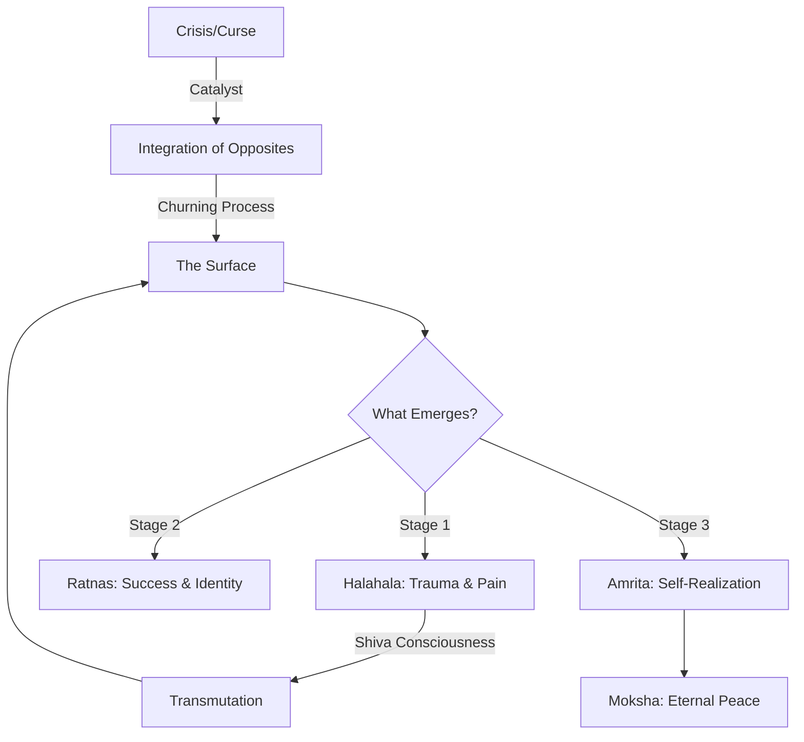

# 🌊 The Great Cosmic Churn: Decoding the Story of Samudra Manthan

Have you ever felt as though your life was being stirred into a chaotic whirlpool? That just as you were reaching for stability, something surfaced from your depths—an old trauma, a hidden fear, or a sudden crisis—that threatened to overwhelm you? In the vast tapestry of [Vedic literature](https://en.wikipedia.org/wiki/Vedas), there is no more potent metaphor for this experience than the **Samudra Manthan**, or the Churning of the Ocean of Milk.

On the surface, it is a breathtaking epic found within the [Vishnu Purana](https://en.wikipedia.org/wiki/Vishnu_Purana) and the [Bhagavata Purana](https://en.wikipedia.org/wiki/Bhagavata_Purana). It features a cast of warring deities, ego-driven demons, a giant tortoise, and a pot of immortality. However, to the seeker, the philosopher, and the psychologist, Samudra Manthan is a sophisticated map of human consciousness. It teaches us a fundamental truth: before the "nectar" of enlightenment or success can be attained, one must first confront and neutralize the "poison" of the subconscious.

In this deep dive, we will decode the mechanics of this cosmic event, analyze the **14 divine treasures** it produced, and explore how this ancient story provides a blueprint for modern mental health and spiritual evolution.

---

## ⚡ The Spark: A Curse, a Crisis, and the Loss of Power

  
  
 <a href="https://unsplash.com/@supaslim">Oyemike Princewill</a> on <a href="https://unsplash.com/photos/a-young-boy-holding-his-hands-up-VI2X0b01p6g">Unsplash</a>

The story does not begin with a quest for immortality, but with a collapse of ego. In the celestial realms, **Indra**, the King of the Gods (Devas), had become blinded by his own power. His downfall began with a simple act of disrespect toward **Sage Durvasa**, a figure renowned for his spiritual potency and his notoriously short temper.

Durvasa presented Indra with a divine garland of flowers. In a moment of arrogance, Indra placed the garland on his elephant, Airavata, who promptly tossed it to the ground and trampled it. To the sage, this was not merely an insult to himself, but a rejection of the divine grace the garland represented. Durvasa unleashed a devastating curse: he stripped the Devas of their *Shree*—the divine luster, prosperity, and strength that sustained their heavenly kingdom.

**The fallout was immediate and absolute.** The Devas found themselves weakened, their cities decaying, and their spiritual authority vanishing. This created a massive power vacuum in the universe. The Asuras (the demons), led by their hunger for dominion, seized the opportunity to conquer the three worlds. 

> "The curse of Durvasa serves as a reminder that spiritual growth is not a permanent achievement but a state of being that requires constant humility. The moment the Devas believed they *owned* their power rather than being stewards of it, they lost it."

Desperate, Indra sought the counsel of **Lord Vishnu**, the Preserver. Vishnu’s solution was unconventional and strategically brilliant. He informed the Devas that they were currently too weak to defeat the Asuras. To regain their strength and secure the *Amrita* (the nectar of immortality), they would need to churn the Ocean of Milk. But there was a catch: the task was so monumental that it required an alliance with their greatest enemies.

This uneasy truce is the first great lesson of the myth. The Devas represent our higher virtues (*Sattva*), while the Asuras represent our primal drives, ego, and aggression (*Rajas* and *Tamas*). The myth suggests that true evolution does not come from suppressing the "demonic" side of our nature, but from integrating it. To reach the highest state of consciousness, we must harness both our discipline and our desire.

---

## ⚙️ The Cosmic Engineering: Stability Amidst Chaos

Churning an ocean of celestial milk is not a simple feat. It required a scale of engineering that mirrored the scale of the spiritual journey. The Devas and Asuras utilized **Mount Mandara** as the churning rod and the great serpent **Vasuki** as the churning rope.

However, as soon as the churning began, the mountain began to sink. The ocean floor was not solid; it was a fluid abyss. Mount Mandara lacked a foundation, and the entire operation threatened to collapse. This is where Lord Vishnu intervened in his second avatar, **Kurma**, the giant tortoise.

Vishnu dove to the depths of the ocean and positioned his indestructible shell beneath the mountain. **Kurma provided the pivot point**—the absolute stability required for the rotation to occur.

### 🐢 The Symbolism of the Kurma Avatar
The role of the tortoise is critical when we apply this story to our own lives. In any period of massive transition—be it a career change, a healing journey, or a spiritual awakening—we experience a "churning." Without a foundation, this process leads to collapse.
- **The Shell as Grounding:** Kurma represents the need for a stable center. In psychological terms, this is the "observing self" or the grounded presence that allows us to endure the turbulence of emotion without being swept away.
- **The Patience of the Tortoise:** The tortoise moves slowly and retreats into its shell for protection. This symbolizes the necessity of introspection and the ability to withstand immense pressure while remaining unmoved.

The logistics of the churn also revealed the blind spots of the ego. The Asuras, believing they deserved the position of honor, insisted on holding the head of Vasuki. The Devas, being humble and strategic, took the tail. As the churning intensified, Vasuki began to exhale scorching fumes and toxic fire. The Asuras, positioned at the head, bore the full brunt of this toxicity. This serves as a bold reminder: **those who chase the "head" of power often find themselves inhaling the most poison.**

---

## 🐍 The Halahala Crisis: Facing the Shadow

Before any treasures emerged, the ocean produced something terrifying: **Halahala**, a lethal poison capable of annihilating all creation. This was the "dark night of the soul." 

When we begin to "churn" our subconscious—through therapy, meditation, or life crises—we do not immediately find peace. Instead, we often find the Halahala: repressed anger, ancestral trauma, grief, and shame. This "poison" surfaces because the process of churning brings everything from the depths to the surface.

Terrified, both the Devas and Asuras fled. They realized that their quest for immortality had inadvertently unlocked the mechanism of their own destruction. In their desperation, they turned to **Lord Shiva**, the Mahadeva.

Shiva, the embodiment of ultimate compassion and detachment, agreed to intervene. He did not fight the poison, nor did he try to push it back into the ocean. Instead, he did the unthinkable: **he drank the poison.**

However, Shiva did not allow the poison to enter his stomach, where it would affect his entire being. Instead, he held it in his throat. His consort, Parvati, placed her hand on his neck to stop the toxin from descending. The poison turned his throat a deep, vibrant blue, earning him the name **Neelakantha** (the Blue-Throated One).

### 🧠 The Alchemy of the Blue Throat
Shiva’s action is the ultimate lesson in **transmutation**. 
- **Observation vs. Absorption:** Shiva shows us how to experience pain without becoming the pain. By holding the poison in his throat, he acknowledges the toxicity but refuses to let it poison his core.
- **The Necessity of the Poison:** The myth asserts that the nectar cannot be reached without first dealing with the poison. In modern psychology, this is akin to "shadow work." You cannot reach a state of genuine wholeness by ignoring your darkness; you must "swallow" it, observe it, and neutralize it through awareness.

---

## 💎 The Fourteen Ratnas: The Rewards of the Struggle

Once the poison was neutralized, the churning finally began to yield the **Chaturdasa Ratna**, or the fourteen gems. These were not merely physical objects but archetypal representations of the boons and distractions that emerge during the process of self-actualization.

The order in which these treasures appeared is vital. They represent the stages of reward that follow the initial crisis.

| Treasure | Symbolic Meaning | Life Application |
| :--- | :--- | :--- |
| **Lakshmi** | Spiritual & Material Abundance | Realizing that true wealth flows from *Dharma* (righteousness). |
| **Airavata** | Mental Strength & Power | The development of a disciplined and powerful mind. |
| **Uchhaishravas** | Mastery of Senses | The ability to move through life with grace and control. |
| **Kaustubha** | The Pure Soul | The discovery of the "diamond" within the rough of the ego. |
| **Kamadhenu** | Manifestation & Abundance | The realization that the universe provides for those who align. |
| **Parijata** | Divine Fragrance/Reward | The sweetness that comes after a period of intense labor. |
| **Varuni** | Worldly Distractions/Intoxication | The danger of getting lost in pleasure once success arrives. |
| **Chandra** | Emotional Balance | Bringing the mind (Moon) into harmony with the spirit. |
| **Dhanvantari** | Healing & Wisdom | The arrival of the "inner physician" who knows how to heal. |
| **Apsaras** | Aesthetic Beauty & Desire | The allure of the material world that can distract from the goal. |
| **Kalpavriksha** | The Power of Intention | The ability to manifest your deepest desires into reality. |
| **Vasuki** | Controlled Desire | The transformation of raw passion into a tool for progress. |
| **The Divine Horse** | Spiritual Speed | The rapid acceleration of growth once the blocks are removed. |
| **Amrita** | Immortality/Liberation | The final realization of the Eternal Self (*Atman*). |

**Bold Stats on the Ratnas:** While different Puranas list these slightly differently, the consensus is on **14 distinct boons**. This number is significant in Vedic numerology, often representing a complete cycle of manifestation.

The progression is clear: **Poison $\rightarrow$ Material Wealth $\rightarrow$ Emotional Healing $\rightarrow$ Spiritual Liberation.** Most people stop churning the moment they find the "gems" (money, fame, or status), mistakenly believing they have reached the end. The story warns us that these are merely by-products; the only true goal is the *Amrita*.

---

## 🎭 The Trickery of Mohini: The Illusion of the Ego

The climax of the story is a shift from cooperation to conflict. As **Dhanvantari**, the physician of the gods, emerged from the ocean carrying the pot of *Amrita*, the Asuras immediately snatched it. Their greed outweighed their agreement. They believed that because they had done the heavy lifting, the prize belonged solely to them.

To recover the nectar, Lord Vishnu assumed the form of **Mohini**, a woman of incomparable beauty and grace. Mohini represents *Maya*—the divine illusion. She approached the Asuras and offered to distribute the nectar fairly between the two groups. Hypnotized by her presence, the Asuras handed over the pot.

Mohini lined the Devas and Asuras in two separate rows. With a charming smile, she began serving the Devas first. By the time she reached the Asuras, the pot was empty.

### ⚖️ The Ethics of Divine Deception
Many read this part of the story and see it as a "cheat." However, in the context of [Dharma](https://en.wikipedia.org/wiki/Dharma), this trickery was an act of cosmic mercy. 
- **The Nature of Amrita:** Immortality in the hands of those driven by ego and malice would lead to an eternal reign of terror. 
- **Alignment over Effort:** The Asuras put in the effort, but they lacked the *alignment*. The Amrita is not a reward for "hard work" alone, but for those whose hearts are purified of greed.

This teaches us that spiritual liberation (*Moksha*) cannot be stolen or forced through willpower. It is a gift that descends only when the ego is surrendered.

---

## 🧠 The Big Picture: The Churning Within

If we strip away the mythology, Samudra Manthan is a precise manual for the human psyche. The "Ocean of Milk" is your subconscious mind—a vast reservoir of everything you have ever experienced, suppressed, or dreamt.

### How to apply the "Internal Churn" to your life:

1.  **Embrace the "Alliance":** Stop fighting your "dark side." Your ambition, anger, and drive (the Asuras) are the same energies that, when aligned with your values (the Devas), provide the power to change your life.
2.  **Find Your Kurma:** When your life feels chaotic, find your center. Whether it is through meditation, a mentor, or a disciplined routine, you need a "shell" to stand on so you don't sink during the process of change.
3.  **Expect the Poison:** When you start a new habit, dive into therapy, or face a crisis, expect things to get worse before they get better. This is the Halahala phase. Do not panic; do not run. Like Shiva, observe the poison, hold it in your awareness, and do not let it reach your heart.
4.  **Ignore the Glitter:** You will find "gems" along the way—promotions, praise, and material gains. Enjoy them, but remember they are not the goal. If you stop churning because you found a "diamond," you will never taste the "nectar."
5.  **Surrender the Ego:** The final step is the realization that you cannot "win" enlightenment. You can only become a vessel for it by letting go of the need to control the outcome.

---

## 🏁 Conclusion: The Eternal Cycle

The Samudra Manthan is a timeless reminder that growth is a violent and messy process. It tells us that value is not found in the absence of struggle, but *through* struggle. We are all, in some sense, churning our own oceans. We are all dealing with our own poisons, chasing our own gems, and searching for our own nectar.

In a modern world defined by "instant gratification" and "toxic positivity," the story of the Blue-Throated God is a revolutionary act. It tells us that it is okay to be in pain, as long as we have the stability to face it and the compassion to transmute it.

Life will always be a churn. The question is: are you holding the rope with greed, or are you holding it with the intention of liberation? By facing our internal poisons with the stillness of a tortoise and the courage of Shiva, we can move past the glitter of the material world and finally reach the nectar of a peaceful, awakened mind.

---

## 📚 References & Further Reading

- **Britannica:** [The Concept of Avatars in Hinduism](https://www.britannica.com/topic/avatar-Hinduism)
- **Wikipedia:** [Samudra Manthan - Detailed Mythos](https://en.wikipedia.org/wiki/Samudra_Manthan)
- **Wikipedia:** [Vishnu Purana](https://en.wikipedia.org/wiki/Vishnu_Purana)
- **Wikipedia:** [Bhagavata Purana](https://en.wikipedia.org/wiki/Bhagavata_Purana)
- **Wikipedia:** [Kurma Avatar](https://en.wikipedia.org/wiki/Kurma)
- **Wikipedia:** [Lord Shiva (Neelakantha)](https://en.wikipedia.org/wiki/Shiva)
- **Wikipedia:** [Mohini - The Divine Illusion](https://en.wikipedia.org/wiki/Mohini)
- **Wikipedia:** [Amrita - The Nectar of Immortality](https://en.wikipedia.org/wiki/Amrita)
- **Wikipedia:** [Lakshmi - Goddess of Prosperity](https://en.wikipedia.org/wiki/Lakshmi)
- **Stanford Encyclopedia of Philosophy:** [Indian Philosophy and the Concept of Self](https://en.wikipedia.org/wiki/Indian_philosophy)
