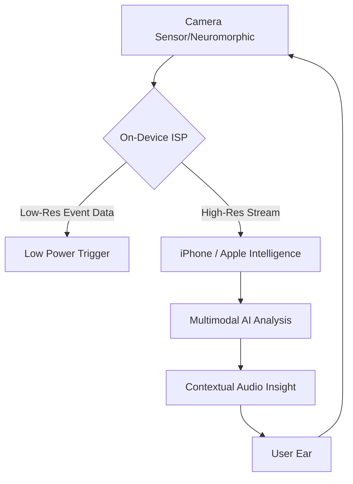

# 🎧 Can Your Ears Actually See? Breaking Down the Camera-Enabled AirPods Rumors

For nearly a decade, the trajectory of the AirPods lineup has been one of refinement rather than revolution. We have witnessed the iterative perfection of Active Noise Cancellation (ANC), the introduction of punchier bass profiles, and the seamless integration into the Apple ecosystem. From the early "stems" that sparked a cultural divide to the high-fidelity spatial audio architecture of the AirPods Max, Apple has essentially mastered the science of the earbud. However, a provocative report from [News18](https://www.news18.com) suggests that Apple is preparing to pivot from pure audio to something far more disruptive: **integrated visual sensing**.

The rumor that camera-equipped AirPods could launch as early as next month has sent shockwaves through the tech community. While "smart glasses" have existed in various forms—from the failure of Google Glass to the current success of the Ray-Ban Meta collaboration—integrating a camera into a device that sits within the ear canal is a massive engineering gamble. It transforms the device from a tool used to *consume* media into a sensor that *captures* the world, all orchestrated by the burgeoning power of Apple Intelligence.

If these rumors materialize, we aren't just looking at a hardware update; we are witnessing the birth of **Ambient Vision**. Imagine your AirPods not just announcing a caller, but whispering the name of a colleague walking toward you, translating a foreign menu in real-time, or providing haptic and audio warnings about a hazard just outside your line of sight. Naturally, this leap forward brings profound privacy concerns and technical hurdles that could either cement Apple's dominance in wearables or create a high-profile stumble.

---

## 🚨 The News18 Leak: Timing, Hype, and the Apple Cycle

  
  
 <a href="https://unsplash.com/@john_smit">John M. Smit</a> on <a href="https://unsplash.com/photos/white-apple-airpods-charging-case-Mc5EwlPC3zA">Unsplash</a>

The current fervor centers on reports that Apple is accelerating the development of a wearable that embeds camera technology directly into the AirPods architecture. According to [News18](https://www.news18.com), a launch could occur "as soon as next month." In the ecosystem of Apple leaks, "next month" is often a volatile phrase. Timelines derived from supply chain whispers or patent filings frequently deviate from actual product launch dates.

However, the timing aligns perfectly with the broader rollout of **Apple Intelligence**. For a generative AI to be truly proactive, it requires a constant stream of contextual data. While the iPhone's camera is powerful, it requires the user to physically lift the device and point it at an object—a high-friction action. A camera positioned in the AirPods provides the AI with a hands-free, first-person stream of the user's environment. This effectively gives Siri "eyes," transforming it from a voice-activated search engine into a contextual companion.

> "The goal of ambient computing is to make the technology disappear into the environment. By moving the sensor from the hand (iPhone) to the head (AirPods), Apple effectively removes the friction between a user's intent and the AI's execution."

Industry analysts are now speculating whether this will arrive as a standalone "AirPods Pro Visual" edition or as a specialized tool for developers already embedded in the [Vision Pro](https://www.apple.com/apple-vision-pro/) ecosystem. Shrinking the spatial awareness of visionOS into a tiny earbud would be an unprecedented feat of miniaturization.

---

## 🛠️ Engineering the Impossible: The Technical Gauntlet

Integrating a camera into a chassis as small as an AirPod is not merely a design challenge; it is a battle against the laws of physics. Discussions on platforms like [Hacker News](https://news.ycombinator.com) highlight three primary deal-breakers: **power consumption, thermal management, and optical alignment**.

### 1. The Power Paradox
AirPods rely on minuscule batteries that are already stretched thin by ANC and Bluetooth connectivity. A standard CMOS image sensor running at 30 or 60 frames per second would deplete the battery in a matter of minutes. To circumvent this, Apple is likely exploring **event-based vision sensors**, also known as neuromorphic sensors.

As detailed in various [ArXiv research papers](https://arxiv.org/abs/1904.08405), event-based cameras do not capture traditional frames. Instead, they only record changes in brightness at the pixel level. If nothing in the scene moves, the sensor consumes virtually zero power. This allows the device to "detect" motion or changes in the environment without the massive energy overhead of traditional video recording.

### 2. The Thermal Wall
Processing visual data generates significant heat. In an iPhone, this heat is dissipated across a large surface area of glass and aluminum. In an AirPod, the processor sits mere millimeters from the sensitive skin of the ear canal. If the chip exceeds a certain temperature threshold, it becomes not only uncomfortable but potentially dangerous.

To solve this, Apple will likely employ a "split-processing" model. The AirPod will handle basic motion detection and low-resolution trigger events, while the heavy lifting—the actual image recognition and AI analysis—will be offloaded to the iPhone via a high-bandwidth, low-latency connection (likely an evolution of the H2 or a new H3 chip).

### 3. The Optical Challenge
The placement of the lens is a critical failure point. A lens on the stem may capture an awkward, downward-tilted angle; a lens on the face of the bud could be obscured by hair or jewelry. Apple's engineers are rumored to be testing **ultra-wide-angle "fish-eye" lenses** or miniature periscope optics to ensure a sufficient field of view despite the constrained form factor.

---

## 🧠 The AI Synergy: Apple Intelligence and Multimodal Context

The primary objective of a camera in an earbud is not photography—it is **contextual awareness**. For years, the limitation of virtual assistants has been their "blindness." Siri knows your location via GPS, but it doesn't know that you are currently staring at a broken dishwasher or a confusing street sign.

By integrating visual sensors, Apple closes this loop. This is where [Apple Intelligence](https://www.apple.com/apple-intelligence/) transitions from a chatbot to a life-assistant. Consider the following high-impact scenarios:

*   **The Social Catalyst**: Imagine attending a professional networking event. Your AirPods recognize a face from your Contacts or a LinkedIn profile and whisper, *"That's Sarah from the 2022 Design Conference; you discussed sustainable architecture."* This turns social anxiety into a competitive advantage.
*   **Real-Time Linguistic Bridges**: While navigating a city like Tokyo or Seoul, you can simply look at a sign in Kanji or Hangul. The AirPods process the image and provide a whispered translation in your ear, eliminating the need to constantly toggle between a camera app and a translation tool.
*   **Revolutionizing Accessibility**: For the visually impaired, this is a paradigm shift. The AirPods could act as a real-time narrator of the physical world: *"A crosswalk is five feet ahead; the signal is currently red, but a pedestrian is crossing to your left."*

The strategic shift here is the move from **Reactive AI** (where the user initiates the query) to **Proactive AI** (where the system anticipates the need based on visual cues).

---

## 👁️ Privacy and the "Social Contract"

We cannot discuss embedded cameras without addressing the "creep factor." The tech industry still carries the scars of [Google Glass](https://en.wikipedia.org/wiki/Google_Glass), which failed not because of the technology, but because of the social repulsion toward "invisible" recording.

AirPods present a more complex ethical dilemma than glasses. A camera on a frame is visible on the bridge of the nose. A camera in an earbud can be hidden by hair, a hat, or the natural contour of the ear. This creates a crisis of consent: **How do bystanders know they are being recorded?**

To mitigate this, Apple is expected to implement a "Privacy-First" hardware suite:
*   **The Immutable LED**: A high-intensity LED that illuminates whenever the camera sensor is active, making it impossible to record covertly.
*   **Edge Computing**: By processing images locally on the iPhone and deleting raw frames immediately after analysis, Apple can claim that "video never leaves the device," reducing the risk of cloud-based leaks.
*   **Granular Permissioning**: Users may be required to opt-in to "Visual Mode" for specific apps, ensuring the camera isn't constantly streaming.

Despite these safeguards, the social friction will be immense. We are moving toward a world of "ambient recording," and the global community has yet to decide if it is comfortable with every white stem potentially acting as a lens.

---

## 🏁 The War of the Wearables: Apple vs. Meta

Apple is not operating in a vacuum. [Meta's Ray-Ban Smart Glasses](https://www.meta.com/smart-glasses/) have already validated the market demand for camera-integrated wearables. Meta's strategy is straightforward: combine a traditional accessory (glasses) with a camera and a speaker, powered by a multimodal AI.

However, Apple is playing a different psychological game. Meta is attempting to build a *new* habit (wearing smart glasses). Apple is **optimizing an existing habit**. Millions of users already wear AirPods for **6-10 hours a day**. By adding a sensor to a device that is already a permanent fixture in the user's life, Apple bypasses the "adoption hurdle."

### Comparative Analysis: The Wearable Landscape

| Feature | Meta Ray-Bans | Apple AirPods (Rumored) |
| :--- | :--- | :--- |
| **Form Factor** | Eyewear | In-Ear Buds |
| **Primary Intent** | Content Creation / AI | Utility / Health / Context |
| **Adoption Barrier** | Medium (Requires glasses) | Low (Already ubiquitous) |
| **Discretion** | Moderate | High (Potentially too high) |
| **Core Ecosystem** | Meta AI / Instagram | Apple Intelligence / iOS |
| **Primary Sensor** | Wide-angle Camera | Neuromorphic / Event-based |

Apple is betting on **frictionless integration**. They aren't asking the user to change their aesthetic; they are simply adding a new sense to a device the user already trusts.

---

## 📈 Market Impact and the "Post-Screen" Economy

If Apple successfully launches a visual-sensing earbud, the implications for the app economy are staggering. We have spent the last **15 years** optimizing for the "glass slab"—the smartphone screen. Every app is designed around a touch-and-scroll interface. 

The introduction of Ambient Vision signals the beginning of the **Post-Screen Era**. When the AI can see what you see and whisper the answer in your ear, the need to "look down" disappears. This could lead to a decline in screen time and a rise in "auditory interfaces."

**Bold Stats to Consider:**
*   **80%** of Gen Z and Millennial users report using AirPods or similar earbuds for more than 4 hours daily.
*   The global wearable tech market is projected to reach **$186 billion by 2030**, with "smart audio" being the fastest-growing segment.
*   Neuromorphic sensors can reduce power consumption by up to **90%** compared to traditional frame-based cameras in low-motion environments.

This transition represents a shift in the very nature of human-computer interaction (HCI). We are moving from *interacting* with a device to *co-existing* with an intelligence.

---

## 🔮 Conclusion: Are We Ready for Our Ears to See?

Regardless of whether the "next month" timeline holds true, the trajectory of Apple's hardware is clear. The company is aggressively pursuing a future where the interface is invisible. We are transitioning from a world where we carry technology in our pockets to a world where technology is woven into our sensory experience.

The prospect of "ears that see" is both exhilarating and terrifying. It promises a world of effortless translation, enhanced memory, and unprecedented accessibility for the disabled. Yet, it threatens the last vestiges of anonymity in public spaces.

Apple isn't just selling a new pair of headphones; they are selling a **digital upgrade to human perception**. As the line between our organic senses and silicon enhancements continues to blur, we must ask ourselves: are we ready for the world to be constantly analyzed, interpreted, and narrated by an AI in our ears?

The screen is fading. The era of Ambient Vision is here.

---

## 📚 References

*   **News18**: [Detailed Report on Apple AirPods Camera Rumors](https://www.news18.com)
*   **Apple Newsroom**: [Apple Intelligence Official Announcement](https://www.apple.com/apple-intelligence/)
*   **Apple Support**: [Vision Pro Technical Specifications](https://www.apple.com/apple-vision-pro/)
*   **Wikipedia**: [Comprehensive History of the AirPods Lineup](https://en.wikipedia.org/wiki/AirPods)
*   **Wikipedia**: [The Social Impact of Google Glass](https://en.wikipedia.org/wiki/Google_Glass)
*   **Hacker News**: [Engineering Constraints of Wearable CMOS Sensors](https://news.ycombinator.com)
*   **ArXiv**: [Event-based Vision: A Survey (Gallego et al.)](https://arxiv.org/abs/1904.08405)
*   **Meta**: [Ray-Ban Meta Smart Glasses Product Specifications](https://www.meta.com/smart-glasses/)
*   **The Verge**: [Analysis of Ambient Computing Trends](https://www.theverge.com)
*   **Wired**: [The Ethics of Always-On Wearable Cameras](https://www.wired.com)
