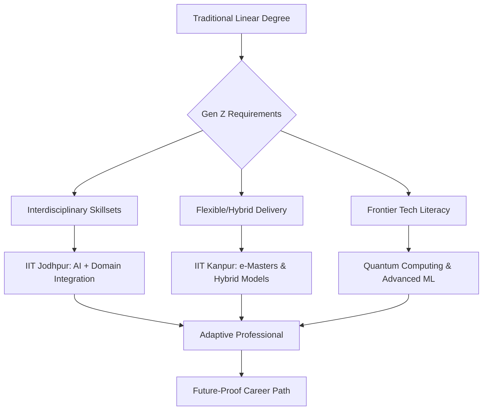

# More Than Just a Degree: The AI and Interdisciplinary Shake-up at IIT Jodhpur and IIT Kanpur

For decades, the definition of an "expert" was someone who possessed exhaustive knowledge of a single, narrow domain. In the traditional academic landscape, if you entered an Indian Institute of Technology (IIT), you were categorized immediately: you were either a Mechanical Engineer, a Civil Engineer, or a Computer Scientist—period. These silos provided a clear path, but they also created walls.

However, for Gen Z—the first generation to grow up with a smartphone as an extension of their hand—those walls are crumbling. Today’s students are not looking for a static piece of paper that certifies their knowledge of a 2010 textbook; they are seeking a dynamic toolkit. They want a curriculum that blends Artificial Intelligence (AI), ethical frameworks, environmental sustainability, and entrepreneurial business sense.

IIT Jodhpur and IIT Kanpur have recognized this seismic shift. They are moving away from the "factory style" of education—where students are processed through identical tracks—and are pioneering a model centered on agility. By replacing rigid departmental boundaries with flexible, AI-driven programs, they are designing an education system for a generation that values purpose, versatility, and the ability to pivot. This is not a mere syllabus update; it is a total rethink of what it means to be an engineer in the age of intelligence.

---

## 🧩 1. Why the Old School Model Stopped Working

To understand why IIT Jodhpur and IIT Kanpur are pivoting, we must first analyze the cognitive architecture of Gen Z. Unlike Millennials, who adapted to the digital revolution as it unfolded, Gen Z was born into a world of ubiquitous connectivity. To them, AI is not a "disruptive technology"—it is a fundamental utility, as invisible and essential as electricity.

According to [Deloitte’s Gen Z and Millennial Survey](https://www.deloitte.com/global/en/issues/work/content/genzmillennialsurvey.html), this generation places a premium on "stackable credentials." They prefer the ability to accumulate specific, high-value skills over a long period rather than committing to a single, rigid degree path that may be obsolete by graduation.

The core problem is the "half-life of knowledge." In traditional engineering, a core concept might remain relevant for twenty years. In AI and data science, a state-of-the-art model can be superseded in six months. When the pace of industry innovation exceeds the pace of academic accreditation, a "relevance gap" opens. Gen Z identifies as "slashies"—they see themselves as developers/designers, analysts/entrepreneurs, or engineers/environmentalists. They refuse to be defined by a single noun.

> "The modern student doesn't want to be confined to a single department. They want to solve problems that exist at the intersection of biology, code, and commerce. If the education system doesn't mirror the intersectional nature of the real world, it becomes a museum rather than a laboratory."

This realization has pushed these institutes toward "problem-first" learning. In this model, the problem (e.g., "How do we reduce urban carbon emissions?") dictates the subjects needed (AI, Thermodynamics, Urban Planning, and Economics), rather than the department dictating the problem.

---

## 🤖 2. IIT Jodhpur’s Big Bet: AI as a Foundational Literacy

IIT Jodhpur is treating Artificial Intelligence not as a specialized elective, but as a foundational literacy—akin to reading, writing, or basic arithmetic. The institute's strategy is to weave AI into the fabric of every discipline, ensuring that no matter the major, every graduate is "AI-fluent."

The objective is to create a "middle ground" of expertise. By merging AI with robotics, healthcare, and sustainable energy, they are preparing students for hybrid roles that were non-existent five years ago. We are seeing the rise of **AI-Clinical Integration Specialists**, who can bridge the gap between data science and bedside medicine, and **Autonomous Systems Architects**, who design the physical and digital infrastructure for self-driving cities.

### The Three Pillars of the Jodhpur Model:

1.  **Universal AI Accessibility:** Through the [IIT Jodhpur AI & ML Center](https://ai.iitj.ac.in/), the institute has created permeable pathways. A student majoring in Mechanical Engineering can integrate high-level ML modules into their degree without needing to switch majors entirely.
2.  **Project-Based Pedagogy:** The focus has shifted from rote memorization to "learning by doing." Students are tasked with solving actual industry bottlenecks, transforming the classroom into an incubator.
3.  **The Hardware-Software Nexus:** While many AI programs focus solely on the "cloud" (software), IIT Jodhpur emphasizes the link between AI and Robotics. This focus on "embodied AI" ensures that graduates can build systems that interact with the physical world, satisfying Gen Z's drive for tangible, futuristic tech.

By creating graduates who can communicate effectively with both a deep-learning researcher and a mechanical technician, IIT Jodhpur is producing "translators"—the most valuable assets in a fragmented, high-tech job market.

---

## ⚡ 3. IIT Kanpur: Scaling Intelligence and the Quantum Leap

While IIT Jodhpur focuses on the blending of subjects, IIT Kanpur is leveraging technology to scale elite education and push the boundaries of computation. Their strategy is two-pronged: expanding access via **e-Masters** and pioneering the **Quantum Era**.

### The e-Masters Revolution
The **e-Masters programmes** are a direct response to the Gen Z philosophy of lifelong learning. The traditional four-year degree is being supplemented—or in some cases, replaced—by a continuous stream of certifications. These programs allow young professionals to acquire high-value expertise in Data Science and AI without pausing their careers [IIT Kanpur Official Portal](https://www.iitk.ac.in/). This asynchronous, hybrid model acknowledges that learning is no longer a phase of life, but a permanent state of existence.

### Entering the Quantum Realm
Beyond AI, IIT Kanpur is investing heavily in **Quantum Technology**. If AI is the engine of the current decade, Quantum Computing will be the engine of the next. By training students in quantum cryptography and materials science, IIT Kanpur is ensuring that India doesn't just use the tools of the future, but builds them.

**Key Objectives at IIT Kanpur:**
*   **Democratizing Elite Education:** Using digital platforms to break the geographic barriers of the "IIT bubble," allowing talent from tier-2 and tier-3 cities to access world-class instruction.
*   **Quantum Readiness:** Preparing a workforce capable of handling the "Quantum Threat" (the ability of quantum computers to break traditional encryption) and the "Quantum Opportunity" (simulating new molecules for drug discovery).
*   **Founder-First Culture:** Through its robust incubation cell, the institute encourages students to view their research as a potential startup. This aligns with the Gen Z desire for autonomy, ownership, and the ability to disrupt established industries.

---

## 🌐 4. Closing the Gap Between Classroom and Career

The "relevance gap" is the primary source of anxiety for Gen Z students. There is a pervasive fear that by the time they receive their diploma, the tools they learned will be obsolete. To combat this, both IIT Jodhpur and IIT Kanpur are integrating industry leaders directly into the curriculum design process.

### Competency-Based Education (CBE)
The shift is moving away from "seat time" (how many hours you sat in a lecture) toward "competency" (what you can actually build). This is evidenced by the evolution of **Capstone Projects**. Instead of theoretical theses, students are now solving high-stakes problems for corporate partners.

For example, a student might spend six months using Machine Learning to optimize a real-world supply chain for a logistics giant or designing a quantum-secure communication protocol for a financial institution. This ensures that graduates are "Day 1 Ready," possessing the practical confidence to navigate a corporate or startup environment without extensive retraining.

---

## ☁️ 5. Campus + Cloud: The Hybrid Educational Shift

For the modern student, the "campus" is no longer a physical boundary; it is a hybrid ecosystem. The integration of physical labs with cloud-based learning platforms is a global trend that these IITs are embracing aggressively.

**The Strategic Advantages of Blended Learning:**
1.  **Hyper-Personalized Pacing:** Digital modules allow students to accelerate through concepts they grasp quickly and dwell on challenging topics without the pressure of a synchronized classroom.
2.  **Global Collaborative Networks:** Cloud tools enable students to collaborate in real-time with mentors in Silicon Valley or peers in Tokyo, expanding their professional network long before graduation.
3.  **Micro-Credentialing:** Instead of waiting four years for a single credential, students can earn "nanodegrees" in specific niches—such as "Neural Network Optimization" or "Quantum Algorithms"—and showcase them on platforms like LinkedIn to attract recruiters in real-time.

This evolution is heavily supported by the **National Education Policy (NEP) 2020**. The NEP introduces a flexible entry and exit system, allowing students to earn a certificate after one year, a diploma after two, or a degree after three or four [National Education Policy 2020](https://www.education.gov.in/national-education-policy-2020). This provides a crucial safety net, allowing Gen Z to experiment with their interests without the fear of "wasting" years of study if they decide to pivot.

---

## 📈 6. Prepping India for the Global "Industry 4.0"

This educational pivot is not just about student satisfaction; it is a geopolitical and economic necessity. As the world enters **Industry 4.0**—characterized by a fusion of technologies that blur the lines between the physical, digital, and biological spheres—the global economy requires a new kind of worker: the **T-Shaped Professional**.

A T-Shaped professional possesses deep expertise in one specific area (the vertical bar of the T) but has the broad ability to collaborate across multiple disciplines (the horizontal bar). By prioritizing AI and Quantum studies, India is transitioning from being the world's "back-office" for software maintenance to becoming a global hub for **High-Value Engineering**.

**The Macroeconomic Implications:**
*   **GDP Acceleration:** With AI projected to contribute up to **$15.7 trillion** to the global economy by 2030 (according to PwC), India's investment in AI-fluent engineers ensures a significant slice of that growth.
*   **Deep Tech Sovereignty:** By focusing on Quantum and AI at the foundational level, India reduces its reliance on foreign intellectual property, fostering a domestic ecosystem of "Deep Tech" startups.
*   **Educational Blueprinting:** The models being tested at IIT Jodhpur and Kanpur serve as a lighthouse for thousands of other engineering colleges across India, signaling a move away from rote learning toward an agile, competency-based framework.

---

## 🧠 7. The Psychology of the Adaptive Engineer

Beyond the technical skills, there is a psychological shift occurring. The "Adaptive Engineer" is not just someone who knows Python or Qiskit; they are someone who has developed a high tolerance for ambiguity.

In the old model, the goal was to find the "correct answer." In the new model, the goal is to ask the "correct question." This requires a shift in mindset from *knowledge acquisition* to *knowledge curation*. The Adaptive Engineer knows that they cannot know everything, but they know exactly how to find, verify, and apply the information they need in real-time.

This resilience is critical for Gen Z, who face an unprecedented amount of career volatility. By teaching students how to learn—rather than what to learn—IIT Jodhpur and IIT Kanpur are providing the most important survival skill of the 21st century: **metacognition**.

---

## 🏁 Conclusion: The End of the Static Degree

The initiatives at IIT Jodhpur and IIT Kanpur mark the beginning of the end for the "Static Degree." We have entered the era of the **Adaptive Engineer**—a professional who is comfortable with chaos, fluent in AI, and capable of synthesizing information from disparate fields to solve complex problems.

Gen Z does not want to be a cog in a pre-designed machine; they want to be the ones designing the machine. By embracing flexibility, interdisciplinary study, and frontier technologies, these institutions are giving them more than just a degree—they are giving them a map and a compass for an uncharted territory.

The bottom line is clear: in a world where AI can generate code and analyze data in seconds, the value of a human engineer no longer lies in their ability to perform a task, but in their ability to adapt, integrate, and innovate. The future belongs not to the specialist, but to the synthesizer.

---

## 📚 References & Further Reading

*   **IIT Jodhpur AI & ML Center**: Detailed insights into the integration of AI across disciplines. [https://ai.iitj.ac.in/](https://ai.iitj.ac.in/)
*   **IIT Kanpur Official Portal**: Exploration of e-Masters and Quantum Computing initiatives. [https://www.iitk.ac.in/](https://www.iitk.ac.in/)
*   **National Education Policy (NEP) 2020**: The government framework enabling flexible education. [https://www.education.gov.in/national-education-policy-2020](https://www.education.gov.in/national-education-policy-2020)
*   **Deloitte Gen Z and Millennial Survey**: Data on the workplace preferences of the new generation. [https://www.deloitte.com/global/en/issues/work/content/genzmillennialsurvey.html](https://www.deloitte.com/global/en/issues/work/content/genzmillennialsurvey.html)
*   **Ministry of Education, Govt of India**: Policy updates on higher education standards. [https://www.education.gov.in/](https://www.education.gov.in/)
*   **World Economic Forum - Future of Jobs Report 2023**: Analysis of the skills gap and the rise of AI. [https://www.weforum.org/reports/the-future-of-jobs-report-2023/](https://www.weforum.org/reports/the-future-of-jobs-report-2023/)
*   **PwC Global AI Study**: Projections on the economic impact of AI on global GDP. [https://www.pwc.com/gx/en/issues/data-and-analytics/publications/artificial-intelligence-study.html](https://www.pwc.com/gx/en/issues/data-and-analytics/publications/artificial-intelligence-study.html)
*   **arXiv.org**: Research papers on the intersection of Quantum Computing and Machine Learning. [https://www.arxiv.org/](https://www.arxiv.org/)
