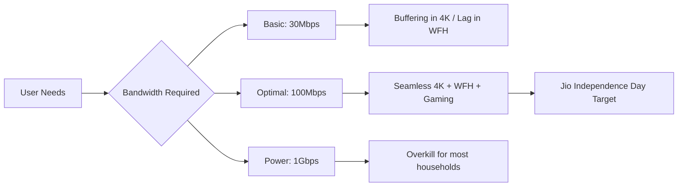

# 🚀 The Great Broadband Reset: How Jio’s Rs 6,000 Price Cut is Changing the Game

The Indian telecom landscape has always been a high-stakes battlefield, but every few years, a move occurs that doesn't just nudge the market—it completely resets the equilibrium. We are currently witnessing such a moment with the **Jio Independence Day Pack**. To the casual observer, it looks like a seasonal promotion; to the industry analyst, it feels like a tactical echo of the 2016 4G revolution. Reliance Jio has aggressively dropped the price of its 100Mbps broadband plan by a staggering **Rs 6,000** for users opting for long-term commitments.

For the average Indian household, the barrier to upgrading to high-speed fiber hasn't been the availability of the wire, but the "monthly friction"—that recurring bill that transforms a premium utility into a luxury expense. By slashing the annual cost by **Rs 6,000**, Jio is effectively dismantling that barrier. This isn't merely a sale; it is a calculated architectural shift to ensure JioFiber becomes the default operating system for the Indian home. As we analyze this move, we are essentially observing the blueprints of [Digital India](https://www.digitalindia.gov.in/) being executed in real-time, one fiber-optic cable at a time.

---

## 📉 How the Savings Actually Work: Breaking Down the Rs 6,000

To grasp why a **Rs 6,000 reduction** is a seismic event, one must understand the traditional pricing psychology of Indian ISPs (Internet Service Providers). For decades, the market operated on a month-to-month basis. For a standard 100Mbps plan, consumers typically pay between **Rs 700 and Rs 1,000 per month** (exclusive of taxes). Over a calendar year, this totals roughly **Rs 8,400 to Rs 12,000**.

Jio is flipping the script by incentivizing the "Annual Lock-in." By shifting the payment cadence from monthly to yearly, the cost per unit of data drops precipitously. 

> "The strategic objective here is to transition the consumer from a 'pay-as-you-go' mindset to a 'lifetime ecosystem' mindset. Once a user is locked into an annual plan, the churn rate—the rate at which customers leave for a competitor—drops to nearly zero."

**The Financial Breakdown:**
*   **Standard Monthly Expenditure:** Rs 749/month $\rightarrow$ **Rs 8,988/year**.
*   **The Independence Day Offer:** A lump-sum annual payment that effectively reduces the monthly equivalent to a fraction of the standard rate.
*   **The Net Gain:** A total saving of approximately **Rs 6,000** when accounting for bundled perks, promotional credits, and the avoidance of monthly setup overheads.

This is classic [Reliance Jio disruption](https://en.wikipedia.org/wiki/Reliance_Jio). By taking 100Mbps—once a "premium" tier reserved for power users and small offices—and pricing it as a commodity, Jio is turning high-speed data into a basic utility, akin to water or electricity. The psychological win for the consumer is immense: pay once, and delete the "internet bill" from your mental checklist for 365 days.

---

## ⚡ Why 100Mbps? The "Goldilocks" Speed for the Modern Home

In the current broadband market, offerings range from basic 30Mbps connections to ultra-fast 1Gbps lines. However, for the vast majority of Indian urban and semi-urban households, **100Mbps is the "Goldilocks" speed**—it is just right. Jio’s decision to target this specific tier for the **Rs 6,000 cut** is a masterstroke of user-behavior analysis.

### 1. The 4K Streaming Threshold
Modern entertainment consumption has shifted toward UHD. To stream a 4K movie on Netflix or Disney+ Hotstar without buffering, a stable connection of **25Mbps** is required. In a household where three family members are simultaneously streaming 4K content in different rooms, a basic 30Mbps plan will fail instantly. A **100Mbps plan**, however, provides a massive overhead, ensuring that streaming remains seamless even while other devices are connected.

### 2. The Hybrid Work Revolution
Zoom, Microsoft Teams, and Google Meet are no longer optional tools; they are the infrastructure of the modern economy. While a high-quality video call only consumes about **3-5Mbps**, the *stability* of the connection is what matters. Fiber-to-the-Home (FTTH) technology significantly reduces "jitter" and packet loss. According to [TRAI's broadband performance metrics](https://www.trai.gov.in/), fiber offers vastly superior latency compared to legacy copper or coaxial cables, making it the only viable choice for professional WFH setups.

### 3. The Gaming and "Big Data" Era
The size of modern software and gaming assets has exploded. A single AAA game title can easily exceed **100GB**. On a 30Mbps connection, such a download is a multi-day ordeal. On a 100Mbps line, it becomes an afternoon task. This makes the internet feel "invisible"—it ceases to be a bottleneck and simply works.

By democratizing 100Mbps, Jio is effectively pushing the entire population away from "entry-level" speeds and into a "performance" tier. This creates a higher baseline of digital literacy and capability across the country.

---

## 🥊 Jio vs. The Competition: The Broadband Price War

A **Rs 6,000 annual saving** is enough to send shockwaves through the industry. For years, the Indian market was a fragmented landscape consisting of the state-run giant **BSNL**, various regional "cable operators," and the premium-positioned **Bharti Airtel**.

### The Clash with Airtel
Airtel has historically leaned into the "premium" narrative, focusing on reliability, superior customer service, and targeted demographics. However, in a price-sensitive market like India, "premium" has a ceiling. When Jio cuts prices by thousands of rupees, the value proposition shifts. While Airtel has countered with "Airtel Black"—a bundle combining mobile, DTH, and fiber—[Reliance's massive capital reserves](https://www.economictimes.indiatimes.com/) allow Jio to sustain predatory pricing for far longer than any competitor.

### The Local ISP Extinction Event
The local "cable guys" who upgraded to fiber are the most vulnerable. They lack the scale to offer massive discounts or bundle expensive OTT subscriptions. When a customer can save **Rs 6,000** and receive a free 4K set-top box, the local provider's only remaining edge is "personal relationship," which is rarely enough to combat such a stark financial incentive.

**Competitive Landscape Analysis:**

| Feature | Local ISPs | Airtel Xstream | JioFiber (Ind. Day Pack) |
| :--- | :--- | :--- | :--- |
| **100Mbps Annual Cost** | Moderate/Variable | Premium | **Deeply Discounted** |
| **Installation Process** | Rapid/Informal | Professional/Structured | **Bundled/Promotional** |
| **Ecosystem Integration** | Internet Only | Mobile + DTH | **Fiber + OTT + Voice + IoT** |
| **Annual Savings** | Negligible | Moderate | **Up to Rs 6,000** |
| **Hardware Quality** | Basic | High | **High (Wi-Fi 6 enabled)** |

This isn't just a fight for market share; it's a fight for **Lifetime Value (LTV)**. Jio knows that the router in the living room is the "anchor." Once installed, the user is far more likely to adopt a Jio SIM, use the JioCinema app, and integrate JioPay into their financial life.

---

## 🧠 The Strategy: The "Annual Lock-in" and Ecosystem Moats

From a traditional accounting perspective, a **Rs 6,000 price cut** looks like a loss of revenue. However, in the telecom industry, the most expensive components are **Customer Acquisition Cost (CAC)** and the management of **Churn**.

### The Churn Killer
If a customer pays monthly, they evaluate the service every 30 days. A single outage or a week of slow speeds can trigger a search for an alternative. However, once a user pays for a year upfront to secure that **Rs 6,000 discount**, they are psychologically and financially "locked in." They are no longer shopping for internet; they are simply using it.

### The Ecosystem Trap
By lowering the price of the 100Mbps plan, Jio is effectively purchasing a year of the user's undivided attention. Within this year, Jio can cross-sell:
*   **JioCinema:** Pushing users toward their sports and movie streaming.
*   **JioAirFiber:** Transitioning those in non-fiber zones to wireless fiber.
*   **Smart Home Devices:** Selling IoT gear that requires a stable Jio connection.

As discussed in various [technical forums on Hacker News](https://news.ycombinator.com/), this "democratic pricing" is a proven strategy to dominate an infrastructure market. It makes choosing any other provider feel financially irrational.

---

## 🌐 The Socio-Economic Impact: Beyond the Balance Sheet

Beyond corporate maneuvering, this price cut has profound implications for India's social fabric. The internet has evolved from a luxury to a fundamental right, essential for everything from UPI payments to government welfare schemes.

### Bridging the Digital Divide
While JioFiber is predominantly an urban product, the pricing pressure it creates ripples outward. When 100Mbps becomes the "cheap" standard in cities, it forces providers in Tier-2 and Tier-3 cities to lower their prices to remain competitive. This accelerates the rollout of high-speed data in areas that were previously neglected.

### Empowering the Student Population
The "homework gap" became glaringly obvious during the pandemic. Students without high-speed internet were left behind. A subsidized **100Mbps plan** ensures that a household with multiple students can engage in simultaneous video learning without the connection collapsing. This is where the "Independence" in the pack name transcends marketing and becomes a social utility.

### Fueling the Creator Economy
India is currently the world's largest hub for short-form video and YouTube content. However, creating high-quality content requires significant **upload bandwidth**. Fiber provides symmetrical or near-symmetrical speeds that traditional cable cannot match. By making 100Mbps affordable, Jio is providing the "digital plumbing" necessary for millions of Indian creators to compete on a global stage.

Research on [broadband and economic growth](https://arxiv.org/) suggests a direct correlation between high-speed internet penetration and GDP growth in developing economies. Every **10% increase** in broadband access facilitates e-commerce, remote employment, and digital entrepreneurship, contributing to a more resilient economy.

---

## 🛠️ The Hardware: More Than Just a Wire

The genius of the Jio offer is that it doesn't just sell "speed"—it sells an integrated home environment. The **Rs 6,000 saving** is the hook, but the hardware is the anchor.

### The Home Gateway & Wi-Fi 6
Jio isn't providing a basic modem. Their newer gateways support **Wi-Fi 6 (802.11ax)**. This is critical because a 100Mbps line is useless if the Wi-Fi signal drops to 10Mbps by the time it reaches the bedroom. Wi-Fi 6 handles multiple devices more efficiently and provides better range, ensuring the user actually *feels* the speed they are paying for.

### The 4K Set-Top Box (STB)
By bundling a 4K STB, Jio transforms the internet connection into a home entertainment hub. By integrating [JioCinema](https://www.jiocinema.com/) and other OTT platforms directly into the hardware, they ensure the user stays within the Jio ecosystem for their leisure time as well as their work time.

### The Resurrection of the Landline
Every JioFiber connection includes a landline with unlimited voice calls. In an era where landlines were considered extinct, Jio brought them back by making them "free." This adds perceived value, making the **Rs 6,000 saving** feel even larger because it replaces the need for a separate cable TV and phone subscription.

**The Trade-offs:**
No deal is without risk. The "lock-in" is a double-edged sword. If service quality dips in month three, the user is still tethered to the provider for another nine months. Additionally, as millions of users migrate to these discounted plans, customer support infrastructure often struggles to keep pace, leading to longer resolution times for technical glitches.

---

## 🔍 Technical Deep Dive: Mbps vs. MBps (The Common Confusion)

To truly appreciate a 100Mbps connection, users must understand what that number actually means. Many consumers confuse **Mbps (Megabits per second)** with **MBps (Megabytes per second)**.

*   **100Mbps (Megabits):** This is the speed at which data travels.
*   **12.5MBps (Megabytes):** Since there are 8 bits in a byte, a 100Mbps connection actually downloads data at a maximum rate of **12.5 Megabytes per second**.

For context, a **1GB file** will take approximately **80-90 seconds** to download on a perfect 100Mbps line. While 1Gbps sounds impressive, for 95% of users, the jump from 30Mbps to 100Mbps is the only upgrade that provides a noticeable difference in daily life.

---

## 🏁 The Bottom Line: Is the Jio Independence Day Pack Worth It?

The Jio Independence Day pack is a masterclass in market penetration. It is not a simple discount; it is a strategic play to convert "customers" into "residents" of the Jio digital state. By targeting the **100Mbps tier**, Jio has identified the exact intersection of performance and value.

**For the Consumer:** The value proposition is undeniable. Securing high-speed, stable internet for a year while saving **Rs 6,000** is a clear win. It removes the stress of monthly billing and provides a platform for growth, whether for a student, a freelancer, or a digital-first family.

**For the Industry:** It is a final warning. The era of charging premium prices for mediocre speeds is over. The "Digital Freedom" being marketed here is real—though it comes with the caveat that the freedom exists within the walled garden built by Reliance Jio.

As India continues its ascent as a digital superpower, fast data is the primary fuel. The democratization of 100Mbps is more than a corporate win; it is a critical step in ensuring that the "digital divide" does not become a permanent social fissure.

---

## 📚 Sources & References

*   **Reliance Jio Official:** [jio.com](https://www.jio.com) — Official plan specifications and promotional terms.
*   **Wikipedia:** [Reliance Jio](https://en.wikipedia.org/wiki/Reliance_Jio) — Historical analysis of market disruption in India.
*   **Digital India:** [digitalindia.gov.in](https://www.digitalindia.gov.in/) — Framework for national digital transformation.
*   **TRAI:** [trai.gov.in](https://www.trai.gov.in/) — Regulatory benchmarks for broadband speed and quality of service.
*   **The Economic Times:** [economictimes.indiatimes.com](https://www.economictimes.indiatimes.com/) — Financial analysis of telecom CAPEX and market share.
*   **JioCinema:** [jiocinema.com](https://www.jiocinema.com/) — Integration of OTT content in broadband bundles.
*   **Hacker News:** [news.ycombinator.com](https://news.ycombinator.com/) — Technical discourse on predatory pricing and network effects.
*   **ArXiv:** [arxiv.org](https://arxiv.org/) — Peer-reviewed research on the correlation between broadband access and GDP.
*   **OpenSignal:** [opensignal.com](https://www.opensignal.com) — Independent analysis of mobile and fixed wireless network experience.
*   **Speedtest by Ookla:** [speedtest.net](https://www.speedtest.net) — Global benchmarks for internet speed and latency.
