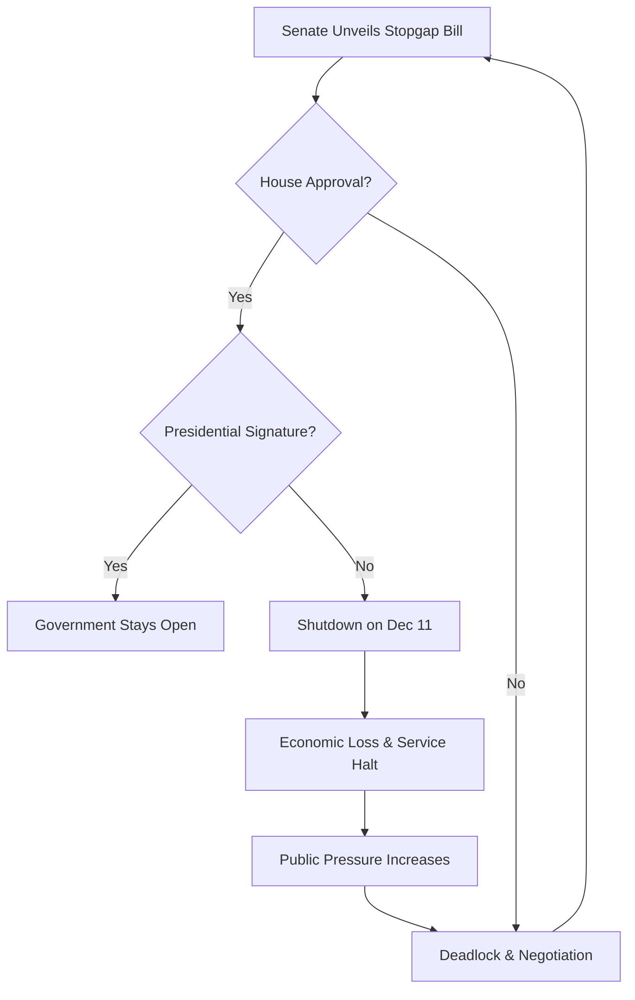

# 🏛️ The December 11 Countdown: Can the Senate Actually Stop a Government Shutdown?

D.C. is perpetually characterized by a certain level of managed chaos, but as the calendar creeps toward December 11, the tension has shifted from political theater to systemic risk. The US Senate has returned to its most polarizing habit: "budgetary brinkmanship." In simple terms, lawmakers are utilizing the threat of a complete government shutdown as a high-stakes bargaining chip to extract concessions on policy and spending. 

To prevent a total collapse of federal operations, a bipartisan coalition of senators has proposed a stopgap bill—officially known as a **Continuing Resolution (CR)**. Think of a CR as a temporary financial bridge; it is designed to keep the lights on and the doors open from the current moment until a comprehensive, long-term budget can be negotiated and passed.

For the average citizen, a "government shutdown" often sounds like a bureaucratic glitch—a series of closed museums or paused permit applications. However, the reality is a cascading domino effect. When the funding expires, Social Security checks can face processing delays, national parks shutter their gates, and critical regulatory oversight vanishes. This stopgap bill isn't a cure for a broken system; it is a financial Band-Aid applied to a deep, systemic wound. With the December 11 deadline looming, the conflict has evolved into a war of attrition between those demanding aggressive spending cuts and those fighting to protect essential public services. It is no longer just a debate over numbers; it is a clash of fundamental governing philosophies, and the entire US economy is caught in the crossfire.

---

## ⚙️ The Anatomy of the Stopgap: How CRs Work

  
  
 <a href="https://unsplash.com/@albrb">Alejandro Barba</a> on <a href="https://unsplash.com/photos/white-concrete-building-under-clear-blue-sky-XU93D-JThyE">Unsplash</a>

To understand why the December 11 date is so critical, one must first grasp the mechanics of a [Continuing Resolution (CR)](https://en.wikipedia.org/wiki/Continuing_resolution). In an ideal legislative cycle, Congress would pass twelve separate appropriations bills by October 1st, marking the start of the federal fiscal year. These bills detail exactly how much money goes to everything from the Department of Defense to the National Park Service.

However, in an era of extreme political polarization, the "ideal" cycle has become a myth. When Congress misses the October deadline, they employ a CR. Essentially, a CR instructs federal agencies: *"Continue operating exactly as you did in the previous fiscal year, but do not spend a single penny more than you were allocated then."* 

While this prevents an immediate shutdown, it traps the government in a "holding pattern." Agencies are legally forbidden from starting new projects, hiring new permanent staff, or pivoting their strategic priorities because they lack the legislative authority to deviate from the previous year's budget.

The current bill being debated is a "short-term" CR. These are tactical maneuvers designed to push the deadline back by a few weeks or months, buying negotiators time to reach a "grand bargain." The danger is that this has become the default mode of governance. We are now witnessing "governing by crisis," where the government operates on a series of precarious extensions. This instability creates a culture of hesitation; agency managers are terrified to commit to long-term goals because their funding could evaporate on a random Tuesday in December.

> "The reliance on Continuing Resolutions is a symptom of a broken appropriations process. We are essentially flying the plane while trying to rebuild the engine in mid-air, hoping the wings don't fall off before we reach the runway." — *Analysis of Legislative Trends*

---

## ⚖️ The Senate's Gambit: The Fight for December 11

A bipartisan group of senators is currently racing to push this stopgap through to avoid the "fiscal cliff" of December 11. The primary battleground is the "top-line" number—the total aggregate amount of federal spending. The divide is stark: some senators are pushing for a "flat" CR (maintaining spending at existing levels), while others are demanding "offsets," which involve cutting funds from specific programs to pay for other priorities.

The architects of the current bill are attempting a delicate middle-ground strategy. They aim to ensure that national security and healthcare remain fully funded while imposing a rigid cap on non-defense discretionary spending. This is a political tightrope walk. Senate leaders must appease the "hardliners" within their own caucuses to secure the 60 votes needed to break a filibuster, while simultaneously ensuring they are not branded as the "roadblock" that caused a shutdown—a label that historically polls poorly with the general public.

One of the most contentious elements of these negotiations is the inclusion of "policy riders." These are legislative "attachments"—small, often unrelated laws tucked into a funding bill. A rider might mandate a change in border security protocols or alter environmental regulations. In the currency of D.C. politics, riders are used to "buy" the votes of reluctant senators. However, they often become "poison pills," making a bill an absolute deal-breaker for the opposing party.

**The clock is the most formidable enemy.** Every hour spent debating a specific rider is an hour lost in the countdown to December 11. If the bill fails to pass both the Senate and the House and receive the President's signature, the [Antideficiency Act](https://en.wikipedia.org/wiki/Antideficiency_Act) takes effect. This law strictly forbids federal agencies from spending money that has not been appropriated by Congress, which legally mandates a shutdown of all non-essential services.

---

## 📉 The Price of Paralysis: Comprehensive Economic Analysis

The anxiety surrounding December 11 isn't merely political; it is deeply economic. A government shutdown does not simply pause paperwork; it freezes a massive segment of the national economy. According to academic research and [economic studies on government shutdowns](https://arxiv.org/search/?query=government+shutdown+economic+impact), the impact is immediate and regressive.

Historically, shutdowns lead to a measurable dip in quarterly GDP. Data from the [Congressional Budget Office (CBO)](https://www.cbo.gov) suggests that the longer a shutdown lasts, the more permanent the economic damage becomes. When hundreds of thousands of federal employees are furloughed, their spending power vanishes. This creates a local economic vacuum in federal hubs—from the corridors of D.C. to rural offices in Kansas.

**Bold Statistics on Shutdown Impacts:**
*   **GDP Reduction:** Major shutdowns have been estimated to shave **0.1% to 0.2%** off total quarterly GDP.
*   **Daily Loss:** Some estimates suggest the US economy loses **billions of dollars per week** in lost productivity and deferred spending.
*   **Wage Delay:** Millions of dollars in wages are delayed, triggering a "consumption freeze" among federal workers.
*   **Contractor Volatility:** Unlike direct employees, federal contractors often do not receive back pay, leading to **immediate cash-flow crises** for thousands of small businesses.

Furthermore, we must consider the "uncertainty effect." Private sector companies that rely on federal approvals—such as pharmaceutical firms awaiting FDA clearance or construction companies needing EPA permits—simply stop moving. If a drug company delays a product launch because the FDA is shuttered, the loss isn't just a government delay; it's a loss of private sector revenue and potentially a delay in life-saving medication reaching the public. This ripple effect ensures that the costs of a shutdown extend far beyond the federal payroll.

---

## 💻 Digital Decay: The Invisible Cyber Risk

While the public focuses on closed national parks, a far more dangerous risk evolves in the background: the decay of national cybersecurity. On platforms like [Hacker News](https://news.ycombinator.com/), tech policy experts frequently warn about the "silent failure" of federal IT systems during funding gaps.

Federal IT infrastructure requires constant, aggressive patching and monitoring. During a shutdown, "non-essential" IT staff are furloughed. While "essential" personnel remain, they are typically overworked, understaffed, and exhausted. This creates a "security gap"—a window of vulnerability that state-sponsored hackers and cybercriminals are eager to exploit. When the team monitoring for intrusions is running at **50% capacity**, the probability of a successful breach increases exponentially.

Moreover, the US government provides critical open data and APIs that thousands of private applications depend on. From NOAA's weather data to the Bureau of Labor Statistics' economic indicators, these feeds are the bedrock of countless financial models. A shutdown can lead to "API death," where these feeds go dark, breaking the tools used by hedge funds, weather apps, and logistics companies.

> "The most dangerous part of a shutdown isn't the closed doors; it's the silent failure of the systems that protect our national security. You cannot 'furlough' a zero-day vulnerability; it exists whether the technician is being paid or not." — *Tech Policy Forum*

The current stopgap bill is, in many ways, a desperate attempt to keep the "digital shield" from flickering. By securing funding, the Senate isn't just paying salaries—they are ensuring that the guards at the servers don't go home.

---

## 👥 The Human Toll: The Paradox of the "Excepted" Worker

Beyond GDP figures and server uptimes lies a devastating human cost. For millions of federal employees, the December 11 deadline is a source of profound psychological stress. Workers are split into two categories: those who are **furloughed** (sent home without pay) and those who are **excepted**.

"Excepted" workers occupy a cruel paradox. By law, they *must* continue working because their roles are deemed essential for the protection of life and property (e.g., TSA agents, Border Patrol, Air Traffic Controllers). However, they do so **without a paycheck**. They are required to report to work, pay for commuting, and provide for their families while their income is frozen indefinitely.

**The Cycle of Shutdown Stress:**
1.  **Pre-Shutdown Anxiety:** Employees stop making large purchases, cancel vacations, and avoid taking out loans due to income instability.
2.  **The Liquidity Gap:** Excepted workers hit an immediate cash crisis, often relying on credit cards to survive.
3.  **The Back-Pay Lag:** Even after a bill is signed, the [Federal Register](https://www.federalregister.gov) and payroll systems often take weeks to process back pay, extending the financial hardship.

This cycle leads to massive burnout and an accelerating "brain drain." High-skill workers—data scientists, cybersecurity experts, and engineers—are fleeing the public sector for the private sector simply to avoid the recurring trauma of "December cliffs." When the government loses its top talent, it loses its capacity to solve complex national problems, creating a long-term degradation of state capacity.

---

## 🔮 Beyond December 11: The Fiscal Cliff and the Path Forward

Passing the current stopgap bill would be a victory for the clock, but it is not a victory for the system. If the Senate avoids the shutdown, they have merely purchased a few more weeks of breathing room. The fundamental conflict—how much the US government should spend and where that money should go—remains unresolved.

The US is currently staring down a "fiscal cliff." The combination of expiring tax cuts, rising interest payments on the national debt, and persistent inflation has turned budget talks into a zero-sum game. This stopgap bill is a tactical retreat, allowing both sides to avoid the political fallout of a shutdown while they prepare for the next confrontation.

To truly escape this cycle, structural reform is required. Some policy experts suggest moving toward "automatic sequesters" or a stricter adherence to the [Budget Act of 1974](https://en.wikipedia.org/wiki/Congressional_Budget_Act_of_1974). Others advocate for "Zero-Based Budgeting," where agencies must justify every dollar from scratch each year, rather than simply adding to the previous year's baseline.

Comparisons with other [OECD nations](https://www.oecd.org) show that the US is an outlier in its frequency of budget-related government closures. Most developed nations have mechanisms to ensure continuity of government, regardless of political deadlock. Until the US adopts similar safeguards, December 11 is just one of many deadlines in a state of permanent crisis. This bill is a necessary evil—a way to keep the gears turning, however slowly, while the architects argue over the blueprint.

---

## 🏁 Conclusion

The fight over the December 11 stopgap bill is a microcosm of the current state of the US legislative process: a high-wire act performed without a safety net. While a Continuing Resolution can stop the immediate disaster, it cannot cure the underlying instability of a government that has forgotten how to budget.

The economic losses, the heightened cyber risks, and the immense stress placed on the federal workforce are too high to be treated as mere pawns in a political game. As the Senate races against the calendar, the hope is that this temporary reprieve leads to a genuine, long-term agreement. Until then, the United States remains in a state of "permanent temporariness," governed by Band-Aids, last-minute deals, and the constant threat of the clock.

## 📚 References

*   **Wikipedia:** [Continuing Resolution](https://en.wikipedia.org/wiki/Continuing_resolution) - Comprehensive overview of stopgap funding.
*   **Wikipedia:** [Antideficiency Act](https://en.wikipedia.org/wiki/Antideficiency_Act) - The legal basis for government shutdowns.
*   **Wikipedia:** [Congressional Budget Act of 1974](https://en.wikipedia.org/wiki/Congressional_Budget_Act_of_1974) - The framework for US federal budgeting.
*   **arXiv:** [Economic Impact of Government Shutdowns](https://arxiv.org/search/?query=government+shutdown+economic+impact) - Quantitative analysis of GDP loss.
*   **Hacker News:** [Government Shutdown Discussions](https://news.ycombinator.com/) - Technical community perspectives on cyber risk.
*   **US Senate:** [Official Appropriations Process](https://www.senate.gov) - The formal steps of federal funding.
*   **Congressional Budget Office (CBO):** [Federal Spending Analysis](https://www.cbo.gov) - Non-partisan budget projections and reports.
*   **Federal Register:** [Rules and Regulations](https://www.federalregister.gov) - Official journal of the federal government.
*   **OECD:** [Government Spending Comparisons](https://www.oecd.org) - International benchmarks for fiscal management.
*   **Treasury.gov:** [Debt and Budgeting](https://home.treasury.gov) - Official US Treasury data on national debt and funding.
