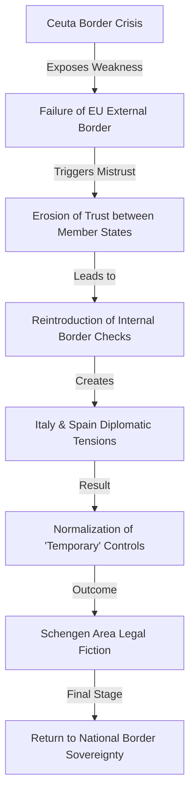

# 🇪🇺 The Ceuta Domino Effect: Is the Schengen Dream Collapsing?

The Schengen Agreement was more than just a diplomatic treaty; it was a bold, high-stakes experiment in institutional trust. The vision was intoxicatingly simple: erase the internal borders of Europe so that millions of citizens could move from Lisbon to Berlin, or Rome to Paris, without the friction of passports, customs queues, or national checkpoints. For decades, this "freedom of movement" served as the gold standard of European integration, symbolizing a continent that had finally moved past the scars of twentieth-century nationalism.

However, this seamless interior relied on one fragile, non-negotiable prerequisite: the **external borders** of the European Union had to be locked down and managed with absolute uniformity. The trust between member states was predicated on the belief that if you entered the zone at any single point, you had been vetted to the same standard regardless of whether you stepped foot in Greece, Poland, or Spain.

That fundamental assumption shattered during the [2021 Ceuta migration crisis](https://www.aljazeera.com/news/2021/5/20/morocco-spain-clash-over-migrants-in-ceuta). When thousands of migrants stormed the fences of the Spanish enclave in North Africa, it wasn't merely a localized humanitarian disaster—it was a geopolitical earthquake that sent shockwaves through the entire Schengen Area. For frontline states like Italy, Ceuta served as a brutal wake-up call. It suggested that the "External Border" was less a fortified wall and more of a permeable membrane. Since then, the EU has witnessed a slow, steady crawl back toward "temporary" border checks, deteriorating diplomatic relations between Mediterranean partners, and a growing suspicion that the Schengen Area is transitioning from a functioning system into a legal fiction.

---

## 🌊 The Catalyst: The Ceuta Breach and the "Weaponization" of People

  
  
 <a href="https://unsplash.com/@michelebit_">Michele Bitetto</a> on <a href="https://unsplash.com/photos/white-concrete-building-with-statue-under-blue-sky-during-daytime-zRZYitC_ABQ">Unsplash</a>

To understand why a small piece of land in North Africa could threaten the stability of Central Europe, one must look at the calculated nature of the May 2021 crisis. The chaos in Ceuta was not a spontaneous migration surge; it was a calibrated power move. In a sudden shift of policy, Morocco loosened its border restrictions, effectively permitting thousands of migrants—predominantly from Algeria and sub-Saharan Africa—to flood into the Spanish enclave.

The images that flashed across global screens were visceral: desperate individuals scaling razor-wire fences, violent clashes with Spanish security forces, and a city of **80,000 people** completely overwhelmed by a sudden influx of thousands. As reported by [Al Jazeera](https://www.aljazeera.com/news/2021/5/20/morocco-spain-clash-over-migrants-in-ceuta), the timing was not coincidental. This move was widely interpreted as Morocco's retaliation after Spain granted asylum to the leader of the Polisario Front, a movement seeking independence for Western Sahara.

By "weaponizing" migration, Morocco exposed the central vulnerability of the Schengen system. Because Ceuta is legally an external EU border, the moment a migrant successfully scales that fence, they are legally "inside" the Schengen Area. From that point forward, they can theoretically travel to any other member state without further passport checks.

This event proved that a single point of failure on the map could compromise the security of the entire continent. For Italy, the lesson was stark: if Spain cannot hold the line in North Africa, "freedom of movement" becomes a strategic liability. Italy’s concern shifted from the initial arrivals to the phenomenon of "secondary movement"—the process where migrants enter through one member state and then travel undetected to another. This created a profound atmospheric shift in EU diplomacy; Italy began to view Spain’s border management not as a shared administrative challenge, but as a massive security breach that threatened Italian national stability.

---

## 🇮🇹 Italy’s Reaction: The Return of the "Temporary" Border

While Italy and Spain do not share a land border, they are inextricably linked by the Schengen logic. In a borderless zone, "free movement" extends to the airports, seaports, and the transit corridors through France. In the wake of the Ceuta crisis, and amid the EU's persistent failure to implement a fair system for distributing asylum seekers, Italy has aggressively pushed to regain control over who enters its territory.

This desire for control manifests as the reintroduction of **border checks**. Under the [Schengen Borders Code](https://home-affairs.ec.europa.eu/policies/schengen-borders-and-visa_en), member states are permitted to reinstate internal border controls temporarily if there is a "serious threat to public policy or internal security." However, the definition of "temporary" has become dangerously elastic.

The "temporary" measures that spiked during the 2015 migrant crisis and the COVID-19 pandemic have now become a standard operating procedure. Italy's frustration with Spain's handling of Ceuta provided the political justification to normalize these checks. When Italy begins scrutinizing flights and ferries originating from Spanish ports or intensifying patrols along the French border to intercept arrivals from the west, it is essentially admitting that the EU's collective security architecture has failed.

This "border nationalism" is further fueled by the **Dublin Regulation**, a contentious piece of EU law which dictates that the country where a migrant first makes contact with EU authorities is responsible for processing their asylum claim. Since Italy and Spain are both "frontline states," they are often left to shoulder the heaviest burdens. When one frontline state is perceived as "leaky," the other feels the pressure. The resulting friction transforms European solidarity into a blame game, where "leaks" in one country are viewed as negligence that burdens another.

---

## ⚖️ The Legal Loophole: When "Temporary" Becomes Permanent

The most alarming trend since the Ceuta crisis is the "normalization of the exception." According to the spirit of the Schengen Agreement, internal border checks should be the extreme exception, reserved for imminent threats. Yet, we are witnessing what sociologists and legal scholars call the **"securitization of the interior."**

Research into [border security and EU migration patterns](https://arxiv.org/abs/2111.10142) indicates that these "temporary" controls have evolved into a semi-permanent state of affairs. Germany, Austria, France, and Italy have repeatedly extended their border checks, often citing "irregular migration" as the primary driver. The internal logic is simple: as long as the external perimeter—exemplified by the fences of Ceuta—feels porous, the internal borders must remain "hard" to compensate.

This creates a staggering legal paradox. On official EU documents, the Schengen Area is expanding and thriving. In practical reality, the experience of crossing a border has become fragmented. Even the [Wikipedia overview of the Schengen Area](https://en.wikipedia.org/wiki/Schengen_Area) notes the increasing frequency of these "temporary" reinstatements.

> "The crisis of Schengen is not a crisis of law, but a crisis of trust. When member states stop trusting the external border, they stop trusting their neighbors. The fence in Ceuta didn't just keep people out; it shut the door on European mutual reliance."

Ceuta served as the "proof of concept" for this distrust. It demonstrated that a non-EU actor (Morocco) could leverage a single member state's border to pressure the entire Union. Consequently, Italy has championed a "fortress" approach, where internal borders act as secondary lines of defense. This effectively transforms the Schengen Agreement into a hollow shell—a treaty that exists on paper but is ignored in practice.

---

## 🔄 The Migration Paradox: Citizens vs. Migrants

The current state of European borders reveals a harsh, binary contradiction in how the EU perceives human movement. For the EU citizen, Schengen is a triumph of liberal values: no queues, no stamps, and the seamless integration of the European lifestyle. However, for the non-European migrant, Schengen is not a "zone of movement" but a monolithic, impenetrable wall.

The paradox is that the "freedom of movement" for citizens is directly dependent on the "restriction of movement" for migrants. The more the EU fails to manage its external borders in places like Ceuta or Lampedusa, the more it feels compelled to restrict movement *inside* the zone to maintain a semblance of control.

This is where the friction between Italy and Spain reaches its peak. Italy often feels it carries a disproportionate share of the Mediterranean burden, with **thousands of arrivals per month** landing on its shores. When Spain experiences a crisis in Ceuta, Italy doesn't see it as a Spanish problem; it sees it as a source of "secondary movement." If migrants enter Spain and then travel to Italy in search of better economic opportunities or established social networks, Italy views this as a failure of Spanish border enforcement.

As a result, the overarching narrative has shifted. We are moving away from the ideal of "European Solidarity" and toward a cold calculation of "National Interest." While the [European Commission](https://ec.europa.eu/info/index_en) continues to promote the "New Pact on Migration and Asylum," these high-level policy frameworks often crash into the gritty reality of border fences. The "free movement" of the 1990s is being replaced by "managed movement," where biometric data and digital surveillance are the new gatekeepers.

---

## 🚩 Political Fallout: The Rise of Border Nationalism

The erosion of free movement is not merely a security necessity; it is a potent political tool. In both Italy and Spain, the rise of right-wing populism has transformed the border from a logistical line into a powerful symbol of national identity.

In Italy, populist movements have long argued that the EU's "open border" philosophy left the nation vulnerable to "uncontrolled" migration. The Ceuta crisis provided the perfect rhetorical ammunition. It allowed politicians to argue that the EU's external borders are a "sieve," and that the only way to ensure national security is to "take back control"—a phrase echoed across Europe from Brexit to the current Italian administration.

This creates a self-reinforcing loop of instability:
1. **External Crisis**: A breach occurs (e.g., Ceuta).
2. **Political Spin**: Populist leaders frame the breach as a failure of the EU or a neighboring member state.
3. **Security Response**: "Temporary" internal border checks are reinstated to "protect" the citizenry.
4. **Normalization**: These checks become embedded in the security infrastructure.
5. **Erosion of Trust**: Neighboring countries, fearing they are the next "weak link," implement their own checks.

This is why the "Schengen Crisis" is so resilient to simple policy fixes. The border is no longer just about stopping illegal entry; it is used to define who belongs to the "European family" and who is an outsider. When Italy expresses distrust in Spain's border management, it is not just discussing numbers—it is signaling the collapse of a shared geopolitical vision.

---

## 🛡️ Frontex and the Militarization of the Perimeter

Central to this crisis is **Frontex**, the European Border and Coast Guard Agency. Originally designed as a coordinating body to help member states, Frontex has evolved into a massive, semi-militarized force. The agency's budget has ballooned, and its mandate has expanded to include intelligence gathering and active surveillance.

However, the expansion of Frontex has not solved the trust deficit. In fact, it has sometimes exacerbated it. Reports of "pushbacks"—the illegal forcing of migrants back across a border—have plagued the agency, creating a tension between the EU's stated commitment to human rights and its desperate drive for security.

In the context of Ceuta, Frontex represents the EU's attempt to "Europeanize" the external border. The theory is that if Frontex manages the border, it is no longer "Spain's problem" or "Italy's problem," but the "EU's problem." But this requires member states to cede significant sovereignty over their own soil. As evidenced by the current climate, the trend is moving in the opposite direction: toward **re-nationalization**.

The militarization of the perimeter in Ceuta—with high-tech sensors, drones, and reinforced fencing—is a physical manifestation of the "Fortress Europe" mentality. While these measures may stop a specific breach, they do nothing to address the root causes of migration or the internal distrust among EU members.

---

## 🛠️ The Path Forward: Reform or Collapse?

Is the Schengen Area actually dying, or is it simply undergoing a violent stress test? To preserve the dream of borderless travel, the EU must resolve the fundamental contradiction in its border policy.

The proposed **EU Migration Pact** aims to create a "mandatory solidarity" mechanism, forcing member states to either accept a quota of asylum seekers or pay a financial contribution. It also seeks to accelerate screening processes at the external borders to prevent the kind of chaos seen in Ceuta. However, critics argue that this is a bureaucratic band-aid on a systemic wound.

For Schengen to survive, the EU needs a transition from "coordinated" border management to "integrated" border management. This would mean:
- **Unified Standards**: A truly singular vetting process that removes the incentive for "secondary movement."
- **Fair Burden Sharing**: Moving beyond the flawed Dublin Regulation to a system where frontline states are not penalized for their geography.
- **Diplomatic De-escalation**: Using the EU's collective economic weight to prevent third-party countries (like Morocco) from weaponizing migration.

The future of Schengen will likely bifurcate into a "Two-Tier" system:
- **The Digital Border**: The implementation of the **Entry/Exit System (EES)** and **ETIAS**, using AI and biometrics to track movements in real-time without physical stops.
- **The Hard Perimeter**: A heavily militarized external shell designed to ensure that a "Ceuta event" never happens again.

Unless Europe finds a way to rebuild trust between its member states, "free movement" will continue to be suspended—one "temporary" measure at a time—until the borders are effectively back.

---

## 📉 Summary of the Schengen Tension Flow

---

## 🏁 Conclusion

The crisis in Ceuta was more than a local skirmish between Spain and Morocco; it was a symptom of a systemic failure within the European project. When Italy and Spain—the two primary anchors of the Mediterranean frontier—clash over the concept of free movement, it reveals that the trust holding the Schengen Area together is evaporating.

"Freedom of movement" is not a permanent state; it is a privilege that exists only as long as there is mutual confidence in a shared security perimeter. When that confidence vanishes, the borders return. Whether through physical fences or invisible digital tracking, Europe is rebuilding the walls it spent decades tearing down.

The question is no longer whether Schengen is in crisis, but whether the European Union has the political will to redefine its borders before "temporary" checks become the permanent reality of European life. If the dominoes continue to fall, the "Schengen Dream" may soon be remembered as a brief, optimistic anomaly in the long history of European borders.

---

## 📚 References

- **Al Jazeera**: [Morocco-Spain clash over migrants in Ceuta](https://www.aljazeera.com/news/2021/5/20/morocco-spain-clash-over-migrants-in-ceuta)
- **European Commission**: [Schengen Borders Code and Policy Framework](https://home-affairs.ec.europa.eu/policies/schengen-borders-and-visa_en)
- **Wikipedia**: [Detailed Overview of the Schengen Area](https://en.wikipedia.org/wiki/Schengen_Area)
- **Wikipedia**: [Geography and Political History of Ceuta](https://en.wikipedia.org/wiki/Ceuta)
- **ArXiv**: [Between welcome culture and border fence: A dataset on the European refugee crisis](https://arxiv.org/abs/2111.10142)
- **European Commission**: [The New Pact on Migration and Asylum](https://ec.europa.eu/info/index_en)
- **Al Jazeera**: [Deep Dive into the 'Weaponization' of Migration](https://www.aljazeera.com/news)
- **Frontex**: [European Border and Coast Guard Agency Reports](https://frontex.europa.eu/)
- **Council of the European Union**: [Legal Text of the Schengen Agreement](https://www.consilium.europa.eu/)
- **European Parliamentary Research Service**: [Analysis of the Dublin Regulation](https://www.europarl.europa.eu/thinktank/en)
