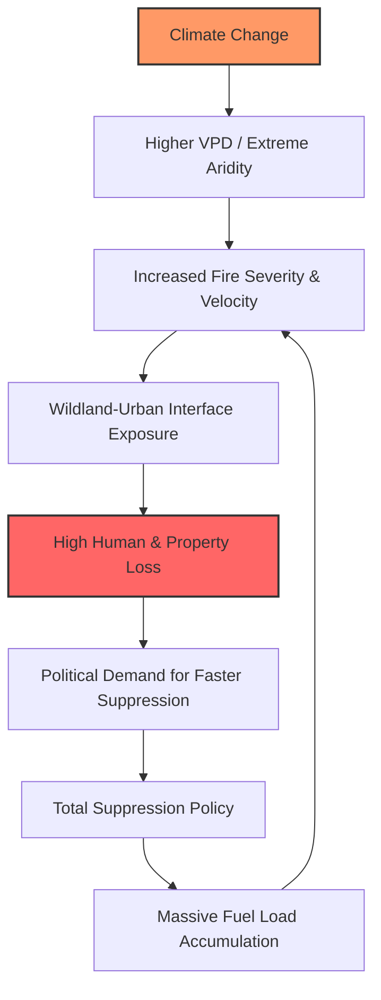

# 🌲 The New Normal for the Pacific Northwest

For decades, the identity of Washington State was inextricably linked to moisture. To the outside world, it was the "Evergreen State," a sanctuary of emerald forests, mist-shrouded mountains, and a persistent drizzle that kept the landscape lush and vibrant. The idea of a catastrophic wildfire felt like a distant threat—something reserved for the arid scrublands of the East or the scorched plains of California. But in recent years, that pastoral image has been violently dismantled, replaced by a recurring, apocalyptic orange haze that blots out the sun.

The fires currently tearing through the state—particularly the devastating blazes around Spokane and the Inland Northwest—are not mere anomalies or the result of a few "unlucky" dry seasons. Instead, they are the manifestation of a perfect storm: a convergence of accelerating climate shifts, a century of misguided forestry policies, and a demographic migration that has placed thousands of homes in the direct path of nature's volatility.

This is not an accidental escalation; it is a systemic failure. When we analyze why the Spokane fires have become so intense and unpredictable, we are essentially documenting the transformation of a resilient ecosystem into a tinderbox. Between the "atmospheric thirst" driven by rising global temperatures and a "suppression paradox" that has left our forests choked with dead biomass, Washington has become a warning siren for the rest of the developed world. As smoke drifts across state lines and oceans, it is becoming clear that the era of simply "putting out fires" is over. We have entered an era of coexistence with fire, where the boundary between the wild and the suburban has blurred dangerously.

---

## 🌡️ The "Atmospheric Thirst": Climate Change and VPD

  
  
 <a href="https://unsplash.com/@77hn">The 77 Human Needs System</a> on <a href="https://unsplash.com/photos/a-book-with-the-title-the-power-of-why-axK93Sfmflc">Unsplash</a>

To understand why modern wildfires are behaving with such unprecedented aggression, we must look beyond the visible flames to the invisible chemistry of the air. While the general public focuses on "relative humidity," climate scientists track a far more critical metric: **Vapor Pressure Deficit (VPD)**. 

Relative humidity tells us how much water is in the air relative to its maximum capacity at a given temperature. VPD, however, measures the actual difference (the deficit) between how much moisture the air *can* hold and how much it *actually* contains. In simpler terms, VPD is "atmospheric thirst."

Because of the thermodynamics of a warming planet, warmer air has a higher capacity to hold water vapor. As temperatures rise, the air becomes exponentially more "thirsty." This creates a powerful suction effect; the atmosphere acts as a massive sponge, aggressively pulling moisture out of the soil, the needles of ponderosa pines, and the grasslands of the Spokane plateau. When the VPD is high, plants lose water through transpiration faster than their root systems can replenish it from the ground. This triggers "fuel curing"—a process where live vegetation becomes biologically stressed, dies, and transforms into highly flammable tinder.

According to research on [wildfire dynamics and fuel moisture](https://arxiv.org/abs/2412.04517), the relationship between increasing temperatures and fuel dryness is not linear—it is exponential. Even a modest increase in average temperature can lead to a precipitous drop in fuel moisture. In Washington, this has resulted in a "seasonal shift": the window for ignition now opens earlier in the spring and remains open well into the autumn. We are seeing the rise of "flash droughts," where a sudden heat spike can strip a landscape of its moisture in a matter of days, leaving the forest floor primed for an explosion.

**The Critical Metrics of Desiccation:**
*   **1.5°C to 2°C:** This is the global warming threshold identified by the [IPCC](https://www.ipcc.ch/) as a potential "tipping point" for Northwest forests. Beyond this, these ecosystems risk flipping from carbon sinks (which absorb CO2) to carbon sources (which release it).
*   **30% Increase:** Estimated jump in "extreme fire weather" days in the Inland Northwest over the last three decades, characterized by the lethal combination of low humidity and high wind gusts.
*   **Millions of Acres:** The recurring scale of damage across the Western US, where moisture deficits are fueling "megafires"—blazes that exceed 100,000 acres and create their own localized weather systems.

> "We are witnessing a fundamental shift in the moisture regime of the West. The forests are not merely dry; they are biologically desiccated. This creates a state of high-intensity combustion that can actually sterilize the soil, preventing the natural regeneration of the forest for decades."

When this "atmospheric thirst" meets a spark—be it a downed power line during a wind event or a bolt of dry lightning—the result is instantaneous. Fuel that was once damp and resistant now ignites with terrifying ease. This allows a surface fire (which burns grass and leaf litter) to rapidly transition into a "crown fire," leaping into the treetops. Once a fire hits the canopy, it moves faster than any ground crew can track, propelled by the very winds that dried the forest in the first place.

---

## 🍂 The Tinderbox Effect: The Suppression Paradox

There is a profound and tragic irony at the heart of the Washington wildfire crisis: the intensity of today's fires is partly a result of our success in fighting yesterday's fires. For over a century, the US Forest Service and other land management agencies operated under a mandate of "total suppression." This was the "Smokey Bear" era—a policy of extinguishing every single ignition as quickly as humanly possible.

While this policy protected timber assets and residential structures in the short term, it ignored a fundamental ecological truth: **forests require fire to survive.**

In a natural state, the Pacific Northwest experienced frequent, low-intensity "cool" fires. These fires acted as a natural cleaning mechanism, clearing out the "understory"—the accumulation of dead leaves, fallen branches, and invasive scrub. By removing this debris, natural fires prevented fuel buildup and allowed sunlight to reach the forest floor, promoting the growth of fire-resistant species. 

By suppressing every small burn for nearly a hundred years, we have inadvertently created a massive accumulation of "fuel load." In the forests surrounding Spokane and the Cascades, the undergrowth has transitioned from a sparse layer of needles to a thick, flammable carpet. Now, when a fire starts, it doesn't stay on the ground. It utilizes this buildup as a "ladder," climbing from the grass to the shrubs and directly into the canopy.

This phenomenon is known as the [Suppression Paradox](https://en.wikipedia.org/wiki/Wildfire). The more we fought every small fire, the more catastrophic the eventual "big one" became. We have moved from "healthy" fires that rejuvenated the soil to "stand-replacing" fires that kill even the oldest, most resilient trees and leave the land vulnerable to massive erosion and invasive weed colonization.

**The Scale of the Build-up:**
*   **100%+ Density Increase:** In parts of the Inland Northwest, the density of small, "ladder fuel" trees has more than doubled compared to pre-European settlement levels.
*   **Continuous Fuel Bridges:** The lack of natural thinning has created unbroken stretches of flammable material, allowing fires to sweep across miles of terrain without hitting a natural firebreak.

---

## ⚡ The Spokane Crucible: Geography and Dry Lightning

While climate change provides the fuel and suppression provides the volume, the specific geography of Spokane creates a unique "crucible" for disaster. Spokane sits in a transitional biological zone—a crossroads between the humid rainforests of the coast and the arid high-desert plains of the interior. This positioning makes the region exceptionally prone to "dry lightning."

Dry lightning occurs when a thunderstorm produces electrical discharges, but the air beneath the cloud base is so arid that the accompanying rain evaporates before it ever reaches the ground—a phenomenon known as *virga*. In a drought year, a single dry lightning event can ignite dozens of simultaneous fires across thousands of square miles. For the [Washington Department of Natural Resources (DNR)](https://www.dnr.wa.gov/), this is a logistical nightmare. When ten fires ignite simultaneously in remote areas, resources are stretched thin. By the time crews arrive at a secondary ignition, it may have already evolved into a massive blaze.

The topography further exacerbates the danger. Rolling hills, deep ravines, and narrow canyons act as natural chimneys, funneling wind and oxygen into the heart of the fire, causing it to burn hotter and faster. "East wind" events—hot, dry air pushing from the interior toward the west—can shove flames toward residential neighborhoods with terrifying velocity.

Adding to this is the presence of **cheatgrass**, an invasive species from Eurasia. Cheatgrass dries out significantly faster than native perennial grasses, acting as a "flashy" fuel—a fast-burning fuse that carries fire from open plains directly into the timber and the edges of the suburbs.

**The Spokane Risk Profile Summary:**
1.  **High Wind Corridors:** Topography that accelerates wind speeds, turning a slow-burn into a wall of flame.
2.  **Invasive Fuel Beds:** Cheatgrass creating a highly ignitable landscape.
3.  **Resource Saturation:** Dry lightning creating "cluster fires" that overwhelm emergency response capacities.

---

## 🏘️ The Human Frontier: The Wildland-Urban Interface (WUI)

The true tragedy of the Washington wildfires is not measured in acres of charred timber, but in lost homes and displaced families. This is the result of the expansion of the **Wildland-Urban Interface (WUI)**—the zone where human development meets undeveloped wildland.

Over the last three decades, a trend of "rural residential" growth has seen thousands of people move away from city centers and into "scenic" forest settings. As Spokane and surrounding towns expanded, neighborhoods were carved into the pines, often served by only one or two narrow access roads. This is a recipe for disaster. When a fire hits a WUI zone, it ceases to be a forest fire and becomes a complex urban emergency.

The most lethal element of WUI fires is "spotting." Extreme heat creates powerful updrafts that lift embers high into the air, where they are carried by the wind for miles. These embers can land on a wooden deck, in a dry gutter, or under a porch, igniting a house while the main fire front is still miles away.

**The WUI Critical Failure Points:**
*   **Evacuation Bottlenecks:** Narrow, winding forest roads become death traps during mass evacuations. Traffic jams can trap residents in the path of a fast-moving fire.
*   **Lack of Defensible Space:** Many residents live in the woods without maintaining a "Home Ignition Zone." Without a buffer of cleared vegetation, the forest essentially delivers the fire to the front door.
*   **Infrastructure Fragility:** Power lines in dense forests are double-edged swords; they can be the cause of the fire during a windstorm or be destroyed by it, cutting off the communication lines essential for emergency alerts.

The economic fallout is now becoming systemic. Major insurance providers are beginning to withdraw from high-risk zones in the West, creating "insurance deserts." Homeowners in the Spokane area are finding it increasingly difficult or expensive to secure coverage, leaving them financially exposed to an inevitable event.

---

## 📉 The Policy Trap: From Prevention to Suppression

For too long, Washington’s strategy has been reactive rather than proactive. A disproportionate amount of the state's fire budget is allocated to **suppression**—the high-cost, "last line of defense" operations involving helicopters, air tankers, and smokejumpers. While these are necessary for saving lives, they are symptoms of a failure in **mitigation**.

Mitigation is the slow, unglamorous work of forest thinning and prescribed burns. Prescribed burns—controlled fires set by professionals under specific weather conditions—are the only way to mimic the natural fire cycle and reduce fuel loads. However, in the WUI, these are politically fraught. Residents dislike the smoke, and local officials fear the political fallout if a controlled burn escapes containment. This leads to "analysis paralysis," where the fear of a small, managed fire prevents the action required to stop a catastrophic, uncontrolled one.

Because the system relies on "emergency funding" (which triggers *after* a disaster) rather than "preventative funding," foresters are perpetually overworked and under-resourced. We are spending billions to treat the symptoms of a warming world while ignoring the cure.

To break this cycle, we must transition to a "Fire-Adaptive Community" model. This involves "home hardening"—replacing wooden shingles with metal, installing ember-resistant vents, and strictly enforcing defensible space laws. It also requires a cultural shift: accepting that smoke is a necessary part of a healthy, sustainable forest.

---

## 🌏 Global Parallels: A Planetary Crisis

The crisis in Washington is not an isolated regional event; it is a local symptom of a "global fire regime shift." From the boreal forests of Canada to the eucalyptus groves of Australia and the peatlands of Indonesia, the drivers are identical: rising temperatures, desiccated air, and a history of poor land management.

When Washington’s forests burn, they trigger a "carbon-fire feedback loop." These forests store massive amounts of carbon; when they incinerate, that carbon is released into the atmosphere, further accelerating global warming, which in turn increases the VPD and the likelihood of more fires. Furthermore, the smoke from the Pacific Northwest frequently travels thousands of miles, impacting air quality in the Midwest and even crossing the Atlantic to Europe.

There is also a profound social dimension to this crisis. While wealthy homeowners in the WUI may have the resources to rebuild or the insurance to recover, rural communities and marginalized populations often bear the brunt of the environmental degradation. The health effects of prolonged smoke exposure—respiratory distress and cardiovascular stress—fall disproportionately on those without high-efficiency air filtration systems.

We are no longer dealing with a "wildfire season." We are living in an era of **permanent fire risk**. The lessons learned in Spokane—the danger of the WUI, the necessity of fuel reduction, and the physics of atmospheric thirst—are applicable to every forested region on Earth.

---

## 🏁 Conclusion: Beyond the Flame

The severity of the Washington wildfires and the tragedies surrounding Spokane are a definitive wake-up call. We cannot "fight" our way out of this crisis. The tools of the 20th century—water drops and fire lines—are insufficient for the "megafires" of the 21st. These blazes are too hot, too fast, and too vast to be stopped by brute force.

To lower the stakes for future generations, Washington must fundamentally rewrite its relationship with the land. This means prioritizing the [US Forest Service's](https://www.fs.usda.gov/) fuel management goals, scaling up prescribed burns, and implementing smarter urban planning that limits development in high-risk zones. We must stop viewing fire as an enemy to be defeated and start viewing it as a natural process to be managed.

The "atmospheric thirst" of a warming planet is a reality we cannot ignore. We can either continue to build tinderboxes and wait for the spark, or we can adapt our infrastructure and our mindset to survive in a drier, hotter world. The smoke over Spokane is not just a sign of destruction—it is a call to action.

---

## 📚 References

*   **Climate Data & VPD:** [ArXiv — Modeling wildfire dynamics with fuel moisture](https://arxiv.org/abs/2412.04517)
*   **General Wildfire Dynamics:** [Wikipedia - Wildfire](https://en.wikipedia.org/wiki/Wildfire)
*   **WUI Guidelines:** [Wikipedia - Wildland-Urban Interface](https://en.wikipedia.org/wiki/Wildland%E2%80%93urban_interface)
*   **Global Climate Trends:** [IPCC - Intergovernmental Panel on Climate Change](https://www.ipcc.ch/)
*   **State Fire Statistics:** [Washington DNR - Wildfire Reports](https://www.dnr.wa.gov/)
*   **Weather Patterns:** [National Weather Service - Climate Summaries](https://www.weather.gov/)
*   **Forest Management:** [US Forest Service - Fuel Management](https://www.fs.usda.gov/)
*   **Home Hardening:** [Firewise USA - NFPA](https://www.nfpa.org/Public-Education/Fire-adjusted-communities/Firewise)
*   **Interagency Coordination:** [National Interagency Fire Center (NIFC)](https://www.nifc.gov/)
