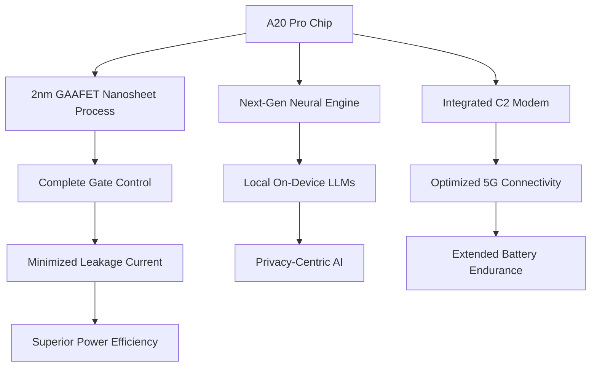

# 🚀 Something Big is Coming: The iPhone 18 Pro is Almost Here

The global technology landscape is currently vibrating with anticipation. While Apple is legendary for its "walled garden" of secrecy, the leaks surrounding the **September 7** launch of the iPhone 18 Pro have become impossible to ignore. This is not merely an incremental update—the kind of "slightly faster processor and a new titanium shade" that we've seen over the last few cycles. Instead, Apple is preparing a fundamental architectural shift. 

We are looking at a transition to **TSMC’s 2nm "Nanosheet" process** and the introduction of a **mechanical variable aperture camera**, a feature that aims to bridge the gap between mobile sensors and professional DSLR optics. For the first time in years, the hardware is changing as fast as the software.

For users in India, the excitement is tempered by financial reality. Between the soaring costs of 2nm fabrication and the complex engineering of a physical iris camera, the iPhone 18 Pro is poised to redefine "premium pricing." Apple is no longer just selling a communication device; they are shipping a pocket-sized AI supercomputer. In this comprehensive analysis, we dive deep into the hardware, the physics of the A20 chip, and the economic implications of the most ambitious iPhone to date.

---

## 📱 Design: The Quest for the "Invisible" Interface

  
  
 <a href="https://unsplash.com/@lagommedia">Laurenz Heymann</a> on <a href="https://unsplash.com/photos/apple-store-shop-front-VkfhJLz5SMQ">Unsplash</a>

For several generations, the iPhone's silhouette has remained largely static. However, the iPhone 18 Pro is focused on "micro-evolutions"—changes that are subtle to the eye but transformative to the user experience. The most significant headline is the evolution of the **Dynamic Island**. Rumors suggest a reduction in size by approximately **35 percent**. 

According to reporting from [India Today](https://www.indiatoday.in/amp/technology/news/story/iphone-18-pro-iphone-18-pro-max-launch-release-date-india-price-leak-rs-139999-camera-upgrades-chipset-2956515-2026-07-26), Apple is achieving this by migrating several Face ID components beneath the display pixels. This "Under-Display Face ID" (UDID) technology reduces the screen cutout, granting more real estate to **Apple Intelligence** notifications and interactive widgets.

### The LTPO+ Revolution
The display isn't just about size; it's about efficiency. While the **6.3-inch and 6.9-inch OLED panels** remain the standard, the shift to **LTPO+ (Low-Temperature Polycrystalline Oxide)** is a game-changer. This allows the refresh rate to drop to a consistent **1Hz** across more of the screen's surface area, drastically reducing power consumption during Always-On display usage.

However, peak performance requires physical space. To accommodate a more robust cooling system and a higher-density battery, the Pro Max model may see a slight increase in dimensions:
*   **Thickness:** An increase of roughly **0.25mm**.
*   **Weight:** An addition of approximately **7 grams**.

While these figures seem negligible, they represent the "thermal tax" required to run a 2nm processor at full throttle without triggering aggressive thermal throttling. In terms of aesthetics, the rumor mill points toward high-fashion tones: **Dark Cherry Red** and a crystalline **Light Blue**.

> "The strategic goal for the iPhone 18 series is the 'disappearance' of hardware. Apple wants the user to forget they are holding a slab of glass and metal, leaving only the content and the AI interface as the primary points of interaction."

---

## ⚡ The A20 Chip: Breaking the FinFET Barrier

The true heart of the iPhone 18 Pro is the **A20 Pro chip**. To understand why this is a leap and not a step, we have to look at the physics of semiconductors. For years, the industry has relied on **FinFET (Fin Field-Effect Transistor)** architecture. In a FinFET design, the gate wraps around the channel on three sides to control the flow of electrons.

Apple is moving to **TSMC's 2nm (N2) process**, which utilizes **GAAFET (Gate-All-Around Field-Effect Transistors)**, also known as **nanosheets**. 

### Why GAAFET Matters
In a GAAFET structure, the gate completely surrounds the channel on all four sides. This provides significantly more control over the electrical current, virtually eliminating "leakage"—the wasted energy that turns into heat. The projected benefits are staggering:
*   **Power Efficiency:** A **10-15% reduction** in power consumption for the same workload.
*   **Performance Boost:** A **10-15% increase** in raw clock speed.
*   **Transistor Density:** More processing power packed into a smaller physical footprint.

As noted by [Times of India](https://timesofindia.indiatimes.com/technology/tech-news/apple-iphone-18-pro-expected-to-debut-in-september-2026-leaked-colours-design-camera-upgrades-battery-price-and-more/amp_articleshow/131684823.cms), this architectural shift is the prerequisite for the next generation of **on-device Large Language Models (LLMs)**. By processing AI locally rather than in the cloud, Apple ensures near-zero latency and unmatched privacy.

Furthermore, the A20 is expected to debut the **Apple-designed C2 modem**. By replacing Qualcomm's hardware with its own, Apple can optimize the 5G radio's interaction with the CPU, potentially boosting overall battery life by an additional **10-20%**.

---

## 📸 Variable Aperture: The End of "Fake" Bokeh

Mobile photography has spent the last decade relying on "Computational Photography"—using software to guess what a blurry background should look like. While impressive, this often results in "edge artifacts," where the AI accidentally blurs a strand of hair or the frame of a pair of glasses.

The iPhone 18 Pro solves this with a **physical variable aperture**. Instead of a fixed hole, the main camera will feature a mechanical iris that can open and close. According to leaks via [Digit.in](https://www.digit.in/news/mobile-phones/apple-iphone-18-pro-max-and-iphone-18-pro-may-launch-soon-from-specs-to-price-here-is-what-leaks-suggest.html/amp), this provides two distinct advantages:

1.  **Optical Bokeh:** When the aperture is wide open (e.g., f/1.4), the lens creates a shallow depth of field naturally. This results in "creamy" backgrounds that are optically correct, not mathematically simulated.
2.  **Deep Focus (Landscape):** In bright sunlight, the aperture can tighten (e.g., f/4.0), ensuring that the entire scene—from the foreground pebble to the distant mountain—is tack-sharp.

### The Hybrid Depth Map
By combining this physical iris with **LiDAR (Light Detection and Ranging)**, the iPhone 18 Pro will generate a "Hybrid Depth Map." The LiDAR maps the 3D geometry of the room, while the variable aperture controls the light. This synergy allows the phone to mimic the behavior of a full-frame mirrorless camera, making it an indispensable tool for content creators.

Fitting a moving mechanical part into a chassis that is less than 9mm thick is an engineering nightmare. This is precisely why Apple is accepting a slightly thicker phone; the trade-off for professional-grade optics is deemed worth the extra fraction of a millimeter.

---

## 🔋 Battery, Thermals, and the Power Struggle

Increased AI processing and mechanical camera parts require a more robust energy reservoir. The leaked specifications suggest a capacity bump:
*   **iPhone 18 Pro Max:** Increasing to **5,200mAh** (up from ~5,088mAh).
*   **iPhone 18 Pro:** Reaching **4,288mAh**.

However, raw capacity is only half the battle. The real challenge is **Thermal Management**. Even with the efficiency of 2nm chips, high-intensity AI tasks (like real-time video translation or generative image editing) create "hot spots" on the SoC. 

To combat this, Apple is reportedly implementing a new **thermal graphite composite sheet** and, for the Pro Max, a **vapor chamber cooling system**. This ensures that the **12GB of LPDDR5X RAM** can operate at peak frequencies without the system triggering a "dim screen" thermal protection mode.

> **Pro Tip:** The slight increase in weight (**7g**) is a strategic decision. Apple has recognized that "Pro" users—photographers, gamers, and developers—would prioritize a device that maintains peak performance during a 4K ProRes render over a device that is marginally lighter in the pocket.

---

## 💰 The Indian Market: The "Premium" Price Jump

For the Indian consumer, the iPhone 18 Pro may be a bitter pill to swallow. Current projections suggest a price hike of **₹20,000 to ₹30,000** over the previous generation. [India Today](https://www.indiatoday.in/amp/technology/news/story/iphone-18-pro-iphone-18-pro-max-launch-release-date-india-price-leak-rs-139999-camera-upgrades-chipset-2956515-2026-07-26) indicates the following starting points:
*   **iPhone 18 Pro:** Approximately **₹1,39,900**.
*   **iPhone 18 Pro Max:** Potentially hitting **₹1,79,900**.

### Why the price surge?
Several factors are converging to drive this cost increase:
*   **Fabrication Costs:** The transition to 2nm is incredibly expensive. TSMC's new GAAFET equipment requires massive capital expenditure, and those costs are passed down the supply chain.
*   **Mechanical Complexity:** A variable iris is a precision instrument. It requires more testing, higher quality control, and more expensive materials than a static lens.
*   **Import and Tax Burden:** India's complex GST structure and import duties on high-end electronics ensure that any US price increase is magnified locally. If the US base price moves to **$1,299**, the Indian conversion is rarely linear.

There is also persistent chatter regarding an **"Ultra"** tier—possibly a foldable or a device with an integrated projector—that could exceed **₹2,00,000**, effectively pushing the "Pro" into the mid-tier of Apple's high-end lineup.

---

## 🌌 The Horizon: The iPhone Ultra & The Foldable Era

The most electrifying possibility for the September 7 event is the unveiling of the **iPhone Ultra**. While the standard iPhone 18 may be positioned as the "entry-level" luxury device, the Ultra is rumored to be Apple's first foray into the foldable market.

Apple has historically avoided foldables due to the "crease" issue—the visible line where the screen folds. To solve this, the Ultra is expected to use **Ultra-Thin Glass (UTG)** combined with a proprietary "drop-hinge" mechanism that minimizes the fold radius.

### A Productivity Powerhouse
Imagine a device that unfolds into a mini-tablet. With the A20 chip, you could run a complex research paper on the left half of the screen while **Apple Intelligence** generates a summarized executive brief on the right. This effectively merges the utility of the iPad Mini with the portability of the iPhone.

By waiting until the 2nm era, Apple ensures that the foldable isn't a gimmick but a tool. The increased efficiency of the A20 is critical here, as driving a larger, foldable OLED panel requires significantly more power.

---

## 🏁 Final Verdict: To Upgrade or to Wait?

The iPhone 18 Pro represents the most significant architectural leap since the introduction of 5G. We are seeing a convergence of three massive shifts: **Material Science (2nm)**, **Optical Engineering (Variable Aperture)**, and **Cognitive Computing (On-device AI)**.

**Who should upgrade?**
*   **The Power User:** If your workflow involves heavy multitasking, 4K video editing, or early adoption of AI tools, the A20 chip is a mandatory upgrade.
*   **The Creator:** The variable aperture transforms the phone from a "capture device" into a "creative tool," reducing the need to carry a heavy DSLR for social content.
*   **The Tech Enthusiast:** If you value the cutting edge of semiconductor physics, the jump to GAAFET is the most interesting thing to happen to mobile CPUs in a decade.

**Who should wait?**
*   **The Casual User:** If your primary uses are messaging, browsing, and casual photography, the price jump in India may not be justifiable. The iPhone 16 or 17 Pro will likely remain "fast enough" for years.

Regardless of the price, September 7 marks the end of the "incremental" era. The iPhone 18 Pro isn't just another model; it is a blueprint for the next decade of mobile computing.

---

## 📚 References & Deep Dives

For those looking to verify these leaks or dive deeper into the technical specifications, we recommend the following sources:

*   **Market Analysis:** [iPhone 18 Pro Leaks & India Price - India Today](https://www.indiatoday.in/amp/technology/news/story/iphone-18-pro-iphone-18-pro-max-launch-release-date-india-price-leak-rs-139999-camera-upgrades-chipset-2956515-2026-07-26)
*   **Hardware Speculation:** [iPhone 18 Pro Expected Specs - Times of India](https://timesofindia.indiatimes.com/technology/tech-news/apple-iphone-18-pro-expected-to-debut-in-september-2026-leaked-colours-design-camera-upgrades-battery-price-and-more/amp_articleshow/131684823.cms)
*   **Camera Tech:** [iPhone 18 Pro Max Rumors - Digit.in](https://www.digit.in/news/mobile-phones/apple-iphone-18-pro-max-and-iphone-18-pro-may-launch-soon-from-specs-to-price-here-is-what-leaks-suggest.html/amp)
*   **Semiconductor Physics:** [TSMC N2 Process Details - TSMC Official](https://www.tsmc.com)
*   **Apple Silicon Trends:** [MacRumors Analysis](https://www.macrumors.com)
*   **Display Engineering:** [LTPO and OLED Guides - Display Industry](https://www.displayindustry.org)
*   **Optics Research:** [Computational Photography Papers - ArXiv](https://arxiv.org)
*   **AI Integration:** [Apple Intelligence Roadmap - Apple Newsroom](https://www.apple.com/newsroom)
