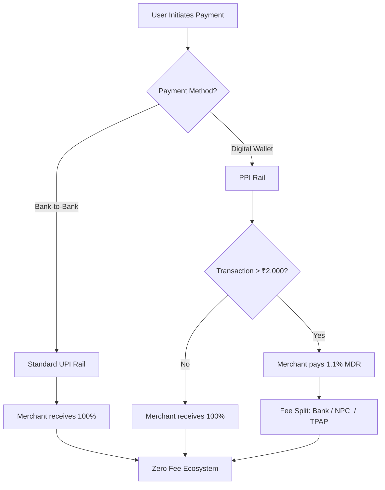

For years, "scanning and paying" in India has felt like a total win. Whether you're paying a street vendor ₹10 for a cutting chai or dropping ₹50,000 at an electronics store, the money moves in seconds—and more importantly, it’s **free**. UPI didn't just change how we handle money; it changed the psychological fabric of spending in India. By removing "friction"—the anxiety of exact change or the fear of transaction fees—UPI turned a cash-obsessed nation into a global leader in real-time digital payments.

But lately, a wave of anxiety has swept through social media and news cycles. Headlines from outlets like [The Economic Times](https://economictimes.indiatimes.com/industry/banking/finance/upi-mdr-explained-what-potential-charges-above-rs-2000-on-paytm-gpay-other-payment-apps-mean-for-you-and-merchants/articleshow/132903354.cms) have reintroduced a technical term that most users had happily ignored: **MDR**, or Merchant Discount Rate. With reports of "charges above Rs 2,000," millions of users on Paytm, Google Pay, and PhonePe are wondering if the "free ride" is finally over.

Here is the bottom line: **No, UPI is not suddenly becoming a paid service for the average consumer.** 

The reality is far more nuanced. It is a story of regulatory balancing, the struggle for fintech sustainability, and the "plumbing" of the [National Payments Corporation of India (NPCI)](https://www.npci.org.in). To understand why these rules exist and whether they will eventually affect you, we need to dive deep into the economics of digital payments.

---

## 🧩 What is MDR and Who Actually Gets the Money?

  
  
 <a href="https://unsplash.com/@brett_jordan">Brett Jordan</a> on <a href="https://unsplash.com/photos/close-up-of-text-from-a-book-about-religious-garments-DgDqBeWzpdE">Unsplash</a>

To understand the controversy, we first have to demystify the **Merchant Discount Rate (MDR)**. In simple terms, MDR is a fee that a merchant (the shopkeeper) pays to the payment service provider for the convenience of accepting a digital payment. If you have ever used a credit card at a retail store, an MDR transaction occurred in the background, even if the store didn't mention it.

When you pay ₹1,000 with a credit card, the merchant doesn't receive the full ₹1,000. They might receive ₹980, while the remaining ₹20 (a 2% MDR) is split among several stakeholders:
1.  **The Issuing Bank:** The bank that provided the card to the customer.
2.  **The Acquiring Bank:** The bank that provided the POS (Point of Sale) machine to the merchant.
3.  **The Card Network:** The infrastructure provider that routes the payment (e.g., Visa, Mastercard, or [NPCI](https://www.npci.org.in) for RuPay).

For the first decade of UPI's existence, the Indian government and the NPCI implemented a **"Zero MDR"** policy. This was a strategic move to drive financial inclusion. By removing all costs for both the sender and the receiver, the government eliminated every possible barrier to adoption. As noted in the [Wikipedia entry for UPI](https://en.wikipedia.org/wiki/Unified_Payments_Interface), the system's open API architecture allowed it to scale at a pace unseen in any other global payment system.

> "The Zero MDR regime was a masterstroke for adoption, but a nightmare for monetization. It turned UPI into a public utility—essential, ubiquitous, but devoid of direct revenue for the companies building and maintaining the infrastructure."

The hidden cost of "free" is that maintaining a massive, real-time network is incredibly expensive. It requires hardened servers, constant security patches to fight evolving cyber-fraud, and immense bandwidth to handle **billions of transactions per month**. While the government provided some subsidies, Third-Party Application Providers (TPAPs) like Google Pay and PhonePe were essentially running a massive utility for free, hoping to find other ways to make their businesses viable.

---

## 🔍 The "Rs 2,000" Mystery: Bank-to-Bank vs. PPI Wallets

The panic surrounding the "Rs 2,000 limit" stems from a misunderstanding of how different UPI "paths" work. Not all UPI payments are the same. There are two primary rails: **Bank-to-Bank** and **PPI-to-Merchant**.

### 1. Bank-to-Bank UPI (The Standard Rail)
This is the most common form of UPI. You link your savings account to an app, and when you pay, the money moves directly from your bank account to the merchant's bank account.
*   **Cost to User:** ₹0 (Free)
*   **Cost to Merchant:** ₹0 (Free)
*   **Limit:** No MDR is charged on these transactions, regardless of the amount. Whether you pay ₹10 or ₹10,000, it remains free.

### 2. PPI-to-Merchant (The Wallet Rail)
**PPI** stands for **Prepaid Payment Instrument**. This refers to digital wallets—think Paytm Wallet, Amazon Pay balance, or Mobikwik. In this scenario, you load money into a wallet first and then use that balance to pay a merchant.

The [NPCI](https://www.npci.org.in) recognized that wallet providers provide additional value (like instant refunds and reduced load on core banking systems). Therefore, they allowed a tiered MDR structure for these specific transactions:
*   **Payments up to ₹2,000:** These remain **completely free** for both the user and the merchant.
*   **Payments above ₹2,000:** A fee of up to **1.1%** can be charged.

**Crucially, this fee is charged to the MERCHANT, not the customer.** If you use your wallet to buy a gadget for ₹2,500, the store pays the 1.1% fee. You still only pay ₹2,500. This distinction was clarified by [The Economic Times](https://economictimes.indiatimes.com/news/india/upi-to-remain-free-for-consumers-says-payments-council-of-india/articleshow/133035443.cms), noting that regular bank-to-bank transfers are untouched.

---

## 💸 The Merchant's Dilemma: Will You Pay the Price?

While the NPCI mandates that the merchant pays the MDR, economic reality often differs from regulatory mandates. In economics, this is known as **"cost pass-through."** When a business faces a new operational cost, they rarely absorb it entirely; instead, they find ways to shift that cost to the consumer.

For a large corporate entity, a 1.1% fee is a rounding error. However, for a small "Kirana" store or a street vendor operating on razor-thin margins, it is a significant hit. If a small vendor is forced to pay a fee on a ₹2,500 wallet transaction, they may react in several ways:

*   **Price Inflation:** Increasing the price of goods by 1-2% to cover the cost of digital acceptance.
*   **Payment Steering:** Actively encouraging customers to use "Direct UPI" (Bank-to-Bank) or cash for transactions exceeding ₹2,000.
*   **Unofficial Surcharges:** Adding a "convenience fee" at the checkout, despite such practices often being against the terms of service.

**The Economic Breakdown at a Glance:**

| Payment Type | Transaction Value | Who Pays? | Fee Percentage |
| :--- | :--- | :--- | :--- |
| **Bank $\rightarrow$ Bank** | Any Amount | No One | **0%** |
| **Wallet $\rightarrow$ Merchant** | $\le$ ₹2,000 | No One | **0%** |
| **Wallet $\rightarrow$ Merchant** | $>$ ₹2,000 | Merchant | **Up to 1.1%** |

---

## 📉 How Fintechs are Solving the "Profitability Puzzle"

Why is the NPCI allowing MDR on wallets now? Because the "Burn Rate" of Indian fintechs has become unsustainable. For years, companies like PhonePe and Google Pay operated as **"loss leaders."** They invested billions in customer acquisition to make their apps a daily habit, but they had no direct way to monetize the actual payment.

To survive, these companies have shifted toward **"Cross-Selling"**—a strategy widely discussed on platforms like [Hacker News](https://news.ycombinator.com). The UPI payment is the "hook" (the acquisition channel). Once the user is inside the ecosystem, the app sells high-margin financial products:

1.  **Insurance:** Micro-insurance for mobile screens, travel, or health.
2.  **Credit & Lending:** Instant personal loans or "Buy Now Pay Later" (BNPL) services, where the app earns interest.
3.  **Wealth Management:** Direct integration with Mutual Funds, Digital Gold, and Stock brokerage.

By allowing a small MDR on wallet transactions, the NPCI is providing a "safety valve." It allows these companies to earn a steady, transaction-based commission, reducing their reliance on risky lending models and venture capital funding.

---

## ⚖️ India vs. The Global Landscape: A Comparative Analysis

India's "Zero MDR" experiment is a global anomaly. Most developed digital payment ecosystems have a built-in monetization model to ensure the system's longevity.

### The US Model (The Card Empire)
In the United States, digital payments are dominated by card networks (Visa/Mastercard). These systems have high MDRs, often ranging from **1.5% to 3.5%**. This high fee funds the massive rewards programs (cashback, miles) that US consumers love, but it also makes digital payments expensive for small businesses.

### The European Model (The Hybrid Approach)
Europe utilizes SEPA (Single Euro Payments Area) for transfers. While these are low-cost, they aren't always "instant" in the way UPI is. Many European banks also charge monthly maintenance fees to users, shifting the cost from the transaction to the account holder.

### The Brazil Model (Pix)
Brazil's **Pix** is the closest relative to UPI. Launched by the Central Bank of Brazil, Pix is free for individuals but allows banks to charge fees to merchants and corporate users. This creates a sustainable loop where the "pipes" are funded by the businesses that profit from the increased volume of digital sales.

The NPCI is attempting to find a "Third Way":
*   **Financial Inclusion:** Keeping small-ticket payments free to protect the poorest vendors.
*   **Infrastructure Sustainability:** Charging larger transactions to ensure the system doesn't collapse under its own weight.

---

## 🚀 The Road Ahead: Future Scenarios for UPI

The conversation about UPI fees is only just beginning. As the system matures, the "totally free" model will likely evolve into a "sustainably priced" model. There are three probable paths for the future of Indian digital payments:

### 1. The Tiered-Pricing Model
The government may implement a sliding scale. For example:
*   **0 - ₹5,000:** Free for all.
*   **₹5,001 - ₹50,000:** Small fee for corporate merchants.
*   **₹50,000+:** Standard MDR for high-value business transactions.
This protects the "cutting chai" vendor while ensuring that a luxury car dealership doesn't use a "free" public utility to move millions of rupees.

### 2. The "Freemium" Business Model
Basic UPI remains free for individuals, but "UPI for Business" could evolve into a subscription service. Merchants would pay a monthly fee for advanced tools:
*   Detailed accounting and GST integration.
*   Automatic payment reminders for customers.
*   Enhanced fraud protection and priority support.

### 3. The CBDC Disruption (The Digital Rupee)
The Reserve Bank of India (RBI) is aggressively piloting the **Digital Rupee (e₹)**. Unlike UPI, which is a *layer* on top of bank accounts, the CBDC is the *money itself*. 
A fully realized CBDC could potentially bypass the need for the complex MDR structure entirely by settling transactions instantly on a blockchain-like ledger, removing the need for multiple intermediary banks.

---

## 🏁 Final Verdict: Should You Be Worried?

If you see a sensationalist headline claiming "UPI is no longer free," you can safely ignore the panic. For the vast majority of Indian citizens, the daily experience of digital payments will remain unchanged.

**Remember these three facts:**
1.  **Your bank account is safe:** Sending money to friends or family is not affected by MDR.
2.  **Your groceries are (likely) safe:** Small-ticket merchant payments remain free.
3.  **You aren't the one paying:** Even when a fee is charged, it is a cost for the merchant, not a charge on your bank balance.

The digital revolution in India was built on the principle of accessibility. Moving from "totally free" to "sustainably priced" is not a failure of the system—it is a sign of its maturity. As UPI scales to serve billions of transactions, the introduction of surgical fees for high-value wallet transactions is simply the cost of ensuring the system remains secure, fast, and available for everyone.

---

## 📚 References & Further Reading

*   **Regulatory Guidelines:** [National Payments Corporation of India (NPCI)](https://www.npci.org.in) - Official documentation on the UPI and PPI frameworks.
*   **Policy Oversight:** [Reserve Bank of India (RBI)](https://www.rbi.org.in) - Guidelines on payment systems and digital currency (CBDC).
*   **Market Analysis:** [The Economic Times: UPI MDR Explained](https://economictimes.indiatimes.com/industry/banking/finance/upi-mdr-explained-what-potential-charges-above-rs-2000-on-paytm-gpay-other-payment-apps-mean-for-you-and-merchants/articleshow/132903354.cms) - Analysis of the impact of PPI charges.
*   **Official Clarifications:** [The Economic Times: NPCI Clarification](https://economictimes.indiatimes.com/news/india/upi-to-remain-free-for-consumers-says-payments-council-of-india/articleshow/133035443.cms) - Direct confirmation regarding bank-to-bank transfers.
*   **Technical Documentation:** [Wikipedia: Unified Payments Interface](https://en.wikipedia.org/wiki/Unified_Payments_Interface) - Comprehensive overview of the UPI architecture.
*   **Financial Terms:** [Wikipedia: Merchant Discount Rate](https://en.wikipedia.org/wiki/Merchant_discount_rate) - Academic explanation of how MDR operates in global finance.
*   **Wallet Frameworks:** [Wikipedia: Prepaid Payment Instrument](https://en.wikipedia.org/wiki/Stored-value_card) - Details on the legal structure of digital wallets.
*   **Industry Discussion:** [Hacker News](https://news.ycombinator.com) - Community debates on fintech monetization and "Burn Rate" economics.
