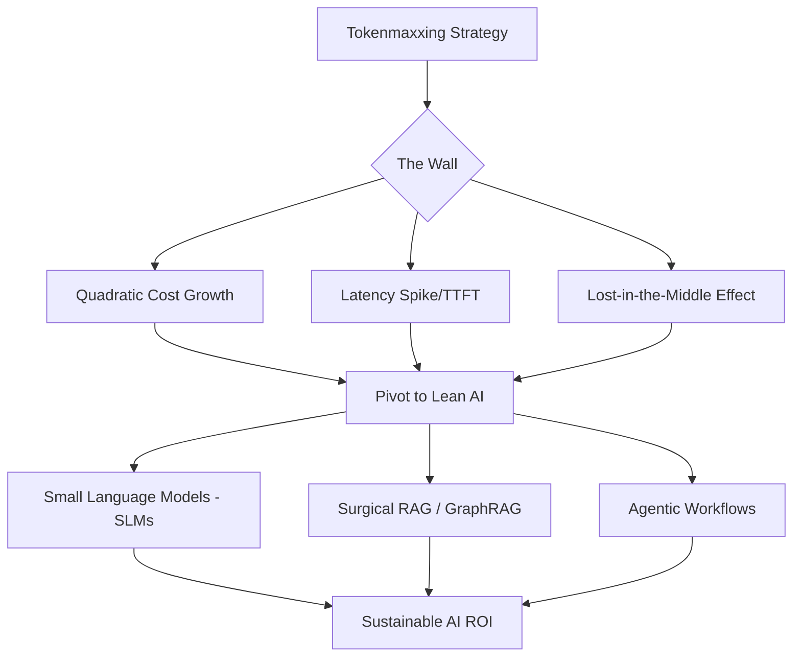

# 📉 Brute Force is Just Too Expensive: Moving from Long-Context LLMs to Efficiency

For the last eighteen months, the dominant narrative in generative AI has been the "infinite context window." We witnessed the industry in a state of breathless awe as Gemini 1.5 Pro announced the ability to handle **2 million tokens** and GPT-4 expanded its horizons. This ushered in an era I call "tokenmaxxing." 

The logic was seductive in its simplicity: why spend months architecting complex data pipelines, optimizing chunking strategies, or fine-tuning a model when you can simply dump your entire codebase, every single customer support transcript, and a mountain of PDFs directly into the prompt? It felt like a shortcut to "perfect" grounding. The prompt became the database.

But for global enterprises like Uber—where a few milliseconds of latency can ripple across millions of rides and every single token is a line item on a massive cloud bill—the honeymoon phase is over. The bill has finally come due. Uber’s AI leadership and other industry titans are realizing that "brute force" prompting is a financial and technical dead end. We are witnessing a tectonic shift away from tokenmaxxing and toward a disciplined framework: **Token ROI**.

---

## 🤯 The Tokenmaxxing Trap: The Allure of the "Infinite" Prompt

  
  
 <a href="https://unsplash.com/@frugalflyer">Frugal Flyer</a> on <a href="https://unsplash.com/photos/calendar-V-CGr9T7kAM">Unsplash</a>

Tokenmaxxing is essentially the engineering equivalent of trying to solve a 1,000-piece puzzle by buying every puzzle piece ever manufactured and dumping them all on the floor at once. In the early days of the LLM boom, "long-context prompting" was hailed as the "RAG-killer." The promise was that we could skip the "plumbing" of AI—no more worrying about vector databases, embedding models, or the art of the "chunk."

However, this shortcut creates a massive hidden liability: **The "Lost in the Middle" glitch**. 

Despite the marketing claims of massive context windows, research proves that LLMs struggle to retrieve information buried in the center of a massive prompt. A seminal study on [long-context retrieval](https://arxiv.org/abs/2307.03172) demonstrated that model performance typically follows a U-shaped curve. The AI is highly proficient at recalling information from the very beginning (primacy effect) and the very end (recency effect) of the prompt, but the middle often becomes a "black hole" of forgotten data.

> "The ability of a model to utilize its context window is not linear. As the input grows, the signal-to-noise ratio plummets, and the model begins to hallucinate or ignore critical constraints placed in the center of the prompt."

For a company like Uber, this isn't just a technical curiosity; it is a systemic business risk. If an AI agent is attempting to resolve a complex rider-driver dispute by scanning a 100k-token conversation history, missing one crucial detail in the middle—such as a specific timestamp or a cancellation reason—could lead to an incorrect refund or a degraded customer experience.

---

## 🚕 The Uber Scale Problem: When Tokens Hit the Bottom Line

To understand why Uber is leading the charge away from tokenmaxxing, one must understand the sheer magnitude of their operational scale. Uber doesn't run a handful of internal chatbots; they manage a planetary-scale AI ecosystem that coordinates millions of requests for rides, eats, and freight in real-time.

At this level of scale, the **cost of a single token** is no longer a rounding error—it is a primary driver of operational expenditure. Moving from a 1,000-token prompt to a 100,000-token prompt doesn't just increase the cost by 100x; it exponentially degrades the user experience.

Uber's approach is rooted in their history. Long before the LLM hype, they built the [Michelangelo machine learning platform](https://www.uber.com/blog/michelangelo-machine-learning-platform/), an internal powerhouse designed for extreme efficiency and scalability. Applying the "Michelangelo Mindset" to LLMs means admitting that "shoving it all in the prompt" is the antithesis of scalable engineering.

**The brutal math of tokenmaxxing:**

*   **Financial Burn:** High-end frontier models charge per million tokens. A "brute force" strategy can turn a profitable feature into a loss-leader overnight. For a system processing **10 million requests per day**, a bloated prompt is a financial catastrophe.
*   **Latency (TTFT):** The "Time to First Token" (TTFT) increases as the prompt grows. In a ride-hailing app, where users expect instant feedback, a **5-second delay** caused by a massive context window is an eternity.
*   **Compute Throughput:** Huge prompts clog the KV (Key-Value) cache on GPUs. This means a single H100 cluster can handle significantly fewer concurrent users, forcing the company to buy more hardware to maintain the same level of service.

---

## 📉 The Math of Diminishing Returns: Quadratic Complexity

The technical reason tokenmaxxing is failing is baked into the very architecture of the Transformer. The standard attention mechanism has **quadratic complexity** $O(n^2)$ relative to the length of the sequence. 

In plain English: if you double the number of tokens in your prompt, the computational work required doesn't double—it quadruples. This is the "Attention Tax." Even with advancements like [FlashAttention](https://arxiv.org/abs/2205.14135), which optimizes memory access, the underlying pressure on GPU VRAM remains immense. 

When a model processes a million tokens, it requires a staggering amount of memory to store the KV cache. We have hit a "memory wall" where the hardware simply cannot keep pace with the appetite of the "infinite prompt" philosophy.

Furthermore, as prompts grow longer, the **signal-to-noise ratio (SNR)** tanks. When an AI is provided with 50 pages of documentation to answer a one-sentence question, it becomes "distracted." The model may fixate on irrelevant details, leading to "hallucination by distraction." The industry is now realizing that **precision is infinitely more valuable than volume**.

---

## 🤖 The SLM Revolution: Moving from "God-Models" to Specialists

As the era of tokenmaxxing fades, we are entering the age of the **Small Language Model (SLM)**. The industry is moving away from the "one model to rule them all" mindset—the idea that you need a trillion-parameter giant to perform every task.

Instead, companies are deploying specialized, smaller models trained on high-quality, curated datasets. Models like **Microsoft's Phi-3**, **Mistral 7B**, and **Llama-3-8B** have proven that a small model, when trained on "textbook-quality" data, can outperform a giant model in specific, constrained domains.

For Uber, this manifests as a **Tiered Intelligence Architecture**:

1.  **The Router (The Traffic Cop):** A tiny, lightning-fast model (perhaps a 1B parameter model) that analyzes the incoming request and decides where it should go.
2.  **The Specialist (The Worker):** An SLM fine-tuned on Uber's specific logistics, policy, and support data. This model "knows" the company's rules because they are baked into its weights, not shoved into its prompt.
3.  **The Oracle (The Expert):** A massive model (like GPT-4o or Claude 3.5 Sonnet) that is only invoked for the most complex, ambiguous, or high-stakes edge cases.

By routing **90% of requests to SLMs**, companies can slash their token spend by **80-95%** while simultaneously reducing latency. Fine-tuning allows the model to "absorb" the knowledge that tokenmaxxers were trying to force into the prompt, effectively moving the context from the *runtime* to the *model weights*.

---

## 🔍 Beyond Simple RAG: The Rise of Surgical Retrieval

If we stop dumping everything into the prompt, how does the AI find the information it needs? The answer lies in the evolution from "Naive RAG" to **Surgical Retrieval**.

Early Retrieval-Augmented Generation (RAG) was simplistic: turn documents into vectors, store them in a database, and grab the top five most similar chunks. This is essentially "mini-tokenmaxxing"—you're still just shoving chunks into the prompt and hoping for the best. 

The next generation of retrieval is far more precise:

### 🕸️ GraphRAG (Knowledge Graphs)
Instead of relying on semantic similarity (which often fails for complex queries), [GraphRAG](https://microsoft.github.io/graphrag/) uses knowledge graphs to map the relationships between entities. If a user asks about a specific ride dispute, GraphRAG doesn't just find "similar" text; it finds the *linked* entities: the Driver ID $\rightarrow$ the Ride ID $\rightarrow$ the Payment Transaction $\rightarrow$ the Support Ticket. It provides the model with a structured map of the problem.

### 🛠️ Agentic Workflows (ReAct)
Rather than one giant prompt, AI agents now use "reasoning loops" (such as the ReAct framework). The agent:
1.  **Reasons:** "To solve this, I first need to check the rider's account status."
2.  **Acts:** Calls a specific API to get the account status.
3.  **Observes:** "The account is flagged for a payment failure."
4.  **Reasons:** "Now I need to check the payment gateway logs."

This is surgical. The agent only pulls in the exact data needed for the current step, keeping the prompt lean and the reasoning sharp.

### 💾 Long-term Memory Layers
Instead of resending the entire chat history (which grows linearly and eventually hits the quadratic cost wall), companies are implementing external memory layers. These systems summarize previous interactions and store them as "compressed memories," injecting only the most relevant summaries back into the prompt.

---

## 💰 The New AI Unit Economics: Moving from "Magic" to "Margin"

This shift signals the maturation of the AI industry. We are exiting the "Magic Phase"—where the goal was simply to prove that the technology could work—and entering the "Margin Phase," where AI must deliver a positive return on investment (ROI) to survive.

CTOs are no longer asking, "Can the AI do this?" They are asking, "**What is the Token ROI of this feature?**" AI spend is being transitioned from a "Research and Development" budget to a "Cost of Goods Sold" (COGS) line item.

**The New AI Economics Playbook:**

*   **Token Budgeting:** Implementing hard caps on tokens per request. If a prompt exceeds 4k tokens, it's flagged for optimization.
*   **Semantic Caching:** Using tools like GPTCache to store responses to common queries. If a user asks a question that has been answered before, the system serves the cached response without calling the LLM, reducing cost to near zero.
*   **Model Distillation:** Using a "Teacher" model (a giant LLM) to generate a massive dataset of high-quality reasoning chains, then using that data to train a "Student" model (a tiny SLM). The student achieves **90% of the teacher's performance at 1% of the cost**.

By treating tokens as a scarce resource rather than an infinite utility, companies are building AI architectures that are sustainable at a scale of billions of requests.

---

## 🏁 Conclusion: The Era of Precision

Tokenmaxxing was a necessary bridge. It allowed developers to prototype at lightning speed, bypassing the complexities of data engineering to see what was possible. It served as a "proof of concept" for the power of LLMs. But as an enterprise strategy, it is a liability.

The pivot toward **SLMs, GraphRAG, and strict unit economics** is not a retreat—it is an evolution. The winners of the next phase of the AI revolution will not be the companies that can afford the largest context windows, but those that can extract the most intelligence from the fewest tokens.

The lesson for Uber and the broader enterprise world is clear: **Intelligence is not a function of the size of the context window; it is a function of the precision of the retrieval.** 

Tokenmaxxing is over. The era of Lean AI has arrived.

---

## 📚 References & Further Reading

*   **Uber Engineering:** [Michelangelo: Uber’s Machine Learning Platform](https://www.uber.com/blog/michelangelo-machine-learning-platform/) - *Deep dive into Uber's approach to scalable ML.*
*   **ArXiv Research:** [Lost in the Middle: How Language Models Use Long Contexts](https://arxiv.org/abs/2307.03172) - *The definitive study on context window degradation.*
*   **Microsoft Research:** [Phi-3 Technical Report](https://arxiv.org/abs/2404.14219) - *Analysis of how high-quality data enables small model dominance.*
*   **Mistral AI:** [Mistral 7B Efficiency Metrics](https://mistral.ai/news/announcing-mistral-7b/) - *How open-weight SLMs are challenging frontier giants.*
*   **Meta AI:** [Llama 3 Model Card](https://ai.meta.com/blog/meta-llama-3/) - *Benchmarking the performance of 8B vs 70B parameter models.*
*   **DeepMind:** [Gemini 1.5: Multimodal Long Context](https://deepmind.google/technologies/gemini/) - *Understanding the technical limits of massive context windows.*
*   **FlashAttention:** [Fast and Memory-Efficient Exact Attention](https://arxiv.org/abs/2205.14135) - *The underlying tech trying to solve the quadratic complexity problem.*
*   **GraphRAG:** [Microsoft's Knowledge Graph Approach](https://microsoft.github.io/graphrag/) - *Moving beyond vector search to structured retrieval.*
*   **Tavily AI:** [The RAG vs Long-Context Debate](https://tavily.com) - *Industry analysis of retrieval strategies.*
*   **Hacker News:** [Discussion on LLM Inference Costs](https://news.ycombinator.com) - *Community insights into the real-world cost of tokenmaxxing.*