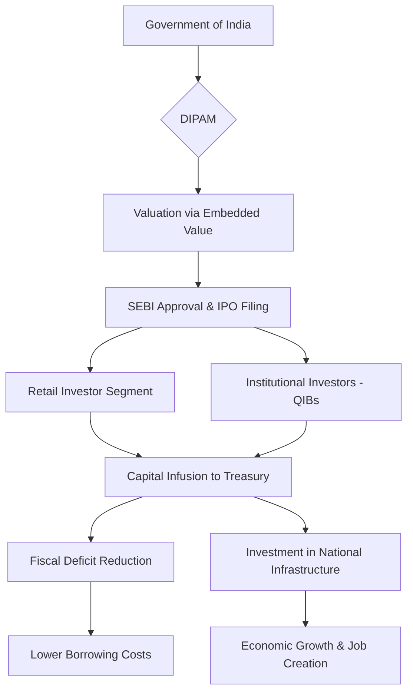

### 🚀 The Big Picture: A Paradigm Shift in Indian Finance

For nearly seven decades, the Life Insurance Corporation of India (LIC) was far more than a mere insurance provider; it was a cultural institution. For the average Indian middle-class family, an LIC policy was the gold standard for savings, a symbol of security, and an unquestioned mark of trust. From the bustling streets of Mumbai to the remotest villages in Himachal Pradesh, the "Zindagi Ke Saath Bhi, Zindagi Ke Baad Bhi" (With you in life, and after life) slogan was woven into the social fabric of the nation.

For over fifty years, LIC operated as a state-owned monopoly—a financial fortress that exerted an unprecedented influence on India's capital markets. It wasn't just selling policies; it was managing a colossal pool of public savings that the government could leverage for national development. However, the global economic landscape shifted. The rise of digitalization, the entry of agile private players, and the changing preferences of Gen Z and Millennial investors meant that the "monopoly" model was no longer sustainable.

The decision by the Government of India to sell a minority stake through a massive Initial Public Offering (IPO) was a watershed moment. This wasn't a simple business transaction or a desperate fire sale; it was a strategic pivot. By transitioning LIC from a purely government-run entity to a publicly listed company, the state aimed to achieve a dual objective: securing immediate liquidity to bridge critical budget gaps and introducing the rigorous discipline of the stock market to a legacy institution.

Coming off the heels of a global pandemic that strained national coffers and facing ambitious infrastructure goals under the [National Infrastructure Pipeline](https://www.nmpindia.gov.in/), the government took a calculated risk. They traded total, opaque control for transparency, professional governance, and market-driven efficiency.

---

### 🏢 The Colossus: Understanding the Scale of LIC

To comprehend why the listing of LIC was such a monumental event, one must first grasp the sheer scale of the organization. The [Life Insurance Corporation of India](https://en.wikipedia.org/wiki/Life_Insurance_Corporation_of_India) is not merely a company; it is a systemic pillar of the Indian economy. Since its inception in **1956**, when the government nationalized 245 private insurance companies to protect policyholders, LIC has dominated the landscape.

#### The Role of the "State's Investor"
For decades, LIC functioned as the government's preferred investment vehicle. Whenever the state needed to stabilize a struggling public sector bank, support a strategic industry during a crisis, or fund massive nation-building projects, it looked to LIC’s reserves. While this served the national interest, it created a conflict of interest: LIC's investment goals were often dictated by policy directives rather than the singular pursuit of maximizing returns for its policyholders.

**The Giant by the Numbers:**
*   **Market Dominance:** Historically, LIC has held a market share of over **60%** in the life insurance sector, dwarfing private competitors like HDFC Life or SBI Life.
*   **Asset Under Management (AUM):** LIC manages assets totaling trillions of rupees, making it one of the largest institutional investors in the [National Stock Exchange (NSE)](https://www.nseindia.com/) and the [Bombay Stock Exchange (BSE)](https://www.bseindia.com/).
*   **Unmatched Reach:** With a workforce of over **1.3 million agents**, LIC possesses a distribution network that reaches the deepest pockets of rural India—a feat no private insurer has yet replicated.

Despite these strengths, the organization was hampered by "Sarkari" (government) inertia. Decision-making was slow, plagued by bureaucratic red tape, and the product suite remained stagnant for years. While private insurers were using AI and Big Data to price risk and personalize policies, LIC was still relying on legacy systems and manual processing. The government realized that for LIC to survive the next fifty years, it needed to stop acting like a government department and start operating like a global financial corporation.

---

### 💸 The Fiscal Imperative: Filling the National Treasury

While the strategic reasons were compelling, the most immediate driver for the sale was the need for capital. Like most sovereign nations, India suffered a significant financial blow during the COVID-19 pandemic. The cost of healthcare, lockdowns, and stimulus packages caused the **fiscal deficit**—the gap between government expenditure and revenue—to widen to precarious levels.

The Department of Investment and Public Asset Management (DIPAM), the arm of the Ministry of Finance responsible for the government's equity investments, was tasked with meeting aggressive disinvestment targets for the 2021-22 fiscal year. LIC was the "crown jewel" of the state's portfolio, and its IPO was the only move large enough to move the needle on the national budget.

> "Disinvestment is not merely about the liquidation of assets; it is a strategic realignment of the state's portfolio. The goal is to ensure the government focuses on its core competency—governance—rather than the day-to-day management of commercial enterprises." — *Executive Summary, Ministry of Finance*

**The Financial Logic of the Listing:**
1.  **Immediate Liquidity:** By listing LIC, the government raised approximately **₹21,000 crore**, providing a critical injection of cash into the treasury.
2.  **Debt Management:** These proceeds allowed the government to reduce its reliance on high-interest domestic and international borrowing, thereby lowering the overall debt-servicing burden.
3.  **Asset Reallocation:** Following the principle of "asset monetization," the government shifted capital from non-core assets (a minority stake in an insurance firm) into core assets. This included funding for highways, digital connectivity, and energy transitions via the [World Bank](https://www.worldbank.org/en/country/india) supported infrastructure projects.

In essence, the government treated LIC as a high-value reserve. By selling a minority stake, they avoided the political volatility of raising taxes while simultaneously funding the [Gati Shakti National Master Plan](https://www.india.gov.in/) for integrated infrastructure development.

---

### 📈 Market Discipline and the 'Embedded Value' Puzzle

Beyond the immediate cash infusion, the government sought to impose **market discipline**. In a 100% state-owned enterprise, success is often measured by the fulfillment of administrative quotas or the submission of periodic reports. However, once a company is listed on a stock exchange, its performance is judged every second by the share price.

Public listing forces a company to adhere to the [Securities and Exchange Board of India (SEBI)](https://www.sebi.gov.in/) guidelines, which require quarterly earnings reports, transparent disclosure of liabilities, and accountability to a diverse set of shareholders. For LIC, this meant a forced evolution in accounting standards and operational transparency.

#### Solving the Valuation Riddle: Embedded Value (EV)
One of the biggest challenges in the LIC IPO was determining the company's price. Unlike a manufacturing firm, an insurance company's value isn't just in its current assets, but in the future profits of policies it has already sold. To solve this, the government utilized **Embedded Value (EV)**.

**What exactly is Embedded Value?**
Embedded Value is the sum of the adjusted net asset value (the assets the company currently holds) and the present value of future profits from existing policies. It is essentially a forecast of the company's long-term viability. By using EV, the government could argue that LIC's massive book of legacy policies represented a goldmine of future revenue, justifying a price that would attract both retail investors and large [Qualified Institutional Buyers (QIBs)](https://www.investopedia.com/terms/q/qib.asp).

By shifting to a listed model, the government allowed the market to "discover" the true value of LIC. It transformed the company from a "black box" of government accounting into a transparent business where the valuation is determined by millions of investors rather than a small committee of bureaucrats.

---

### 🛠️ The Mechanics of the Sale: How it Happened

The LIC IPO was one of the largest in Indian history, requiring a sophisticated blend of financial engineering and public relations. The government opted for a **Partial Disinvestment**, ensuring they retained a majority stake (over **51%**). This allowed the state to keep the "steering wheel" while benefiting from the "engine" of the private market.

To ensure the IPO didn't just benefit wealthy institutional investors, the government introduced specific incentives for retail investors, including discounts on the offer price. This was a strategic move to maintain the "democratic" nature of the company, allowing the very people who bought policies to also own shares.

**Key components of the process included:**
*   **Offer for Sale (OFS):** Unlike a fresh issue of shares (where the company gets the money), an OFS involves the promoter (the government) selling its existing shares. The proceeds went directly to the treasury, not to LIC's balance sheet.
*   **The Regulatory Guardrails:** SEBI ensured that all risk factors—including the potential for political interference—were clearly disclosed in the Red Herring Prospectus (RHP).
*   **The Listing Day:** When LIC finally debuted on the NSE and BSE, it became one of the largest listed insurance entities globally, providing a benchmark for the entire Indian financial services sector.

---

### ⚖️ The Great Debate: Strategic Masterstroke or Short-sighted Sale?

The decision to list LIC sparked an intense debate among economists, politicians, and the general public. The arguments essentially split into two camps: those who viewed it as "selling the family silver" and those who saw it as a "necessary modernization."

#### The Critics: "Selling the Family Silver"
Opponents of the IPO argued that the government was sacrificing a long-term strategic asset to solve a short-term budget crisis. Their primary concerns were:
*   **Profit vs. Purpose:** There was a fear that the pressure to deliver quarterly dividends to shareholders would force LIC to abandon its social mission. Critics worried LIC would stop selling low-margin insurance to rural populations and instead focus on high-premium urban products.
*   **Under-valuation:** Some analysts argued that the IPO price was too conservative and didn't fully capture the "trust premium" associated with the LIC brand.
*   **Loss of Sovereign Control:** While the government kept 51%, critics argued that the need to satisfy public shareholders would limit the government's ability to use LIC as a tool for national economic stabilization.

#### The Supporters: "The Efficiency Mandate"
Supporters argued that the era of state-protected monopolies had to end for the sake of the consumer. Their arguments included:
*   **The Wake-up Call:** With the rise of FinTech and "InsurTech" startups, LIC needed a shock to its system. Listing the company forced it to compete on efficiency, technology, and customer service.
*   **Corporate Governance:** A listed company requires independent directors and rigorous external audits. This reduces the likelihood of political patronage in hiring and procurement.
*   **Market Maturity:** The IPO provided a massive amount of liquidity to the Indian market and created a valuation benchmark for other insurance companies, encouraging more foreign direct investment (FDI) into the sector.

The government's stance was clear: LIC is "too big to be inefficient." By introducing a minority of private ownership, they believed they could unlock the company's latent potential while maintaining the sovereign guarantee that ensures policyholder security.

---

### 🌍 The Global Context: The Shift from State Capitalism

The LIC IPO is not an isolated event but part of a broader global trend. For decades, the world has been moving from "State Capitalism"—where the government owns and operates key industries—to "Market-Led Growth."

#### Comparative Global Models
*   **The United Kingdom:** In the 1980s, the Thatcher government pioneered "privatization," selling off giants like British Telecom and British Gas to increase efficiency and reduce state spending.
*   **Singapore:** The Singaporean government uses a sophisticated model via **Temasek Holdings**. They own massive stakes in companies but allow them to be managed as independent, profit-driven entities. This "Sovereign Wealth Fund" model is often cited as the gold standard for state ownership.
*   **China:** In recent years, China has listed many of its massive state-owned enterprises (SOEs) on global exchanges to bring in foreign capital and force its managers to adopt international accounting standards.

India began its liberalization journey in **1991**, but for a long time, it only sold off "sick" or loss-making units. The LIC IPO represents a new chapter: the partial privatization of "National Champions"—the profitable, healthy winners.

**Comparing Disinvestment Strategies:**
| Strategy | Ownership Shift | Management Control | Primary Goal |
| :--- | :--- | :--- | :--- |
| **Full Privatization** | 0% Gov / 100% Private | Fully Private | Total Exit / Efficiency |
| **Strategic Sale** | Minority Gov / Majority Private | Private Lead | Operational Turnaround |
| **Partial Listing (LIC)** | Majority Gov / Minority Private | Government Lead | Capital + Market Discipline |

By choosing the "middle path" for LIC, India managed to secure the benefits of market valuation without completely abandoning its role as the ultimate protector of the citizens' life savings.

---

### 🏁 Conclusion: The Future of the Giant

Selling a stake in LIC was a move born of necessity and guided by strategy. Financially, it was a critical tool to manage the [IMF-monitored](https://www.imf.org/en/Countries/IND) fiscal deficits and recover from the economic scarring of a global pandemic. Strategically, it was an admission that the old ways of running a financial giant—through bureaucratic decree—were no longer viable in a digital, competitive world.

The debate over whether it was a mistake to "sell the family silver" will likely continue for years. However, the reality is that the world has changed. The era of state-protected monopolies is over. By listing LIC, the government essentially held up a mirror—the stock market—and told the company it was time to evolve.

LIC remains a pillar of the Indian economy, but it is now a pillar that must be structurally sound enough to withstand the scrutiny of thousands of shareholders. Its success will not be measured by the size of its bureaucracy, but by its ability to innovate, its transparency in governance, and its capacity to provide value to both the government and the common investor. The giant has finally stepped out of the government's shadow and into the light of the open market.

---

## 📚 References

  
  
 <a href="https://unsplash.com/@77hn">The 77 Human Needs System</a> on <a href="https://unsplash.com/photos/a-book-with-the-title-the-power-of-why-axK93Sfmflc">Unsplash</a>

*   **Life Insurance Corporation of India (Official):** [https://licindia.in/](https://licindia.in/)
*   **Department of Investment and Public Asset Management (DIPAM):** [https://dipam.gov.in/](https://dipam.gov.in/)
*   **International Monetary Fund (IMF) - India Reports:** [https://www.imf.org/en/Countries/IND](https://www.imf.org/en/Countries/IND)
*   **Securities and Exchange Board of India (SEBI):** [https://www.sebi.gov.in/](https://www.sebi.gov.in/)
*   **National Stock Exchange of India (NSE):** [https://www.nseindia.com/](https://www.nseindia.com/)
*   **BSE India - Market Data:** [https://www.bseindia.com/](https://www.bseindia.com/)
*   **Ministry of Finance - Union Budget Documents:** [https://www.indiabudget.gov.in/](https://www.indiabudget.gov.in/)
*   **The World Bank - India Economic Update:** [https://www.worldbank.org/en/country/india](https://www.worldbank.org/en/country/india)
*   **National Infrastructure Pipeline (NIP):** [https://www.nmpindia.gov.in/](https://www.nmpindia.gov.in/)
*   **Wikipedia - LIC History:** [https://en.wikipedia.org/wiki/Life_Insurance_Corporation_of_India](https://en.wikipedia.org/wiki/Life_Insurance_Corporation_of_India)
