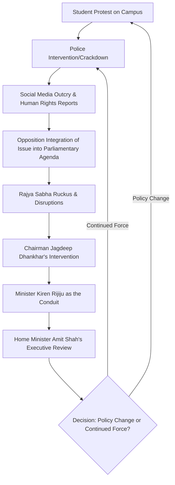

**Alternative Headline: Sentiments vs. Statutes: That Moment the Rajya Sabha Chairman Told Rijiju to Talk to Amit Shah**

If you’ve been following the Rajya Sabha lately, you know it’s rarely quiet. But some days, the tension goes beyond the usual political bickering, evolving into a systemic confrontation that mirrors the volatility of the streets. Recently, the upper house transformed into a theater of high drama, serving as a microcosm of the broader conflict between state authority and youth dissent. While the halls of power echoed with shouts over the government's crackdown on student protests, a pivotal moment occurred: the Rajya Sabha Chairman, Jagdeep Dhankhar, did not simply exercise his power to silence the room. Instead, he issued a directive that revealed the fragile nature of current parliamentary communication. He instructed Kiren Rijiju, the Minister of Parliamentary Affairs, to "echo the sentiments" of the Opposition to the Home Minister, Amit Shah.

According to reports from the [Hindustan Times](https://www.hindustantimes.com), this was more than a tactical move to restore order. It provides a profound glimpse into the current state of Indian parliamentary democracy—a landscape where formal, evidence-based debates are increasingly superseded by "sentiments," and where the Chairman must act as a psychological bridge between an enraged Opposition and a formidable executive branch. This incident underscores a deep-seated divide in how the Indian state perceives student dissent and how that friction eventually erupts within the highest legislative body of the land.

---

## 📢 The Chaos: Why the House Erupted

  
  
 <a href="https://unsplash.com/@simplicity">Marija Zaric</a> on <a href="https://unsplash.com/photos/a-sign-that-says-making-sense-is-optional-thSiaZPe9vU">Unsplash</a>

The volatility began when the Opposition parties raised a collective alarm over what they described as a "brutal crackdown" on student protesters across various campuses. In the Indian sociopolitical context, student activism has historically been a bellwether for larger social unrest. However, recent reports of aggressive police interventions, arbitrary detentions, and the deployment of security forces on university grounds have kept the Rajya Sabha in a state of perpetual friction. The Opposition sought to hold the government accountable, arguing that the "death of campus freedom" was not an accidental byproduct of law and order but a calculated policy of intimidation.

The eruption occurred when members began citing specific instances of students being detained without due process and the systemic stripping away of the right to peaceful assembly. The atmosphere quickly devolved into a cacophony of slogans, desk-thumping, and interruptions. Kiren Rijiju attempted to manage the chaos using the standard parliamentary rulebook, emphasizing "procedural correctness." However, the Opposition had reached a boiling point where the technicalities of the rulebook felt irrelevant compared to the urgency of the human rights violations they were citing.

This "ruckus as a tool" strategy has become an increasingly common sight in the Indian Parliament. When the Opposition perceives that the government is using its majority to bypass substantive debate on sensitive issues—such as student rights, regional autonomy, or agrarian distress—disruption becomes their only remaining lever of influence. In this specific clash, the Rajya Sabha became a proxy battlefield. The shouting matches were not merely about parliamentary procedure; they were reflections of the struggles occurring in the corridors of universities like [Jawaharlal Nehru University (JNU)](https://en.wikipedia.org/wiki/Jawaharlal_Nehru_University), where the clash between state security and academic liberty is most acute.

---

## ⚖️ The Chairman’s Move: Jagdeep Dhankhar’s Role

Jagdeep Dhankhar, the **15th Vice President of India** and Chairman of the Rajya Sabha, occupies one of the most precarious positions in the government. He is constitutionally mandated to be a neutral arbiter, ensuring that the house functions efficiently while protecting the rights of the minority. However, [Jagdeep Dhankhar's](https://en.wikipedia.org/wiki/Jagdeep_Dhankhar) tenure has been marked by an assertive style, often leading to high-profile clashes with the Opposition over the interpretation of parliamentary rules.

Yet, in this specific encounter involving Rijiju and Shah, Dhankhar pivoted his strategy. Instead of relying solely on the gavel to punish disruption, he acknowledged that the Opposition's anger carried significant political and emotional weight. By telling Rijiju to "echo the sentiments" of the Opposition to Amit Shah, Dhankhar was walking a precarious tightrope. He was effectively validating the frustration of the members while simultaneously offering a trade-off: stop the disruption in exchange for a guarantee that their grievances would reach the man holding the keys to internal security.

This shift suggests a worrying realization: the political climate in India is so polarized that the "rules of the house" are no longer sufficient to maintain order. Dhankhar was attempting to convert parliamentary noise into a signal that the executive branch could not ignore. By framing the demands as "sentiments" rather than "legal grievances," he shifted the conversation from a technical argument about law to a matter of political empathy. This was a calculated attempt to cool the temperature of the room by suggesting a direct line to the Home Ministry.

---

## 🛠️ Power Dynamics: Kiren Rijiju and Amit Shah

To understand the gravity of this request, one must examine the specific roles of the two men involved. Kiren Rijiju, as the Minister of Parliamentary Affairs, acts as the "Chief Operating Officer" of the house. His primary objective is the smooth passage of legislation and the management of the legislative calendar. He is the diplomat, the negotiator, and the buffer between the government and the Opposition.

In contrast, [Amit Shah](https://en.wikipedia.org/wiki/Amit_Shah), the Minister of Home Affairs, is the "Enforcer." The Ministry of Home Affairs (MHA) wields immense power, controlling the Central Armed Police Forces (CAPF) and overseeing state security apparatuses. When the Opposition speaks of "crackdowns," "police brutality," and "state terror," they are pointing directly at Shah’s portfolio.

The Chairman’s instruction created an unusual and informal communication chain. In a traditional parliamentary setting, a Minister provides a formal answer on the floor, which is then recorded in the official minutes and subject to further scrutiny. However, "echoing sentiments" is a visceral, informal act. It implies that the official government scripts and sanitized answers are no longer sufficient to satisfy the house. 

By asking Rijiju to convey the *mood* of the house to Shah, Dhankhar signaled that the Home Minister needs to recognize that the current security strategy regarding student protests is generating a political crisis that cannot be managed by mere procedural denials.

> "The strength of a democracy is measured not by the silence of its citizens, but by the ability of its leaders to listen to the noise of dissent. When the legislature becomes a mere messenger for the executive, the essence of representative governance is compromised."

This dynamic reveals the extreme centralization of power within the current administration. The fact that the Chairman felt the need to send a message specifically to Amit Shah underscores that Shah is the primary architect of India's internal security framework. Rijiju, in this scenario, was reduced to a messenger, bridging the gap between the legislative shouting match and the executive's iron will.

---

## 🎓 A History of Fire: Student Activism in India

This parliamentary clash did not occur in a vacuum. It is the latest chapter in a long and often violent history of student activism in India. From the anti-Emergency protests of the 1970s to the Mandal Commission agitations and the more recent frictions at Delhi University, campuses have always been the incubators of political dissent.

Historically, student movements in India have functioned as a "moral conscience" for the nation. However, there has been a paradigm shift in how the state handles these movements. The "crackdown" referenced in the [Hindustan Times report](https://www.hindustantimes.com) is part of a broader trend where student protests are increasingly reframed as "national security threats" rather than "academic freedom issues." 

The pattern has become alarmingly consistent:
1.  **The Spark:** A protest begins over a specific policy (e.g., fee hikes, citizenship laws, or campus violence).
2.  **The Label:** The administration labels the students as "anti-national" or claims they are being manipulated by "foreign hands" or "invisible entities."
3.  **The Response:** Security forces move in, often using disproportionate force, followed by the filing of First Information Reports (FIRs) under stringent laws.
4.  **The Silence:** The resulting fear creates a "chilling effect," discouraging other students from speaking out.

According to various human rights reports and legal analyses, the use of digital surveillance on student leaders has expanded exponentially. When these issues reach the Rajya Sabha, they cease to be local campus disputes; they become symbols of the broader struggle between the state's desire for absolute order and the youth's demand for basic liberty. Because the government often appears dismissive of these protests in public, the Opposition uses the floor of the house as the last remaining venue to amplify the voices of the students.

---

## 📜 The Legal Grey Zone: Protesting vs. Law and Order

At the heart of this conflict lies a profound legal paradox. The Indian Constitution, under [Article 19](https://en.wikipedia.org/wiki/Fundamental_rights_in_India), guarantees the right to freedom of speech and expression, as well as the right to assemble peaceably and without arms. However, these rights are not absolute. The state can impose "reasonable restrictions" in the interests of the sovereignty and integrity of India, the security of the state, and public order.

The "crackdown" that ignited the Rajya Sabha resides precisely in this "grey zone" of "reasonable restrictions." The government argues that student protests often act as covers for violent activities or are stirred up by external agents to destabilize the country. From this perspective, the use of force is a necessary tool for maintaining the rule of law.

Conversely, the Opposition and legal scholars argue that "reasonable restrictions" have been expanded to mean "anything that criticizes the current administration." A major point of contention is the application of the **Unlawful Activities (Prevention) Act (UAPA)**. The UAPA is a draconian law that makes bail nearly impossible and allows the state to hold individuals for extended periods without trial. 

**Bold Stats on the Legal Landscape:**
*   **UAPA Conviction Rates:** Historically, the conviction rate under UAPA has remained strikingly low (often below **3%** in some jurisdictions), despite the high number of arrests.
*   **Detention Periods:** Under certain security laws, individuals can be detained for **90 days** or more before a chargesheet is even filed.
*   **Constitutional Mandate:** While **Article 19** protects speech, the state's interpretation of "public order" has expanded to include the prevention of "disrepute" to the government.

When Chairman Dhankhar asks the government to "echo sentiments," he is touching upon this tension. The "sentiment" is the belief that the law is being used as a weapon to silence dissent rather than a shield to protect the public. While the courts occasionally intervene to grant bail to detained students, the gap between the arrest and the release is often enough to break the spirit of a student movement.

---

## 📉 The Decline of Discourse: From Debate to "Messages"

The most alarming aspect of the "echo sentiments" moment is what it reveals about the degradation of political discourse in India. In a functioning parliamentary democracy, the process is designed for deliberation: a Minister presents facts, the Opposition critiques those facts, and the two sides attempt to reach a consensus or record their fundamental disagreement. 

However, the Rajya Sabha is transitioning from a house of "debate" to a house of "messaging." When a presiding officer must ask a Minister to "convey a feeling" to another Minister, it is a clear admission that the formal tools of parliamentary oversight—such as the Question Hour and No-Confidence Motions—are failing.

This shift has several dangerous implications:
1.  **The Erosion of Accountability:** When "sentiments" are conveyed privately, there is no public record of the government's response. The transparency of the democratic process is replaced by back-channel diplomacy.
2.  **The Theater of Emotion:** Parliament becomes a theater of emotions rather than a forum for policy. The goal is no longer to change a law through argument, but to create enough noise to force a private conversation.
3.  **Executive Dominance:** Relying on the Home Minister to "fix" a sentiment issue highlights the extreme concentration of power. Instead of a collective cabinet responsibility, power is centralized in a few individuals.

For the average citizen, this process looks less like governance and more like a managed conflict. When the public sees their representatives screaming in the house and the Chairman acting as a mediator rather than a moderator, the legitimacy of the institution erodes. There is a massive, yawning gap between "echoing a sentiment" and actually amending a policy or releasing a wrongly detained student.

---

## 🗺️ The Communication Path of a Parliamentary Crisis

The trajectory from a street protest to a directive in the Rajya Sabha is a complex cycle of escalation and containment. The following diagram illustrates how a grassroots movement is filtered through the machinery of the state:

This cycle demonstrates that the response (or lack thereof) from the Home Ministry feeds directly back into the intensity of the protests on the ground. If the "echoed sentiments" result in no tangible change, the "ruckus" in the house only intensifies during the next session.

---

## 🏁 Conclusion: A Symptom of a Strained Democracy

The moment in the Rajya Sabha where Chairman Jagdeep Dhankhar told Kiren Rijiju to echo the Opposition's sentiments to Amit Shah serves as a perfect metaphor for the current state of Indian governance. It was an attempt at empathy in an era of deep polarization—a tactical "bridge" built to prevent the house from collapsing into total chaos.

However, empathy is not a substitute for accountability. The "sentiments" expressed by the Opposition are not mere emotions; they are reflections of a broader anxiety regarding the survival of dissent in the world's largest democracy. When young people feel that their academic curiosity and political convictions are met with batons instead of dialogue, the resulting friction will inevitably spill over into the halls of Parliament.

Ultimately, a healthy democracy cannot survive on "echoed sentiments." It requires a robust commitment to the right to protest, a judicial system that prevents the misuse of security laws, and an executive branch that views criticism as a catalyst for improvement rather than an act of treason. Until the temporary bridge built by the Chairman is transformed into a permanent road of open, transparent dialogue, the Rajya Sabha will likely remain a house of ruckus—a loud, echoing mirror of the unrest on the streets.

---

## 📚 References

*   [Hindustan Times - Rajya Sabha coverage and reports](https://www.hindustantimes.com)
*   [Wikipedia - Jagdeep Dhankhar: Biography and Role](https://en.wikipedia.org/wiki/Jagdeep_Dhankhar)
*   [Wikipedia - Amit Shah: Portfolio and Influence](https://en.wikipedia.org/wiki/Amit_Shah)
*   [Wikipedia - Jawaharlal Nehru University (JNU): Academic Freedom](https://en.wikipedia.org/wiki/Jawaharlal_Nehru_University)
*   [Wikipedia - Fundamental Rights in India (Article 19)](https://en.wikipedia.org/wiki/Fundamental_rights_in_India)
*   [India News - Analysis of Parliamentary Proceedings](https://www.hindustantimes.com/india-news)
*   [Ministry of Home Affairs (MHA) - Government of India Official Portal](https://www.mha.gov.in)
*   [Rajya Sabha Official Website - Rules of Procedure](https://rajyasabha.nic.in)
*   [Constitution of India - Full Text and Amendments](https://www.india.gov.in/my-government/constitution-india)
*   [Human Rights Watch - Reports on India and Student Freedom](https://www.hrw.org)