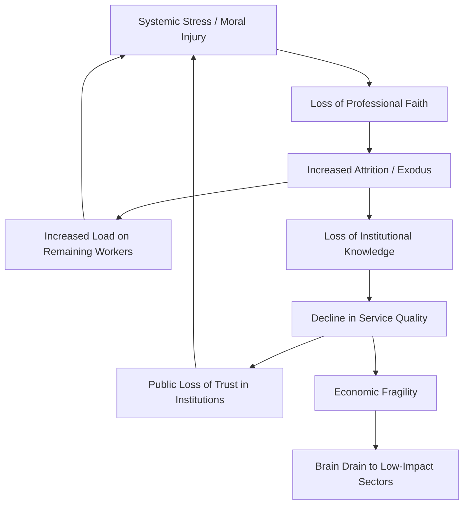

We used to have a pretty simple deal: study hard, get into a respected career, and in exchange for your hard work and expertise, you’d get stability, a sense of purpose, and a place where you belonged. For a long time, that was the unspoken contract for doctors, teachers, engineers, and lawyers. You gave your life to the craft, and the craft took care of you—not just with a paycheck, but mentally and emotionally. You weren’t just an employee; you were part of a legacy, a professional "guild," and a key part of how society actually functions.

But lately, that contract is being shredded.

All over the world, we're seeing something happen that goes way beyond the usual talk about "burnout." Burnout is just being exhausted; it’s a dead battery that you can fix with a long vacation or a raise. What’s happening now is deeper and more worrying: a total loss of faith. When an entire group of professionals decides that the goalposts have moved too far, or that the moral cost of their job is just too high, you don't just get a labor shortage. You get a collapse of institutional knowledge and a shake-up of social stability.

Whether it’s a nurse who can’t give their patients the care they deserve, a teacher who feels totally abandoned by the state, or a software engineer wondering if an LLM just made ten years of experience irrelevant, the question is the same: **Is this career still worth the sacrifice?**

---

## 🧠 The Anatomy of a Crisis: It's Not Burnout, It's Moral Injury

  
  
 <a href="https://unsplash.com/@erik_brolin">Erik Brolin</a> on <a href="https://unsplash.com/photos/man-squatting-on-road-while-taking-photo-u368pt_238k">Unsplash</a>

To understand why people are quitting in droves, we have to stop using the corporate "burnout" narrative. For years, the HR and corporate psychology crowd has treated worker distress as a personal failing—like you just aren't "resilient" enough or you have a "poor work-life balance." But sociologists and clinicians are pointing to something much heavier: **Moral Injury**.

The term "moral injury" was originally coined to describe the psychological distress felt by military veterans who were forced to act, or witness actions, that violated their core moral beliefs. In a professional context, [moral injury](https://en.wikipedia.org/wiki/Moral_injury) occurs when the system you work for prevents you from doing the work you were trained to do ethically. 

It’s not about *how much* work you're doing; it's about the *kind* of work—or the fact that you can't do it right. When a professional is forced to prioritize a metric (like "patient throughput" or "test scores") over a human being, they aren't just stressed; they are being betrayed.

> "Moral injury is the damage done to one's conscience or moral compass when that person perpetrates, witnesses, or fails to prevent acts that transgress deeply held moral beliefs and expectations." — *Adapted from the National Center for PTSD*

**The psychology of professional disillusionment follows a predictable, heartbreaking cycle:**

1.  **The Idealism Phase**: You enter the field with a "calling." You believe your skills will make a tangible difference in the world. You are willing to endure low starting pay and long hours because the *purpose* outweighs the cost.
2.  **The Friction Phase**: You begin to hit systemic walls. You realize that the budget isn't for the students; it's for the administration. You see that the hospital is run like a hotel, not a healing center.
3.  **The Cognitive Dissonance Phase**: You attempt to "power through." You work 70 hours a week, hoping that your individual excellence can shield your patients or students from the broken system. You believe that if you just work harder, you can "save" the parts of the job you love.
4.  **The Breaking Point (Moral Injury)**: You realize that the system isn't broken—it's *working exactly as designed*. You realize that the inefficiency, the understaffing, and the lack of resources are features, not bugs, designed to maximize profit or minimize liability.
5.  **The Exit**: You lose faith. You realize that staying in the profession requires you to kill the part of yourself that cared in the first place. You leave, not because you are tired, but because you can no longer recognize the person in the mirror.

When this happens to a few people, it's a tragedy. When it happens to an entire profession, it's a systemic risk. We are currently witnessing the "scaling" of moral injury across the most critical sectors of the economy.

---

## 🏥 The Frontline Collapse: Healthcare’s Breaking Point

Nowhere is this more obvious—or more dangerous—than in healthcare. For decades, the medical industry relied on the "heroism" of its staff to cover up chronic underfunding and a bloated managerial class. The "hero" narrative was a convenient tool: if you are a hero, you don't need a sustainable schedule; you just need "passion."

COVID-19 acted as a catalyst, exposing how fragile a system is when it treats healthcare workers as an infinite resource. The [World Health Organization (WHO)](https://www.who.int) has highlighted the global crisis of health worker burnout, but "burnout" is too small a word. We are seeing a wholesale rejection of the current medical-industrial complex.

**The stats are staggering:**
*   **30% to 50%** of nurses reported intentions to leave their current positions during the height of the pandemic, a trend that has not fully reversed.
*   **Over 40%** of physicians report symptoms of burnout, but more tellingly, a growing percentage report "moral distress"—the feeling of knowing the right thing to do but being unable to do it due to institutional constraints.
*   The [nursing shortage](https://www.cnn.com/2023/05/15/health/nursing-shortage-burnout/index.html) is no longer a recruitment problem; it is a **retention disaster**.

The real danger here is the **Death Spiral of Care**. As veteran clinicians—the "institutional anchors"—quit, the workload for those remaining increases exponentially. This leads to higher error rates, more moral injury, and more exits. 

More critically, we are losing **Tacit Knowledge**. Medical expertise isn't just found in textbooks; it's the "gut feeling" an experienced nurse has when a patient's breathing changes slightly before the monitors even beep. When the veterans leave, that knowledge vanishes. New graduates enter the field with no mentors to guide them, making them more prone to errors and faster to burn out.

We are heading toward a two-tier healthcare system: a "boutique" version for the wealthy where care is slow and human, and a "factory" version for everyone else, run by an exhausted, rotating door of temporary staff and under-trained residents.

---

## 🍎 The Foundation Crumbles: The Education Exodus

The education sector is mirroring the healthcare collapse, but the drivers are slightly different. Teaching was once a protected "vocation"—a social contract where the teacher provided the intellectual foundation of society in exchange for respect and stability.

That contract has been voided. Teachers are now facing a "perfect storm" of stressors: stagnant wages that fail to keep pace with inflation, an explosion of behavioral issues in the classroom, and an increasingly hostile political climate regarding curriculum.

According to reports on [teacher attrition](https://www.nbcnews.com/business/consumer/teacher-shortage-why-teachers-leaving-profession-rcna74388), the exodus isn't just about the money—though **60-hour work weeks** and out-of-pocket spending on supplies are significant. It is about the loss of agency.

**The "Faith Gap" in Education:**
*   **The Promise**: "You have the power to change a child's life through knowledge and mentorship."
*   **The Reality**: You are a data-entry clerk for the state, spending more time documenting compliance than actually teaching.

When teachers lose faith, the impact on students is profound. Education is fundamentally a relational process. When a school experiences high turnover, students lose the stable adult presence they need to develop emotionally. The "institutional memory" of a school—knowing which student needs a firmer hand and which one needs a quiet word of encouragement—is wiped clean every time a veteran teacher leaves.

The result is the "industrialization" of the classroom. Without experienced mentors, teaching reverts to a script. The art of pedagogy is replaced by a checklist of standardized test requirements. We are essentially automating the soul out of education because we've made the profession untenable for human beings.

---

## 💻 The New Existential Dread: AI and the Tech Class

While healthcare and education are dealing with *moral* injury, the technology sector is facing an *existential* one. For twenty years, software engineering was the ultimate "safe bet." The faith in tech was built on the scarcity of a specific skill: the ability to translate human needs into complex, executable code.

The emergence of Large Language Models (LLMs) and Generative AI has shifted the foundation. If you browse [Hacker News](https://news.ycombinator.com), you'll find a pervasive sense of "career vertigo." The fear isn't just that AI will "take the jobs," but that the *nature of the expertise* is being devalued.

**The Tech Disillusionment Cycle:**
1.  **Commoditization**: Writing code is moving from a "creative art and science" to a "commodity utility."
2.  **The Junior Dev Trap**: If an AI can do the work of a junior developer, the "on-ramp" to the profession is destroyed. How does a novice become an expert if the entry-level tasks—the ones where you actually learn how things work—are automated?
3.  **Identity Crisis**: Engineers who viewed themselves as "architects" now find themselves acting as "AI editors," spending their days debugging hallucinations rather than building new systems.

This leads to a dangerous "shallowness" in the industry. When high-skilled workers lose faith in the value of deep mastery, they stop striving for it. We are entering an era of "Prompt Engineers" who can generate a functioning app but cannot explain the underlying memory management or security vulnerabilities of the code they just shipped. This is a ticking time bomb for global digital infrastructure.

---

## ⚖️ The Corporate Grind: Law and the Billable Hour

We cannot ignore the "white-collar" professional collapse. The legal profession, particularly "Big Law," has long operated on an "up-or-out" model. The faith here was based on prestige and the promise of eventual partnership.

However, the "billable hour" has become a weapon of exhaustion. When your value is measured solely by the number of six-minute increments you can log in a day, the practice of law ceases to be about justice and becomes about inventory management. 

Many young lawyers are experiencing a specific type of disillusionment: the realization that they have spent hundreds of thousands of dollars on a degree to become a high-paid document reviewer. The gap between the *ideal of the law* (justice, advocacy, ethics) and the *reality of the law* (billable targets, endless due diligence, corporate compliance) creates a profound sense of emptiness.

---

## 📉 The Macro Effect: The Professional Death Spiral

When you zoom out, the loss of faith across these disparate fields follows a singular, systemic pattern. This is not a series of isolated incidents; it is a collapse of the "professional class" as a stabilizing force in society.

This is the **Professional Death Spiral**. The most critical point in this loop is the **Loss of Institutional Knowledge**. 

Professionalism is not just about following a handbook; it is about "tacit knowledge"—the unwritten rules and intuitive leaps that only come with years of practice. When a veteran surgeon leaves, they don't just leave a vacancy; they take 30 years of "pattern recognition" with them. When that happens on a systemic scale, the organization's "IQ" drops.

**The economic and social fallout is severe:**
*   **Wage Inflation without Productivity**: Organizations raise salaries to attract new hires to a "broken" field. However, because the remaining staff is burnt out and lacks mentors, the actual output quality drops despite the higher cost.
*   **Brain Drain**: The most talented individuals—those with the most mobility—are the first to leave. This leaves behind a workforce that is either too inexperienced to lead or too exhausted to innovate.
*   **Institutional Fragility**: We are losing the ability to handle "Black Swan" events. When a crisis hits, you need people who have "seen this before." If the veterans are gone, the system panics.

---

## 🛠️ Reclaiming the Vocation: Can Faith Be Restored?

Can a profession recover once the collective faith is gone? History suggests that "wellness programs," "resilience training," or one-time signing bonuses are useless. These are "band-aid" solutions for a systemic hemorrhage. 

Faith is not a commodity you can buy; it is a relationship you rebuild. To stop the Great Abandonment, we need a **New Social Contract** based on three pillars:

### 1. System-Care, Not Self-Care
We must stop telling nurses to "do more yoga" or teachers to "practice mindfulness" to survive an impossible workload. This is gaslighting. Faith returns when the system is redesigned to protect the worker's ability to do their job well.
*   **Healthcare**: Mandating safe patient-to-staff ratios (similar to the models used in California).
*   **Education**: Hard caps on class sizes and the removal of redundant administrative reporting.

### 2. The Return of Professional Autonomy
Disillusionment thrives in environments where experts are treated like cogs. When a doctor is told by a non-medical administrator how many minutes they can spend with a patient, professional pride dies. 
*   **The Fix**: Shift decision-making power back to the practitioners. Give experts the autonomy to define what "quality care" or "quality learning" looks like, rather than letting it be defined by a spreadsheet in a corporate office.

### 3. Valuing Human Judgment over Production
In the age of AI and "efficiency metrics," we have forgotten that the most valuable part of a profession is **human judgment**. 
*   **Tech**: Shift the valuation of engineers from "lines of code produced" to "systemic integrity and ethical oversight."
*   **Law**: Move away from the billable hour toward value-based pricing that rewards outcomes over hours spent.

If we do not make these changes, "The Great Resignation" will simply evolve into "The Great Abandonment." When the people who keep the lights on—the healers, the teachers, and the builders—decide the cost is too high, the infrastructure of modern life begins to fray. We cannot expect "heroes" to save us if we treat heroism as a substitute for a functioning workplace.

---

## 🏁 Conclusion

Losing faith in a career is not a personal failure; it is a systemic signal. When an entire class of workers walks away, they are sending a message that the current model is no longer sustainable. It is a giant red flag on the dashboard of our civilization.

Whether it is a nurse's moral injury, a teacher's exhaustion, or a coder's existential dread, the root cause is identical: the gap between the **promise of the vocation** and the **reality of the employment** has become an unbridgeable canyon.

If we continue to treat this as a "labor shortage" to be solved with recruitment bonuses, we will fail. This is a crisis of meaning. The goal should not be to simply fill vacancies, but to rebuild professions that are actually worth joining. A society is only as stable as the faith its professionals have in their work. When that faith dies, the profession doesn't just shrink—it vanishes, and we all pay the price.

---

## 📚 References & Further Reading

*   **On Moral Injury**: [National Center for PTSD - Understanding Moral Injury](https://www.ptsd.va.gov)
*   **Healthcare Workforce Stats**: [American Nurses Association (ANA)](https://www.nursingworld.org)
*   **Teacher Attrition Trends**: [National Education Association (NEA) - Educator Reports](https://www.nea.org)
*   **AI and the Future of Work**: [MIT Technology Review - The Impact of Generative AI](https://www.technologyreview.com)
*   **Global Burnout Metrics**: [World Health Organization (WHO) - Occupational Phenomenon](https://www.who.int)
*   **The Psychology of Work**: [Psychology Today - The Difference Between Burnout and Moral Injury](https://www.psychologytoday.com)
*   **Labor Market Data**: [U.S. Bureau of Labor Statistics (BLS)](https://www.bls.gov)
*   **Tacit Knowledge Theory**: *The Tacit Dimension* by Michael Polanyi.