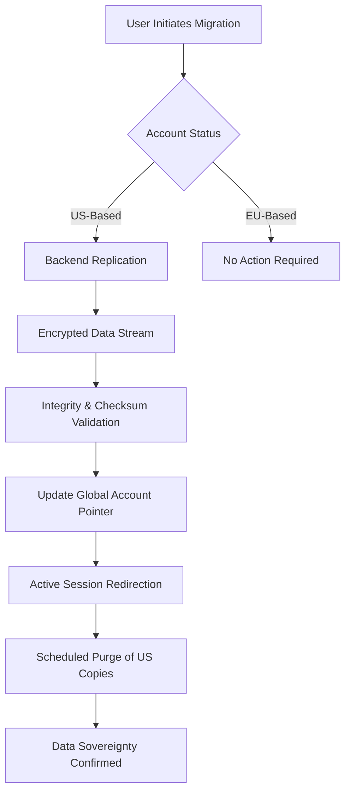

For decades, the prevailing narrative of the internet was one of a "borderless" utopia. We were told that data was weightless—a digital mist that flowed seamlessly across oceans and continents, unbound by the archaic constraints of geography. This vision of the "Global Village" was seductive, promising a world where information was the only currency and maps were irrelevant. 

However, for anyone living in the European Union or handling sensitive professional data, this "borderless" feel has transitioned from a feature to a liability. The reality is that data isn't a mist; it is a physical entity. Your emails, your contacts, and your calendar invites reside on spinning platters or flash cells inside humming, air-conditioned server farms. These servers are physically bolted to floors in specific jurisdictions, and those jurisdictions come with laws.

If your email is stored in a US data center, you aren't merely agreeing to a company's Terms of Service; you are effectively placing your most private communications under the legal jurisdiction of the United States government. For EU citizens, this creates a fundamental and often violent clash between the [General Data Protection Regulation (GDPR)](https://en.wikipedia.org/wiki/General_Data_Protection_Regulation), which defines privacy as a fundamental human right, and US surveillance frameworks that prioritize national security over individual anonymity.

This is the precise problem Fastmail is addressing. By launching a dedicated EU data region, Fastmail isn't simply optimizing for speed—they are providing **data sovereignty**. In an era where "privacy" has been diluted into a marketing buzzword, the act of physically relocating data to a different continent is one of the few tangible steps a provider can take to fundamentally alter the legal protections afforded to a user.

---

## 🚀 The Big Move: Architecture of Sovereignty

Fastmail has officially evolved its infrastructure to include a dedicated EU data region. This is not a superficial "mirror" or a cached copy of a US-based service; it is a structural decoupling. Users now have the agency to decide whether their data lives in the US or within the European Union. For new sign-ups, the choice is immediate. For legacy users, Fastmail has engineered a migration pipeline that allows the seamless transfer of years of digital history from one hemisphere to another.

This move is a direct response to the growing demand for "sovereign" digital services. Once a user realizes that the physical location of a server determines which government can issue a subpoena, the value proposition of an EU-based region becomes clear. Fastmail is positioning itself as the sophisticated, professional alternative to the "Big Tech" hegemony of Google and Microsoft. While the giants offer regional "tenants" for Fortune 500 companies, the individual user—the journalist, the lawyer, the independent consultant—is typically left in a legal gray area, their data drifting wherever the provider's load balancer deems most efficient.

The core philosophy here is simple: **"You decide which law applies to your data."** For a professional in Berlin or a dissident in Paris, this isn't about shaving a few milliseconds off a page load—it's about ensuring their data is shielded by some of the strictest privacy protections in human history. We are witnessing a pivotal shift: privacy is moving from the *software layer* (encryption and hashing) to the *physical layer* (geography and jurisdiction).

> "The ability to choose your data region is no longer a luxury feature; it is a fundamental requirement for any service claiming to respect the privacy and legal rights of European citizens."

---

## ⚖️ The Legal Collision: GDPR vs. The CLOUD Act

To understand why physical server location matters, one must analyze the collision between two of the most powerful legal frameworks in the digital age: the GDPR and the US CLOUD Act.

### The GDPR Pillar
The [GDPR](https://en.wikipedia.org/wiki/General_Data_Protection_Regulation) is perhaps the most ambitious piece of privacy legislation ever enacted. It operates on the principle that personal data belongs to the individual, not the corporation. One of its strictest mandates is that personal data cannot be transferred to a "third country" unless that country can demonstrate an "adequate level of protection." The penalties for failure are staggering: fines can reach **€20 million or 4% of a company's global annual turnover**, whichever is higher.

### The CLOUD Act Paradox
Conversely, the [Clarifying Lawful Overseas Use of Data (CLOUD) Act](https://en.wikipedia.org/wiki/Clarifying_Lawful_Overseas_Use_of_Data_Act) grants US law enforcement the power to compel US-based technology companies to provide data via a warrant, **regardless of where that data is physically stored**. 

This creates a legal paradox: A US company could store your data in Frankfurt to satisfy GDPR requirements, but if the US government issues a warrant under the CLOUD Act, the company may be legally forced to hand that data over, potentially violating EU law in the process.

### The Schrems Saga
This tension was brought to the forefront by privacy activist Max Schrems. Through a series of landmark challenges at the European Court of Justice (ECJ), Schrems successfully dismantled the "Safe Harbor" and "Privacy Shield" agreements. He argued that US surveillance programs—specifically **Section 702 of the FISA (Foreign Intelligence Surveillance Act)**—are incompatible with the fundamental rights of EU citizens. The resulting "Schrems II" ruling left thousands of companies in a state of legal vertigo.

By implementing a dedicated EU region, Fastmail introduces "legal friction." While Fastmail still maintains US ties, moving data to the EU forces a conflict of laws. In many cases, this forces the US government to utilize a Mutual Legal Assistance Treaty (MLAT). The MLAT process is significantly slower, requires higher thresholds of evidence, and is subject to much greater diplomatic and legal scrutiny than a domestic US warrant. For the privacy-conscious user, this friction is the primary product they are paying for.

---

## 🛠️ Under the Hood: The Engineering of Migration

Relocating a user's entire digital existence—thousands of emails, complex calendar recursions, and intricate contact lists—across an ocean is a non-trivial engineering feat. Fastmail had to build a migration pipeline that ensures zero data loss and zero downtime.

### The Migration Pipeline
When a user initiates a move to the EU region, the system triggers a backend replication process. The data is encrypted in transit using industry-standard protocols and streamed from US clusters to the EU infrastructure. Once the replication is verified, a "cut-over" occurs. The system updates a global account pointer, redirecting all subsequent requests to the EU region.

### Managing Data Silos
From a technical perspective, this requires Fastmail to manage "data silos." Traditional cloud architectures favor "Global Distribution," where data is mirrored across multiple regions to ensure high availability. However, to comply with strict residency rules, Fastmail must ensure that **both primary and backup copies** of EU data stay within the EU. 

This introduces complexity in disaster recovery and load balancing. Fastmail cannot simply "failover" an EU user to a US server during a regional outage without violating the very residency promise they are making. This requires a more robust, localized redundancy strategy within the EU itself.

### The Performance Dividend
While the primary driver is legal, the secondary benefit is **latency**. The laws of physics dictate that data cannot travel faster than the speed of light. By eliminating the need for a request to travel from Berlin to Virginia and back, Fastmail significantly reduces the Round Trip Time (RTT). The result is a "snappier" interface and faster mail synchronization, proving that privacy and performance are not mutually exclusive.

---

## 🗣️ The Verdict: Professionalism vs. Paranoia

The reaction from the technical community—specifically on platforms like [Hacker News](https://news.ycombinator.com/)—has been a nuanced blend of applause and skepticism. 

### The "Reasonable Protection" Camp
Many users view this as a massive victory. For the vast majority of professionals, the goal isn't to hide from a targeted NSA operation, but to avoid bulk data collection and ensure their information is handled according to the laws of their own home. Fastmail's approach provides a "sweet spot"—it offers a high-end productivity suite with a level of legal protection that makes it a viable alternative to Google Workspace for EU-based SMEs.

### The "Hardcore Privacy" Camp
The skeptics, often found in the encrypted-mail community, argue that as long as the corporate entity has a US presence, the server location is only a partial shield. They argue that the "Holy Grail" of privacy is a service hosted in the EU, owned by an EU entity, with no US parent company or operational ties.

However, this debate often ignores the "Productivity Gap." As detailed in various [community discussions](https://news.ycombinator.com/), many users find the extreme privacy options too limiting for professional work. Academic research on "Cloud Data Sovereignty" found on [ArXiv](https://arxiv.org/search/?query=cloud+data+sovereignty&searchtype=all) suggests that as the world moves toward "Digital Bordering," the winners will be services that offer flexible residency rather than those that attempt to exist outside of any jurisdiction entirely.

---

## 🏁 The Competitive Landscape: Fastmail vs. The Field

To accurately assess the value of Fastmail's EU region, we must compare it against the other primary contenders in the privacy-email space: Proton Mail and Tutanota.

### The E2EE Specialists: Proton & Tutanota
Proton Mail (Switzerland) and Tutanota (Germany) are the "Gold Standard" for anonymity. Their primary weapon is End-to-End Encryption (E2EE). In their models, the provider does not hold the decryption keys; therefore, even if a government seizes the server, the data is unreadable.

### The Productivity Powerhouse: Fastmail
Fastmail takes a different path. They are not an E2EE provider—because E2EE fundamentally breaks features like server-side search, complex calendar integration, and seamless third-party API connectivity. Fastmail focuses on being a **powerhouse productivity tool** that leverages legal jurisdiction rather than mathematical impossibility to protect its users.

### Feature Comparison Matrix

| Feature | Fastmail (EU) | Proton Mail | Gmail |
| :--- | :--- | :--- | :--- |
| **Data Region Choice** | ✅ Yes | ✅ Fixed (CH) | ❌ Limited/Corporate |
| **GDPR Compliance** | ✅ High | ✅ Very High | ⚠️ Variable |
| **End-to-End Encryption**| ❌ No | ✅ Yes | ❌ No |
| **Search/Calendar Power**| ✅ Exceptional | ⚠️ Moderate | ✅ Exceptional |
| **US Jurisdiction** | ⚠️ Partial | ✅ No | ❌ Full |
| **Latency (for EU)** | ✅ Low | ✅ Low | ⚠️ Variable |

Fastmail is essentially building a bridge for the **"Privacy-Pro"**: the user who cares deeply about their legal rights and data residency but cannot afford to sacrifice the efficiency and power of a modern productivity suite.

---

## 🔮 The Future of the Sovereign Web

The introduction of an EU data region by Fastmail is a canary in the coal mine. It signals the end of the "Global Village" era and the beginning of the "Sovereign Web." 

We are entering a period of **Digital Regionalism**. In this new paradigm, the most important question a user can ask isn't just "Is my data encrypted?" but "Where does my data live, and who has the legal authority to ask for it?" 

Moving toward regional silos is expensive, operationally complex, and antithetical to the original design of the internet. However, it is the only sustainable way to reconcile borderless technology with bordered laws. As more providers adopt this model, we can envision a future where our digital identities are not anchored to a corporate office in Silicon Valley, but are distributed across the globe based on our own legal preferences and citizenship.

### Practical Steps for the Privacy-Conscious
For those looking to audit their own digital footprint, the following checklist is recommended:
1. **Identify Data Residency:** Check the privacy policy of every major service (Email, Cloud Storage, CRM) to see where their primary data centers are located.
2. **Evaluate Jurisdiction:** Determine if the provider is subject to the US CLOUD Act or similar extraterritorial laws.
3. **Assess the Trade-off:** Decide if the productivity gains of a "Big Tech" tool outweigh the jurisdictional risks.
4. **Migrate to Sovereignty:** Whenever possible, choose providers that offer regional data residency (like Fastmail's EU region).

The lesson is clear: **digital autonomy begins with geography**. Whether you are a business owner navigating the complexities of EU audits or an individual wanting to keep your private life out of foreign courts, taking control of your data region is a critical step in securing your digital future. Fastmail has set a high bar for the industry; it remains to be seen which other providers have the courage—and the engineering will—to follow.

---

## 📚 References

- **Fastmail Official**: [Fastmail Blog: Official Announcement on EU Regions](https://www.fastmail.com/blog/)
- **Legal Frameworks**: [Wikipedia: General Data Protection Regulation (GDPR)](https://en.wikipedia.org/wiki/General_Data_Protection_Regulation)
- **US Law**: [Wikipedia: Clarifying Lawful Overseas Use of Data (CLOUD) Act](https://en.wikipedia.org/wiki/Clarifying_Lawful_Overseas_Use_of_Data_Act)
- **Community Discourse**: [Hacker News: Discussions on Fastmail Data Residency](https://news.ycombinator.com/)
- **Academic Research**: [ArXiv: Cloud Data Sovereignty and Legal Frameworks](https://arxiv.org/search/?query=cloud+data+sovereignty&searchtype=all)
- **Judicial Rulings**: [Court of Justice of the European Union (CJEU): Schrems II Ruling](https://curia.europa.eu/)
- **Technical Documentation**: [Fastmail Help Center: Data Residency and Migration Guide](https://www.fastmail.com/help/)
- **Advocacy**: [Privacy International: Trends in Data Localization](https://privacyinternational.org/)
- **Digital Rights**: [Electronic Frontier Foundation (EFF): Surveillance and the CLOUD Act](https://www.eff.org/)
- **Regulatory Body**: [European Data Protection Board (EDPB): Guidelines on Data Transfers](https://edpb.europa.eu/)