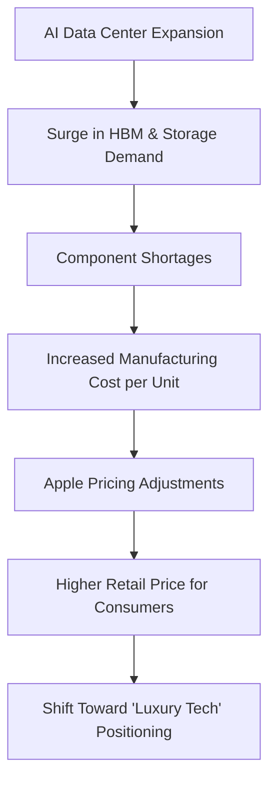

Heads up: it looks like Apple is about to fundamentally change how they price their hardware, and it is not a shift that will help our wallets. For over a decade, Apple has operated on a predictable pricing cadence—they would bump the price slightly for a generational leap in storage or a "Pro" feature, and the base models remained relatively stable. But that era of predictability is ending. 

According to a recent report from [Livemint](https://www.livemint.com/technology/tech-news/iphone-price-hike-coming-next-week-apple-may-raise-prices-from-tomorrow-report-11786252720970.html), Apple may be hiking the prices of iPhones currently available on shelves as early as August 10. This is a jarring departure from standard industry practice, where prices typically drop or remain flat as a product reaches the end of its lifecycle to make room for the next generation.

This isn't just a rumor about some distant future model; we are talking about the hardware available today. When you combine this immediate threat with industry predictions that the iPhone 18 Pro could see a price jump of **$200**, it becomes clear that Apple is navigating a perfect storm: a volatile global supply chain and an aggressive, expensive push into on-device AI hardware. If you have been waiting to buy a phone at a "normal" price, your window of opportunity is closing faster than you think.

---

## 🚨 The August 10 Countdown: A Sudden Shift in Strategy

  
  
 <a href="https://unsplash.com/@onurbinay">Onur Binay</a> on <a href="https://unsplash.com/photos/silver-iphone-6-and-red-iphone-case-OKjJZNTl004">Unsplash</a>

The current anxiety stems from a leak shared by a prominent tipster known as **Fixed Focus Digital** on Weibo. As detailed by [Livemint](https://www.livemint.com/technology/tech-news/iphone-price-hike-coming-next-week-apple-may-raise-prices-from-tomorrow-report-11786252720970.html), evidence suggests that Apple plans to raise prices on the current lineup starting Monday, August 10. While the tipster noted that this remains a rumor, the supporting data from Apple's production numbers paints a concerning picture.

Reports indicate that Apple has significantly throttled the production of current models, slashing production lines from **30% down to 15%**. In the consumer electronics world, a production cut of this magnitude usually signals one of two things:
1. **Inventory Clearing:** They are intentionally limiting supply to drive demand for an upcoming launch.
2. **Cost Recovery:** They are raising prices to offset rising component costs, making the current phones harder to find to justify the price hike.

This strategy is atypical for Apple. Traditionally, the company prefers to introduce a more expensive "Ultra" or "Pro Max" tier rather than increasing the price of existing SKUs. However, with the global semiconductor market in a state of flux, Apple may no longer have the luxury of absorbing these costs. If August 10 proves to be the date, consumers who delayed their purchase by a few weeks could find themselves paying a premium for the exact same device they could have bought last week.

---

## 💻 The Precedent: How Macs and iPads Paved the Way

If you are skeptical that Apple would raise prices mid-cycle, you only need to look at their other product categories. The iPhone is not the first target; the Mac and iPad lineups have already undergone similar adjustments. In June, Apple implemented price changes that caught even seasoned analysts by surprise.

As reported by [Livemint](https://www.livemint.com/technology/tech-news/iphone-price-hike-coming-next-week-apple-may-raise-prices-from-tomorrow-report-11786252720970.html), some of these increases were staggering:
*   **MacBook Pro M5 Max:** Certain high-end configurations saw price increases as high as **₹1 lakh** in specific regional markets.
*   **Apple TV 4K:** The price jumped from **₹14,900 to ₹25,900**, representing a massive **74% increase**.

These were not subtle adjustments for inflation; they were aggressive leaps. These moves suggest that Apple is actively testing the "price ceiling" of its user base. By implementing these hikes on secondary devices like the Apple TV, Apple is gauging how much additional cost the ecosystem loyalists are willing to bear. If users accept a **74% increase** on a streaming box, it is only a matter of time before the iPhone—Apple's primary revenue driver—follows suit.

---

## 🧠 The "AI Tax": Why Components are Skyrocketing

This price surge isn't merely a corporate grab for more profit; it's a symptom of a systemic crisis in the chip and memory sectors. The catalyst is the global AI gold rush. Apple acknowledged the severity of the situation in a statement to CNBC (via [Livemint](https://www.livemint.com/technology/tech-news/iphone-price-hike-coming-next-week-apple-may-raise-prices-from-tomorrow-report-11786252720970.html)):

> “The consumer electronics industry is facing an unprecedented challenge. The rapid expansion of AI data centres has created an extraordinary surge in demand for memory and storage. We have never seen a component price increase this much, this quickly.”

Essentially, we are paying an "AI Tax." To power Large Language Models (LLMs) like GPT-4 or Gemini, tech giants are building massive data centers that require an astronomical amount of **High Bandwidth Memory (HBM)** and advanced NAND storage. 

The problem is that the same fabrication plants (fabs) and memory providers—such as [Samsung](https://www.samsung.com) and [SK Hynix](https://www.skhynix.com)—that supply Apple also supply the AI server market. When NVIDIA, Microsoft, and Meta buy up memory capacity by the terabyte, it creates a supply crunch for consumer-grade hardware. Even if the physical design of an iPhone remains unchanged, the cost of the internal silicon and memory has surged. Apple now faces a choice: absorb the cost and watch their margins shrink, or pass the bill to the consumer. Given their track record, the latter is far more likely.

---

## 📈 The Road to iPhone 18 Pro: The $200 Price Jump

While the August 10 rumor is an immediate concern, the long-term forecast for the iPhone 18 Pro is even more daunting. **IDC**, a global leader in market intelligence, has been tracking these trends and has revised its pricing forecasts upward. Initially, IDC predicted a modest **$100 increase** for Pro models, but the current trajectory suggests a much steeper climb.

According to [Livemint](https://www.livemint.com/technology/gadgets/iphone-18-pro-iphone-18-pro-max-could-see-up-to-200-price-hike-says-report-11782632325917.html), the iPhone 18 Pro and Pro Max could see a price hike of up to **$200**. To put this into perspective, let's look at the projected pricing trajectory:

| Model | Estimated Launch Price | Projected iPhone 18 Pro Price | Potential Increase |
| :--- | :--- | :--- | :--- |
| **iPhone 17 Pro** | **$1,099** | **$1,299** | **+$200** |
| **iPhone 17 Pro Max** | **$1,199** | **$1,399** | **+$200** |

In markets like India, where import duties and GST already inflate prices, this could translate to an additional **₹20,000** per device. Nabila Popal of IDC suggests that the era of incremental $50 increases is over. The "Pro" series is evolving from a high-end consumer tool into a genuine luxury asset, designed to offset the billions Apple is spending on R&D for its AI integration (Apple Intelligence).

---

## 📸 Technical Justifications: A20 Chips and Variable Aperture

Apple rarely raises prices without a corresponding "spec bump" to justify the cost to the public. To make a **$200 jump** palatable, the iPhone 18 Pro is expected to feature the most significant hardware overhaul in years.

### The A20 Pro Chip: The 2nm Revolution
The centerpiece of the next generation will be the **A20 Pro chip**. Based on reports from [TSMC](https://www.tsmc.com), this chip will likely be the first to utilize a **2nm process**. The move from 3nm to 2nm is a monumental engineering feat that provides two primary benefits:
*   **Performance:** A projected **15% increase** in raw processing power, essential for running complex AI models locally on the device rather than in the cloud.
*   **Efficiency:** A **30% improvement** in power efficiency, which could finally solve the battery anxiety associated with high-performance Pro models.

### Professional Optics: Mechanical Variable Aperture
The camera system is also receiving a professional-grade upgrade. The iPhone 18 Pro is rumored to implement a **mechanical variable-aperture lens**. Currently, smartphones use a fixed aperture and simulate background blur (bokeh) using software (Computational Photography). A variable aperture allows the lens to physically open and close, mimicking a DSLR. This results in:
*   **Natural Depth of Field:** Real optical blur that looks professional and organic.
*   **Superior Low-Light Control:** Better management of light intake to reduce noise in dark environments.

### The Shrinking Dynamic Island
Apple is also working to push more of the Face ID sensor array beneath the display. This is expected to reduce the size of the "Dynamic Island" by approximately **35%**, providing a more immersive, edge-to-edge screen experience. While these upgrades are impressive, the cost of implementing 2nm silicon and mechanical lenses is astronomical, providing Apple the perfect justification for the $1,300 price point.

---

## 📱 The Foldable Factor: Setting a New Price Ceiling

Beyond the standard slab phones, Apple is quietly preparing its entry into the foldable market. The launch of an "iPhone Fold" is not just about a new form factor; it is a strategic move to shift the entire pricing psychology of the brand.

IDC suggests the first foldable iPhone could carry an average price of **$2,500**, with high-capacity models potentially hitting **$3,000**. This creates a psychological phenomenon known as **Anchor Pricing**. When a consumer sees a $3,000 foldable iPhone, a $1,300 iPhone 18 Pro suddenly feels like a "reasonable" or even "mid-range" option.

Furthermore, the extreme margins on a $3,000 device could allow Apple to subsidize some of the memory costs for the base models, potentially preventing the iPhone 18 (non-Pro) from skyrocketing. However, the overarching trend is clear: Apple is pivoting away from the mass market and doubling down on the "Luxury Tech" segment.

---

## 🌏 Regional Impact: The India Context

The pricing volatility is particularly acute in India. As Apple shifts more production to India via partners like Foxconn and Tata, the pricing structure is becoming more complex. While local assembly helps reduce some import duties, the volatility of the Indian Rupee against the US Dollar often forces Apple to raise prices to maintain global margin parity.

For the Indian consumer, the combination of a **$200 global hike** and local tax fluctuations could make the iPhone 18 Pro one of the most expensive smartphones ever released in the region. This makes the August 10 rumor even more critical for local buyers who are trying to time their purchase before the next inevitable price correction.

---

## 🛠️ Buyer's Guide: To Buy Now or Wait?

Given the current volatility, the "correct" time to buy an iPhone depends entirely on your user profile.

### 🟢 Buy Now (Before August 10) If:
*   **You are budget-conscious:** If you need a phone today, the risk of a mid-cycle price hike outweighs the benefit of waiting for a slightly better model next year.
*   **You don't need "Pro" AI features:** If your primary use case is social media, browsing, and standard photography, the current iPhone 15 or 16 series is more than sufficient.
*   **You want a guaranteed price:** Buying now removes the gamble of the August 10 price shift.

### 🟡 Wait Until Next Year If:
*   **You are a "Power User":** If you actually need 2nm processing power for heavy video editing or AI development, the A20 chip will be a generational leap.
*   **You are a Photography Enthusiast:** The mechanical variable aperture is a game-changer that will make the iPhone 18 Pro a legitimate tool for professional creators.
*   **You want a Foldable:** If you've been waiting for a folding screen, the current lineup will feel obsolete the moment the Fold launches.

---

## 🏁 Conclusion: The End of the Affordable Flagship

We are witnessing a fundamental shift in the smartphone economy. The "AI Tax" is a real and present phenomenon that has already claimed the Mac and iPad lineups. While the promise of A20 chips, 2nm efficiency, and DSLR-grade lenses is exciting, these innovations come with a steep financial cost.

The line between a "smartphone" and a "luxury asset" is blurring. Apple is betting that the integration of Apple Intelligence and professional-grade hardware will make users view the iPhone not as a tool, but as an essential piece of a high-end AI ecosystem. Whether we are willing to pay **$1,300** for that privilege remains to be seen, but for those looking to save, the window is closing. If you don't need the bleeding edge, the smartest move for your wallet is to act before the August 10 deadline.

---

## 📚 References

*   **Livemint:** [iPhone 18 Pro, iPhone 18 Pro Max could see up to $200 price hike, says report](https://www.livemint.com/technology/gadgets/iphone-18-pro-iphone-18-pro-max-could-see-up-to-200-price-hike-says-report-11782632325917.html)
*   **Livemint:** [iPhone price hike coming next week? Apple may raise prices from tomorrow](https://www.livemint.com/technology/tech-news/iphone-price-hike-coming-next-week-apple-may-raise-prices-from-tomorrow-report-11786252720970.html)
*   **TSMC:** [Official 2nm Process Roadmap and Production Targets](https://www.tsmc.com)
*   **IDC:** [Worldwide Quarterly Mobile Phone Tracker and Pricing Forecasts](https://www.idc.com)
*   **Samsung Semiconductor:** [High Bandwidth Memory (HBM) Market Analysis](https://www.samsung.com)
*   **SK Hynix:** [AI Memory Solutions and Supply Chain Impact](https://www.skhynix.com)
*   **CNBC:** [Apple's Statement on Component Cost Increases](https://www.cnbc.com)
*   **Bloomberg:** [Analysis of Apple's Shift Toward Luxury Tier Pricing](https://www.bloomberg.com)