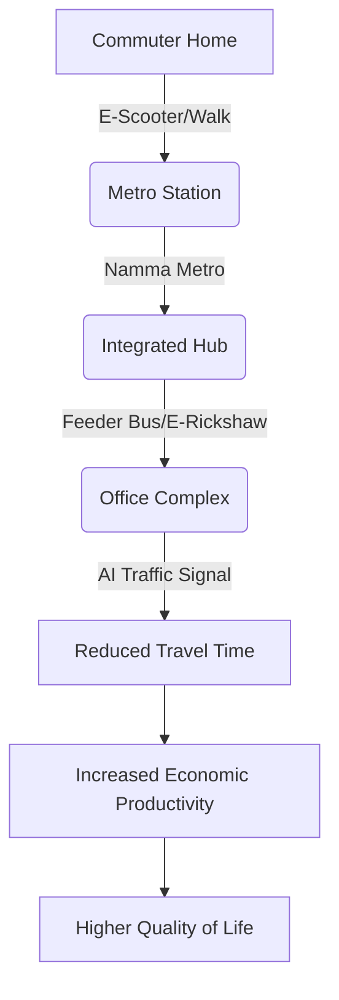

Bengaluru is a city of wild contradictions. On one hand, it is the undisputed "Silicon Valley of India"—a global tech powerhouse where the world’s most sophisticated code is written, AI startups are born, and new unicorns emerge with dizzying frequency. It is a city that attracts the brightest minds from across the globe, offering a blend of cosmopolitan energy and a lingering, nostalgic charm. But on the other hand, the simple act of traversing the city feels like a battle from another era. 

For millions of residents, the daily commute is not merely a transition from home to work; it is an endurance test of patience and mental fortitude. The city was originally envisioned as a "Garden City," characterized by lush canopies and wide, breathable spaces. However, that legacy infrastructure has been completely overwhelmed by a massive, unplanned population boom and a geometric increase in private vehicle ownership. The result is a systemic collapse of mobility.

That is where the **Bengaluru Urban Mobility Mission (BUMM)** enters the frame. Launched by the Government of Karnataka, BUMM is not just another bureaucratic attempt to build a few more flyovers or widen a handful of arterial roads. It represents a fundamental shift toward **"integrated mobility."** The core philosophy is a realization that we cannot simply pour more concrete to solve congestion; instead, the city must synchronize the Metro, electric buses, walkable paths, and AI-driven traffic management into a single, seamless ecosystem. With the city’s economy risking stagnation due to gridlock, BUMM is perhaps the most critical intervention in the city's modern history.

---

### 📉 Section 1: The Anatomy of the Gridlock

To understand why a full-scale "Mission" is necessary, one must look at the staggering data. Bengaluru consistently ranks among the most congested cities globally. According to the [TomTom Traffic Index](https://www.tomtom.com/traffic-index/), it is common for a simple 10-kilometer trip to take **45 to 60 minutes** during peak rush hour, effectively reducing the average speed of the city to a crawl.

The problem is a classic case of infrastructure lagging behind exponential growth. The rapid, unplanned expansion of the 1990s and 2000s—driven by the IT boom—left the city with a fragmented road network. [Wikipedia's overview of transport in Bengaluru](https://en.wikipedia.org/wiki/Transport_in_Bengaluru) highlights how residential layouts were converted into commercial hubs without corresponding upgrades to road width or drainage, creating permanent bottlenecks at junctions like Silk Board, Hebbal, and Tin Factory.

**The cost of this congestion is not just measured in minutes, but in billions:**
*   **Economic Productivity**: Economists estimate that when high-skill workers spend **2 to 4 hours a day** idling in traffic, the city suffers a massive loss in GDP due to lost man-hours.
*   **Psychological Toll**: "Commuter stress" has become a systemic health issue. Chronic exposure to traffic noise and the frustration of unpredictable travel times contribute to increased cortisol levels and burnout among the workforce.
*   **Environmental Degradation**: Idling engines are a primary source of particulate matter (PM2.5), contributing to a decline in the city's air quality and respiratory health.

> "Traffic in Bengaluru isn't just a logistical failure; it's a tax on the city's mental health and economic potential. When the most productive minds in the country are stuck at a signal for an hour, the entire innovation ecosystem suffers."

Furthermore, the city is currently trapped in the "construction paradox." To fix the traffic, the government is building the Namma Metro and various underpasses. However, the construction zones often block 50% of the existing road capacity, creating a temporary cycle of misery that makes the transition to a better system feel almost unbearable for the current generation of commuters.

---

### 🏗️ Section 2: How BUMM Actually Works: The Integration Engine

BUMM differs from previous efforts because it stops treating the Metro, the buses, and the roads as separate entities. In the past, the [Bangalore Metro (BMRCL)](https://bmrc.karnataka.gov.in/) and the [Bangalore Metropolitan Transport Corporation (BMTC)](https://bmtc.karnataka.gov.in/) operated as silos, often with conflicting schedules and disconnected boarding points. 

The centerpiece of BUMM is **Multi-Modal Integration (MMI)**. The goal is to create a "frictionless" journey. Imagine a commuter stepping off a Metro train and finding a synchronized BMTC feeder bus or an e-rickshaw waiting exactly where the exit ends, all accessible via a single **Common Mobility Card (NCMC)**. By removing the need to switch payment methods or walk long distances between modes, the "cost" of using public transport (in terms of effort) drops significantly.

**The Strategic Pillars of BUMM:**

1.  **Network Expansion & Acceleration**: Speeding up the completion of Metro Phase 2 and planning Phase 3 to ensure that tech parks on the periphery (like Whitefield and Electronic City) are fully connected to the city center.
2.  **Fleet Electrification**: Transitioning the BMTC fleet to electric buses. This not only reduces the carbon footprint but also lowers the operating cost per kilometer, allowing for more frequent service.
3.  **Data-Driven Route Optimization**: Using GPS and passenger load data to redesign bus routes. The mission aims to eliminate redundant overlapping routes and fill "transit deserts"—areas where residents have no viable public transport options.
4.  **Transit-Oriented Development (TOD)**: This is a planning shift that encourages high-density residential and commercial development within a 500-to-800-meter radius of Metro stations. If people live and work near the hub, the need for a private car vanishes.

By transforming public transit from a "last resort" into a "preferred choice," BUMM aims to trigger a modal shift, moving a significant percentage of the population out of private cars and into high-capacity transit.

---

### 🚲 Section 3: Solving the "Last-Mile" Nightmare

The "last mile" is the Achilles' heel of urban planning. A commuter might be willing to take the Metro for 12 kilometers, but if the final 1.5 kilometers involves dodging open drains, walking on broken sidewalks, or haggling with an overpriced auto-rickshaw, they will likely choose to drive their own car for the entire journey.

BUMM is placing a heavy emphasis on **Non-Motorized Transport (NMT)**. The mission recognizes that a city that is hostile to pedestrians is inevitably a city choked by cars. The plan involves:

*   **Pedestrianization**: Creating wide, shaded, and unobstructed sidewalks that actually lead somewhere. This involves reclaiming road space from illegal parking and haphazard encroachments.
*   **Dedicated Cycling Lanes**: Moving beyond "painted lines" to physically segregated lanes that protect cyclists from heavy traffic, encouraging a shift toward bicycles for short-distance commutes.
*   **Micro-Mobility Hubs**: Integrating organized e-bike and e-scooter rental docks at every major Metro and bus station. 

As noted in [academic research on urban mobility](https://arxiv.org/abs/2502.14528), the integration of micro-mobility can reduce local emissions by up to **20-30%** in high-density corridors. When the "bridge" between the station and the office is seamless, the entire public transport system becomes viable.

**The Last-Mile Flowchart:**
1.  **The Hub**: Arrival at Namma Metro Station or BMTC Terminal.
2.  **The Bridge**: Transition to e-rickshaws, rental cycles, or electric feeder buses.
3.  **The Destination**: A safe, walkable, and shaded path to the final office or home entrance.

---

### 🤖 Section 4: AI and the Digital Twin of Traffic

It is only fitting that the software capital of India uses software to solve its traffic. BUMM is integrating **AI, IoT (Internet of Things), and Big Data** to move away from static traffic management.

The traditional system relies on fixed timers—a light stays green for 60 seconds regardless of whether there are 5 cars or 500. BUMM is implementing **Adaptive Traffic Control Systems (ATCS)**. These systems use high-resolution cameras and road-surface sensors to monitor traffic volume in real-time. If the AI detects a massive backup on one arm of a junction while the other is empty, it dynamically adjusts the signal timing to clear the congestion.

Beyond signals, the city is exploring the concept of a **"Digital Twin"**—a virtual replica of Bengaluru's traffic flow. By feeding real-time GPS data from ride-sharing apps and Google Maps into this model, planners can:
*   **Predict Bottlenecks**: Identify a jam before it happens and reroute traffic via digital signage.
*   **Optimize Roadworks**: Schedule maintenance during windows of lowest demand.
*   **Simulate Changes**: Test the impact of a new one-way street or a flyover in a virtual environment before spending crores on construction.

However, tech is not a silver bullet. Critics argue that AI-optimized traffic lights can actually increase "induced demand" by making driving slightly more efficient, which in turn attracts more cars to the road. The true test of BUMM's tech stack will be whether it prioritizes the movement of *people* (buses and pedestrians) over the movement of *private vehicles*.

---

### 🎓 Section 5: The Great Debate: Induced Demand vs. Capacity

To understand why BUMM is shifting its focus, one must understand the concept of **Induced Demand**. For decades, the default solution to Bengaluru's traffic was to build more flyovers and widen roads. The logic was simple: *More space = Less traffic*.

In reality, the opposite happens. This is known as the **Lewis-Mogridge Position**: when you increase road capacity, you reduce the "cost" of driving (in time). This makes driving more attractive, encouraging people who previously took the bus or stayed home to start driving. Within a few years, the new lanes are just as jammed as the old ones, but with a higher total volume of cars.

This is why the tech community, frequently debating these issues on platforms like [Hacker News](https://news.ycombinator.com/), argues that the only sustainable path is to stop expanding roads and start restricting car usage.

**BUMM’s response to this is Transit-Oriented Development (TOD).** Instead of bringing people to the city via highways, TOD brings the city to the people. By allowing higher Floor Area Ratio (FAR) for buildings near Metro stations, the city encourages a "15-minute city" model—where work, shopping, and healthcare are all within a short walk or ride from one's home.

> "You cannot solve traffic by adding more lanes to the highway; that's like trying to cure obesity by buying bigger pants. The only solution is to reduce the number of cars on the road by providing superior alternatives."

For BUMM to truly succeed, the government may eventually need to consider politically sensitive tools such as **congestion pricing** (charging cars to enter high-traffic zones) or strict parking caps in commercial districts.

---

### 🌍 Section 6: The Macro Impact: Health, Equity, and Survival

The stakes of the Bengaluru Urban Mobility Mission extend far beyond the frustration of a long commute. This is a matter of public health and social equity.

**1. Public Health and Air Quality**: 
Bengaluru's air quality index (AQI) often spikes during peak hours. Millions of idling internal combustion engines release a cocktail of NOx and particulate matter. The push for an **EV ecosystem**—electric buses and charging infrastructure—is not just a "green" gesture; it is a necessity for the city's respiratory health. According to [World Health Organization (WHO)](https://www.who.int/) guidelines, reducing urban traffic congestion is one of the most effective ways to lower the incidence of asthma and cardiovascular disease in metropolitan areas.

**2. Social Equity**: 
Traffic is an equalizer in frustration, but not in impact. A wealthy executive in a climate-controlled SUV is inconvenienced by traffic; a daily wage worker on a crowded, delayed bus is economically penalized. When public transit is unreliable, the "mobility gap" widens. BUMM’s focus on expanding the BMTC network to the outskirts ensures that low-income workers can access high-paying jobs in the city center without spending **30% of their income** on unreliable private transport.

**3. Economic Sustainability**: 
If Bengaluru becomes too difficult to navigate, the "innovation premium" of the city will vanish. Global companies may shift their operations to cities with better infrastructure (like Hyderabad or Pune), or push for permanent remote work, which could hollow out the city's commercial core.

**The Big-Picture Benefits summarized:**
*   **Economic**: Higher productivity and sustained attractiveness for FDI.
*   **Environmental**: Lower carbon footprint and breathable air.
*   **Social**: Inclusive access to opportunity across all socio-economic strata.
*   **Livability**: A return to the "Garden City" ethos where public spaces are for people, not parking lots.

---

### 🏁 Conclusion: The Road Ahead

The Bengaluru Urban Mobility Mission is a massive, necessary, and long-overdue correction. By pivoting from a "road-centric" to a "human-centric" model, the Government of Karnataka is finally acknowledging that the era of the private car as the primary mode of urban transport is over. All the technical components are now on the table: the expanding Metro, the electric bus fleet, the last-mile micro-mobility, and the AI-driven traffic management.

However, the ultimate challenge is not technical—it is institutional. BUMM can only succeed if the various agencies—the **BBMP** (civic body), **BMRCL** (Metro), **BMTC** (Buses), and the **Traffic Police**—stop working in silos and begin operating as a single, coordinated unit. 

Furthermore, it requires a cultural shift. For decades, the car has been a status symbol in Bengaluru. The mission will only truly "fix" the traffic when the city's elite find it more prestigious—or at least more efficient—to travel by Metro than by a luxury sedan.

Bengaluru is at a crossroads. It can either become a cautionary tale of how rapid growth can strangle a city, or it can become a global blueprint for how a broken metropolis can reinvent itself. The blueprint is ready. The mission is launched. Now, the city must actually move forward.

---

## 📚 References

  
  
 <a href="https://unsplash.com/@jay_5">Jayanth Muppaneni</a> on <a href="https://unsplash.com/photos/a-large-building-with-a-clock-on-the-top-of-it-y96JVdGu7XU">Unsplash</a>

*   **TomTom Traffic Index**: [Real-time congestion data and rankings for Bengaluru](https://www.tomtom.com/traffic-index/)
*   **Wikipedia**: [Transport in Bengaluru - History and Infrastructure](https://en.wikipedia.org/wiki/Transport_in_Bengaluru)
*   **Bangalore Metro (BMRCL)**: [Official portal for Metro expansions and phases](https://bmrc.karnataka.gov.in/)
*   **BMTC**: [Official site for Bengaluru's bus services and fleet modernization](https://bmtc.karnataka.gov.in/)
*   **ArXiv**: [Research on Urban Mobility and AI-driven Traffic Management](https://arxiv.org/)
*   **Hacker News**: [Community discussions on Bengaluru's infrastructure and 'Induced Demand'](https://news.ycombinator.com/)
*   **Government of Karnataka**: [Urban Development Department guidelines on mobility](https://ud.karnataka.gov.in/)
*   **World Health Organization (WHO)**: [Urban Health and Air Quality Guidelines](https://www.who.int/)