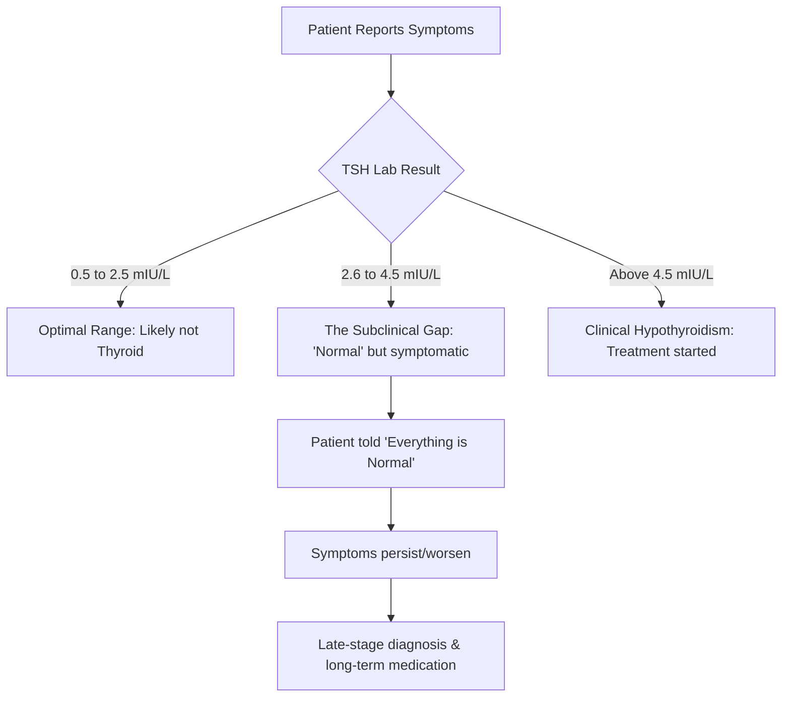

You’ve just left the doctor's office. You're looking at your latest blood work, and every single number—cholesterol, glucose, liver enzymes—is in the clear. The doctor gives you the thumbs up and says, **"Everything is normal."**

For most of us, that’s a huge relief. We assume everything under the hood is running perfectly and we go about our day. But according to Dr. Shriram Nene, that word "normal" is actually one of the most misleading terms in modern medicine. Here is the critical distinction: **"normal" does not necessarily mean you are healthy; it simply means you fit into a statistical average of the population being tested.**

There is a massive, often dangerous gap between "not being clinically sick" and "actually being healthy." This is where chronic fatigue, brain fog, early-stage insulin resistance, and silent inflammation hide. When we only look at those standard reference ranges, we aren't practicing preventative medicine—we are merely checking to see if a disease has already manifested. To truly optimize your health, you must look past the lab report and understand the difference between a population average and what is actually **optimal** for your unique biology.

---

## 📉 The Math of 'Normal': The 95% Fallacy

  
  
📸 <a href="https://unsplash.com/@usmanyousaf">Usman Yousaf</a> on <a href="https://unsplash.com/photos/man-in-white-dress-shirt-wearing-black-framed-eyeglasses-SakqLf78KVo">Unsplash</a>

To understand why "normal" is a trap, you have to understand how these ranges—formally called **Reference Intervals**—are constructed. Most laboratories do not determine a "healthy" range by studying the most vibrant, energetic people on earth. Instead, they take a large, convenient group of people and calculate the average.

Specifically, they typically use a **95% confidence interval**. In plain English: the "normal" range is the middle 95% of the sampled group. This leads to two systemic failures:

1.  **The Healthy Outlier:** By definition, **5% of perfectly healthy people** will fall outside the "normal" range, potentially leading to unnecessary prescriptions or anxiety.
2.  **The Unhealthy Average:** Conversely, a vast number of people who feel terrible or are in the early stages of metabolic collapse will fall squarely inside that 95% window.

As research into [clinical laboratory standards](https://www.ncbi.nlm.nih.gov/pmc/articles/PMC3543344/) highlights, these intervals are often based on "convenience samples." If the group being sampled is primarily sedentary, poorly nourished, or aging in a modern urban environment, the "normal" range shifts to reflect that mediocrity. We are essentially comparing our health to a population that is, as a whole, increasingly unwell.

> "The reference range is a snapshot of the crowd, not a blueprint for the individual. If the crowd is walking toward a cliff, the 'average' path is still a dangerous one." — Dr. Shriram Nene

When your physician says your results are "normal," they are effectively saying, *"You are statistically similar to the average person we test."* But in an era of skyrocketing obesity and Type 2 diabetes, being "average" is no longer a benchmark for success—it is a risk factor.

---

## 🦋 The 'Subclinical' Gap: The Case of the Thyroid

The thyroid is perhaps the most egregious example of the "normal" trap. The primary screening tool is the TSH (Thyroid Stimulating Hormone) test. Because TSH is produced by the pituitary gland to "tell" the thyroid to work, a high TSH usually suggests an underactive thyroid (hypothyroidism).

Standard laboratory ranges for TSH are notoriously wide, often spanning from **0.4 to 4.5 mIU/L**. However, clinical experience and patient outcomes suggest a much tighter window of vitality.

Many patients with a TSH of **3.5 mIU/L**—which is "normal" on paper—still suffer from classic hypothyroid symptoms:
*   **Crushing exhaustion** that sleep doesn't fix.
*   **Unexplained weight gain** despite a caloric deficit.
*   **Cognitive impairment** (brain fog) and depression.
*   **Cold intolerance** and thinning hair.

This is the **"subclinical gap."** These patients aren't "diseased" enough to trigger a prescription according to the guidelines, but they are too "suboptimal" to function at their peak. Research from the [American Thyroid Association](https://www.thyroid.org/) and various endocrine studies suggest that for many adults, the **optimal TSH range** is actually between **0.5 and 2.5 mIU/L**.

By ignoring the optimal range, we miss the opportunity for early lifestyle interventions or low-dose support. Dr. Nene argues that we must treat the *person*, not the *paper*. If the patient feels sick, a "normal" result should be viewed as a reason to dig deeper into T3, T4, and antibody testing, not a reason to cease the investigation.

---

## 🍬 The Glucose Gradient: The Slow Slide to Insulin Resistance

The "normal" trap is most dangerous when applied to blood sugar. Most doctors rely on **HbA1c**, which provides an average of blood glucose over the previous three months. The standard "normal" threshold is typically **below 5.7%**.

The fallacy here is the belief that health is a binary toggle—that you are either "normal" or "prediabetic." In reality, metabolic health is a gradient. If a patient's HbA1c creeps from **4.8% to 5.6%** over five years, they remain "normal" by every clinical standard. However, that shift represents a significant decline in insulin sensitivity.

According to data on [metabolic syndrome](https://www.diabetes.org/), the transition from "optimal" to "high-normal" is where the most insidious damage occurs. This is the stage where **hyperinsulinemia** (high levels of insulin) begins. Insulin is a growth hormone; when it remains chronically elevated to keep blood sugar in the "normal" range, it can drive inflammation, promote visceral fat storage, and increase the risk of cardiovascular disease.

**The Metabolic Health Spectrum:**
*   **Optimal HbA1c (4.8% – 5.2%)**: Your body maintains glucose homeostasis with minimal insulin effort.
*   **High Normal (5.3% – 5.6%)**: A critical warning sign. Your body is working harder (producing more insulin) to keep you in the "normal" range.
*   **Prediabetic (5.7% – 6.4%)**: The official alarm. The body can no longer keep up, and glucose begins to spill over.
*   **Diabetic (6.5%+)**: Systemic failure of glucose regulation.

Dr. Nene likens waiting for a result to become "abnormal" to waiting for your car engine to start smoking before you check the oil. The goal is not to avoid the "prediabetic" label; the goal is to maintain **metabolic flexibility**, ensuring your body can switch efficiently between burning glucose and burning fat.

---

## 💔 The Lipid Lie: Moving Beyond LDL

For decades, the "normal" range for LDL (Low-Density Lipoprotein) cholesterol has been the gold standard for heart health. If your LDL is under **130 mg/dL**, you're often told you're "fine."

However, modern cardiology is shifting. We now know that **LDL-C (the concentration of cholesterol)** is a poor predictor of risk compared to **LDL-P (the number of particles)** or **ApoB**. A person can have "normal" LDL cholesterol but a dangerously high number of small, dense LDL particles that easily penetrate the arterial wall and cause plaque.

To move from "normal" to "optimal," you should look at combined markers:
1.  **Triglyceride/HDL Ratio**: A ratio above **2.0** often indicates insulin resistance, regardless of what the LDL says.
2.  **ApoB**: This measures the total number of atherogenic particles. It is a far more accurate predictor of cardiovascular risk than standard LDL.
3.  **hs-CRP (High-sensitivity C-Reactive Protein)**: This measures systemic inflammation. High LDL in the absence of inflammation is far less dangerous than "normal" LDL in the presence of high inflammation.

Consulting resources like the [American Heart Association](https://www.heart.org/) reveals that while general guidelines exist, the context of your overall metabolic health determines whether your cholesterol numbers are a threat or a non-issue.

---

## 💊 The Micronutrient Myth: 'Sufficient' vs. 'Thriving'

The word "normal" is used most deceptively in vitamin and mineral testing. Take **Vitamin D**, for example. Many labs list anything above **30 ng/mL** as "sufficient."

There is a profound difference between *preventing rickets* (the clinical definition of sufficiency) and *optimizing the immune system*. Numerous studies on [Vitamin D and immune resilience](https://pubmed.ncbi.nlm.nih.gov/) suggest that levels between **50 and 80 ng/mL** are necessary for optimal autoimmune regulation and respiratory health.

Similarly, consider **Ferritin** (stored iron). A "normal" range might start as low as **15 ng/mL**. Yet, many women experience severe hair loss, restless leg syndrome, and profound lethargy if their ferritin is below **50 ng/mL**. In this case, "normal" is merely the threshold for not having clinical anemia, not the threshold for feeling great.

> "The medical system is designed to detect deficiency and disease, not to promote vitality. 'Sufficient' is the bare minimum required to not be clinically sick; 'Optimal' is what you need to thrive." — Dr. Shriram Nene

When we settle for "sufficient," we settle for mediocrity. This creates a psychological wall where patients are told their symptoms are "all in their head" simply because their markers are inside the lines.

---

## ⏱️ Context is King: The Danger of the Snapshot

One of the most critical insights from Dr. Nene is that a single lab test is a **snapshot**, not a movie. A "normal" result on a Tuesday morning provides zero information about the *direction* in which your health is moving.

Consider this hypothetical trajectory of fasting glucose:
*   **Year 1**: 82 mg/dL (Normal)
*   **Year 2**: 88 mg/dL (Normal)
*   **Year 3**: 92 mg/dL (Normal)
*   **Year 4**: 96 mg/dL (Normal)
*   **Year 5**: 99 mg/dL (Normal)

To a doctor looking only at the Year 5 result, the patient is healthy. To a physician looking at the **trend**, the patient is in a state of metabolic collapse. They are sliding steadily toward hyperglycemia. The "normal" range masks the crisis because it only cares about the destination, not the journey.

To avoid the snapshot trap, adopt these three strategies:
1.  **Longitudinal Tracking**: Maintain your own spreadsheet of labs over 5-10 years. Look for the slope of the line, not the individual dots.
2.  **Diurnal Awareness**: Understand that markers like cortisol, glucose, and testosterone fluctuate wildly throughout the day. A single test at 10:00 AM is not a representation of your 24-hour biology.
3.  **Symptom Correlation**: If your labs are "normal" but your energy, sleep, or mood are "abnormal," trust the symptoms. The lab is a tool, but your body is the primary source of truth.

---

## 🧬 The Path to Personalized Health: N-of-1 Medicine

The ultimate solution to the "normal" trap is the transition toward **Personalized Medicine**, or "N-of-1" medicine. This philosophy acknowledges that the "average human" is a mathematical fiction. Your genetics, microbiome, environment, and lifestyle create a unique biological baseline.

For a professional athlete, a "normal" resting heart rate of **70 bpm** might actually be a sign of overtraining or illness, as their personal optimal is **45 bpm**. For a sedentary person, a "normal" blood pressure of **120/80** might be the ceiling of their health, while for others, it is the floor.

**How to implement N-of-1 health tracking:**

*   **Establish Your Personal Baseline**: Get comprehensive testing when you feel your absolute best. This is *your* gold standard, not the lab's.
*   **Utilize Real-Time Data**: Move beyond the annual blood draw. Tools like [Continuous Glucose Monitors (CGMs)](https://www.fda.gov/) or wearable trackers for Heart Rate Variability (HRV) provide the "movie" rather than the "snapshot."
*   **Interdisciplinary Analysis**: Don't look at markers in isolation. Compare your Vitamin D levels with your calcium and magnesium; compare your LDL with your inflammation markers.

By redefining "normal" as *"what works for my unique system,"* you shift from a passive recipient of medical reports to an active investigator of your own biology.

---

## 🏁 Conclusion: Reclaiming Your Health Data

The next time you receive a lab report and see the word "Normal" stamped next to your results, do not simply close the folder. Instead, initiate a deeper conversation with your healthcare provider. Ask: **"Is this result optimal for someone with my specific goals, or is it just average for the general population?"**

Dr. Shriram Nene’s warning is a call to action: stop settling for the "absence of disease" and start chasing **vitality**. Whether it is the subclinical thyroid gap, the slow climb of blood sugar, or the mediocrity of "sufficient" vitamin levels, the truth of your health is often hidden in the margins.

True health is not found in a green checkbox on a PDF; it is found in the trends, the context, and the lived experience of your energy, mood, and longevity. You are not a statistical average; you are a unique, complex biological system. It is time to treat yourself that way.

---

## 📚 References & Further Reading

*   **Clinical Reference Intervals**: [NCBI - Limitations of Reference Intervals and the Impact on Patient Care](https://www.ncbi.nlm.nih.gov/pmc/articles/PMC3543344/)
*   **Thyroid Guidelines**: [American Thyroid Association - TSH and Hypothyroidism Management](https://www.thyroid.org/)
*   **Metabolic Health**: [American Diabetes Association - Standards of Medical Care in Diabetes](https://www.diabetes.org/)
*   **Immune Resilience**: [PubMed - Vitamin D's Role in Immune Function and Autoimmunity](https://pubmed.ncbi.nlm.nih.gov/)
*   **Cardiovascular Risk**: [American Heart Association - Understanding Cholesterol and Lipid Markers](https://www.heart.org/)
*   **Personalized Medicine**: [Mayo Clinic - The Future of Precision Medicine](https://www.mayoclinic.org/)
*   **Insulin Sensitivity**: [Harvard Health - Understanding Insulin Resistance and Prediabetes](https://www.health.harvard.edu/)