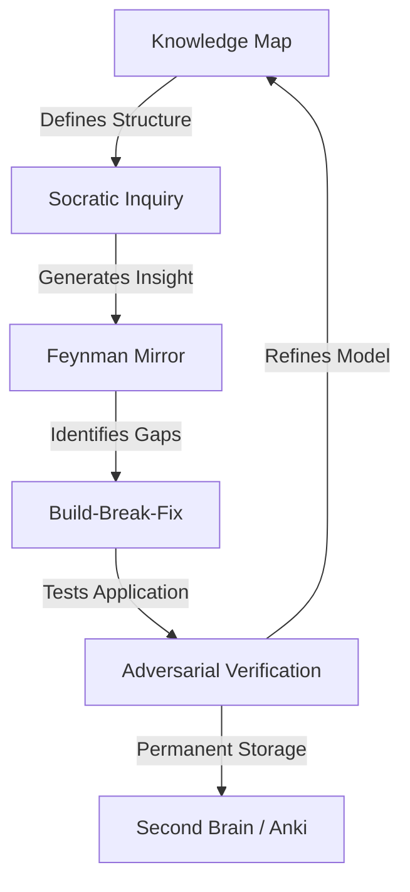

For decades, the process of mastering a complex subject followed a predictable, linear path: you bought a textbook, enrolled in a structured course, and spent countless hours scouring Google for specific answers to narrow questions. We existed in the era of **Information Retrieval**. The primary challenge was *finding* the needle of truth in a haystack of data. Success was measured by your ability to locate a source and synthesize it manually.

  
  
 <a href="https://unsplash.com/@markusspiske">Markus Spiske</a> on <a href="https://unsplash.com/photos/how-dare-you-on-white-printer-paper-_yZeVgJAAMY">Unsplash</a>

However, the emergence of Large Language Models (LLMs) has shifted the paradigm from retrieval to **Synthesis**. We are no longer just searching for information; we are interacting with it in a conversational, iterative loop. When utilized correctly, an LLM is not a "cheat code" to bypass the hard work of thinking—it is a "cognitive prosthetic" [Wired](https://www.wired.com/story/ai-learning-complex-topics/) that expands our capacity to handle dense, multi-dimensional information.

The crisis of modern AI usage is that most people treat these models as answer-engines. They ask for the "bottom line" or the "TL;DR," which inadvertently triggers shallow processing. This creates a dangerous illusion of understanding. To truly master a subject, we must stop asking AI for the answers and start using it to build a personalized, high-fidelity tutoring system. By merging cognitive science—specifically the Socratic method, the Feynman technique, and the principle of "desirable difficulty"—with strategic prompting, you can transform an LLM into a world-class private tutor.

---

### 🗺️ The Architecture of Understanding: Building a Knowledge Map

The most common failure point when tackling a formidable topic—whether it's Quantum Computing, Macroeconomics, or the Rust programming language—is the "Deep Dive" fallacy. Learners dive straight into the granular details without a structural framework, leading to **Cognitive Overload**. According to Sweller's Cognitive Load Theory, our working memory can only hold a limited amount of information; when we are bombarded with random facts without a mental "hook" to hang them on, the information simply evaporates.

The first step in an AI-powered learning workflow is the creation of a **Knowledge Map**. Instead of asking "What is X?", you must ask the LLM to construct a **dependency graph** of the topic. A dependency graph identifies exactly what you need to understand *first* before the advanced concepts become intelligible.

For instance, you cannot grasp *Backpropagation* in neural networks if you are shaky on the *Chain Rule* in calculus or *Gradient Descent*. If you attempt to learn the former without the latter, you aren't learning; you're just memorizing jargon. 

> "Learning is not the acquisition of facts, but the construction of a mental model that allows for the prediction of future outcomes."

By prompting the LLM to "Outline the fundamental prerequisites for [Topic] and organize them in a logical learning sequence," you create a personalized roadmap [Zapier](https://www.zapier.com/blog/use-ai-to-learn-faster/). Academic research indicates that these "dynamic learning paths" are significantly more effective than static syllabi because they can be pruned and expanded in real-time based on the learner's existing knowledge [arXiv:2104.11276](https://arxiv.org/abs/2104.11276).

**The "Architect" Prompt Template:**
*"I am a beginner in [Topic]. I want to achieve a professional level of understanding. Please provide a comprehensive learning roadmap. For each milestone, list 3-5 key concepts I must master and explain specifically why these are prerequisites for the next stage. Identify 'bottleneck concepts'—the ones that usually trip people up—and suggest how to approach them."*

This transition moves the AI from a simple fact-sheet to a strategic architect, ensuring your foundation is reinforced before you build the superstructure of your knowledge.

---

### 💬 The Socratic Loop: From Answer-Seeking to Inquiry

Once the map is drawn, the instinctive reaction is to ask the AI to "explain the first concept." While efficient, this is **passive learning**. Passive learning is the enemy of mastery; it creates a "fluency heuristic" where you feel you understand the material because the explanation is clear, but you cannot apply the logic independently.

To combat this, you must implement the **Socratic Loop**. The Socratic method is a form of cooperative argumentative dialogue to stimulate critical thinking and to draw out ideas and underlying presuppositions [Wikipedia](https://en.wikipedia.org/wiki/Socratic_method). In the context of AI, this means shifting the model's role from "Lecturer" to "Tutor."

The goal is to introduce **"desirable difficulty."** This cognitive science principle suggests that the more effort the brain exerts to retrieve or construct an answer, the stronger the resulting neural connection. If the AI gives you the answer, the "difficulty" is zero, and the retention is minimal. If the AI guides you to find the answer, the retention skyrockets.

**Bold Statistics on Active Learning:**
Research in educational psychology suggests that students engaged in active retrieval and Socratic questioning show a **40% to 60% increase in long-term retention** compared to those using passive reading or direct instruction [Wikipedia: Testing effect](https://en.wikipedia.org/wiki/Testing_effect).

In the developer community, power users on Hacker News often share a "Socratic Prompt" that prevents the AI from simply writing the code for them [Hacker News](https://news.ycombinator.com/item?id=36543210):

**The "Socratic Tutor" Prompt Template:**
*"I want to learn [Concept]. You are my Socratic tutor. Do not give me the answer directly. Instead, ask me a series of probing questions that lead me to derive the conclusion myself. If I make a mistake, do not correct me immediately; instead, ask a question that highlights the contradiction in my logic, guiding me back toward the truth."*

By using this loop, you are no longer a consumer of a lecture; you are an active participant in a derivation. You are building the logic in your own mind, with the AI acting as a guardrail to ensure you don't veer off into total confusion.

---

### 🧪 The Feynman Mirror: Using AI to Spot Knowledge Gaps

The ultimate test of understanding is the ability to simplify. This is the core of the **Feynman Technique**, named after Nobel laureate Richard Feynman, who posited that if you cannot explain a concept to a six-year-old, you don't truly understand it [Wikipedia](https://en.wikipedia.org/wiki/Richard_Feynman). 

Traditionally, the Feynman Technique requires a human listener to provide feedback. With an LLM, you have a **"Feynman Mirror"**—a tireless, omniscient editor that can spot the exact moment your logic falters.

This workflow leverages a psychological phenomenon known as the **Protégé Effect**, where the act of preparing to teach someone else leads to a deeper organization of knowledge in the teacher's own mind.

**The Feynman Mirror Workflow:**
1. **Production (Active Recall):** You explain the concept in your own words.
2. **Simplification (Synthesis):** You strip away the jargon to expose the raw logic.
3. **Verification (Correction):** The AI analyzes the explanation for "blind spots."

**The "Mirror" Prompt Template:**
*"I am going to explain [Concept] to you as if you are a beginner with no prior knowledge of this field. Please listen to my explanation. When I am finished, do not tell me I did a 'great job.' Instead, provide a critical audit: 
1. Identify any logical leaps where I assumed the listener knew something I didn't explain.
2. Point out any factual inaccuracies, no matter how small.
3. Highlight areas where my language is too vague or relies on jargon.
4. Ask me one 'stress-test' question that requires me to apply this concept to a new scenario."* [Towards Data Science](https://towardsdatascience.com/using-llms-for-personalized-learning-a-comprehensive-guide-f7b2e5a1c4d2).

This process exposes the "hidden gaps"—those areas where you *felt* confident but couldn't actually articulate the mechanism. It transforms the AI from a source of information into a diagnostic tool for your own brain.

---

### 🌉 Bridging the Abstract: Synthetic Analogies and Examples

One of the most grueling aspects of learning is the "abstraction gap." This is the cognitive distance between a theoretical definition (e.g., "a distributed consensus algorithm") and a tangible understanding of how it behaves in the real world.

AI is uniquely capable of bridging this gap through **Synthetic Analogies**. An analogy is not just a helpful hint; it is a cognitive bridge. It allows the brain to map new, unfamiliar information onto a pre-existing mental schema. Because LLMs have been trained on nearly every domain of human knowledge, they can generate analogies tailored specifically to *your* interests.

If you are a professional chef trying to understand "API Gateways," a technical definition of "request routing and authentication" might feel sterile. But if the AI explains it through the lens of a restaurant kitchen, the concept clicks instantly.

**Example of Synthetic Mapping:**
*   **The Technical Concept:** API Gateway.
*   **The Analogy:** The Maître d' of a high-end restaurant.
*   **The Logic:** The Maître d' is the single point of entry. They check the reservation (Authentication), ensure the guest is allowed in (Authorization), and then direct them to the specific table or server (Routing). The kitchen (Backend Services) never deals with the crowd directly; they only receive organized requests from the Maître d'.

By utilizing AI as a "cognitive prosthetic," you can bypass the initial frustration of technical jargon [Wired](https://www.wired.com/story/ai-learning-complex-topics/). Instead of fighting a textbook definition for two hours, you gain an intuitive "feel" for the concept in seconds, which makes the subsequent technical study far more productive.

**Pro Tip:** To avoid "analogy drift" (where the analogy becomes too simple and loses accuracy), ask the AI for **three different analogies**—one simple, one complex, and one counter-intuitive. The overlap between these three analogies is where the true essence of the concept resides.

---

### 🛠️ The "Build-Break-Fix" Cycle: Applying Theory to Practice

Theory is a ghost until it is applied. In technical and scientific fields, there is a massive chasm between "tutorial competence" (the ability to follow a set of instructions) and "architectural competence" (the ability to design a system from scratch).

To bridge this, employ the **Build-Break-Fix cycle**. This method is highly praised in the engineering community for its ability to simulate real-world experience [Hacker News](https://news.ycombinator.com/item?id=37214567).

**The Build-Break-Fix Methodology:**
1. **Implement:** Use the AI to explain a small, working piece of code or a process. Build it immediately in your own environment.
2. **Sabotage:** Ask the AI, *"How could I intentionally break this? What edge cases, race conditions, or input errors would cause this system to fail?"*
3. **Debug:** Once the system breaks, do not ask for the fix. Attempt to diagnose the failure using the error logs.
4. **Analyze:** Once fixed, ask the AI for the **root cause**. Not "how to fix it," but "why it happened."

Educational psychology highlights that **error-driven learning**—the process of making a mistake and then correcting it—leads to significantly deeper encoding than getting it right on the first attempt. By using AI to engineer "controlled failures," you are effectively compressing years of "on-the-job" troubleshooting into a few hours of study.

---

### ⚠️ The Trap of Fluency: Fighting the Illusion of Competence

The most dangerous risk of AI-assisted learning is the **Illusion of Competence**. LLMs are designed to be helpful, polite, and fluent. They produce explanations that are so smooth and logically sequenced that they *feel* easy to understand. 

This is a psychological trap. You are mistaking the AI's fluency for your own mastery. In cognitive science, this is referred to as "shallow processing". When the AI does the heavy lifting of synthesizing the information, your brain doesn't perform the deep encoding required for long-term memory. You leave the chat feeling like an expert, but when you open a blank document, you find you cannot recreate the logic.

To fight this, you must introduce **Adversarial Prompting**. You must force the AI to stop being a helpful assistant and start being a rigorous examiner.

**Adversarial Prompting Strategies:**
*   **The Devil's Advocate:** *"I believe [Concept] works like this: [Your Explanation]. Play devil's advocate. Find the flaws in my reasoning and explain why my interpretation might be wrong."*
*   **The Trick Question:** *"Give me a 'trick question' about this topic. The question should look simple but require a deep understanding of the nuance to answer correctly. Do not give me the answer until I respond."*
*   **The Contrast Test:** *"Contrast [Concept A] with [Concept B]. What is the one subtle difference that 90% of beginners miss, and why does that difference matter in a real-world application?"* [Hacker News](https://news.ycombinator.com/item?id=38123456).

By adding friction and conflict back into the process, you strip away the illusion of fluency and force your brain to actually verify the information.

---

### 🧠 Integrating AI into a "Second Brain"

To move from temporary understanding to permanent mastery, AI learning cannot exist in a vacuum. You must integrate your AI dialogues into a personal knowledge management (PKM) system—often called a "Second Brain" (e.g., Obsidian, Notion, or Anki).

The most effective learners use AI to generate **Atomic Notes**. Instead of copying and pasting a long AI response, they distill the AI's insights into a single, concise note written in their own words, linked to other related concepts.

**The AI-to-PKM Pipeline:**
1. **Socratic Dialogue $\rightarrow$** Distill the core "Aha!" moment into a one-sentence principle.
2. **Feynman Mirror $\rightarrow$** Save the "corrected" version of your explanation as a permanent note.
3. **Adversarial Test $\rightarrow$** Convert the "trick questions" into Anki flashcards for **Spaced Repetition**.

**Bold Stat on Spaced Repetition:**
Studies on the spacing effect show that reviewing information at increasing intervals—rather than cramming—can improve long-term retention by **up to 80%** [arXiv:1602.07032](https://arxiv.org/abs/1602.07032). Using an LLM to generate these specific, high-quality flashcards based on your *actual* mistakes is a superpower for the modern learner.

---

### The Human-AI Learning Loop

Mastery is not a destination but a process of continuous refinement. Going from a novice to an expert requires a rhythmic cycle of structure, questioning, application, and critical verification. AI provides the tools to accelerate every phase of this journey, provided the human remains the driver.

The "Human-AI Learning Loop" is not about removing the struggle of learning—it is about **optimizing the struggle**. We use AI to map the terrain, simulate failures, and challenge our assumptions, but the actual "work"—the mental effort of synthesis and the frustration of a failed experiment—must remain with the human.

In the age of artificial intelligence, the most valuable skill is no longer the ability to find the answer; it is the ability to ask the questions that lead to genuine understanding. If you treat the LLM as a Socratic partner rather than an oracle, you can transform these models into the most powerful classrooms in human history.

---

### 📚 References

*   **Zapier:** [How to Use AI to Learn Anything Faster](https://www.zapier.com/blog/use-ai-to-learn-faster/)
*   **Towards Data Science:** [Using LLMs for Personalized Learning: A Comprehensive Guide](https://towardsdatascience.com/using-llms-for-personalized-learning-a-comprehensive-guide-f7b2e5a1c4d2)
*   **Wired:** [The Future of Learning: LLMs as Cognitive Prosthetics](https://www.wired.com/story/ai-learning-complex-topics/)
*   **Wikipedia:** [Socratic Method](https://en.wikipedia.org/wiki/Socratic_method)
*   **Wikipedia:** [Richard Feynman](https://en.wikipedia.org/wiki/Richard_Feynman)
*   **Wikipedia:** [Testing effect](https://en.wikipedia.org/wiki/Testing_effect)
*   **arXiv (1602.07032):** [Unbounded Human Learning: Optimal Scheduling for Spaced Repetition](https://arxiv.org/abs/1602.07032)
*   **arXiv (2104.11276):** [Constructing a personalized learning path using genetic algorithms](https://arxiv.org/abs/2104.11276)
*   **Hacker News:** [How I use LLMs to learn new programming languages](https://news.ycombinator.com/item?id=37214567)
*   **Hacker News:** [The danger of the 'Illusion of Competence' in AI Learning](https://news.ycombinator.com/item?id=38123456)
*   **Hacker News:** [Prompting LLMs as Socratic Tutors for Complex Systems](https://news.ycombinator.com/item?id=36543210)