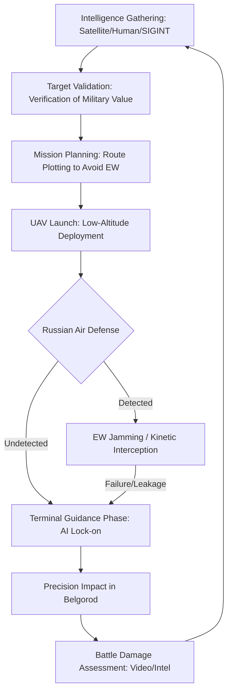

For years, the inhabitants of Belgorod, a regional center in Russia’s borderlands, viewed the conflict in Ukraine as a distant storm—one that occasionally rained shrapnel but remained largely contained within the borders of the neighboring state. However, the sonic landscape of the city has fundamentally shifted. The thunderous roar of heavy artillery and the shrieking descent of cruise missiles have been joined, and in some cases replaced, by a high-pitched, insect-like buzz. This is the sound of the Unmanned Aerial Vehicle (UAV), and it signals a profound evolution in the strategy of the Ukrainian Armed Forces.

Recent reports from [Reuters](https://www.reuters.com) have highlighted the escalating intensity of these incursions, with Russian authorities confirming **six deaths** following a sophisticated drone strike on the city. This event is not an isolated incident or a random failure of defense; it is a calculated component of a broader campaign to bring the visceral reality of the war directly to the Russian populace.

For the first time since the full-scale invasion of 2022, the Russian domestic front is experiencing the psychological and physical toll of aerial bombardment on a consistent basis. Belgorod, once a quiet agricultural hub, has been effectively transformed into a frontline city. This represents a shift toward "asymmetric attrition," where low-cost, high-precision drones are used to negate the traditional advantages of a larger military power. By striking targets within Russian territory, Kyiv is systematically dismantling the Kremlin's narrative that the "special military operation" is a distant endeavor. The message is clear: distance from the front line no longer guarantees safety.

---

## 💥 The Strike That Shook Belgorod: Anatomy of an Attack

  
  
📸 <a href="https://unsplash.com/@kairohweder">Kai Rohweder</a> on <a href="https://unsplash.com/photos/white-and-black-p-printed-road-sign-510t2DpFDd0">Unsplash</a>

The recent strike that resulted in **six deaths** serves as a case study in the vulnerability of modern urban centers to UAV technology. According to [Reuters](https://www.reuters.com), the drones managed to bypass several layers of air defense, striking targets that were centrally located within the city. While Russian state media outlets have labeled these incursions as "terrorist attacks" to galvanize public support and justify further escalation, a strategic analysis reveals a more precise objective.

Ukrainian intelligence has demonstrated an increasing ability to identify high-value targets—such as ammunition depots, command posts, and troop concentrations—that are embedded within civilian infrastructure. The tragedy of the **six deaths** underscores the inherent danger of "dual-use" logistics. When the Russian military utilizes residential areas to hide fuel tankers or shell caches, the risk to civilians becomes an inevitable byproduct of the military's own tactical choices.

> "The democratization of precision strike capabilities means that a small team of operators can now achieve effects previously reserved for the air forces of superpowers. When these drones penetrate the 'safe' rear areas, they don't just destroy hardware; they destroy the illusion of state protection."

From a tactical standpoint, these strikes serve a dual purpose. First, they degrade the material readiness of the Russian forces preparing for offensives in the Kharkiv and Sumy directions. Second, they force the Russian Ministry of Defense into a "defensive dilemma." To protect Belgorod, Russia must relocate its most advanced air defense systems—such as the S-400 Triumf—away from the active front lines in the Donbas. Every missile battery moved back to protect a city is a gap created in the shield protecting Russian ground troops, which Ukraine can then exploit with its own artillery and air assaults.

---

## 📍 The Belgorod Nexus: Why This City is the Epicenter

To understand why Belgorod has become the primary target, one must examine the geography of the region. As detailed in [Wikipedia’s overview of the Belgorod Oblast](https://en.wikipedia.org/wiki/Belgorod_Oblast), the region shares a porous border with Ukraine's Kharkiv and Sumy oblasts. This makes it the indispensable logistics artery for any Russian military operation in northeastern Ukraine.

Belgorod is not merely a city; it is a **strategic nexus**. It houses the railheads, fuel depots, and barracks that feed the Russian war machine. By targeting this hub, Ukraine is effectively attacking the "pipeline" of the invasion. A single drone strike on a fuel depot doesn't just burn diesel; it grounds helicopters and stalls armored columns for days.

**The strategic logic for targeting Belgorod is three-fold:**

*   **Proximity and Penetration:** The short flight distance reduces the time drones are exposed to radar detection and limits the window for Electronic Warfare (EW) systems to lock on and jam the signal.
*   **Infrastructure Density:** The mixing of military assets with civilian housing makes it nearly impossible for Russia to create a "sterile" military zone, ensuring that any successful strike will have a high visibility and high emotional impact.
*   **Psychological Symmetry:** For over two years, Russian forces have systematically targeted the Ukrainian energy grid and residential blocks. By bringing the fight to Belgorod, Kyiv is establishing a "symmetry of suffering," forcing the Russian public to confront the cost of the war in their own currency: blood and rubble.

The **six deaths** reported by Reuters act as a grim milestone in this strategy. It signals that the "red lines" regarding where the war can be fought have been erased.

---

## 🛠️ The Engineering of Attrition: How the Drones Work

The drones raining down on Belgorod are not the prestige weapons of a traditional air force; they are "attrition-grade" tools. These are weapons designed to be cheap, disposable, and effective. Research published in [ArXiv papers on UAV warfare](https://arxiv.org/abs/2303.11325) suggests we are witnessing a paradigm shift where autonomous systems are replacing manned aircraft for tactical strikes.

Ukraine employs a sophisticated, tiered drone ecosystem:

1.  **Long-Range "Kamikaze" UAVs:** These are often composite-winged aircraft capable of traveling hundreds of kilometers. They are used for strategic strikes on oil refineries and airfields, acting as a "poor man's cruise missile."
2.  **FPV (First Person View) Drones:** These are modified racing drones equipped with shaped charges. They are the "snipers" of the sky, capable of flying into a tank's hatch or a bunker's vent with terrifying precision.
3.  **Reconnaissance and Spotter UAVs:** These drones provide the "eyes," using high-resolution thermal imaging to locate targets and coordinate the strike drones in real-time.

The true brilliance of this system is the **cost-exchange ratio**. A drone that costs approximately **$20,000** to produce can destroy a fuel depot worth **millions of dollars** or force the Russian military to expend an interceptor missile costing **$2 million**. This is economic warfare at its most basic: bankrupting the opponent's defense budget by flooding the zone with cheap threats.

As discussed in technical forums like [Hacker News](https://news.ycombinator.com), the frontier of this war is now Artificial Intelligence. Newer generations of drones utilize "terminal guidance," where the drone’s onboard computer uses computer vision to lock onto a target in the final seconds of flight. This removes the need for a constant GPS link or a human pilot, making the drone virtually immune to the electronic jamming that previously neutralized them.

---

## 🛡️ The Shield and the Sword: Russia's Defense Struggle

On paper, Russia possesses one of the most formidable integrated air defense systems (IADS) in the world. The S-300 and S-400 systems are designed to intercept stealth fighters and ballistic missiles. However, they are fundamentally ill-equipped to handle a plastic drone flying at **100 kilometers per hour** and **50 meters** above the ground.

The battle for Belgorod has devolved into a desperate struggle of **Electronic Warfare (EW)**. Russia has deployed massive jamming arrays intended to "blind" drones by spoofing GPS signals or severing the command link between the pilot and the aircraft. Yet, the persistence of these strikes proves that Ukrainian innovation is outpacing Russian bureaucracy.

**The Russian defense struggle is characterized by three critical failures:**

*   **The Radar Gap:** Low-flying drones blend into the "ground clutter"—the noise created by trees, buildings, and hills. By the time a drone is detected on radar, it is often already within the city limits.
*   **Saturation Tactics:** Ukraine employs "swarm" logic. By launching **dozens of drones** simultaneously, they overwhelm the processing capacity of the air defense operators. Even a **90% interception rate** means 10% of the drones still hit their targets.
*   **Resource Fragmentation:** The Russian military is forced to spread its defenses thin. Protecting every border town from drone strikes requires an impossible amount of manpower and equipment, leaving other areas critically exposed.

Despite the evacuation of border residents and the deployment of handheld "anti-drone guns," the **six deaths** reported by Reuters demonstrate that the shield is leaking. The psychological state of the residents of Belgorod is one of permanent anxiety, knowing that a drone could appear over their rooftop at any moment.

---

## 🧠 The Psychology of the Home Front: Breaking the Narrative

While the physical damage of a drone strike is significant, the psychological damage is the primary objective. For the average Russian citizen, the war was a curated experience—a series of sanitized reports on state television. The drones in Belgorod have shattered that curation.

When a drone strikes a building in a Russian city, the conflict ceases to be a "special operation" and is recognized for what it is: a total war. This creates a profound sense of vulnerability. The **six deaths** are not just statistics; they are evidence that the Russian state is unable to fulfill the most basic social contract: the provision of security for its citizens.

> "The goal of deep strikes is not the total destruction of the enemy's army, but the destruction of the state's promise of safety. When the home front becomes a front line, the political cost of the war becomes an internal liability for the leadership."

This psychological erosion is accelerated by the "Telegram War." Footage of burning warehouses and shattered apartments in Belgorod bypasses state censors and reaches millions of smartphones instantly. This creates a state of "cognitive dissonance," where the official narrative of victory clashes with the visual reality of defeat in their own backyard.

---

## 🌏 Shifting Red Lines: The Global Strategic Precedent

The Belgorod campaign is a masterclass in the gradual shifting of "red lines." In the early stages of the conflict, Western allies were hesitant to provide Ukraine with long-range weapons, fearing that strikes deep inside Russia would trigger a nuclear response or a direct NATO-Russia clash.

However, by developing indigenous, home-made drones, Ukraine found a loophole. Because these weapons are produced domestically, they allow for a "salami-slicing" escalation—small, incremental increases in the depth of strikes that normalize the idea of hitting Russian soil without triggering a catastrophic global response.

**This shift has three major global implications:**

1.  **The Death of Strategic Depth:** The traditional military concept of "strategic depth"—the idea that a country is safe if its industrial and political centers are far from the border—is obsolete. Cheap drones have effectively shrunk the world.
2.  **The AI Arms Race:** The use of autonomous terminal guidance in Belgorod is accelerating the global race toward "Lethal Autonomous Weapons Systems" (LAWS). We are moving toward a world where machines make the decision to kill without human intervention.
3.  **Quantity as a Quality of Its Own:** The conflict proves that a swarm of cheap, "good enough" weapons can defeat a few "perfect" and expensive systems. This will fundamentally change how nations invest in defense procurement.

The smoke rising over Belgorod is a signal to the world that the rules of engagement have changed. The strike that killed **six people** is a harbinger of a new era of warfare where there is no longer a distinction between the "combat zone" and the "home front."

---

## 📉 The Drone Attack Lifecycle: From Intelligence to Impact

To visualize the complexity of these operations, the following diagram illustrates the lifecycle of a typical drone strike on a target in Belgorod.

---

## ⚖️ Ethical and Legal Dimensions of Urban Drone Warfare

The escalation of strikes in Belgorod brings to the forefront the complex legalities of International Humanitarian Law (IHL). Under the Geneva Conventions, the principle of **distinction** requires combatants to distinguish between military objectives and civilian objects.

The Russian military’s decision to integrate logistics hubs into urban centers is a violation of the spirit, if not the letter, of these laws, as it puts civilians at risk (often referred to as "human shielding"). Conversely, the use of autonomous drones raises questions about **accountability**. If an AI-guided drone misidentifies a civilian bus as a military convoy, who is responsible? The programmer? The commander? The machine?

As these strikes continue, the international community must grapple with the reality that the "battlefield" has expanded to include every city within drone range. The **six deaths** in Belgorod are a reminder that in modern asymmetric war, the boundary between soldier and civilian is increasingly blurred.

---

## 🏁 Conclusion: The Permanent Front Line

The [Reuters](https://www.reuters.com) report regarding the **six deaths** in Belgorod is more than a news snippet; it is a symptom of a fundamental shift in the nature of modern conflict. The numbers may be small when compared to the catastrophic losses in cities like Bakhmut or Avdiivka, but the symbolic and strategic weight is immense.

Belgorod has become a laboratory for the future of war. It is where the world is learning that high-tech air defenses can be defeated by plastic and plywood, and where the psychological armor of a superpower can be pierced by a swarm of buzzing drones.

As Ukraine continues to refine its UAV capabilities and Russia struggles to adapt its rigid, top-down military structure, Belgorod will remain a flashpoint. These strikes are not mere raids; they are a persistent reminder that the cost of aggression is eventually paid at home. As long as the war continues, the sound of drones will haunt the Russian borderlands, and the "red lines" will continue to recede further inland until the political and human cost becomes unsustainable for the Kremlin.

---

## 📚 References

*   **Reuters:** [News Reports on Belgorod Drone Attacks and Casualty Figures](https://www.reuters.com)
*   **Wikipedia:** [Geography, Logistics, and History of the Belgorod Oblast](https://en.wikipedia.org/wiki/Belgorod_Oblast)
*   **ArXiv:** [Technical Research on UAV Dynamics and Asymmetric Air Warfare](https://arxiv.org/abs/2303.11325)
*   **Hacker News:** [Community Analysis of Terminal Guidance and AI in Drone Tech](https://news.ycombinator.com)
*   **Institute for the Study of War (ISW):** [Daily Assessments of Russian-Ukrainian Border Dynamics](https://www.understandingwar.org)
*   **Wikipedia:** [General Overview of the Russian Invasion of Ukraine](https://en.wikipedia.org/wiki/Russian_invasion_of_Ukraine)
*   **BBC News:** [Reports on the Humanitarian Impact of Border Strikes](https://www.bbc.com)
*   **Wikipedia:** [Principles and Applications of Electronic Warfare](https://en.wikipedia.org/wiki/Electronic_warfare)
*   **Al Jazeera:** [Analysis of the Psychological War on the Russian Home Front](https://www.aljazeera.com)
*   **The Guardian:** [Investigation into the Supply Lines of the Russian Army in Belgorod](https://www.theguardian.com)