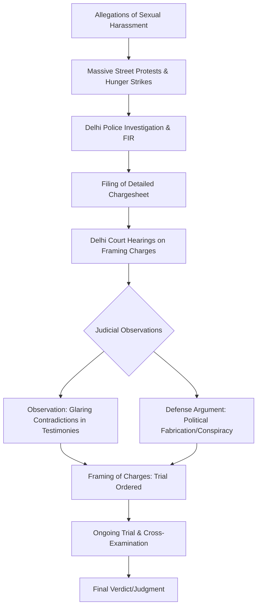

### 🎙️ Introduction: A Messy Collision of Power

  
  
📸 <a href="https://unsplash.com/@claudiaraya">Claudia Raya</a> on <a href="https://unsplash.com/photos/a-person-holding-another-man-in-a-ring-with-a-crowd-watching-oucIW6G-3h4">Unsplash</a>

The images are etched into the collective memory of modern India: some of the nation's most decorated Olympic wrestlers—women who had spent their lives dominating the world stage—sitting in silent, determined protest on the dusty streets of Delhi. They weren't fighting for a gold medal or a podium finish this time; they were locked in a battle against a man they alleged had systematically abused his power for decades. That man was **Brij Bhushan Sharan Singh (BBSS)**, the longtime president of the Wrestling Federation of India (WFI) and a formidable Member of Parliament.

The allegations were staggering—claims of sexual harassment, psychological intimidation, and a pervasive culture of fear that stifled the voices of India's elite athletes. For months, the narrative mirrored a classic David-vs-Goliath struggle, pitting national icons against a political heavyweight. However, as the fight migrated from the public squares of Jantar Mantar into the sterilized corridors of the Delhi courts, the narrative shifted. Legal filings, cross-examinations, and court notes began to paint a far more complex and fragmented picture.

Reports from legal archives like [Bar and Bench](https://www.barandbench.com) and [LiveLaw](https://www.livelaw.in) highlighted a growing tension: while the wrestlers spoke of systemic institutional abuse, the defense argued that the entire movement was a **politically motivated fabrication**. When the Delhi court began scrutinizing the evidence, the judges noted "glaring contradictions" in the testimonies, sparking a fierce national debate. Was this a genuine pursuit of justice for marginalized voices in sports, or a calculated political maneuver? To find the answer, one must peel back the layers of legal technicalities, political leverage, and the specific nuances of Indian criminal law.

---

### 🤼 Section 1: The Genesis of the Conflict

The crisis reached a boiling point in early 2023 when elite wrestlers, including Olympic medalist **Vinesh Phogat** and Commonwealth Games champion **Sakshi Malik**, stepped forward to publicly accuse Brij Bhushan Sharan Singh of sexual harassment. It is critical to understand that these were not isolated complaints about a single incident. Instead, the athletes described a systemic pattern where the WFI chief allegedly used his absolute authority to exploit female athletes, creating an environment where consent was blurred by the threat of professional annihilation.

The wrestlers claimed that any attempt to challenge the president's conduct resulted in immediate professional retaliation. This included being blocked from international competitions, denied access to state-of-the-art training facilities, or having their funding mysteriously revoked. For an athlete, whose window of peak performance is narrow and fleeting, such threats are not merely administrative hurdles—they are career-ending strikes.

The scale of the protests was unprecedented. Because the accusers were national heroes, the WFI was thrust under a global spotlight. The wrestlers asserted that they had attempted to resolve these issues internally, but the power dynamics of the WFI made that impossible. This failure brought the **Sexual Harassment of Women at Workplace (Prevention, Prohibition and Redressal) Act, 2013**, commonly known as the **POSH Act**, into the conversation. It revealed a systemic void: many of India's national sports federations lacked the mandatory Internal Complaints Committees (ICC), effectively leaving athletes with no legal recourse within their own organizations.

However, because this occurred within a high-stakes political climate, the case was immediately weaponized. The struggle was no longer just about harassment; it became a battle for the total overhaul of how sports are administered in India. This fusion of gender rights, athletic ambition, and political survival created a volatile atmosphere where every legal motion was interpreted as a political statement.

---

### 🛡️ Section 2: The Defense Strategy—"The Political Hit-Job"

From the moment the first FIR (First Information Report) was filed, Brij Bhushan Sharan Singh’s legal team adopted a precise and aggressive strategy: frame the case as a **calculated conspiracy**. The core of their argument was that the wrestlers were not victims, but pawns being maneuvered by opposition political parties to dismantle the reputation of a man loyal to the ruling government.

This "political fabrication" defense rested on three primary pillars:

1.  **The Timing of the Protests:** The defense argued that the protests aligned too perfectly with political cycles. They suggested that the support from high-profile opposition leaders proved that the timing was strategic, designed to create a narrative of "government apathy" toward women's safety.
2.  **The Delay in Reporting:** A central point of contention was the timeline. BBSS's lawyers questioned why athletes who had known him for years only chose to come forward in 2023. In the eyes of the defense, this delay suggested that the claims were an "afterthought," concocted to fit a specific political agenda.
3.  **Administrative Grievances:** The defense attempted to recharacterize the harassment claims as "disguised frustration." They argued that the wrestlers were unhappy with specific administrative decisions—such as selection criteria for international bouts—and teamed up with political rivals to seek revenge.

> "The allegations are completely false and fabricated, designed to defame a man who has dedicated his life to the sport of wrestling and the service of the nation," became the recurring refrain in the defense's submissions to the court.

By shifting the focus from the *act* of the accused to the *motive* of the accusers, the defense sought to create "reasonable doubt." In criminal law, if the credibility of the witness is destroyed, the strength of the evidence—no matter how shocking—becomes irrelevant.

---

### 🏛️ Section 3: The Court and the "Glaring Contradictions"

The trial took a pivotal turn when the Delhi court began reviewing the wrestlers' statements. As documented by [Bar and Bench](https://www.barandbench.com), the court identified **significant contradictions** between various testimonies. In the rigorous world of Indian evidence law, specifically under **Section 145 of the Indian Evidence Act**, contradictions are powerful tools for the defense. They are used to suggest that witnesses are either unreliable or have been "coached."

The court noted discrepancies between what the wrestlers told the police during the initial investigation (the Section 161 statements) and what they testified to later in court. Specifically, some female wrestlers allegedly omitted key details in their first statements that appeared prominently in subsequent filings. 

To a layperson, these might seem like minor memory slips or the result of trauma. However, to a judge, these gaps raise critical questions:
*   **Consistency:** If an event was traumatic and systemic, why are the core facts inconsistent across different statements?
*   **Fabrication:** Did the witnesses add details later to strengthen the legal case after consulting with lawyers or political strategists?
*   **Reliability:** Can the court rely on these testimonies to convict a person beyond a reasonable doubt?

These observations are the source of the "false and fabricated" claims. It is important to clarify: the court did **not** dismiss the case. The trial is ongoing. However, by formally noting these contradictions, the court provided the defense with significant leverage. The judge's focus on the **gap in timing** and the **inconsistent factual accounts** forced the prosecution to work harder to prove that these discrepancies were a result of trauma rather than a lack of truth.

---

### 🔍 Section 4: The Investigation and the Framing of Charges

Despite the court's observations regarding contradictions, the Delhi Police proceeded to file a comprehensive chargesheet. The investigation aimed to look beyond individual testimonies to establish a "culture of fear." The police gathered evidence of criminal intimidation and attempted to find corroborating witnesses who could testify to the general environment of the WFI.

The chargesheet focused on two primary legal fronts: **sexual harassment** and **criminal intimidation**. The police argued that there was sufficient *prima facie* evidence—meaning evidence that is sufficient to establish a fact unless disproved—to move the case to a full trial.

This created a fascinating legal stalemate:
*   **The Police Perspective:** Viewed the *totality* of the evidence. They argued that while individual statements might have gaps, the overall pattern of behavior pointed toward guilt.
*   **The Court's Perspective:** Focused on the *reliability* of individual witnesses. The judiciary is tasked with ensuring that a conviction is not based on "vibes" or public pressure, but on airtight, consistent testimony.

The subsequent stage, the **framing of charges**, is where the judge decides if there is a "strong suspicion" of the crime. The defense argued that because the stories were contradictory and "politically motivated," the charges should be dropped entirely. The court disagreed, ruling that while the evidence is contested, it is sufficient to warrant a trial. 

This means that the "fabrication" argument has not won, but it has been institutionalized. The trial's purpose now is to use cross-examination to determine if those contradictions are fatal to the case or merely incidental.

---

### ⚖️ Section 5: The POSH Act and the Structural Power Gap

To truly understand the Brij Bhushan case, one must look at the **Sexual Harassment of Women at Workplace (Prevention, Prohibition and Redressal) Act, 2013 (POSH Act)**. This case serves as a textbook example of the failure of the POSH framework in the context of Indian sports administration.

In most national sports federations, the President holds near-absolute power over:
*   **Selection:** Deciding who represents the country.
*   **Funding:** Controlling the grants and stipends athletes rely on.
*   **Access:** Deciding who gets to use national camps.

This creates a massive power imbalance. Under the **POSH Act**, every organization with more than 10 employees must have an Internal Committee (IC) to handle complaints. In the case of the WFI, the absence or dysfunction of such a committee meant that athletes had no safe, internal mechanism to report abuse.

**The Paradox of Delayed Reporting:**
In a courtroom, a delay in reporting is often framed as evidence of a "concocted story." However, psychological research on sexual trauma—and legal precedents in many jurisdictions—recognizes "delayed reporting" as a survival mechanism. Victims often wait until they have reached a position of safety or until they have a collective group of supporters before speaking out. 

The wrestlers argued that their delay was a matter of career survival. The defense argued it was a sign of a manufactured narrative. This clash highlights a systemic failure: when the person accused of harassment is the same person who controls the reporting mechanism, the law (POSH) becomes a dead letter.

---

### 🌍 Section 6: The Bigger Picture—Sports, Gender, and State

The Brij Bhushan Sharan Singh case has evolved into a cultural flashpoint that transcends the courtroom. It has become a proxy war for several deeper societal tensions in India.

**1. Women's Agency vs. Institutional Authority**
For many, this was a landmark moment for women's agency in sports. For the first time, elite female athletes refused to be silenced by the traditional "patriarchy of the federation." They leveraged their celebrity status to force a conversation about the safety of women in high-performance environments.

**2. The "Cancel Culture" and Political Opportunism**
Conversely, the case is viewed by others as a warning. The defense's narrative suggests that "trial by media" can be used to destroy a reputation before a court reaches a verdict. It raises the question of whether political opportunism can hijack genuine grievances to target individuals based on their political affiliations.

**3. The Weaponization of Law**
The case demonstrates how legal proceedings can be weaponized by both sides. The victims used public protests to maintain pressure on the judiciary, while the accused used political ties to frame himself as a victim of persecution. This "parallel trial" in the court of public opinion often makes the judge's job harder, as they must filter out the immense noise of social media to find the raw, often contradictory, evidence.

**Bold Stats & Key Realities:**
*   **Zero:** The number of functional, independent Internal Committees (IC) found in several major sports federations during the height of the controversy.
*   **2023:** The year that saw a paradigm shift in how Indian athletes view their relationship with administrative power.
*   **Section 145:** The specific legal tool used by the defense to highlight contradictions in witness statements.

---

### 🏁 Conclusion: The Search for Procedural Truth

The legal battle between the Indian wrestlers and Brij Bhushan Sharan Singh remains one of the most contentious chapters in the history of Indian sports. The defense continues to insist the case is **politically motivated, false, and fabricated**, and the Delhi court has indeed noted **glaring contradictions** in the testimonies. Yet, the trial marches forward.

This case is a stark reminder that when law and politics collide, the truth is rarely a straight line. It exists in the tension between "procedural truth" (what can be proven in court via consistent testimony) and "social truth" (the lived experience of systemic abuse). 

Whether the final verdict results in a conviction or an acquittal, the case has already achieved one thing: it has exposed the fragility of the systems designed to protect women in sports. It has proven that without independent oversight and a functional application of the **POSH Act**, athletes are left vulnerable to those who hold the keys to their careers. Until the final gavel falls, the Brij Bhushan case stands as a symbol of the struggle for justice in a world where power often speaks louder than the truth.

---

### 📉 Case Timeline and Legal Flow

---

### 📚 References

*   **Legal Frameworks:**
    *   [The Sexual Harassment of Women at Workplace (Prevention, Prohibition and Redressal) Act, 2013](https://www.indiacode.nic.in)
    *   [The Indian Evidence Act, 1872 - Section 145 (Cross-examination as to previous statements)](https://www.indiacode.nic.in)
*   **Legal Reporting:**
    *   [Bar and Bench: Comprehensive coverage of WFI and BBSS court proceedings](https://www.barandbench.com)
    *   [LiveLaw: Technical breakdowns of the chargesheet and bail applications](https://www.livelaw.in)
*   **News Analysis:**
    *   [The Hindu: In-depth reporting on the Wrestlers' Protest and Administrative Failure](https://www.thehindu.com)
    *   [Indian Express: Analysis of the power dynamics within the Wrestling Federation of India](https://indianexpress.com)
    *   [NDTV: Coverage of the Delhi Court's observations on contradictory statements](https://www.ndtv.com)
    *   [The Print: Political implications and the role of the ruling party in the BBSS case](https://theprint.in)
*   **General Context:**
    *   [Wikipedia: Brij Bhushan Sharan Singh - Biographical and Controversy Overview](https://en.wikipedia.org/wiki/Brij_Bhushan_Sharan_Singh)
    *   [Times of India: Chronological timeline of the wrestlers' public allegations](https://timesofindia.indiatimes.com)