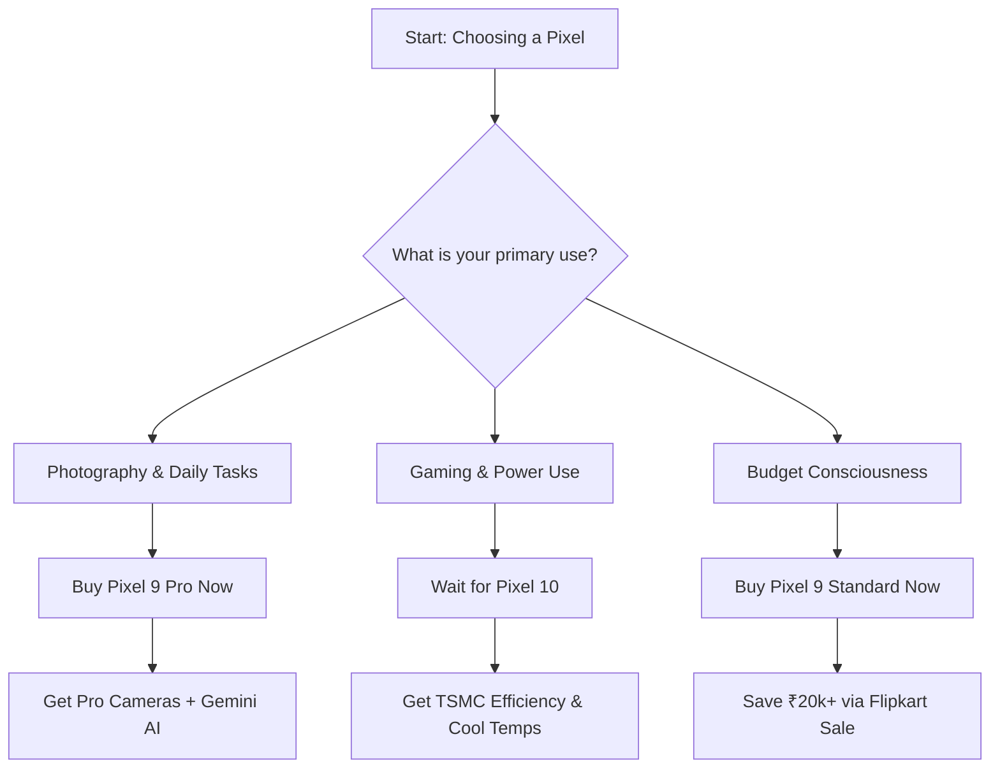

Timing is everything when investing in a new flagship smartphone. For the savvy consumer, there is usually a "sweet spot"—that precise window where the current model is fully polished, the Day One software bugs have been patched, and the price begins to dip aggressively just as the industry starts whispering about the next generation. 

Right now, we have entered that window for the Google Pixel 9 series.

If you browse [Flipkart](https://www.flipkart.com), you'll notice the Pixel 9, 9 Pro, and 9 Pro XL are undergoing significant price corrections. While tech enthusiasts are already speculating about the Pixel 11's capabilities, the immediate dilemma for most is simpler: do you secure a Pixel 9 today while it's heavily discounted, or do you gamble on the promises of the Pixel 10?

For years, the Pixel line has been lauded as the "smartest" phone on the market, though it has occasionally struggled with thermal management and modem stability. With Flipkart slashing prices, you're looking at **immediate savings of ₹15,000 to ₹25,000**. However, the Pixel 10 is rumored to be the most significant architectural shift in the history of the product line.

Let's dissect the current deals, the actual utility of the Pixel 9, and the technical reasons why the Pixel 10 is causing such a stir in the enthusiast community.

---

## 💰 The Flipkart Price Drop: Market Analysis

  
  
📸 <a href="https://unsplash.com/@amanz">Amanz</a> on <a href="https://unsplash.com/photos/a-person-holding-a-cell-phone-in-their-hand-MuGEpHK8S4k">Unsplash</a>

The current price volatility on Flipkart isn't an accident; it's a strategic inventory clear-out. In the competitive Indian premium segment, Google is fighting a two-front war against the entrenched loyalty of Apple and the aggressive feature-packing of Samsung's S-series.

Currently, the Pixel 9 is hitting price points that place it in direct competition with "flagship killers" from the previous year. For users with specific banking partnerships—primarily **HDFC and SBI**—bank discounts can shave an additional **₹5,000 to ₹10,000** off the price. Furthermore, exchange bonuses for older Pixel or Samsung devices are currently at a peak, often offering **over-valuation for trade-ins** to lure users into the Google ecosystem.

> "The value proposition of the Pixel 9 has shifted fundamentally. It is no longer positioned as a luxury tool for the 'AI early adopter,' but as a high-value proposition for the consumer who wants a world-class camera without paying the inflated 'Day One' premium."

The economics are straightforward: by purchasing during these sales, you bypass the steep depreciation that typically hits Pixels in the first six months. With the **Pixel 9 starting at roughly 20-30% less** than its launch MSRP, it represents the lowest barrier to entry for Google's premium AI experience. However, in the electronics cycle, a steep price drop is almost always a harbinger of upcoming hardware.

---

## 🧠 Pixel 9: The AI Powerhouse Available Today

Despite the noise surrounding the Pixel 10, the Pixel 9 remains a formidable device. Its core strength isn't raw horsepower—it's the integration of **Gemini Nano**, Google's most efficient on-device AI model.

Unlike AI features that rely on the cloud (which can be slow and privacy-invasive), much of the Pixel 9's intelligence happens locally on the device. This allows for near-instantaneous processing of texts, summaries, and image manipulations.

### 🛠️ Key AI Features and Utility
*   **Magic Editor:** This isn't just a filter. It uses generative AI to reposition subjects, change the lighting of the sky, or remove distracting background elements with a few taps.
*   **Call Assist:** A lifesaver for those who hate phone calls. It can screen calls, wait on hold for you, and provide real-time transcriptions.
*   **Pixel Screenshots:** A new, powerful tool that uses on-device AI to index your screenshots, making them searchable via natural language (e.g., "What was the gate number for my flight in that screenshot from Tuesday?").

**The Technical Blueprint:**
*   **Display:** The "Super Actua" displays are a highlight, peaking at **2700+ nits**. This ensures that even under the harsh midday sun in Delhi or Mumbai, the screen remains perfectly legible.
*   **Camera Hardware:** The 50MP main sensor continues to lead in color accuracy and dynamic range, often beating the iPhone in still-photography contrast.
*   **Longevity:** Google has committed to **7 years of OS and security updates**. A Pixel 9 purchased in 2024 is technically supported until **2031**, which drastically changes the "wait or buy" math.

For the average user, the Pixel 9 delivers **95% of the flagship experience**. The 120Hz LTPO screen is buttery smooth, and the software is the cleanest version of Android available.

---

## 📸 The Pro Models: Why They Are the True Value Play

If you are browsing the Flipkart sale, the **Pixel 9 Pro and 9 Pro XL** are where the real magic happens. One of Google's most strategic moves this year was offering the "Pro" internals in two different sizes. You no longer have to settle for a massive "XL" brick to get the professional camera system.

The Pro series is less of a phone and more of a pocket-sized production studio. The **triple-lens array** (Wide, Ultra-wide, and Periscope Telephoto) provides a versatility that the standard Pixel 9 lacks. 

### 🚀 Pro-Exclusive Capabilities
1.  **Video Boost:** By uploading video to the cloud for processing, Google can normalize lighting and dynamic range to a level that rivals professional mirrorless cameras.
2.  **AI Zoom Enhance:** This feature uses generative AI to "fill in the gaps" when zooming into a photo, sharpening details that the lens couldn't physically capture.
3.  **Pro Controls:** For those who know their way around ISO and shutter speed, the Pro models offer manual controls that allow for artistic photography beyond the "point-and-shoot" AI.

On Flipkart, the Pro models frequently see the most aggressive exchange offers. If you are trading in a Pixel 7 Pro or a Samsung S22 Ultra, the effective cost of upgrading to a 9 Pro can be surprisingly low, making the wait for the Pixel 10 feel unnecessary.

---

## ⚡ The Pixel 10 Pivot: The TSMC Revolution

If the Pixel 9 is so good, why is the tech community obsessed with the Pixel 10? The answer lies in the silicon. Since the Pixel 6, Google has relied on **Tensor chips manufactured by Samsung Foundry**. While these chips are excellent for AI, they have suffered from two persistent flaws: **thermal throttling (overheating)** and **modem inefficiency (signal drops)**.

The Pixel 10 is expected to be a total architectural reset. Leaks from supply chain analysts suggest the **Tensor G5 will be Google's first fully custom-designed chip**, manufactured by **TSMC (Taiwan Semiconductor Manufacturing Company)** using a cutting-edge **3nm process** [via Android Authority](https://www.androidauthority.com).

### 🔬 Why TSMC Matters (The Technical Breakdown)
For those not steeped in semiconductor physics, here is why a move to TSMC is a game-changer:

| Feature | Samsung (Tensor G4) | TSMC (Tensor G5 - Expected) | Impact on User |
| :--- | :--- | :--- | :--- |
| **Process Node** | 4nm (Modified) | **3nm (Custom)** | Better transistor density |
| **Power Efficiency** | Moderate | **High** | Longer battery life |
| **Thermal Profile** | Prone to heating | **Cooler operation** | No lag during gaming/4K video |
| **Modem Integration** | Third-party / Integrated | **Fully Optimized** | Stronger 5G signal in weak areas |

**The "Power User" Trap:** If you use your phone for heavy gaming (e.g., *Genshin Impact*, *PUBG*), high-resolution video editing, or if you live in a region with extremely high ambient temperatures, the Pixel 9's Tensor G4 may struggle. In these cases, the jump to the Tensor G5 will be the largest performance leap in the history of the Pixel line. It is the difference between a modified consumer engine and a purpose-built racing engine.

---

## 🔮 Looking Beyond: The Pixel 11 and the AI Agent Era

If the Pixel 10 is the hardware reset, the **Pixel 11** is where Google intends to realize its vision of a "post-app" world. By the time the Pixel 11 arrives, the hardware will likely be perfected, allowing the **AI Agent** to take center stage.

The industry expects the Pixel 11 to feature **true on-device multimodal AI**. This means the phone won't just process text or images, but will understand a live stream of your camera and microphone in real-time, acting as a proactive assistant rather than a reactive tool.

For the long-term strategist, the Pixel 9 serves as an excellent **"bridge device."** It provides the current AI capabilities of Gemini while allowing you to wait for the TSMC hardware to mature. Historically, the first generation of a new chip architecture (Pixel 10) fixes the big bugs, while the second generation (Pixel 11) optimizes the performance.

---

## ⚖️ Decision Matrix: Buy Now or Wait?

The choice depends entirely on your user profile. You cannot make a decision based on specs alone; you must make it based on your daily habits.

### ✅ Grab the Pixel 9 Now if...
*   **You need a phone today:** If your current device is broken or obsolete, the Pixel 9 is a fantastic choice.
*   **You prioritize the camera over gaming:** If your primary "heavy" use is taking photos of your kids, pets, or landscapes, the Tensor G4 is more than enough.
*   **You are a casual Android user:** If your day consists of Instagram, WhatsApp, emails, and light multitasking, you will never notice the difference between the G4 and the G5.
*   **The discount is irresistible:** If you can get a Pixel 9 Pro for **under ₹70,000** through bank offers, the value is too high to ignore.

### ⏳ Wait for the Pixel 10/11 if...
*   **You are a "Power User":** If you edit 4K video on your phone or play competitive mobile games, the thermal efficiency of the TSMC chip is non-negotiable.
*   **Battery anxiety is your main struggle:** A 3nm process typically results in a **15-25% increase in power efficiency**, meaning significantly longer screen-on time.
*   **You want a "Pure" Google Silicon experience:** If you want a device where Google controls every single aspect of the chip design (not just modifications of a Samsung design), the Pixel 10 is your milestone.

---

## 🏁 The Final Verdict

The price crash of the Pixel 9 on Flipkart is a classic market correction. Google has created a software masterpiece, but it is currently housed in "good enough" hardware. 

If you can find a Pixel 9 or 9 Pro at a steep discount—especially when leveraging **bank offers and exchange deals**—it is a logically sound purchase. You are getting a device that will be updated until 2031, featuring the best AI integration currently available in the mobile market.

However, if you are part of the 10% of users who push their hardware to the limit, the Pixel 10 represents Google's "iPhone moment." The shift to TSMC is the missing piece of the puzzle that will finally align Pixel hardware with Pixel software.

**Bottom Line:** If the total discount (Sale + Bank + Exchange) exceeds **20% of the MSRP**, **BUY the Pixel 9**. If you are currently using a functional phone and value peak efficiency and thermal performance, **WAIT for the Pixel 10**.

---

## 📚 References & Further Reading

For those who want to dive deeper into the technical benchmarks and leak reports, we recommend the following sources:

*   **Hardware Analysis:** [Android Authority: The shift to TSMC Tensor G5](https://www.androidauthority.com) - Detailed breakdown of the 3nm process.
*   **Shopping:** [Flipkart India: Google Pixel Store](https://www.flipkart.com) - Current pricing and exchange calculators.
*   **Official Specs:** [Google Store: Pixel 9 Pro Technical Specifications](https://store.google.com) - Verified data on nits and sensor sizes.
*   **Community Insights:** [Hacker News: Discussion on ARM vs TSMC Efficiency](https://news.ycombinator.com) - Deep dives into semiconductor logic.
*   **Software Deep Dive:** [9to5Google: Gemini Nano and On-Device AI](https://9to5google.com) - How Google is implementing multimodal AI.
*   **Review Comparisons:** [The Verge: Pixel 9 Pro vs iPhone 16 Pro](https://www.theverge.com) - Side-by-side camera and battery tests.
*   **Camera Benchmarks:** [DXOMARK: Google Pixel Camera Rankings](https://www.dxomark.com) - Quantitative analysis of image quality.
*   **Technical Specs:** [GSM Arena: Pixel 9 Series Comparison](https://www.gsmarena.com) - Comprehensive hardware table.