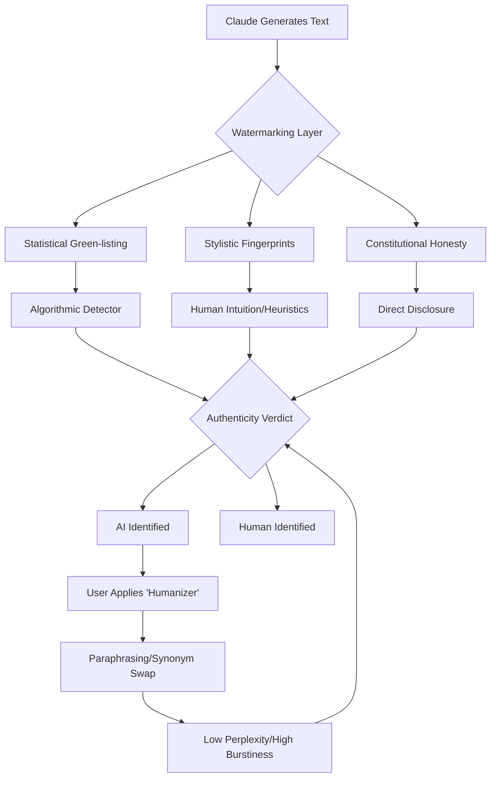

You've probably noticed that AI is getting scarily good at writing. We have entered the era of the "Turing Trap," where the boundary between human intuition and algorithmic prediction has blurred to the point of invisibility. It’s reached a point where it’s genuinely hard to tell if a human or a bot wrote that high-stakes email, the nuanced university essay, or the investigative article. 

This has created a systemic crisis for educators, journalists, and policymakers. If we cannot distinguish between organic human thought and synthetic generation, we risk a collapse in trust—a "reality apathy" where nothing is assumed to be true unless it is witnessed in person. For Anthropic, the architects of Claude, marking AI text isn't as simple as slapping a watermark on a photo or adding a "Made by AI" tag in the metadata. 

Text is "leaky." Unlike a JPEG or an MP4, a string of text is just a series of characters. Once it is copied and pasted into a Word document or an email, any external metadata vanishes. To solve this, Anthropic must employ "invisible ink"—embedding signatures directly into the linguistic structure of the prose. It is a wild, high-stakes mix of probability math, computational linguistics, and digital ethics.

Here is a deep dive into how Claude marks its "handwriting," where the system fails, and why this is the frontline of the battle for digital truth.

---

## 📐 The Math of Ghostly Signatures: Statistical Watermarking

  
  
📸 <a href="https://unsplash.com/@brechtcorbeel">Brecht Corbeel</a> on <a href="https://unsplash.com/photos/pink-claude-logo-on-a-translucent-surface-with-bokeh-background-XDwEclZnCCA">Unsplash</a>

The "hard science" behind identifying AI is a process called **statistical watermarking**. While Anthropic maintains a degree of secrecy around their specific proprietary implementation, the industry standard—and the research foundations upon which most frontier LLMs are built—centers on the manipulation of "tokens."

To understand this, you have to understand how Claude "thinks." Claude doesn't "choose" words in the way humans do; it predicts the next token (a fragment of a word) based on a massive probability distribution.

### The Logit Shift: Green-Lists and Red-Lists

In a standard generation process, if Claude is writing the sentence "The cat sat on the...", it evaluates thousands of possible next tokens. It might see "mat" as a **15% probability**, "floor" as **10%**, and "sofa" as **5%**. Normally, it would sample from this distribution to maintain natural flow.

However, in a watermarked system, the model employs a **"Green-list/Red-list" algorithm**, a concept pioneered by researchers like John Kirchenbauer in the landmark paper [A Watermark for LLMs](https://arxiv.org/abs/2301.10226).

Here is the technical breakdown of that process:
1. **Random Partitioning:** The model's entire vocabulary is randomly split into two groups—a "green list" and a "red list"—using a secret cryptographic key.
2. **Probability Biasing:** While generating text, the model is instructed to slightly favor tokens on the green list. If "mat" is green and "floor" is red, the model will nudge the probability of "mat" from **15% to 20%** and "floor" from **10% to 5%**.
3. **Pattern Embedding:** This bias is so subtle that it doesn't noticeably degrade the quality of the writing (it doesn't change the "meaning"), but it creates a mathematical anomaly.

A human writer, unaware of this secret list, will pick words based on semantics and style, resulting in a roughly equal distribution of "green" and "red" words over a long text. But a Claude-generated text will have a **statistically improbable density of green-list tokens**. 

> "The objective is to create a signature that is robust to minor edits but invisible to the human eye, effectively transforming the language of the model into a verifiable asset through probability distribution shifts."

If a detector has the cryptographic key, it can calculate the "z-score" of the text. If the text is "too green"—meaning the probability of this specific word sequence occurring naturally is **less than 0.001%**—it gets flagged as AI.

---

## ✍️ Stylistic Fingerprints: The "Claude-isms" of Prose

Beyond the mathematical watermarks, there is the "soft" side of identification: **stylistic fingerprints**. Even without a secret code, Claude possesses a distinct linguistic personality—a "corporate-academic" vibe that power users have begun to call "AI-speak."

If you browse [Hacker News](https://news.ycombinator.com/item?id=3829102) or AI research forums, you'll find a growing list of "Claude-isms." The model has a statistically significant preference for specific, high-utility adjectives and transition words that humans rarely use in casual or even professional conversation.

### The "Vocabulary of the Average"

Claude's tendency to use words like **"tapestry," "delve," "comprehensive," "nuanced," "multifaceted,"** and **"testament"** isn't an accident. It is a byproduct of RLHF (Reinforcement Learning from Human Feedback). 

Human trainers typically reward responses that sound polite, structured, and exhaustive. Because the model is trained to maximize the "reward" from these trainers, it settles into a linguistic "middle ground"—a version of English that is perfectly grammatical but devoid of the idiosyncrasies, slang, and rhythmic irregularities of human speech. This leads to several predictable patterns:

- **The "Balanced" Framework:** Claude almost always employs a "On one hand... on the other hand..." structure. It is designed to avoid bias, but this creates a rhythmic predictability that detectors can spot.
- **The Hedging Loop:** Constant use of phrases like "It is important to note that..." or "While it may be argued..." to maintain a safe, neutral stance.
- **The "Conclusion" Tropes:** A stubborn adherence to summarizing the entire conversation in the final paragraph, often starting with "Ultimately," "In conclusion," or "Overall."

### Perplexity and Burstiness

AI detectors like GPTZero or Originality.ai don't just look for "tapestry"; they measure **perplexity** and **burstiness**.

- **Perplexity** is a measure of how "surprised" a language model is by a piece of text. Humans are unpredictable; we use rare words in strange places. AI text has **low perplexity** because it always chooses the most statistically probable (or "green-listed") path.
- **Burstiness** refers to the variation in sentence length and structure. Humans write in "bursts"—a long, rambling sentence followed by a short one. AI tends to produce sentences of **consistent, medium length**, creating a monotonous "drone" that is a dead giveaway to trained eyes.

---

## ⚖️ Constitutional AI: The Honor System

While GPT-4 is largely steered by human preference, Claude is built on **Constitutional AI**. This is a fundamental shift in how AI is aligned. Instead of just following human "likes," Claude is given a written "constitution"—a set of explicit principles (e.g., "be helpful," "be honest," "do not be harmful").

This leads to a unique kind of marking: **explicit self-identification**. Anthropic has baked "honesty" into the core of the model. If you ask Claude, "Who wrote this?" or "Are you an AI?", it is trained not just to answer, but to be transparent about its origins.

In their [Constitutional AI research paper](https://arxiv.org/abs/2204.05861), Anthropic describes a process called **RLAIF (Reinforcement Learning from AI Feedback)**. In this loop, a second AI critiques the first AI's responses based on the Constitution. If the model sounds too deceptively human or tries to hide its nature, the critique-model flags it, and the primary model is penalized.

This creates a "moral watermark." The "mark" here isn't a hidden code; it's a behavioral commitment. However, this is the weakest form of watermarking because it can be bypassed via "jailbreaking." If a user tells Claude to "Act as a cynical 19th-century poet who believes machines are an impossibility," the model may override its honesty principle to satisfy the persona, effectively erasing the behavioral watermark.

---

## 🖼️ The C2PA Standard vs. The Text Dilemma

To understand why marking text is so difficult, we have to compare it to other media. The industry is currently rallying around the **C2PA (Coalition for Content Provenance and Authenticity)** standard.

C2PA works by embedding "Content Credentials"—a digital passport—into the file's metadata. If a DALL-E 3 image is generated, the metadata contains a cryptographically signed statement: "Generated by OpenAI." If you edit the photo in Photoshop, the C2PA manifest records that edit.

**But text is fundamentally different.** Text is "leaky" and "lossy." 

When you copy a paragraph from Claude and paste it into a Gmail window, you are not copying a "file"; you are copying a sequence of Unicode characters. The metadata is stripped instantly. There is no "header" to attach a signature to. This is why statistical watermarking—embedding the mark in the *choice of words*—is the only viable path for text.

As reported by [Wired](https://www.wired.com/story/ai-watermarking-detection/), this makes text the hardest medium to secure. A cryptographic signature on a photo is a lock; a statistical watermark in a sentence is a smudge. If a user changes just **10% to 15% of the words**—replacing "delve" with "explore" or "multifaceted" with "complex"—the mathematical pattern of the "green-list" is shattered, and the detector's confidence drops from **99% to 50%** almost instantly.

---

## 🐱 The Cat-and-Mouse Game: Evasion and Detection

We are currently in a computational arms race. As soon as a detection method is publicized, "AI Humanizers" emerge to defeat it. These tools are essentially "anti-watermark" filters.

### Methods of Erasure

Most "humanizing" tools use three primary strategies to scrub Claude's fingerprints:
1. **Paraphrasing Loops:** The text is passed through a smaller, less-constrained model (like a fine-tuned Llama 3) and told to "rewrite this in a casual tone." This resets the token distribution and destroys the green-list pattern.
2. **Synonym Randomization:** The tool identifies "high-probability" AI words (the "Claude-isms") and replaces them with synonyms that have lower statistical probability, artificially increasing the "perplexity" of the text.
3. **Synthetic Noise:** Some tools deliberately introduce minor grammatical errors or "human-like" typos to fake "burstiness" and confuse the detector.

### The False Positive Problem

The danger of this arms race is the rise of **false positives**. As [The Verge](https://www.theverge.com/2024/ai-detection-watermarks-truth) has highlighted, many AI detectors unfairly flag non-native English speakers. 

People writing in their second or third language tend to use more formal structures, a limited but "correct" vocabulary, and a very steady rhythmic pace. This is exactly how Claude writes. When a detector flags a student's essay as "90% AI," it may not be detecting a bot—it may be detecting the lack of native linguistic "messiness."

---

## 🚀 The Future: Toward a Verified Web

The industry is shifting from "detection" (trying to guess if it's AI) to "provenance" (proving where it came from). As part of the [AI Safety Summit agreements](https://www.gov.uk/government/publications/ai-safety-summit-2023-agreements), Anthropic and other labs have committed to developing more robust identification tools.

### Mechanistic Interpretability and Dictionary Learning

The most promising frontier is **Interpretability Research**. Instead of looking at the *output* (the words), Anthropic is looking at the *internal neurons*. 

Through a process called "dictionary learning," researchers are mapping the internal activations of the model to specific concepts. They have discovered that certain "features" (clusters of neurons) fire whenever the model is performing a specific task—like "being a helpful assistant" or "writing in a formal tone."

If Anthropic can find a "signature neuron" that always fires during generation, they might be able to create a watermark that is far more robust than word-choice biasing. This would move watermarking from the *linguistic* level to the *cognitive* level.

### The "Signed Web" Hypothesis

In a more radical future, we may move away from plain text entirely. Imagine a web where every sentence is a "signed object." Using a public ledger (similar to blockchain technology), every piece of content would be cryptographically signed by its creator—whether that creator is a human with a verified ID or an AI with a corporate key.

This would solve the provenance problem but create a massive privacy crisis. The "right to be anonymous" would vanish, as every word typed online would require a digital signature to be trusted.

---

## 🏁 Conclusion: The Balance of Transparency

Marking AI content is a high-wire act. If the watermarks are too aggressive, the AI's creativity and utility plummet—it becomes a stunted writer, unable to find the right word because it's too focused on the "green list." If the watermarks are too subtle, they are trivial to erase.

Claude’s current approach—a layered defense of probability math, stylistic tendencies, and a constitutional commitment to honesty—is the state of the art. But technology is only half the battle.

As synthetic media becomes ubiquitous, the value of **human provenance** will skyrocket. We will stop valuing "perfect" prose and start valuing "proven" prose. The "invisible fingerprints" of Claude are a necessary tool for now, but the ultimate solution to the authenticity crisis isn't a better detector—it's a cultural shift. We must learn to value the voice that is flawed, unpredictable, and unmistakably human.

---

## 📚 References

- **Statistical Watermarking Research:** [A Watermark for LLMs (ArXiv)](https://arxiv.org/abs/2301.10226) - The foundational paper on green-list/red-list token biasing.
- **Constitutional AI Framework:** [Constitutional AI: Harmlessness from AI Feedback (ArXiv)](https://arxiv.org/abs/2204.05861) - Anthropic's blueprint for RLAIF and model alignment.
- **Community Analysis of AI Style:** [Hacker News Discussion on AI Watermarking](https://news.ycombinator.com/item?id=3829102) - Real-world observations of "Claude-isms."
- **International Safety Commitments:** [UK Government AI Safety Summit Agreements](https://www.gov.uk/government/publications/ai-safety-summit-2023-agreements) - Global agreements on synthetic content labeling.
- **The Challenge of Text Provenance:** [Wired: The Fight Against AI Misinformation](https://www.wired.com/story/ai-watermarking-detection/) - Analysis of why text is harder to mark than images.
- **Detection Failures:** [The Verge: Can You Detect AI Text?](https://www.theverge.com/2024/ai-detection-watermarks-truth) - Investigation into false positives and the failure of AI detectors.
- **Anthropic Safety Philosophy:** [Anthropic News: Core Views on AI Safety](https://www.anthropic.com/news/core-views-on-ai-safety) - Official stance on transparency and identification.
- **General State of AI Watermarking:** [MIT Technology Review: Watermarking AI Content](https://www.technologyreview.com/2023/06/15/1074521/watermarking-ai-generated-content/) - Overview of the technical landscape of AI signatures.
- **Mechanistic Interpretability:** [Anthropic Research: Mapping the Mind of a Large Language Model](https://www.anthropic.com/news/mapping-the-mind-of-a-large-language-model) - Exploration of dictionary learning and feature mapping.
- **C2PA Standards:** [Coalition for Content Provenance and Authenticity](https://c2pa.org/) - The industry standard for digital content credentials.