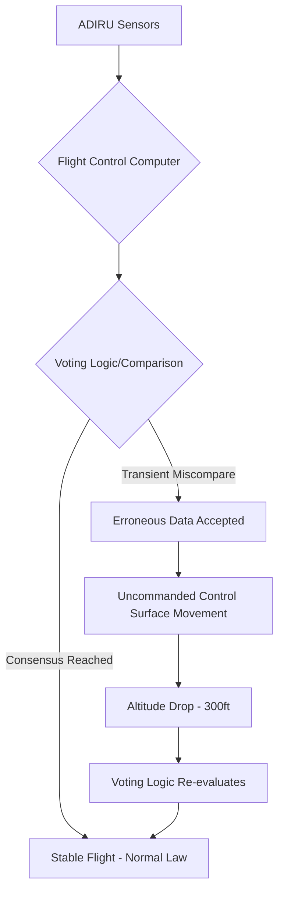

Imagine you are cruising at **35,000 feet** somewhere over the Indian subcontinent. The cabin is humming with the white noise of the engines, the autopilot is maintaining a steady course from Delhi to Mumbai, and the horizon is a flat, unchanging line of blue and haze. Then, without warning, the world shifts. It feels as though the floor has vanished beneath your feet. For a few harrowing seconds, the aircraft dips—a sudden, uncommanded drop of **300 feet**. 

To the passengers in the cabin, it feels like a textbook case of severe clear-air turbulence—that stomach-flipping sensation of weightlessness followed by a sharp jolt as the plane levels off. But once the aircraft touches down safely in Mumbai, the post-flight report reveals something far more unsettling than a pocket of bad air.

This wasn't weather. This was a "rare flight-control event." In the simplest terms, the aircraft's digital brain—the sophisticated fly-by-wire system—was told a lie by one of its sensors, and for a fraction of a second, it believed that lie. This incident serves as a chilling case study in the invisible technology that keeps modern jets aloft and the eternal tension between total automation and the reality of hardware failure.

---

## 📉 Breaking Down the 300-Foot Drop: Physics and Perception

  
  
 <a href="https://unsplash.com/@reskp">Jametlene Reskp</a> on <a href="https://unsplash.com/photos/white-and-black-fish-wall-decor-JjgesqSOd2o">Unsplash</a>

To understand why a **300-foot** drop is significant, we have to look at the physics of cruise flight. At **35,000 feet**, a commercial jet like the Airbus A320 is traveling at roughly **450 to 500 knots** (about 500-575 mph). At these speeds, the aircraft is in a state of delicate equilibrium between lift, weight, thrust, and drag.

Usually, the autopilot maintains this equilibrium through microscopic adjustments. It makes tiny tweaks to the elevators (the flaps on the tail) and the trim to ensure the altitude remains constant within a few feet. When a "flight-control event" occurs, this equilibrium is violently disrupted. 

The sensation passengers feel—the "stomach-drop"—is a result of a sudden decrease in G-force. When the plane dips uncommanded, the passengers are momentarily in a state of partial free-fall. While **300 feet** is a negligible distance compared to the seven miles of altitude above the ground, the *acceleration* of that drop is what triggers the human fight-or-flight response.

The [Director General of Civil Aviation (DGCA)](https://www.thehindu.com/news/national/not-turbulence-air-india-a320-suffered-rare-flight-control-event-before-300-foot-altitude-drop/article68745441.ece) was explicit in its findings: this was not an atmospheric event. Unlike turbulence, where an external mass of air pushes the aircraft, this was an internal command failure. The plane's own flight control surfaces moved the aircraft downward because the computer thought it was the correct thing to do.

---

## 🌪️ Turbulence vs. Technical Failure: The Critical Distinction

In the immediate aftermath of such incidents, airlines often use the word "turbulence" as a catch-all term. It is a comforting explanation because turbulence is a natural part of flying—essentially the aviation equivalent of a bumpy road. However, from a safety and engineering perspective, the difference between turbulence and a flight-control event is night and day.

### External Force (Turbulence)
Turbulence is caused by external factors:
*   **Convective Turbulence:** Warm air rising rapidly (thermals).
*   **Mechanical Turbulence:** Wind hitting mountains or buildings and swirling.
*   **Clear Air Turbulence (CAT):** High-altitude wind shear where two air masses of different speeds meet.

In these scenarios, the aircraft is a passive object being acted upon by the environment. The autopilot fights these forces to keep the plane level.

### Internal Command (Flight-Control Event)
A flight-control event is an "uncommanded" movement. This means the aircraft's control surfaces—the ailerons, elevators, or rudder—moved without pilot input and without external atmospheric pressure. 

> "The event is described as 'rare' because the system is designed with multiple redundancies to prevent such occurrences. When a system intended to provide stability becomes the source of instability, it represents a fundamental challenge to the automation logic." — [Aviation Safety Analysis](https://skybrary.aero/)

When a flight-control event occurs, the "logic" of the plane has failed. This is significantly more concerning to regulators like the [FAA](https://www.faa.gov) and [EASA](https://www.easa.europa.eu) because it suggests that the digital safeguards meant to prevent crashes could, under specific rare conditions, actually induce a dangerous maneuver.

---

## 🧠 The "Digital Nervous System": Understanding Fly-by-Wire (FBW)

To grasp how a "rare event" results in a physical drop, one must understand the architecture of [Fly-by-Wire (FBW)](https://en.wikipedia.org/wiki/Fly-by-wire). The Airbus A320 was a pioneer in this field, fundamentally changing how pilots interact with their aircraft.

In legacy aircraft, the pilot's yoke was connected to the wing flaps via a complex system of steel cables, pulleys, and hydraulic actuators. If the pilot pulled back on the yoke, they were physically pulling a cable that moved the elevator.

In a FBW system, there is no physical connection. When the pilot moves the sidestick, they are sending an electronic signal to a suite of computers. These computers—specifically the **Elevator Aileron Computers (ELAC)** and **Spoiler Elevator Computers (SEC)**—process the request and decide how to move the surfaces based on the plane's current state.

### Flight Envelope Protection
The primary benefit of FBW is "Flight Envelope Protection." The computer acts as a digital guardrail, preventing the pilot from performing maneuvers that would exceed the aircraft's structural limits. For example:
*   **Stall Protection:** The computer will prevent the nose from pitching up so high that the wings lose lift.
*   **Over-speed Protection:** The computer will prevent the plane from diving so steeply that it exceeds its maximum operating speed.
*   **Bank Angle Protection:** The computer prevents the plane from rolling beyond a safe limit (typically **67 degrees**).

However, this protection relies entirely on the integrity of the data coming from the sensors. If the sensors provide "garbage" data, the computer will apply "garbage" corrections. This is the core of the Air India incident: the guardrails momentarily pushed the plane in the wrong direction because the data it was receiving was flawed.

---

## ⚖️ The "Laws" of the Plane: Normal, Alternate, and Direct

The A320 does not operate in a single mode. Depending on the health of its sensors and computers, it switches between different "Flight Control Laws." This hierarchy is a critical safety feature designed to ensure the plane remains flyable even during multiple system failures, a concept explored deeply in [Flight Control Law Switching research](https://arxiv.org/abs/2304.14350).

### 1. Normal Law
This is the standard operating mode. Full digital protections are active. The pilot provides "load factor" commands (e.g., "I want the plane to climb"), and the computer handles the precise surface movements to achieve that goal while ensuring the plane stays within the safe envelope.

### 2. Alternate Law
If the system detects a significant failure—such as the loss of multiple air-data sensors—it degrades to Alternate Law. In this mode, some protections are lost. The plane behaves more like a conventional aircraft. The pilot has more direct control, but they also lose the "safety net" that prevents stalls or over-stressing the airframe.

### 3. Direct Law
This is the final fallback. There is no computer filtering. The sidestick movement corresponds directly to a specific degree of surface deflection. It is "raw" flight, requiring the pilot to manually maintain every aspect of stability.

In the Air India case, the aircraft was operating under **Normal Law**. The "momentary failure" indicates a transient glitch where the system briefly misinterpreted sensor data but stayed within Normal Law. Because the failure was so fast, the system didn't have time to "degrade" to Alternate Law; it simply executed a wrong command and then immediately corrected it once the data reconciled.

---

## 🗳️ The Sensor Glitch and the "Voting" Process

How does a flight computer know if a sensor is lying? It uses a process called "voting logic" or "sensor fusion," a cornerstone of [Fault-Tolerant Control systems](https://arxiv.org/abs/1910.14127).

The A320 utilizes three independent **Air Data Inertial Reference Units (ADIRUs)**. These units combine information from Pitot tubes (speed), static ports (altitude), and accelerometers (attitude). To ensure accuracy, the computers constantly compare the readings from all three ADIRUs.

**The Voting Logic Scenario:**
*   **ADIRU 1:** Reports altitude at **35,000 ft**.
*   **ADIRU 2:** Reports altitude at **35,000 ft**.
*   **ADIRU 3:** Reports altitude at **35,500 ft**.

Under normal circumstances, the computer sees that ADIRU 3 is the "outlier." It "votes" ADIRU 3 out of the decision-making process and relies on the agreement between 1 and 2. This is why a single sensor failure usually goes unnoticed by passengers.

**The "Rare Event" Glitch:**
A "rare flight-control event" occurs when a glitch is so transient—perhaps lasting only **0.1 to 0.5 seconds**—that it bypasses the voting logic or causes a momentary "miscompare" that the system interprets as a genuine trend. If the computer briefly believes the plane has suddenly jumped up **500 feet**, it will command a rapid nose-down movement to "correct" the altitude. 

Once the voting logic re-evaluates the data a millisecond later and realizes the spike was an error, it cancels the command and returns the plane to its assigned flight level.

---

## 🛠️ Recovery, Regulation, and the DGCA's Mandate

The pilots on the Air India flight were praised for handling the situation "effectively." This highlights a crucial point in aviation: the human is the ultimate fail-safe. While the autopilot eventually corrected the altitude, the pilots' role was to monitor the **Primary Flight Display (PFD)** and be ready to disconnect the autopilot instantly if the "glitch" turned into a sustained dive.

Following the incident, the [DGCA](https://www.dgca.gov.in) took a systemic approach. They didn't just investigate the individual aircraft; they ordered a fleet-wide inspection of all Air India A320s. This is a standard safety protocol known as an "Airworthiness Directive" or a safety mandate.

**The investigation focused on several key areas:**
1.  **ADIRU Calibration:** Ensuring that the inertial reference units were not suffering from "drift" or electronic noise.
2.  **Pitot-Static Integrity:** Checking for blockages or moisture in the sensors that could cause erratic pressure readings.
3.  **Software Versioning:** Verifying that the flight control software was up to date with the latest Airbus service bulletins.

By auditing the entire fleet, regulators aim to determine if this was a "random hardware failure" (a one-off) or a "systemic vulnerability" (a flaw in a specific batch of sensors). If the latter is true, it could lead to a global recall of specific components.

---

## ⚖️ Comparative Analysis: A320 vs. 737 MAX (MCAS)

It is impossible to discuss "sensors lying to computers" without mentioning the Boeing 737 MAX and the MCAS (Maneuvering Characteristics Augmentation System). While the Air India A320 incident was a "glitch," the MCAS failures were systemic design flaws.

| Feature | Air India A320 Event | Boeing 737 MAX (MCAS) |
| :--- | :--- | :--- |
| **Sensor Input** | 3 ADIRUs (Redundant) | 1 Angle of Attack (AoA) Sensor |
| **Logic** | Voting Logic (Consensus) | Single Point of Failure |
| **Outcome** | Momentary drop, self-corrected | Sustained dive, required manual override |
| **System Law** | Normal Law $\rightarrow$ Stable | MCAS override $\rightarrow$ Unstable |
| **Result** | Safe landing, fleet audit | Global grounding, redesign |

The A320 incident proves that redundancy works. Even though a glitch occurred, the presence of multiple sensors and a "voting" system meant the error was corrected almost instantly. The 737 MAX tragedy occurred because the system trusted a *single* sensor without a "vote," allowing a single lie to drive the plane into the ground.

---

## 🏁 Conclusion: The Paradox of Automation

The Air India A320 incident is a vivid illustration of the **Automation Paradox**. As we build more complex systems to eliminate human error, we inadvertently introduce new, systemic errors that are harder for humans to diagnose in real-time.

A mechanical cable cannot have a "logic glitch"; it either holds or it snaps. A digital system, however, can "think" it is saving the plane while it is actually performing a dangerous maneuver. The **300-foot drop** was a digital hiccup—a momentary lapse in the machine's perception of reality.

As the aviation industry moves toward increased autonomy and the integration of AI into flight decks, the lesson from this Delhi-Mumbai flight remains constant: **redundancy is the only shield against failure.** Automation is a powerful tool, but it is not a replacement for the vigilant eye of a trained pilot. At **35,000 feet**, the line between a routine flight and a technical crisis is often as thin as a single line of erroneous code.

---

## 📚 References

*   **The Hindu:** [Not turbulence: Air India A320 suffered rare flight-control event before 300-foot altitude drop](https://www.thehindu.com/news/national/not-turbulence-air-india-a320-suffered-rare-flight-control-event-before-300-foot-altitude-drop/article68745441.ece)
*   **Wikipedia:** [Fly-by-wire Architecture and History](https://en.wikipedia.org/wiki/Fly-by-wire)
*   **Wikipedia:** [Airbus A320 Family Technical Specifications](https://en.wikipedia.org/wiki/Airbus_A320_family)
*   **SKYbrary:** [Uncommanded Flight Control Movements](https://skybrary.aero/)
*   **DGCA India:** [Official Safety Directives and Aviation Regulations](https://www.dgca.gov.in)
*   **ArXiv:** [Fault Tolerant Super Twisting Sliding Mode Control of a Quadrotor UAV Using Control Allocation](https://arxiv.org/abs/2304.14350)
*   **ArXiv:** [Self-Repairing Hardware Architecture for Safety-Critical Cyber-Physical-Systems](https://arxiv.org/abs/1910.14127)
*   **FAA:** [Flight Standards and Airworthiness Directives](https://www.faa.gov)
*   **EASA:** [Safety Oversight and Certification Standards](https://www.easa.europa.eu)
*   **Airbus:** [Flight Control Laws and Envelope Protection Documentation](https://www.airbus.com)