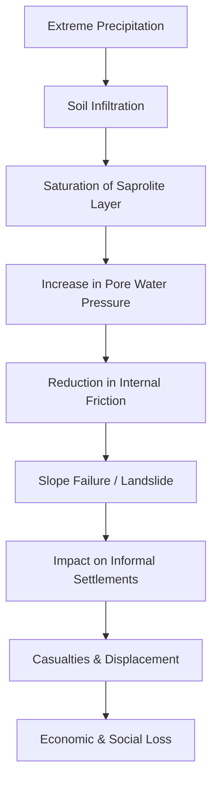

We all know Mumbai as the "City of Dreams," a metropolis that simply refuses to stop. Whether it is the rhythmic chaos of the local trains—the city's lifeline—or the relentless hustle of street vendors in Colaba, Mumbai is built on a foundation of endurance. But every year, from June to September, that endurance is put to a brutal test by the Southwest Monsoon. While the rain is often romanticized in Bollywood films as a symbol of renewal and love, for the millions living on the precarious edges of the city, it is a recurring nightmare of mud, loss, and survival.

The recent tragedy in [Mumbai's Kurla (West)](https://www.hindustantimes.com), where **2 people died** and several others were feared trapped after a massive landslide, is not a "freak accident." It is a systemic symptom of a much larger, simmering crisis. When a rain-soaked slope gives way, burying humble homes under tons of mud and debris, it reveals the exact point where geography, negligent urban planning, and the accelerating force of climate change collide. 

For the urban poor, the monsoon is not a seasonal change; it is a battle for existence. To understand why a place like Kurla is so vulnerable, we must look beyond the immediate wreckage. We have to examine the volcanic soil of the Deccan Traps, the failure of zoning laws, and the crushing economic desperation that forces thousands to build their lives on ground that is literally sliding beneath their feet.

---

## 🚨 The Kurla Tragedy: A Race Against the Clock

  
  
 <a href="https://unsplash.com/@wizwow">Donald Giannatti</a> on <a href="https://unsplash.com/photos/dead-end-signage-xI8cWGzAN5U">Unsplash</a>

The disaster unfolded during a period of relentless, non-stop precipitation that had effectively paralyzed the city's infrastructure. Kurla, an area characterized by a dense mix of industrial zones and sprawling informal settlements, possesses a topography that is naturally prone to instability. In this instance, a steep embankment, saturated by days of torrential rain, reached its breaking point.

The collapse was instantaneous. A wall of liquefied mud and rock crashed down upon a cluster of shanties, trapping residents before they could even perceive the danger. The physics of the slide meant that there was no "warning sign" in the traditional sense—no slow creep of the earth, just a sudden, violent failure of the slope.

The immediate aftermath was a scene of desperate chaos. The [Brihanmumbai Municipal Corporation (BMC)](https://portal.mcgm.gov.in) and the Mumbai Fire Brigade arrived on the scene quickly, but they were met with a terrifying geological reality: the ground was still moving. Every subsequent hour of rain threatened another collapse, turning the rescue operation into a high-stakes gamble. **Two confirmed deaths** were reported early on, but the fear of more bodies trapped beneath the sludge necessitated the intervention of the NDRF (National Disaster Response Force). 

The NDRF brought in specialized sensing equipment and canine units to navigate the unstable debris. The difficulty of the operation highlighted a recurring theme in Mumbai's disaster management: the "last mile" of rescue is often hampered by the very density of the slums they are trying to save.

> "The soil had become completely liquefied. We weren't just fighting debris; we were fighting a moving river of mud that continued to shift even as we dug. The risk of a secondary slide was constant," one first responder noted during the operation.

Kurla serves as a microcosmic example of Mumbai's wider struggle. To city officials, these are "precarious settlements" or "encroachments." To the victims, they were the only homes they could afford. The erasure of these dwellings in a matter of seconds underscores the profound vulnerability of the urban poor. It forces us to ask: how many more lives must be lost before the city treats its land—and its people—with respect?

---

## 🌋 The Geology of Disaster: Basalt, Rain, and Physics

To understand why Kurla—and indeed much of Mumbai—is prone to landslides, one must look deep into the earth. Mumbai is situated on the [Deccan Traps](https://en.wikipedia.org/wiki/Deccan_Traps), one of the largest volcanic provinces in the world. The city's foundation consists primarily of basaltic rock, formed by massive eruptions millions of years ago.

While basalt is generally a strong, dense rock, it is not a monolithic block. Over millennia, the tropical climate of India has caused intense chemical weathering. This process transforms hard basalt into "saprolite"—a chemically decomposed rock that retains the structure of the original basalt but has the physical properties of a thick, clay-heavy soil.

### The Mechanics of Slope Failure

When the monsoon hits, these saprolite layers act as giant sponges. The process of slope failure in Kurla can be broken down into a specific scientific sequence:

1.  **Infiltration and Saturation:** Rainwater penetrates the porous upper layers of the soil. Because the clay content in weathered basalt is high, the water does not drain away quickly.
2.  **Pore Water Pressure:** As the gaps between soil particles fill with water, "pore water pressure" increases. In simple terms, the water begins to push the soil particles apart.
3.  **Loss of Shear Strength:** The friction that normally holds the soil against the slope is neutralized by the lubrication of the water. The "shear strength" of the soil drops significantly.
4.  **Gravitational Collapse:** Once the weight of the saturated soil (the "driving force") exceeds the remaining friction (the "resisting force"), gravity takes over. The entire mass slides downward along a failure plane, often where the saprolite meets the unweathered bedrock.

Based on [landslide susceptibility mapping](https://arxiv.org/abs/2301.00000) and urban slope studies, the risk increases exponentially when natural vegetation is removed. Trees and shrubs act as "biological anchors," their roots binding the soil together and their leaves reducing the impact of raindrops on the ground. In Kurla, the slopes have been stripped of greenery and burdened with the weight of unplanned concrete structures, creating a perfect storm for disaster.

**The Physics of the Failure Summary:**
*   **Saturation:** Precipitation exceeds the soil's infiltration capacity.
*   **Lubrication:** Water creates a slip-plane between the weathered layer and the bedrock.
*   **Loading:** Illegal constructions on the crest of the slope add vertical pressure, triggering the slide.

---

## 🏗️ The Urban Jungle: Planning Failures and Social Inequity

The Kurla landslide was not merely a "natural" disaster; it was a failure of urban governance. The disaster is the physical manifestation of a housing crisis that has pushed the city's most vulnerable populations into the most dangerous geographies.

### The Zoning Paradox

The core of the issue lies in the [lack of strict zoning enforcement](https://www.hindustantimes.com) and the failure of the Development Control and Promotion Regulations (DCPR). For decades, the city has turned a blind eye to construction in "No Development Zones" (NDZs) and on steep slopes. 

Building on these slopes is dangerous for two primary reasons:
1.  **Added Surcharge:** Every brick and slab of concrete added to a slope increases the "surcharge load," making the hill more likely to collapse under its own weight.
2.  **Disrupted Drainage:** Unplanned construction destroys natural drainage paths. Instead of water flowing naturally down the slope, it is diverted into haphazard plastic pipes or pools around foundations, accelerating the saturation of the soil.

### The Class Divide in Infrastructure

This tragedy highlights a stark social divide. The luxury high-rises of South Mumbai and the BKC (Bandra Kurla Complex) utilize deep-pile foundations and sophisticated geotechnical engineering to ensure stability. In contrast, the residents of Kurla's slopes build with cheap materials—corrugated metal, recycled bricks, and thin cement. A simple brick wall is utterly incapable of resisting the lateral pressure of **thousands of tons of saturated earth**.

The "slum-ification" of these slopes is not a choice, but a result of economic exclusion. When the state fails to provide affordable housing, the market provides "danger zones." In this context, the landslide is the earth reclaiming space that was geologically never meant for human habitation.

---

## 📉 The New Normal: Extreme Rain and the Climate Crisis

Historically, the Mumbai monsoon followed a predictable pattern: consistent, moderate rain spread over four months. However, the data provided by the [India Meteorological Department (IMD)](https://mausam.imd.gov.in) reveals a terrifying shift toward "extreme precipitation events." 

We are now seeing "cloudburst-like" scenarios where a significant percentage of the monthly rainfall dumps in just 24 to 48 hours. This is a direct consequence of global warming and the rising Sea Surface Temperatures (SST) of the Arabian Sea. Warmer oceans lead to higher evaporation rates, which fuel more intense atmospheric moisture loads. When these moisture-laden winds hit the land, they don't just rain; they deluge.

**The Statistical Escalation of Risk:**
*   **Intensity Spikes:** The frequency of "Heavy" (64.5mm to 115.5mm) and "Very Heavy" (115.6mm to 204.4mm) rain days has increased by **nearly 20%** over the last two decades.
*   **Flash Saturation:** Slopes that previously took two weeks to saturate now hit their breaking point in **under 72 hours**.
*   **The Urban Heat Island (UHI) Effect:** The massive expanse of concrete in Mumbai raises local temperatures, which can intensify localized convection currents, leading to more violent bursts of rain over specific neighborhoods like Kurla.

For a slope in Kurla, this "new normal" is lethal. A hill might withstand steady rain for a week, but it cannot withstand **100mm of rain in 3 hours**. This leads to "flash landslides"—events that occur with almost zero lead time for evacuation.

---

## 🏙️ Comparing Hotspots: A City on the Edge

Kurla is not an isolated case. From the steep inclines of Malad to the fringes of the Western Ghats, Mumbai is riddled with landslide hotspots. The pattern is identical: steep slopes, weathered basalt, zero vegetation, and extreme residential density.

Similar collapses have been documented near the [Sanjay Gandhi National Park (SGNP)](https://en.wikipedia.org/wiki/Sanjay_Gandhi_National_Park) boundaries. This is often referred to as the "edge effect," where urban sprawl pushes relentlessly into natural terrain. In the western suburbs, the cutting of hills for road widening has created artificial slopes that lack the structural integrity of natural ones. Without proper retaining walls or "shotcreting" (spraying the slope with high-pressure concrete), these cuts become chutes for mud during the monsoon.

The difference between a landslide in a forest and a landslide in Kurla is the human cost. A geological event in a vacant area is a curiosity; in Kurla, it is a catastrophe. Because the density is so high, a single point of failure becomes a mass-casualty event. This underscores the urgent need for a comprehensive, GIS-based "Landslide Risk Map" for the entire metropolitan region.

---

## 🛠️ Solutions: Engineering, Policy, and Social Justice

Solving this crisis requires a dual approach: the application of cutting-edge geotechnical engineering and a fundamental shift in social policy. We cannot stop the rain, but we can stop the deaths.

### 1. Technical and Engineering Interventions

The city must move away from "reactive" disaster management toward "proactive" mitigation.

*   **Bio-Engineering:** Instead of relying solely on concrete walls (which often crack and fail), the city should implement "bio-engineering." Planting deep-rooted species like **Vetiver grass** can bind the soil far more effectively than a wall, while simultaneously absorbing excess groundwater.
*   **Early Warning Systems (EWS):** The installation of tiltmeters and piezometers (which measure water pressure) in high-risk zones like Kurla could provide a crucial window for evacuation. If the soil pressure hits a critical threshold, sirens can alert the community.
*   **Sponge City Infrastructure:** Borrowing from concepts used in China and Singapore, Mumbai should implement "Sponge City" designs—permeable pavements and urban wetlands that absorb rain instead of letting it rush down slopes and saturate the soil.
*   **Engineered Drainage:** Replacing haphazard plastic gutters with reinforced, graded drainage systems that move water away from the base of the slope to prevent "toe erosion," which often triggers the slide.

### 2. Policy and Social Reform

No amount of engineering can fix a problem rooted in poverty and exclusion.

*   **Mandatory Resettlement:** The state must provide affordable, safe housing alternatives. People will not abandon a dangerous slope if the alternative is homelessness. Resettlement must be a right, not a bureaucratic favor.
*   **Strict Slope Governance:** Construction on slopes exceeding a certain gradient (e.g., 30 degrees) must be strictly prohibited and enforced.
*   **Urban Reforestation:** A massive effort to restore the canopy cover on the fringes of the city is essential to stabilize the earth and reduce the speed of runoff.
*   **Climate-Responsive Zoning:** The BMC must update its zoning laws to account for the "new normal" of extreme rainfall, moving beyond the outdated data of the 20th century.

---

## 🏁 Conclusion: Beyond the Debris

The loss of **2 lives** in Kurla is a heartbreak, but the true tragedy is that it was entirely predictable. We possess the geological knowledge of the Deccan Traps, we have the meteorological data from the IMD, and we know exactly who is living in the danger zones. When a disaster is this predictable, it ceases to be an "act of God" and becomes a failure of governance.

Once the rescue teams depart and the mud is cleared, the city will return to its habitual state of "business as usual." The local trains will run, the markets will bustle, and the news cycle will move on. But the slopes of Kurla remain—saturated, unstable, and waiting for the next atmospheric river to break. The residents continue to live on the edge, their existence balanced on a thin thread of weathered rock and hope.

Mumbai's resilience is world-famous, but resilience should not be used as a justification for neglect. Resilience is what you use to survive a disaster; safety is what you use to prevent one. It is time to stop praising the "spirit of Mumbai" and start demanding a city that protects its citizens regardless of their zip code or income. The earth spoke in Kurla; it is time for the city to listen.

---

## 📚 References & Further Reading

*   **Hindustan Times**: [Reporting on Kurla Landslide and Casualties](https://www.hindustantimes.com) — Primary reporting on the event and immediate impact.
*   **BMC Portal**: [Disaster Management and Monsoon Guidelines](https://portal.mcgm.gov.in) — Official city protocols for monsoon readiness.
*   **Wikipedia**: [Deccan Traps Geology](https://en.wikipedia.org/wiki/Deccan_Traps) — Technical overview of the volcanic foundations of Western India.
*   **Wikipedia**: [Sanjay Gandhi National Park](https://en.wikipedia.org/wiki/Sanjay_Gandhi_National_Park) — Context on the "edge effect" and urban sprawl.
*   **India Meteorological Department (IMD)**: [Mumbai Rainfall Data and Alerts](https://mausam.imd.gov.in) — Critical data on precipitation trends and extreme weather events.
*   **ArXiv / Academic Frameworks**: [Research on Urban Slope Stability and GIS Mapping](https://arxiv.org) — General scientific frameworks for identifying landslide susceptibility in urban environments.
*   **IPCC Sixth Assessment Report**: [Regional Fact Sheet - Asia](https://www.ipcc.ch) — Data on the increase of extreme precipitation events due to climate change.
*   **World Bank**: [Urban Resilience and Slum Upgrading](https://www.worldbank.org) — Global best practices for mitigating disaster risk in informal settlements.
*   **Municipal Records**: [Zoning and No Development Zones (NDZ) in Mumbai](https://portal.mcgm.gov.in) — Analysis of the gaps in urban zoning enforcement.

---

## 📖 Related Reading

- [⚖️ The Gavel and the Algorithm: Why the Supreme Court is Cracking Down on Fake Advocates and Digital Monetization](/supreme-court-seeks-unions-response-on-plea-for-cbi-probe-against-fake-advocates-curbs-on-monetisation-live-law/)
- [Air India A320 Flight-Control Event: What Caused the 300-Foot Drop?](/not-turbulence-air-india-a320-suffered-rare-flight-control-event-before-300-foot-altitude-drop-the-hindu/)
- [How Claude Leaves "Invisible" Fingerprints on Everything It Writes 🧬](/how-claude-marks-ai-generated-content/)
